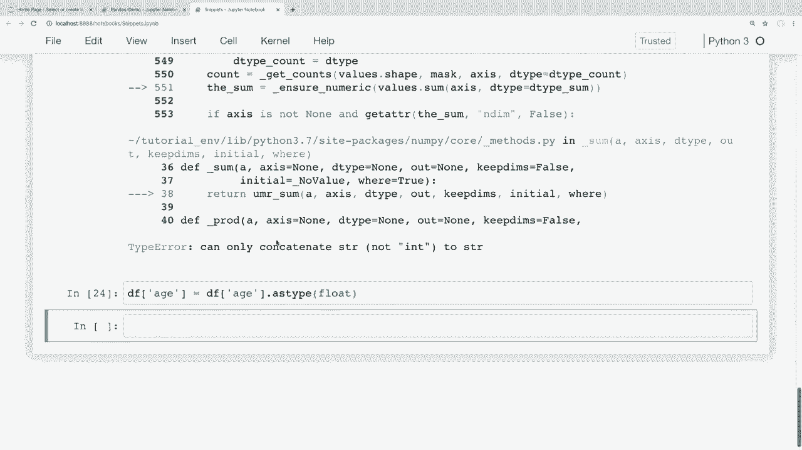
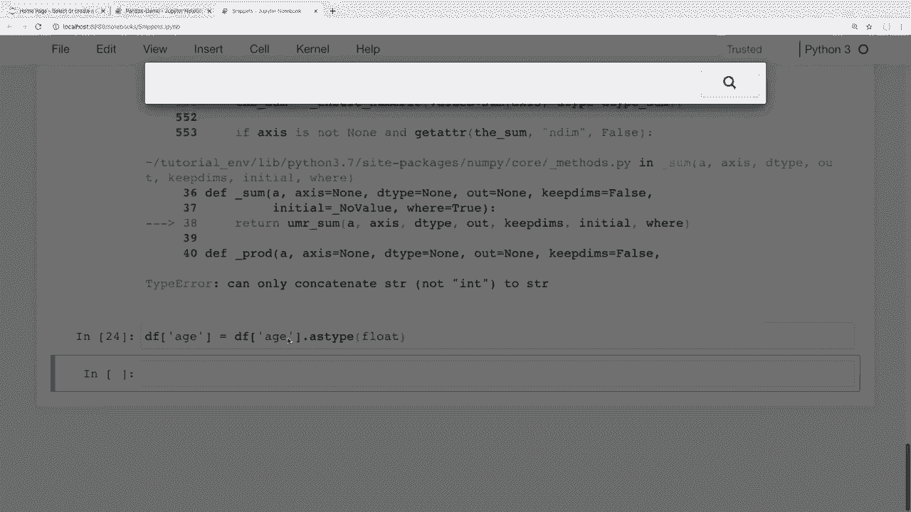
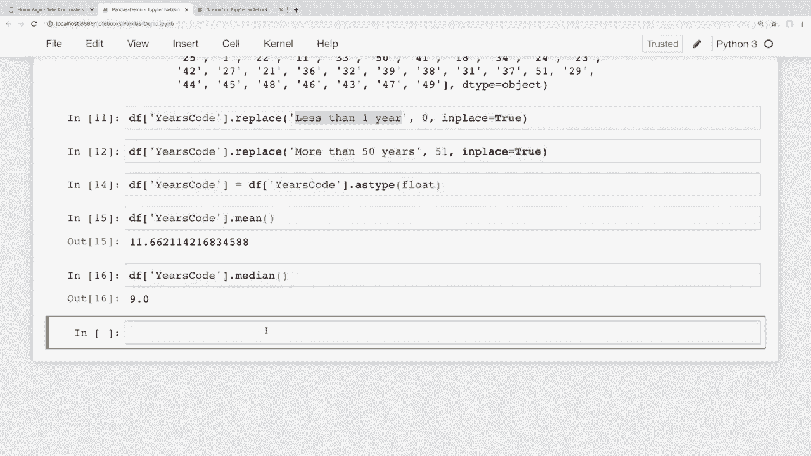
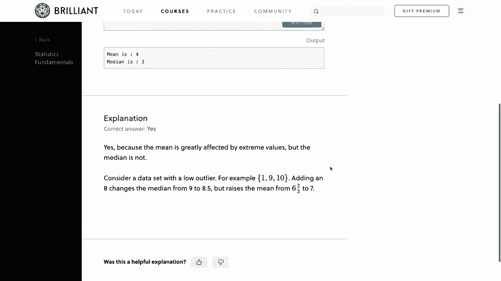
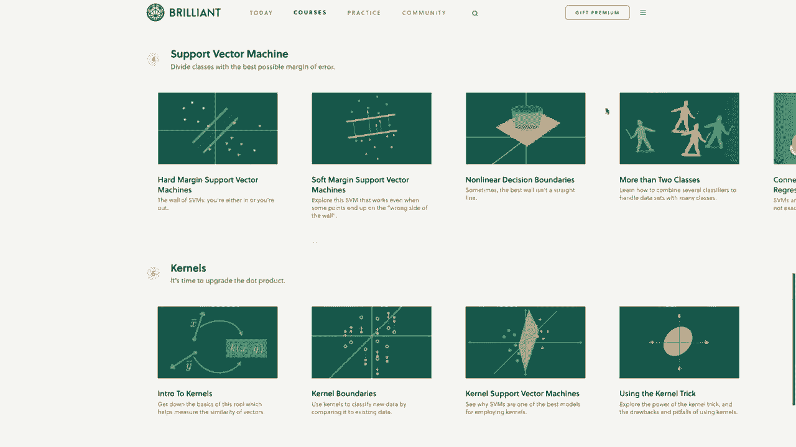
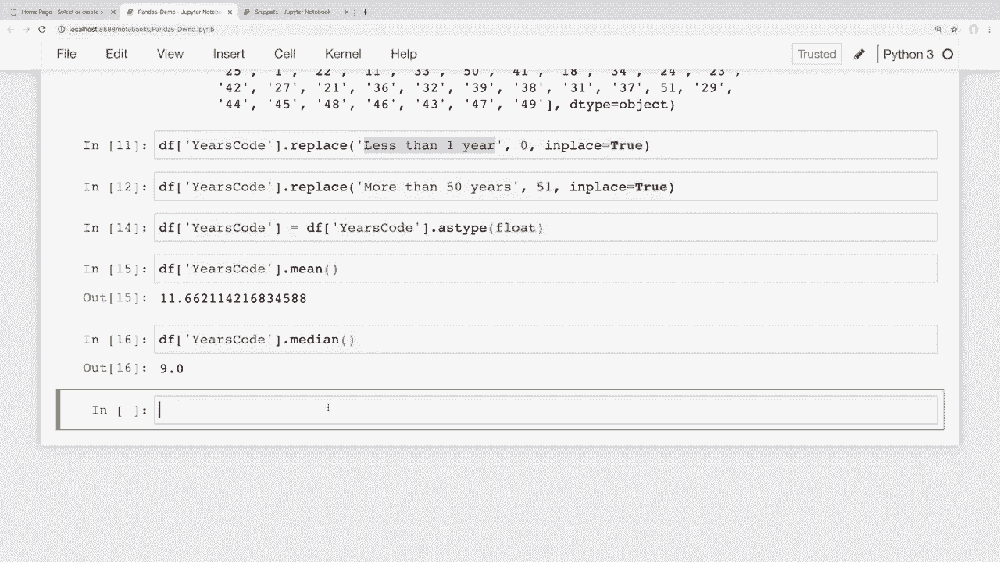

# 用 Pandas 进行数据处理与分析！P9：数据清洗 - 转换数据类型和处理缺失值 🐼

在本节课中，我们将学习如何处理数据集中的缺失值，以及如何将数据转换为合适的数据类型以便进行分析。几乎每个真实世界的数据集都可能包含缺失数据或需要清理的数据，掌握这些技能至关重要。课程最后，我们将应用所学知识，基于 Stack Overflow 调查数据，计算受访开发者的平均编程年限。

---

## 🧹 处理缺失值

上一节我们介绍了数据清洗的重要性，本节中我们来看看如何处理缺失值。Pandas 提供了多种方法来处理缺失数据，例如删除包含缺失值的行或列，或用特定值填充它们。

### 删除缺失值

我们可以使用 `dropna()` 方法来删除包含缺失值的行或列。以下是其核心参数：

*   **`axis`**: 决定删除行还是列。`axis=0` 或 `'index'` 删除行（默认），`axis=1` 或 `'columns'` 删除列。
*   **`how`**: 决定删除标准。`how='any'`（默认）表示该行/列中**任一**值为缺失即删除；`how='all'` 表示该行/列**所有**值均为缺失才删除。
*   **`subset`**: 指定在哪些列中检查缺失值，仅对这些列应用删除规则。

以下是使用 `dropna()` 的几种方式：

```python
# 删除任何包含缺失值的行（默认行为）
df.dropna()

# 删除所有值都缺失的行
df.dropna(how='all')

# 删除任何包含缺失值的列
df.dropna(axis='columns')

# 仅在 'email' 列检查，删除该列为缺失值的行
df.dropna(subset=['email'])

# 在 'last_name' 和 'email' 列检查，仅当这两列都缺失时才删除行
df.dropna(subset=['last_name', 'email'], how='all')
```

**注意**：上述操作默认返回新 DataFrame。若想直接修改原数据，需设置参数 `inplace=True`。

### 识别与替换自定义缺失值

有时数据中的缺失值并非标准的 `NaN`，而是如 `"NA"`、`"Missing"` 等自定义字符串。我们需要先将它们替换为 `NaN`，Pandas 才能识别。

在创建 DataFrame 后，可以使用 `replace()` 方法：

```python
import numpy as np
# 将 'NA' 和 'Missing' 字符串替换为 np.nan
df.replace(['NA', 'Missing'], np.nan, inplace=True)
```

若从 CSV 文件加载数据，可以在读取时直接指定哪些值应被视为缺失：

```python
# 在读取 CSV 时，将 'NA' 和 'Missing' 视为缺失值
missing_values = ['NA', 'Missing']
df = pd.read_csv('data.csv', na_values=missing_values)
```

### 填充缺失值

有时删除数据不可行，我们可以用特定值填充缺失值，这尤其适用于数值数据。使用 `fillna()` 方法：

```python
# 用字符串 'MISSING' 填充所有缺失值
df.fillna('MISSING')

# 用数字 0 填充所有缺失值
df.fillna(0)

# 使填充操作永久生效
df.fillna(0, inplace=True)
```

---

## 🔢 转换数据类型

处理完缺失值后，我们常需转换列的数据类型以进行数学运算。例如，一个看起来是数字的列，其数据类型可能是字符串 (`object`)。

### 查看数据类型

使用 `.dtypes` 属性查看每列的数据类型：

```python
df.dtypes
```

### 转换单列数据类型

使用 `.astype()` 方法转换列的类型。**注意**：如果列中包含 `NaN` 值，则不能直接转换为整数 (`int`)，因为 `NaN` 是浮点类型。此时应转换为浮点数 (`float`)。





```python
# 尝试转换为整数（若存在 NaN 会报错）
# df['age'] = df['age'].astype(int)

# 安全做法：转换为浮点数
df['age'] = df['age'].astype(float)

# 现在可以计算平均值
average_age = df['age'].mean()
```

### 转换整个 DataFrame 的数据类型

使用 `.astype()` 方法可以一次性转换整个 DataFrame 中所有列的类型（需确保转换对所有列有效）。

```python
df_numeric = df.astype(float)
```

---

## 📊 实战演练：分析 Stack Overflow 调查数据

现在，让我们将所学知识应用于现实数据。我们将使用 Stack Overflow 开发者调查数据，计算受访者的平均编程年限。

### 步骤 1：处理异常字符串值

查看 `'YearsCode'` 列，我们发现除了数字，还有 `'Less than 1 year'` 和 `'More than 50 years'` 这样的字符串。我们需要将它们转换为数字以便计算。

```python
# 查看该列的唯一值，发现字符串
print(df['YearsCode'].unique())

# 将字符串替换为对应的数字
df['YearsCode'].replace('Less than 1 year', 0, inplace=True)
df['YearsCode'].replace('More than 50 years', 51, inplace=True) # 可根据需要调整
```

### 步骤 2：转换数据类型并计算

替换后，该列仍是对象类型，需要转换为数值型，然后进行计算。

```python
# 将列转换为浮点数（因为存在 NaN）
df['YearsCode'] = df['YearsCode'].astype(float)

# 计算平均编程年限
average_years = df['YearsCode'].mean()
median_years = df['YearsCode'].median()




print(f"平均编程年限: {average_years:.1f} 年")
print(f"编程年限中位数: {median_years} 年")
```

通过这个例子，我们可以看到数据清洗和类型转换是获得准确分析结果的关键步骤。


---






## 📝 总结

本节课中我们一起学习了数据清洗的两个核心操作：

1.  **处理缺失值**：我们掌握了如何删除 (`dropna`)、识别替换自定义缺失值 (`replace`, `read_csv(na_values)`) 以及填充 (`fillna`) 缺失数据。
2.  **转换数据类型**：我们学会了如何查看 (`.dtypes`) 和转换 (`.astype()`) 列的数据类型，特别是处理包含 `NaN` 的数值列时，需转换为 `float` 类型。



这些技能能帮助我们处理杂乱的真实数据，为后续的分析和建模打下坚实基础。下一节课，我们将学习如何处理日期和时间序列数据。