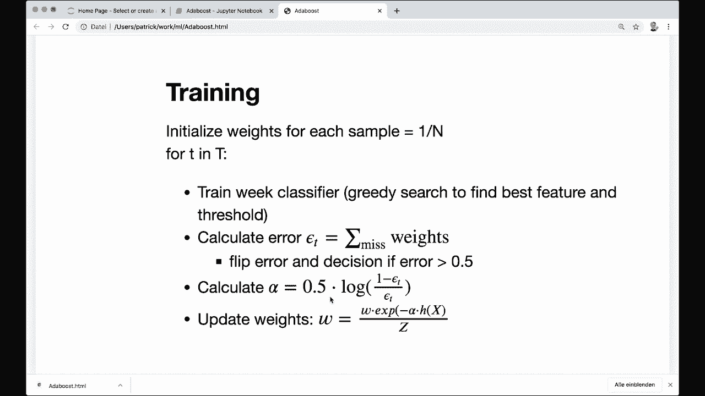
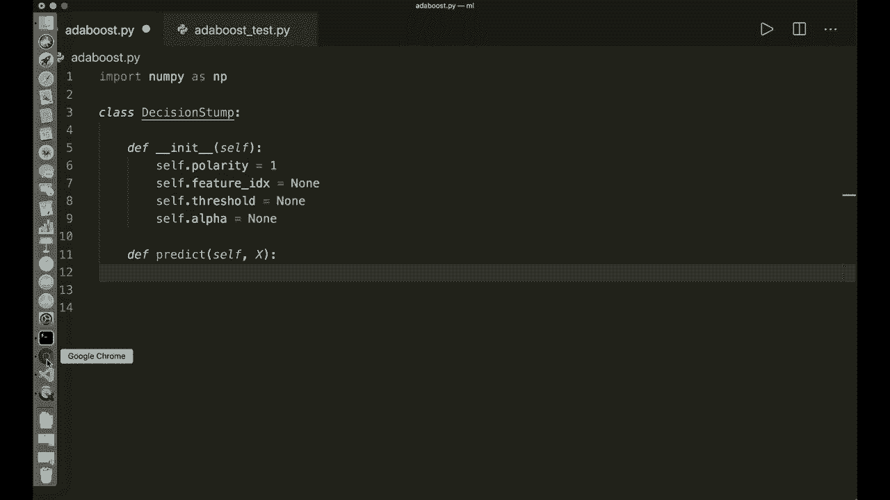
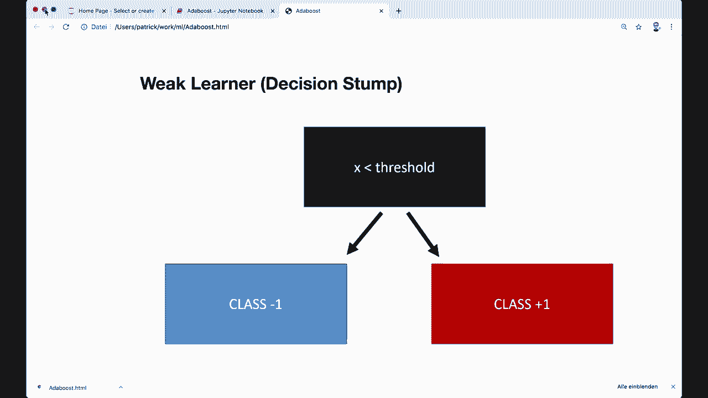
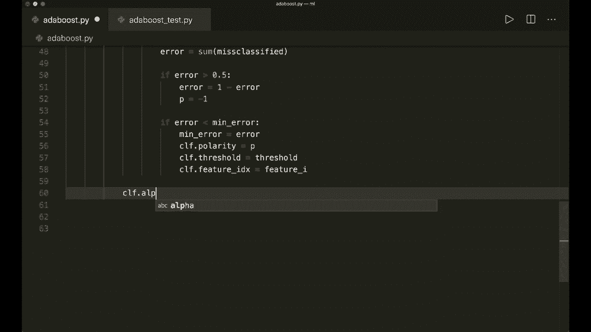
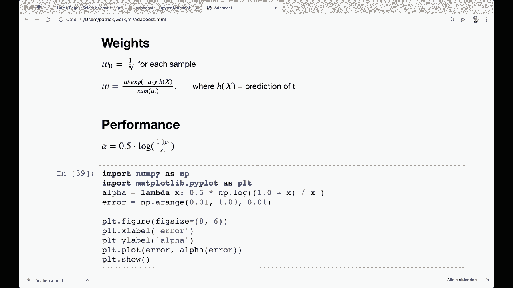
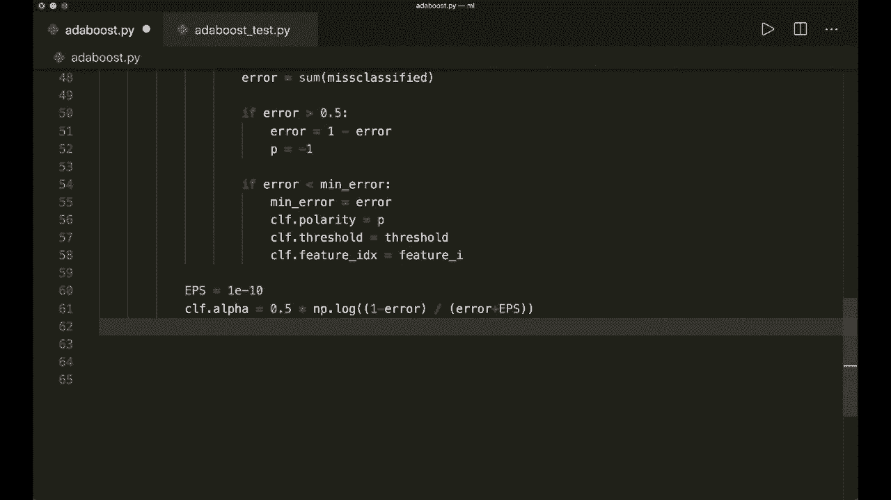
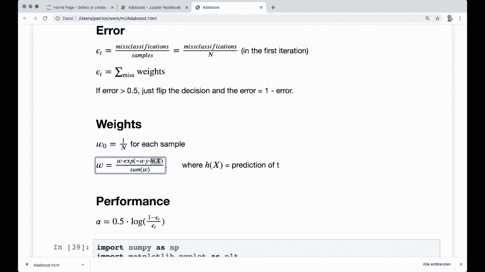
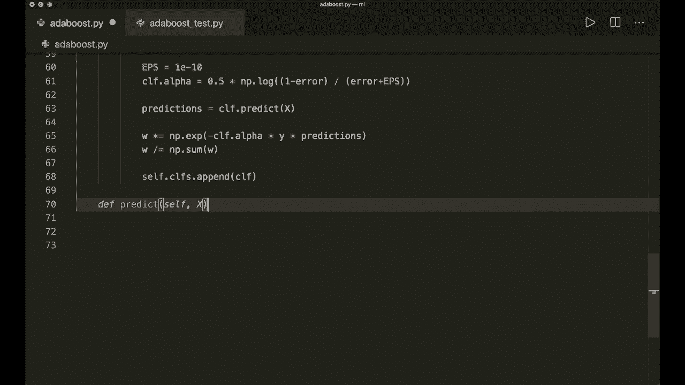
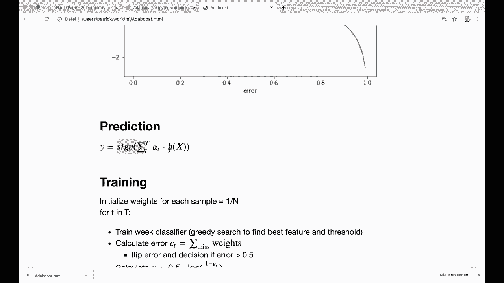
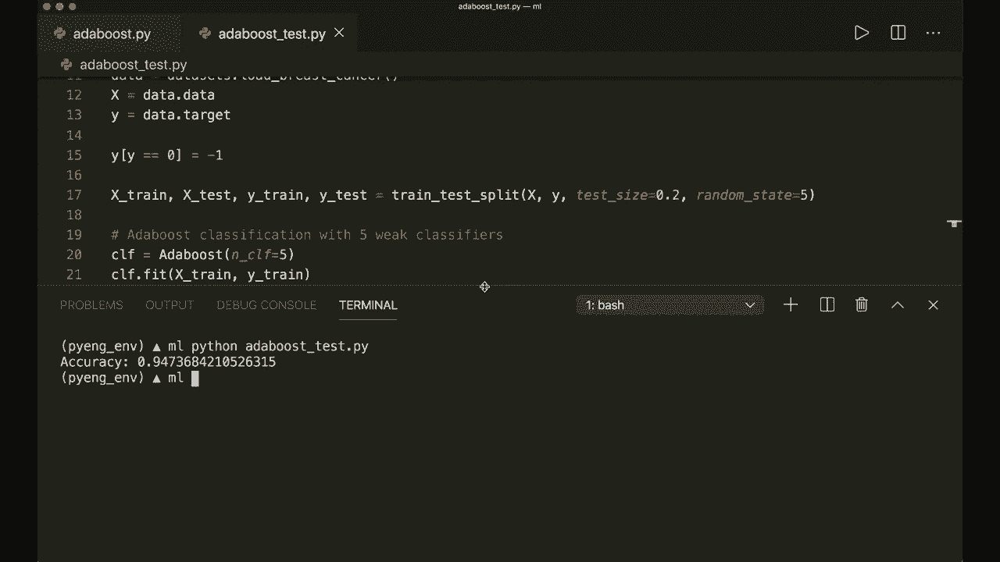

# 机器学习算法实现课程 P14：L14- AdaBoost 🚀

在本节课中，我们将学习并实现 AdaBoost 算法。AdaBoost 是一种集成学习方法，其核心思想是将多个性能较弱的“弱分类器”组合起来，形成一个强大的“强分类器”。我们将仅使用 Python 和 Numpy 库来完成这一实现。

---

## 算法核心概念 🧠

上一节我们介绍了集成学习的基本思想，本节中我们来看看 AdaBoost 的具体工作原理。

AdaBoost 通过迭代训练一系列弱分类器（如决策树桩）来工作。在每一轮迭代中，它会根据上一轮分类器的错误情况调整训练样本的权重，使得被错误分类的样本在下一轮获得更多关注。最终，它将所有弱分类器的预测结果进行加权求和，得到一个强分类器。

### 核心组件与公式

以下是实现 AdaBoost 所需的核心组件及其数学描述：

1.  **弱分类器（决策树桩）**：一个非常简单的分类器，仅基于单个特征和阈值进行决策。
    *   **预测规则**：对于一个样本 `x` 的某个特征 `x_i` 和阈值 `th`，预测 `y_pred` 为：
        ```python
        if polarity == 1:
            y_pred = +1 if x_i >= th else -1
        else:
            y_pred = -1 if x_i >= th else +1
        ```
        `polarity` 用于控制决策方向。

2.  **样本权重**：每个样本 `i` 都有一个权重 `w_i`，初始时所有样本权重相等。
    *   **初始化公式**：`w_i = 1 / n`，其中 `n` 是样本总数。



3.  **分类器误差**：衡量一个弱分类器的性能，考虑样本权重。
    *   **计算公式**：`error = sum(w_i for i in misclassified_samples)`
    *   如果 `error > 0.5`，则翻转该分类器的决策（即改变 `polarity`），并令 `error = 1 - error`。

4.  **分类器权重（Alpha）**：用于在最终组合时衡量每个弱分类器的重要性。性能越好（误差越小）的分类器，其 `alpha` 值越大。
    *   **计算公式**：`alpha = 0.5 * ln((1 - error) / (error + epsilon))`
        其中 `epsilon` 是一个极小的数，防止除以零。

5.  **权重更新**：根据当前分类器的表现更新样本权重，被误分类的样本权重增加。
    *   **更新公式**：`w_i := w_i * exp(-alpha * y_i * h(x_i))`
        其中 `h(x_i)` 是当前弱分类器对样本 `i` 的预测（+1 或 -1），`y_i` 是真实标签。
    *   更新后需要对所有权重进行归一化：`w_i := w_i / sum(w)`





6.  **最终预测**：将所有弱分类器的预测结果按其 `alpha` 值加权求和，然后取符号。
    *   **计算公式**：`final_prediction = sign( sum(alpha_k * h_k(x)) )`

---

## 代码实现步骤 💻

理解了上述核心概念后，我们进入代码实现环节。实现过程主要分为两个类：`DecisionStump`（决策树桩）和 `AdaBoost`。

### 1. 决策树桩类 (DecisionStump)

决策树桩是我们的弱分类器。

以下是 `DecisionStump` 类需要包含的属性和方法：
*   `__init__`: 初始化极性、特征索引、阈值和权重（alpha）。
*   `predict`: 根据存储的特征索引和阈值，对输入数据 `X` 进行预测。

### 2. AdaBoost 类

这是算法的主类。

以下是 `AdaBoost` 类的训练（`fit`）步骤：
1.  初始化样本权重为 `1/n`。
2.  循环训练指定数量的弱分类器：
    *   a. 实例化一个 `DecisionStump`。
    *   b. **贪婪搜索**：遍历所有特征和所有可能的阈值，找到能使加权误差最小的特征和阈值组合，并设置给当前的决策树桩。
    *   c. 计算当前决策树桩的误差 `error`。如果 `error > 0.5`，则翻转其决策（极性）。
    *   d. 根据公式计算当前分类器的权重 `alpha`。
    *   e. 使用当前分类器预测所有样本。
    *   f. 根据权重更新公式更新所有样本的权重，并进行归一化。
    *   g. 将训练好的决策树桩存入列表。
3.  实现预测（`predict`）方法：遍历所有弱分类器，将其预测结果按 `alpha` 加权求和，然后取符号作为最终预测。





---

## 完整代码示例 📝





```python
import numpy as np

class DecisionStump:
    def __init__(self):
        self.polarity = 1
        self.feature_idx = None
        self.threshold = None
        self.alpha = None

    def predict(self, X):
        n_samples = X.shape[0]
        X_column = X[:, self.feature_idx]
        predictions = np.ones(n_samples)

        if self.polarity == 1:
            predictions[X_column < self.threshold] = -1
        else:
            predictions[X_column > self.threshold] = -1

        return predictions

class AdaBoost:
    def __init__(self, n_clf=5):
        self.n_clf = n_clf
        self.clfs = []

    def fit(self, X, y):
        n_samples, n_features = X.shape
        w = np.full(n_samples, (1 / n_samples))
        self.clfs = []

        for _ in range(self.n_clf):
            clf = DecisionStump()
            min_error = float('inf')

            # 贪婪搜索最佳特征和阈值
            for feature_i in range(n_features):
                X_column = X[:, feature_i]
                thresholds = np.unique(X_column)

                for threshold in thresholds:
                    p = 1
                    predictions = np.ones(n_samples)
                    predictions[X_column < threshold] = -1

                    misclassified = w[y != predictions]
                    error = sum(misclassified)

                    if error > 0.5:
                        error = 1 - error
                        p = -1

                    if error < min_error:
                        min_error = error
                        clf.polarity = p
                        clf.threshold = threshold
                        clf.feature_idx = feature_i

            # 计算分类器权重 alpha
            EPS = 1e-10
            clf.alpha = 0.5 * np.log((1.0 - min_error + EPS) / (min_error + EPS))

            # 更新样本权重
            predictions = clf.predict(X)
            w *= np.exp(-clf.alpha * y * predictions)
            w /= np.sum(w)

            self.clfs.append(clf)

    def predict(self, X):
        clf_preds = [clf.alpha * clf.predict(X) for clf in self.clfs]
        y_pred = np.sum(clf_preds, axis=0)
        y_pred = np.sign(y_pred)
        return y_pred
```





---

## 测试与总结 🎯

我们可以使用一个简单的数据集（如乳腺癌数据集）来测试我们的实现。注意，AdaBoost 要求标签为 `+1` 和 `-1`，因此需要将原始标签 `0` 转换为 `-1`。



本节课中我们一起学习了 AdaBoost 算法的核心思想与实现细节。我们了解到，AdaBoost 通过迭代调整样本权重，专注于之前被错误分类的样本，并组合多个弱分类器来构建一个强分类器。关键点在于理解误差计算、分类器权重（alpha）以及样本权重更新的数学原理。通过亲手实现，我们不仅加深了对算法的理解，也掌握了将其转化为代码的能力。