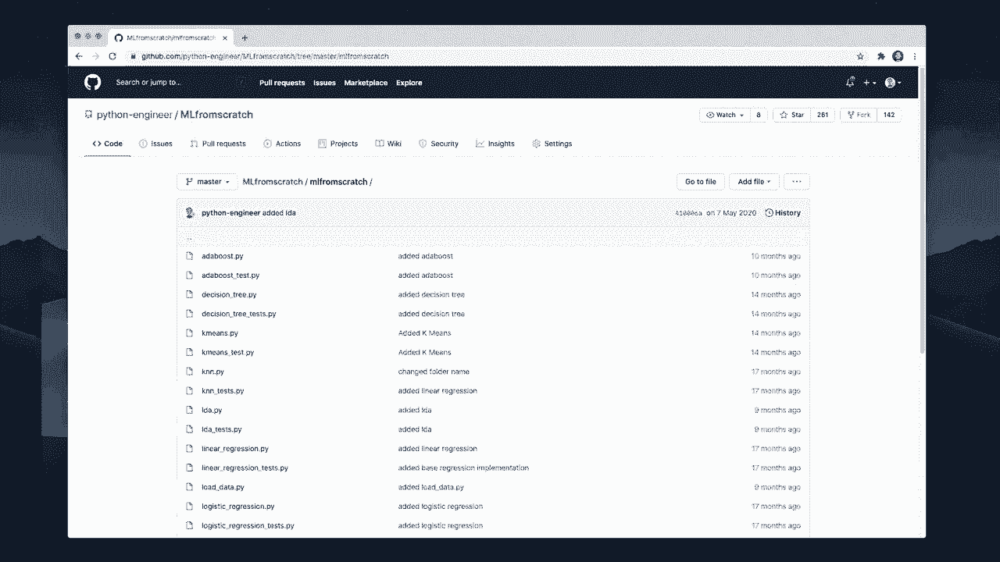
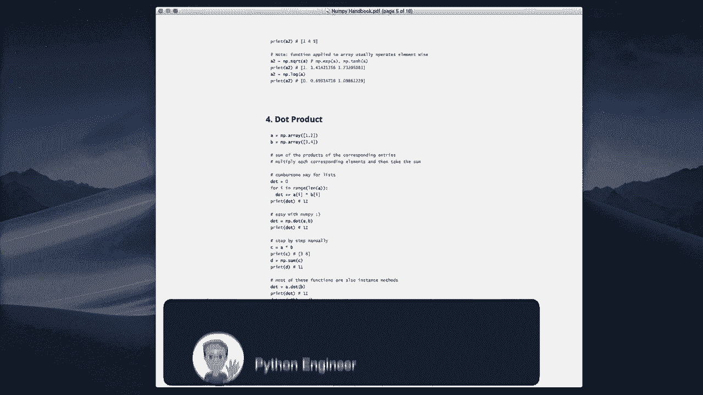
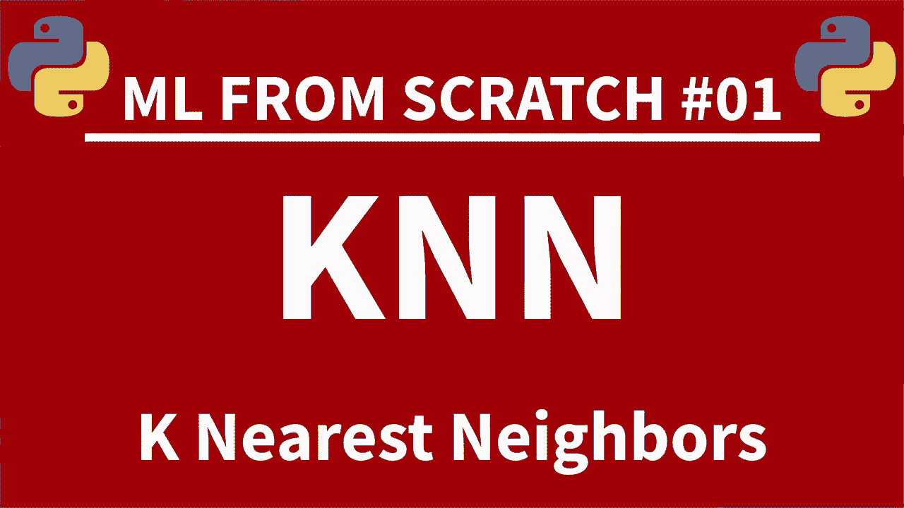

# 机器学习算法实现教程 P1：L1- 介绍 📚

在本节课中，我们将要学习一个名为“用 Python 和 Numpy 实现最热门的12个机器学习算法”的系列课程。本节是第一部分，主要介绍整个系列的目标、内容结构以及学习所需的资源。

这个系列视频是一个从零开始的机器学习综合教程。它将作者“从零开始的机器学习系列”的所有15个部分合并成了一个完整的视频课程。

在系列课程中，我们将仅使用纯 **Python** 和 **Numpy** 库来实现最流行的机器学习算法。这种方法非常适合初学者或中级学习者，因为它能帮助你更深入地理解这些算法背后的工作原理。

所有视频在进入代码实现部分之前，都会包含相应的理论讲解。作者会为每个部分提供时间标记，方便你查找。此外，所有的项目代码都可以在 **Github** 上获取。

为了帮助你更好地学习，作者还创建了一本免费的 **Numpy 手册**。这本手册涵盖了你必须了解的所有基本函数，并且包含了各个部分的有用代码示例。

你可以在作者的网站上免费下载这本电子书。相关的链接会在视频描述中提供。

以下是本系列课程的一些核心资源：
*   **视频内容**：包含理论讲解与代码实现。
*   **项目代码**：全部开源在 Github 上。
*   **学习手册**：免费的 Numpy 电子书。

现在，让我们正式开始学习之旅。如果你觉得这个内容有帮助，请点赞并考虑订阅频道。

本节课中我们一起学习了本系列课程的整体介绍，包括其目标（用纯Python和Numpy实现算法）、内容结构（理论结合代码）以及为你准备的学习资源（代码仓库和Numpy手册）。下一节，我们将开始深入第一个机器学习算法的具体理论。