# 机器学习算法实现 P10：L10- 决策树第 2 部分 🌳

在本节课中，我们将继续学习决策树算法，并专注于使用 Python 和 Numpy 实现一个完整的决策树分类器。我们将从计算熵开始，逐步构建节点类、树生长逻辑、信息增益计算以及最终的预测功能。

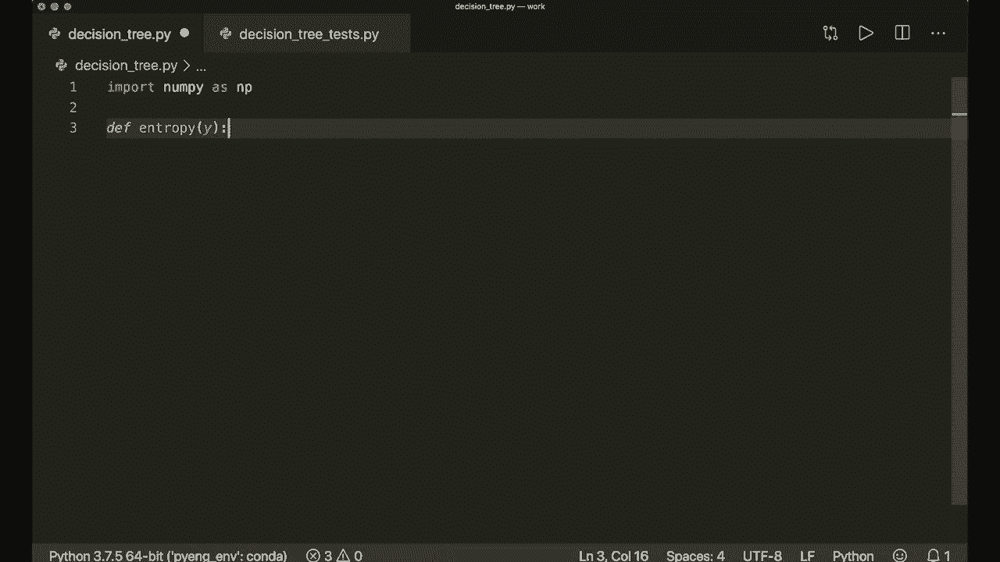

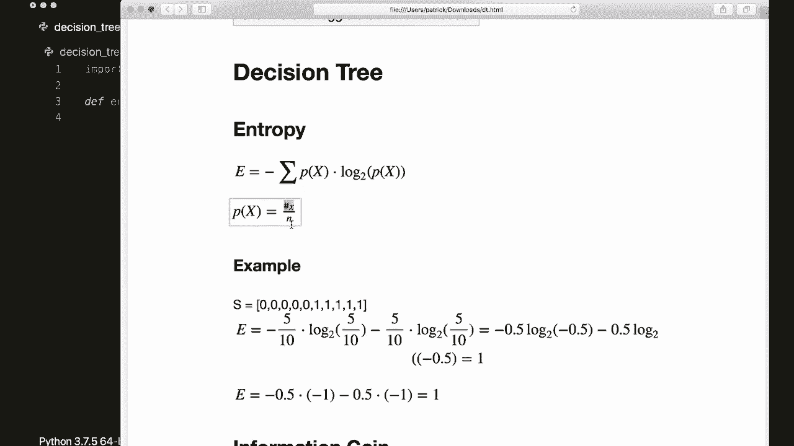

---

## 概述

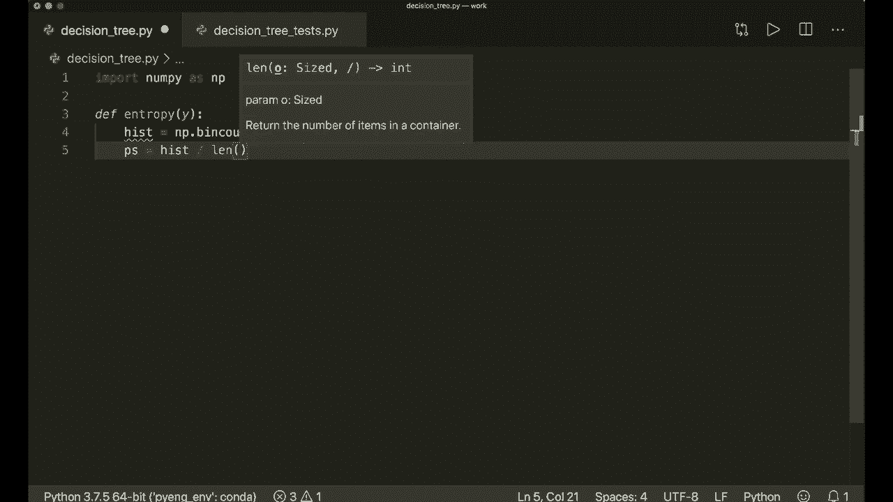

上一节我们介绍了决策树的理论基础。本节中，我们将动手实现一个完整的决策树分类器。实现过程包括定义辅助函数、构建树结构、实现训练（拟合）和预测方法。

---

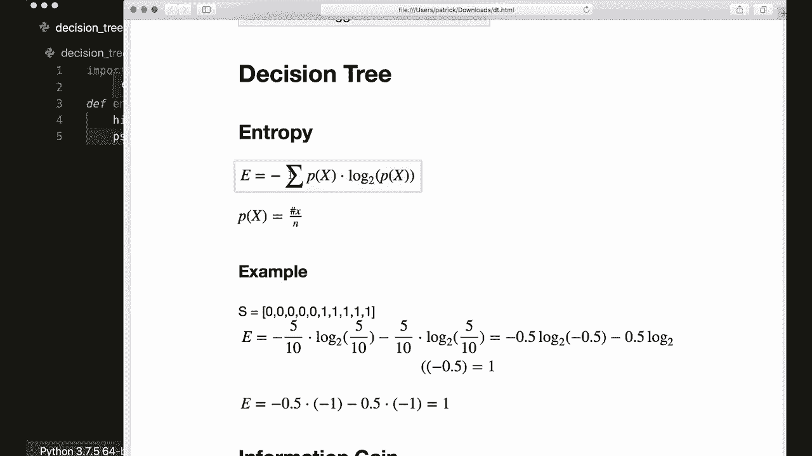

## 熵的计算

首先，我们需要一个函数来计算数据集的熵。熵是衡量数据集不纯度的指标。

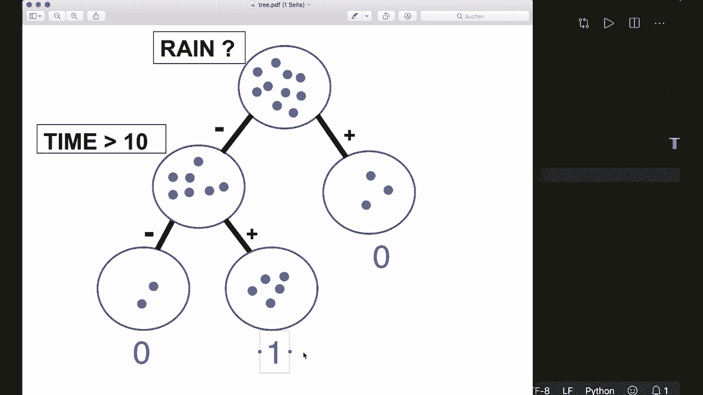

**公式**：
`Entropy = - Σ (p_i * log2(p_i))`，其中 `p_i` 是第 `i` 个类别在数据集中出现的概率。

以下是计算熵的代码实现：

```python
import numpy as np

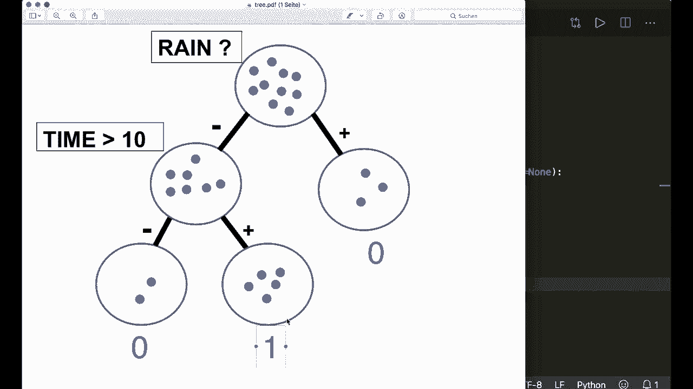

def entropy(y):
    hist = np.bincount(y)
    ps = hist / len(y)
    return -np.sum([p * np.log2(p) for p in ps if p > 0])
```

该函数接收一个包含类别标签的向量 `y`，计算每个标签的出现频率，然后应用熵公式。

---

## 节点类

决策树由节点构成。我们需要一个 `Node` 类来存储每个节点的信息，例如分裂特征、阈值、子节点或叶节点的预测值。

以下是 `Node` 类的实现：

```python
class Node:
    def __init__(self, feature=None, threshold=None, left=None, right=None, *, value=None):
        self.feature = feature
        self.threshold = threshold
        self.left = left
        self.right = right
        self.value = value

    def is_leaf_node(self):
        return self.value is not None
```

*   如果节点是内部节点，则存储 `feature`（分裂特征索引）、`threshold`（分裂阈值）以及 `left` 和 `right` 子节点。
*   如果节点是叶节点，则存储 `value`（该节点的预测类别）。
*   `is_leaf_node` 方法用于判断节点是否为叶节点。

---

## 决策树类

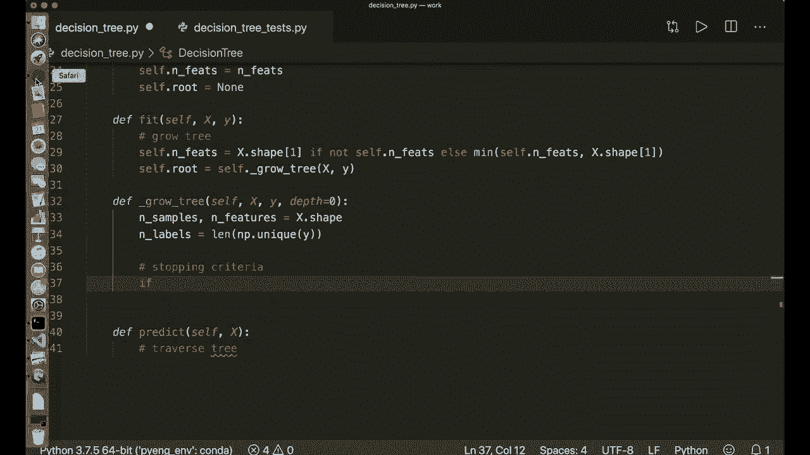

现在，我们开始实现主要的 `DecisionTree` 类。该类将包含树的生长、训练和预测逻辑。

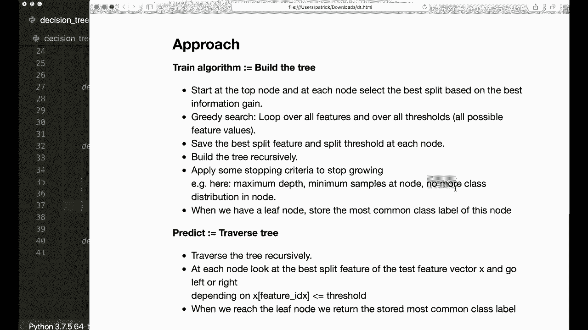

### 初始化

在初始化时，我们设置一些超参数，如树的最大深度、节点继续分裂所需的最小样本数，以及每次分裂时考虑的特征数量（用于随机性）。

```python
from collections import Counter

class DecisionTree:
    def __init__(self, min_samples_split=2, max_depth=100, n_features=None):
        self.min_samples_split = min_samples_split
        self.max_depth = max_depth
        self.n_features = n_features
        self.root = None
```

### 辅助函数：最常见标签

在创建叶节点时，我们需要知道该节点中最常见的类别标签。

```python
    def _most_common_label(self, y):
        counter = Counter(y)
        most_common = counter.most_common(1)[0][0]
        return most_common
```

### 核心方法：拟合（训练）

`fit` 方法是训练决策树的核心。它调用 `_grow_tree` 方法从根节点开始递归地构建树。

```python
    def fit(self, X, y):
        # 确定实际使用的特征数量
        self.n_features = X.shape[1] if not self.n_features else min(self.n_features, X.shape[1])
        # 开始生长树
        self.root = self._grow_tree(X, y)
```

### 树生长逻辑

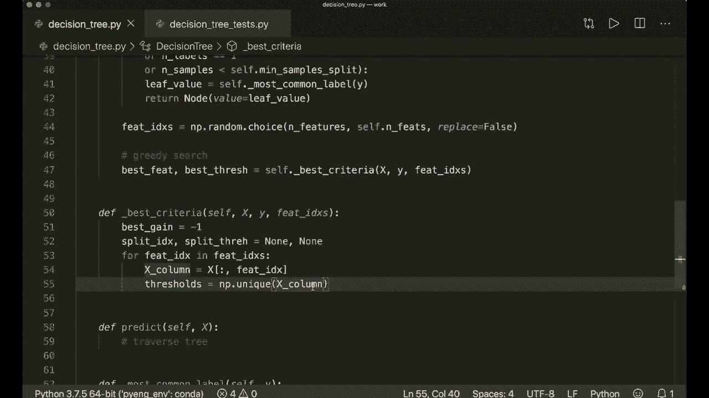

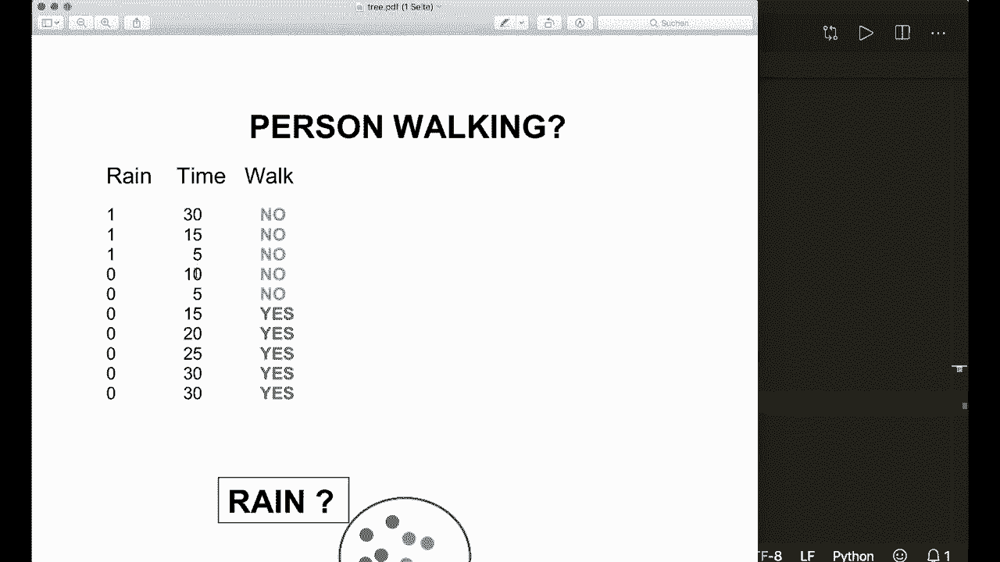

`_grow_tree` 方法递归地构建决策树。它遵循以下步骤：
1.  检查停止条件（达到最大深度、节点样本数过少或节点纯度足够）。
2.  如果满足停止条件，则创建叶节点，其值为当前节点数据中最常见的标签。
3.  否则，进行贪婪搜索以找到最佳分裂特征和阈值。
4.  根据最佳分裂点将数据分为左右两部分。
5.  对左右子集递归调用 `_grow_tree` 方法。

```python
    def _grow_tree(self, X, y, depth=0):
        n_samples, n_feats = X.shape
        n_labels = len(np.unique(y))

        # 停止条件检查
        if (depth >= self.max_depth or n_labels == 1 or n_samples < self.min_samples_split):
            leaf_value = self._most_common_label(y)
            return Node(value=leaf_value)

        # 随机选择特征子集进行搜索
        feat_idxs = np.random.choice(n_feats, self.n_features, replace=False)

        # 贪婪搜索最佳分裂点
        best_feat, best_thresh = self._best_criteria(X, y, feat_idxs)

        # 根据最佳分裂点分割数据
        left_idxs, right_idxs = self._split(X[:, best_feat], best_thresh)

        # 递归生长左右子树
        left = self._grow_tree(X[left_idxs, :], y[left_idxs], depth+1)
        right = self._grow_tree(X[right_idxs, :], y[right_idxs], depth+1)

        # 返回内部节点
        return Node(best_feat, best_thresh, left, right)
```

### 寻找最佳分裂标准

`_best_criteria` 方法遍历指定的特征和所有可能的阈值，计算每个分裂的信息增益，并选择增益最大的分裂点。

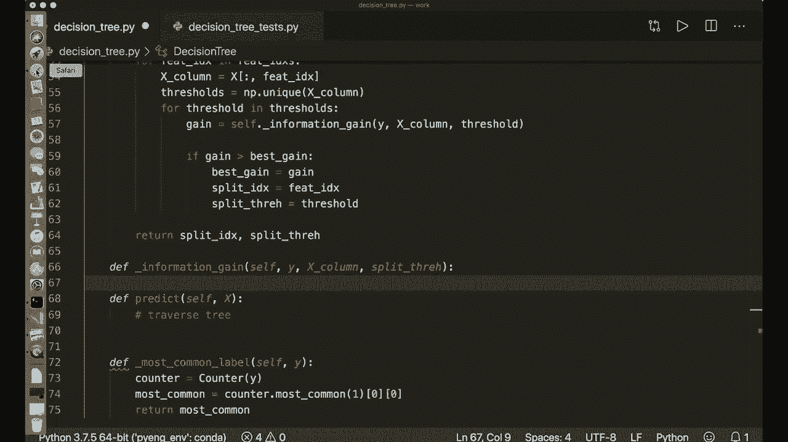

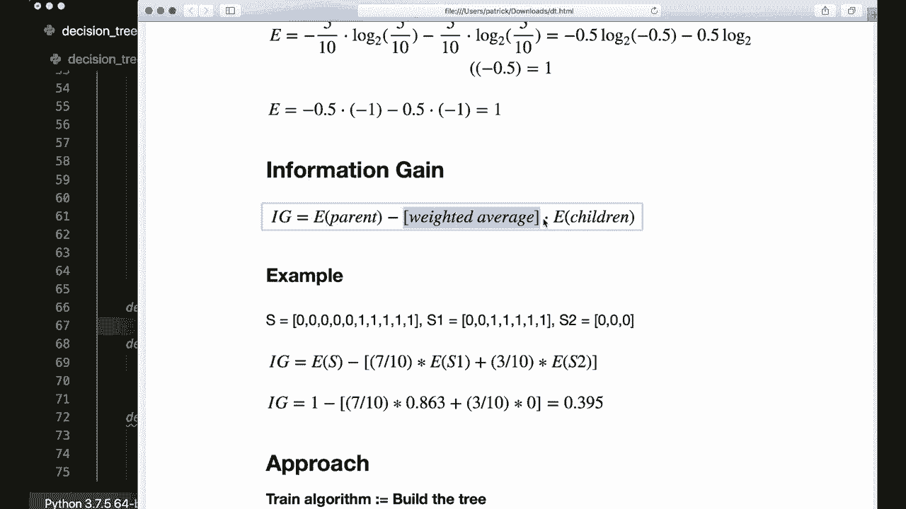

```python
    def _best_criteria(self, X, y, feat_idxs):
        best_gain = -1
        split_idx, split_thresh = None, None

        for feat_idx in feat_idxs:
            X_column = X[:, feat_idx]
            thresholds = np.unique(X_column)

            for threshold in thresholds:
                gain = self._information_gain(y, X_column, threshold)
                if gain > best_gain:
                    best_gain = gain
                    split_idx = feat_idx
                    split_thresh = threshold
        return split_idx, split_thresh
```

### 计算信息增益

信息增益衡量了分裂前后不确定性减少的程度。它是父节点熵与子节点加权平均熵的差值。

**公式**：
`Information Gain = Entropy(parent) - [ (n_left/n_total)*Entropy(left) + (n_right/n_total)*Entropy(right) ]`

```python
    def _information_gain(self, y, X_column, split_thresh):
        # 父节点熵
        parent_entropy = entropy(y)

        # 生成分裂
        left_idxs, right_idxs = self._split(X_column, split_thresh)

        if len(left_idxs) == 0 or len(right_idxs) == 0:
            return 0

        # 计算子节点的加权平均熵
        n = len(y)
        n_l, n_r = len(left_idxs), len(right_idxs)
        e_l, e_r = entropy(y[left_idxs]), entropy(y[right_idxs])
        child_entropy = (n_l / n) * e_l + (n_r / n) * e_r

        # 计算信息增益
        information_gain = parent_entropy - child_entropy
        return information_gain
```

### 数据分割

`_split` 是一个简单的辅助函数，根据给定特征列和阈值将样本索引分为左右两组。

```python
    def _split(self, X_column, split_thresh):
        left_idxs = np.argwhere(X_column <= split_thresh).flatten()
        right_idxs = np.argwhere(X_column > split_thresh).flatten()
        return left_idxs, right_idxs
```

### 预测方法

训练好树之后，我们需要用它来对新样本进行预测。`predict` 方法对每个输入样本，从根节点开始遍历树，直到到达叶节点并返回其预测值。

```python
    def predict(self, X):
        return np.array([self._traverse_tree(x, self.root) for x in X])

    def _traverse_tree(self, x, node):
        # 如果到达叶节点，返回预测值
        if node.is_leaf_node():
            return node.value

        # 否则，根据特征和阈值决定向左或向右遍历
        if x[node.feature] <= node.threshold:
            return self._traverse_tree(x, node.left)
        return self._traverse_tree(x, node.right)
```

---

## 测试实现

以下是一个简单的测试脚本，使用乳腺癌数据集来验证我们的决策树实现：

```python
from sklearn import datasets
from sklearn.model_selection import train_test_split

# 加载数据
data = datasets.load_breast_cancer()
X, y = data.data, data.target

# 划分训练集和测试集
X_train, X_test, y_train, y_test = train_test_split(X, y, test_size=0.2, random_state=42)

# 创建并训练决策树
clf = DecisionTree(max_depth=10)
clf.fit(X_train, y_train)

# 进行预测并计算准确率
predictions = clf.predict(X_test)
accuracy = np.sum(predictions == y_test) / len(y_test)
print(f"决策树准确率: {accuracy:.2f}")
```

运行此脚本，可以评估我们实现的决策树分类器的性能。

---

## 总结

本节课中，我们一起学习了如何从零开始实现一个决策树分类器。我们涵盖了以下关键步骤：
1.  **计算熵**：作为衡量数据不纯度的指标。
2.  **构建节点类**：用于存储树的结构信息。
3.  **实现树生长逻辑**：通过递归分裂数据来构建树，并使用信息增益作为分裂标准。
4.  **实现预测功能**：通过遍历训练好的树结构对新样本进行分类。

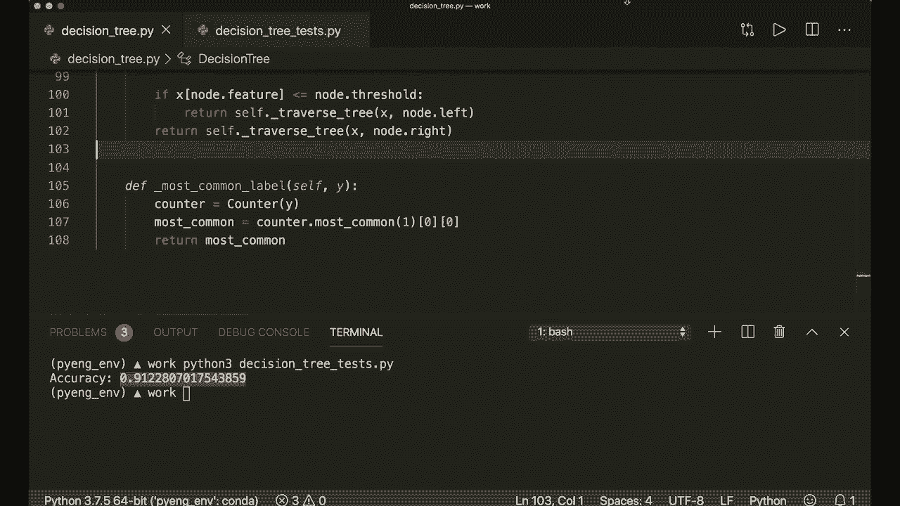

这个实现包含了决策树的核心思想，并为后续扩展（如随机森林）奠定了基础。在下一个教程中，我们将以此为基础，实现更强大的集成学习模型——随机森林。