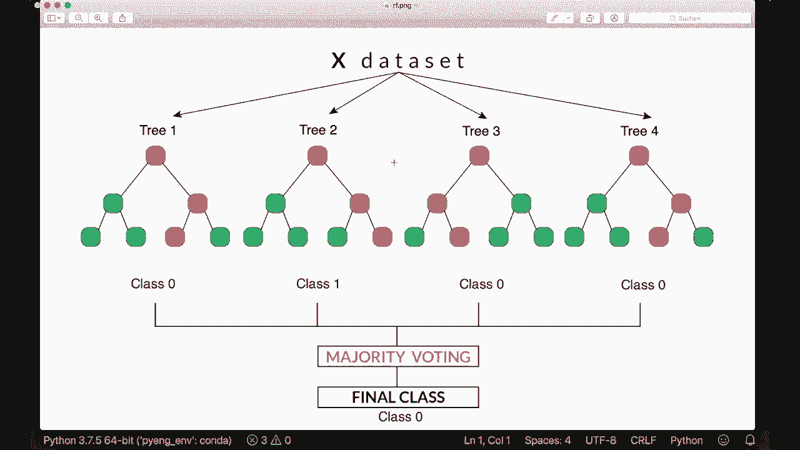
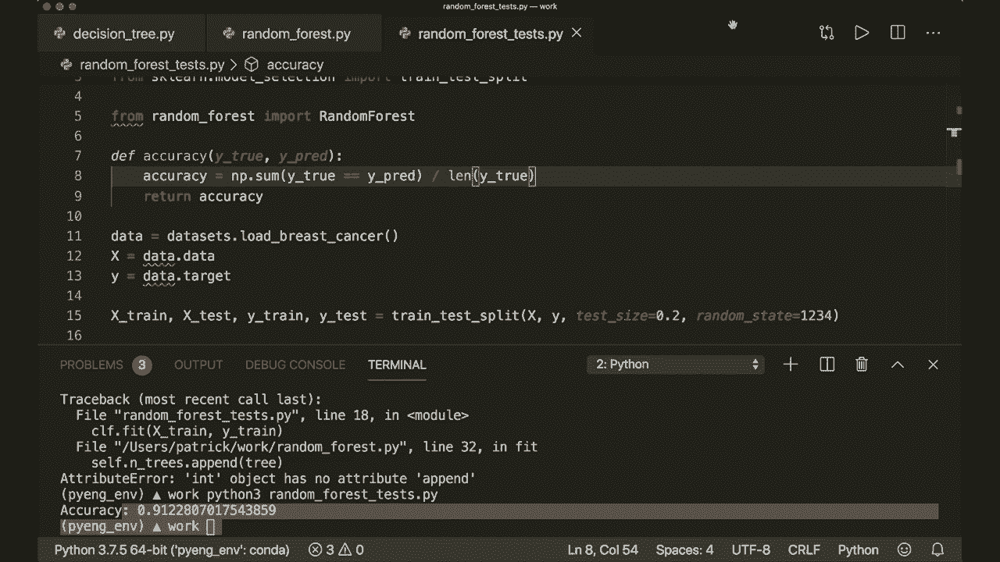

# 机器学习算法实现教程 P11：L11 - 随机森林 🌲🌲🌲

在本节课中，我们将要学习如何使用 Python 和 Numpy 库来实现随机森林算法。随机森林是最强大且最受欢迎的机器学习算法之一。

在上一个教程中，我们介绍了单棵决策树的工作原理。如果你还没有观看之前的教程，请务必去观看，因为本次的随机森林模型及其实现是基于上次的决策树模型构建的。

## 算法概述

随机森林的核心思想是将多棵决策树组合成一片“森林”。我们训练多棵树，每棵树使用训练数据的一个随机子集进行训练，这也是“随机”一词的由来。在预测时，我们让每棵树都进行预测，然后通过“多数投票”的方式来决定最终的预测结果。

随机森林相比单棵决策树有一些优势。通过构建更多的树，我们有更多机会获得正确的预测。同时，这种方法也减少了单棵树过拟合的可能性。因此，随机森林的准确性通常高于单棵决策树，这也是它如此强大的原因。



现在，我们可以直接跳到实现部分。

## 代码实现

首先，我们需要导入必要的库和模块。

```python
import numpy as np
from collections import Counter
from decision_tree import DecisionTree  # 假设决策树类已在上一个教程中实现
```

接下来，我们创建随机森林类。

```python
class RandomForest:
    def __init__(self, n_trees=100, min_samples_split=2, max_depth=100, n_feats=None):
        self.n_trees = n_trees
        self.min_samples_split = min_samples_split
        self.max_depth = max_depth
        self.n_feats = n_feats
        self.trees = []
```

在初始化方法中，我们定义了森林中树的数量、决策树分裂所需的最小样本数、树的最大深度以及可选的特征数量。同时，我们创建了一个空列表来存储训练好的树。

上一节我们介绍了类的初始化，本节中我们来看看如何训练模型。

### 训练模型（Fit 方法）

以下是 `fit` 方法的实现步骤，它负责训练随机森林中的所有决策树。

```python
    def fit(self, X, y):
        self.trees = []  # 确保列表为空
        for _ in range(self.n_trees):
            # 创建一棵决策树
            tree = DecisionTree(min_samples_split=self.min_samples_split,
                                max_depth=self.max_depth,
                                n_feats=self.n_feats)
            # 为当前树生成一个随机数据子集（Bootstrap 样本）
            X_sample, y_sample = self._bootstrap_samples(X, y)
            # 用该子集训练决策树
            tree.fit(X_sample, y_sample)
            # 将训练好的树添加到列表中
            self.trees.append(tree)
```

在训练每棵树之前，我们需要从原始数据中抽取一个随机子集。这个过程称为“Bootstrap 抽样”。

以下是生成 Bootstrap 样本的辅助函数。

```python
    def _bootstrap_samples(self, X, y):
        n_samples = X.shape[0]
        # 随机选择索引，允许重复（有放回抽样）
        idxs = np.random.choice(n_samples, size=n_samples, replace=True)
        return X[idxs], y[idxs]
```

这个函数通过有放回地随机抽取样本，为每棵树创建了一个略有不同的训练数据集。

### 进行预测（Predict 方法）

训练好模型后，我们就可以用它来进行预测了。预测过程分为两步：首先让每棵树独立预测，然后汇总结果进行投票。

以下是 `predict` 方法的实现。

```python
    def predict(self, X):
        # 收集每棵树的预测结果
        tree_preds = np.array([tree.predict(X) for tree in self.trees])
        # 调整数组结构，便于后续按样本进行多数投票
        tree_preds = np.swapaxes(tree_preds, 0, 1)
        # 对每个样本的多个预测结果进行多数投票
        y_pred = [self._most_common_label(tree_pred) for tree_pred in tree_preds]
        return np.array(y_pred)
```

为了让代码更清晰，我们需要一个辅助函数来找出一个数组中出现次数最多的标签（即多数投票）。

以下是 `_most_common_label` 函数的实现。

```python
    def _most_common_label(self, y):
        counter = Counter(y)
        most_common = counter.most_common(1)[0][0]
        return most_common
```

这个函数使用 `collections.Counter` 来统计标签出现的频率，并返回最常见的那个。

## 模型测试

现在，让我们用一个简单的测试脚本来验证我们的随机森林模型是否工作正常。

```python
from sklearn.datasets import load_breast_cancer
from sklearn.model_selection import train_test_split
from sklearn.metrics import accuracy_score

# 加载数据
data = load_breast_cancer()
X = data.data
y = data.target

# 划分训练集和测试集
X_train, X_test, y_train, y_test = train_test_split(X, y, test_size=0.2, random_state=42)

# 创建随机森林实例（为了演示速度，这里只使用3棵树）
clf = RandomForest(n_trees=3, max_depth=10)

# 训练模型
clf.fit(X_train, y_train)

# 进行预测
predictions = clf.predict(X_test)

# 计算准确率
acc = accuracy_score(y_test, predictions)
print(f"随机森林模型准确率: {acc:.2f}")
```

运行这段代码，如果一切顺利，你将看到模型在测试集上的预测准确率。

## 总结

本节课中我们一起学习了随机森林算法的原理与实现。我们了解到，随机森林通过集成多棵在随机数据子集上训练的决策树，并采用多数投票机制进行预测，从而获得了比单棵决策树更强的泛化能力和更高的准确性。

我们使用 Python 和 Numpy 从零开始实现了随机森林类，包括 Bootstrap 抽样、模型训练和预测等核心功能。虽然我们的实现为了清晰易懂而牺牲了一些性能优化，但它完整地展示了随机森林的工作机制。



希望这个教程能帮助你更好地理解这一强大的机器学习算法。