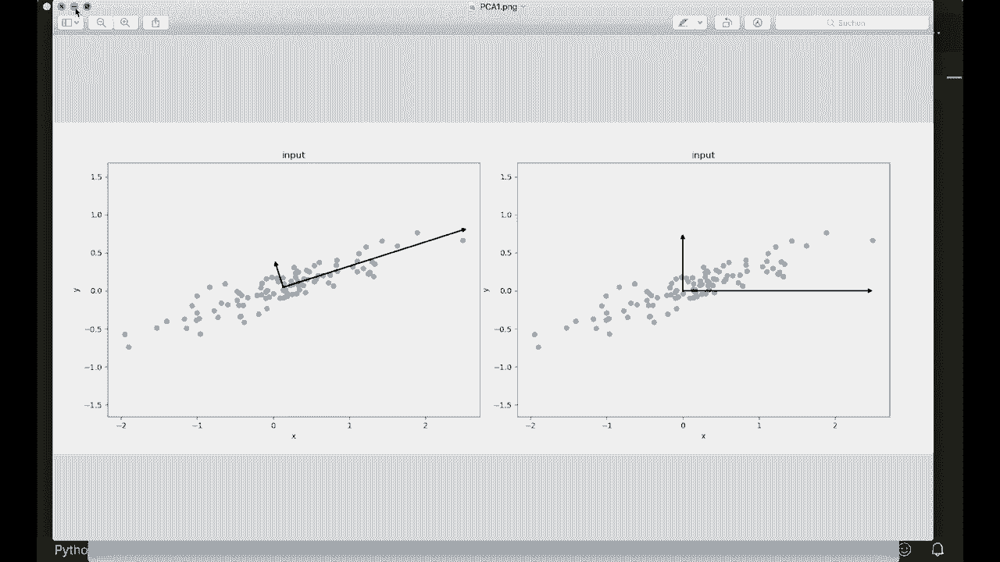
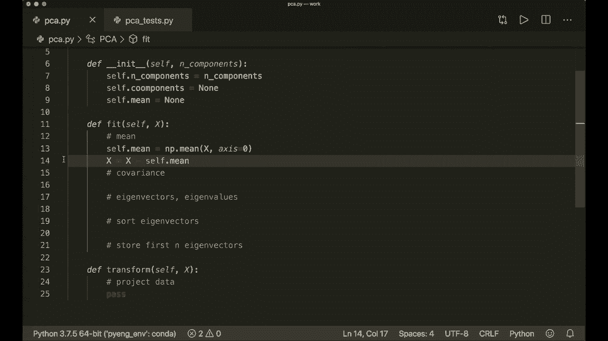
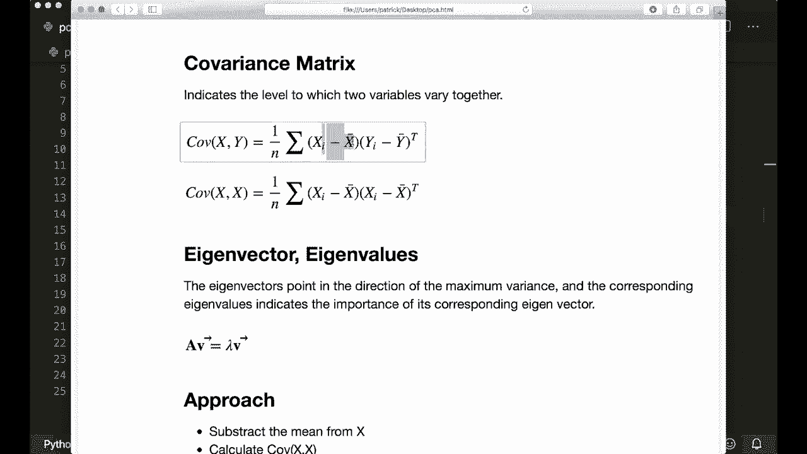
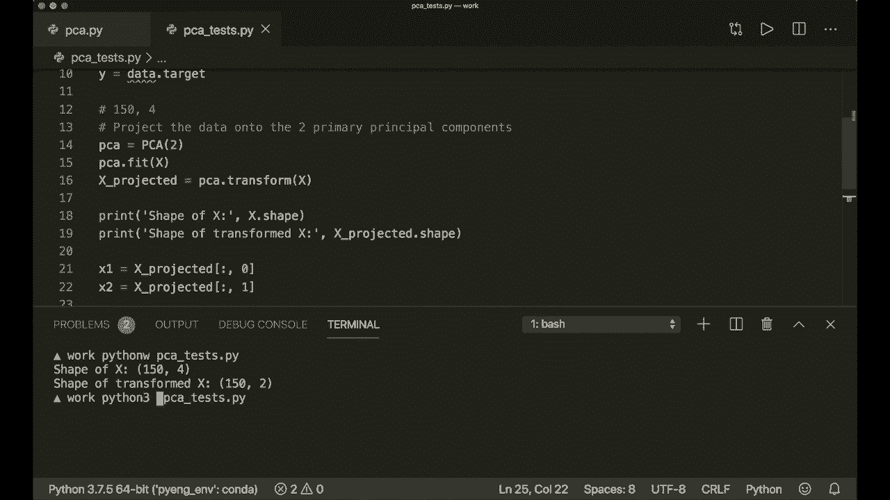
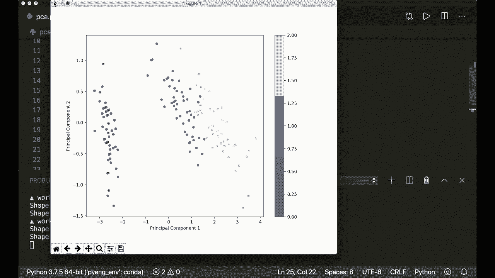
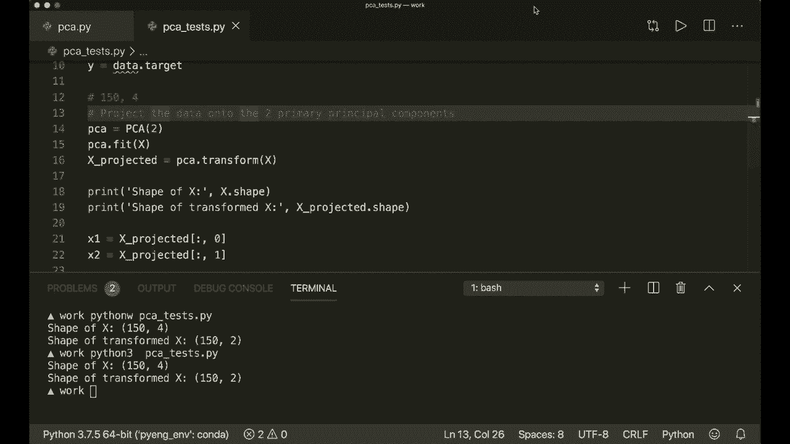

# 课程 P12：L12 - 主成分分析 (PCA) 🧩

在本节课中，我们将学习主成分分析（PCA）的原理，并使用 Python 和 Numpy 库从头实现它。PCA 是一种强大的降维技术，能够从数据中提取线性无关的特征，并帮助我们理解数据的主要变化方向。

## 概述

主成分分析（PCA）的目标是找到一组新的坐标轴（称为主成分），这些坐标轴彼此正交（即线性独立），并且能够按照数据在它们上方差的大小进行排序。通过保留方差最大的前几个主成分，我们可以在尽可能保留信息的同时，降低数据的维度。

## PCA 的核心思想

假设我们有一组二维数据点，我们希望将其投影到一维空间上。正确的投影方向应该使得投影后的数据点具有最大的分布范围（即方差最大），同时从原始数据点到投影轴的垂直距离（即投影误差）最小。

上一节我们介绍了 PCA 的目标，本节中我们来看看如何通过数学方法找到这些主成分。

## PCA 的数学原理

我们需要最大化投影数据的方差。样本 **X** 的方差公式为：

\[
\text{Var}(X) = \frac{1}{n} \sum_{i=1}^{n} (x_i - \bar{x})^2
\]

其中，\(\bar{x}\) 是样本均值。在计算前，我们需要先将数据中心化（减去均值）。

此外，我们需要计算数据的协方差矩阵，它描述了不同特征之间的共同变化关系。对于中心化后的数据 **X**，其协方差矩阵 **C** 的计算公式为：



\[
C = \frac{1}{n} X^T X
\]

我们的问题最终归结为求解这个协方差矩阵的特征值和特征向量。特征向量指明了数据方差最大的方向，而对应的特征值则表示了该方向上方差的大小。

## PCA 的实现步骤

以下是实现 PCA 所需的具体步骤：

1.  **中心化数据**：从数据集中减去每个特征的均值。
2.  **计算协方差矩阵**：根据上述公式计算中心化后数据的协方差矩阵。
3.  **计算特征值与特征向量**：对协方差矩阵进行特征分解。
4.  **排序特征向量**：将特征向量按照其对应特征值的大小降序排列。
5.  **选择主成分**：根据要保留的维度数量 `k`，选择前 `k` 个特征向量。
6.  **转换数据**：将原始数据投影到选出的特征向量上，得到降维后的新数据。



## 使用 Python 和 Numpy 实现 PCA



现在，我们将上述步骤转化为代码。首先创建一个名为 `PCA` 的类。

```python
import numpy as np

class PCA:
    def __init__(self, n_components):
        self.n_components = n_components
        self.components = None
        self.mean = None

    def fit(self, X):
        # 步骤1: 中心化数据
        self.mean = np.mean(X, axis=0)
        X = X - self.mean

        # 步骤2: 计算协方差矩阵
        # 注意：np.cov 期望每行是一个特征，每列是一个样本，因此需要转置
        cov_matrix = np.cov(X.T)

        # 步骤3: 计算特征值和特征向量
        eigenvalues, eigenvectors = np.linalg.eig(cov_matrix)
        # np.linalg.eig 返回的 eigenvectors 的每一列是一个特征向量，我们将其转置以便于后续操作
        eigenvectors = eigenvectors.T

        # 步骤4: 对特征向量进行排序（按特征值降序）
        idxs = np.argsort(eigenvalues)[::-1]
        eigenvalues = eigenvalues[idxs]
        eigenvectors = eigenvectors[idxs]

        # 步骤5: 存储前 n_components 个特征向量
        self.components = eigenvectors[0:self.n_components]

    def transform(self, X):
        # 将数据投影到主成分上
        X = X - self.mean
        return np.dot(X, self.components.T)
```

## 测试 PCA 实现

我们将使用著名的 Iris 数据集来测试我们的 PCA 实现。该数据集原本有 4 个特征，我们将使用 PCA 将其降至 2 维以便可视化。

```python
from sklearn.datasets import load_iris
import matplotlib.pyplot as plt

# 加载数据
data = load_iris()
X = data.data
y = data.target

# 创建 PCA 实例并降维
pca = PCA(n_components=2)
pca.fit(X)
X_projected = pca.transform(X)

print('原始数据形状:', X.shape)
print('降维后数据形状:', X_projected.shape)

# 可视化结果
plt.scatter(X_projected[:, 0], X_projected[:, 1], c=y, edgecolor='none', alpha=0.8, cmap=plt.cm.get_cmap('viridis', 3))
plt.xlabel('主成分 1')
plt.ylabel('主成分 2')
plt.colorbar()
plt.show()
```



运行上述代码，我们将得到原始 4 维数据在 2 维空间中的投影。不同类别的数据点用不同颜色表示，可以看到即使经过降维，不同类别之间仍然有较好的区分度。

## 总结





本节课中我们一起学习了主成分分析（PCA）。我们了解了 PCA 通过寻找数据方差最大的方向（主成分）来实现降维和特征提取。我们详细介绍了其数学原理，包括方差最大化、协方差矩阵和特征分解。最后，我们使用 Python 和 Numpy 一步步实现了 PCA 算法，并在 Iris 数据集上验证了其效果。PCA 是数据预处理和探索性数据分析中的一个基础且重要的工具。