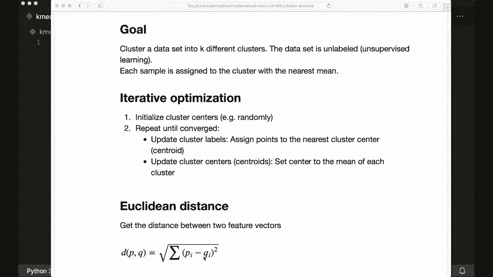
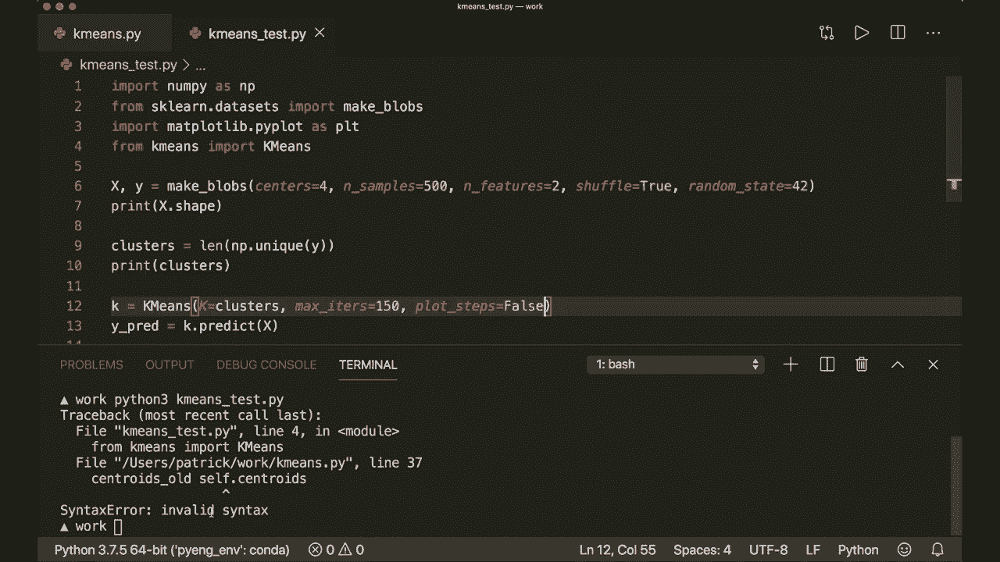
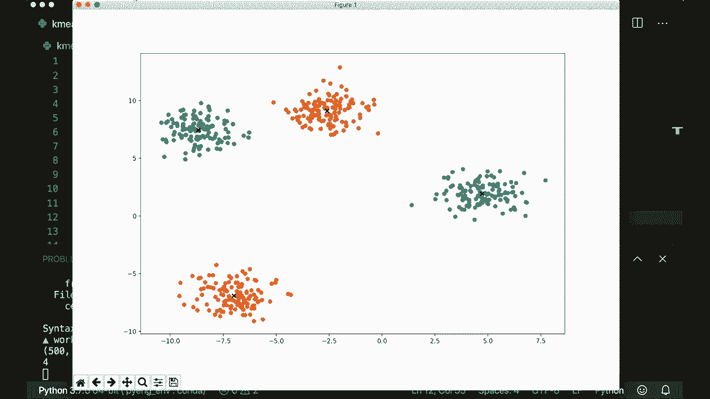
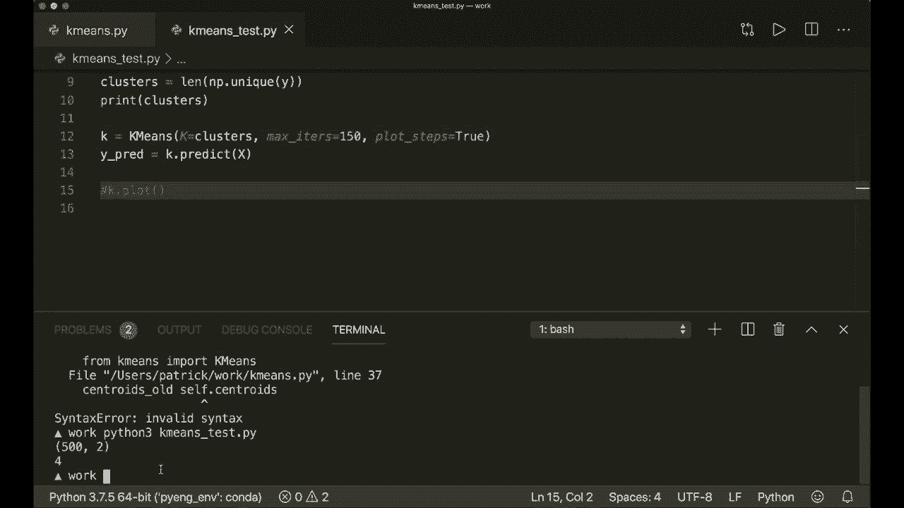
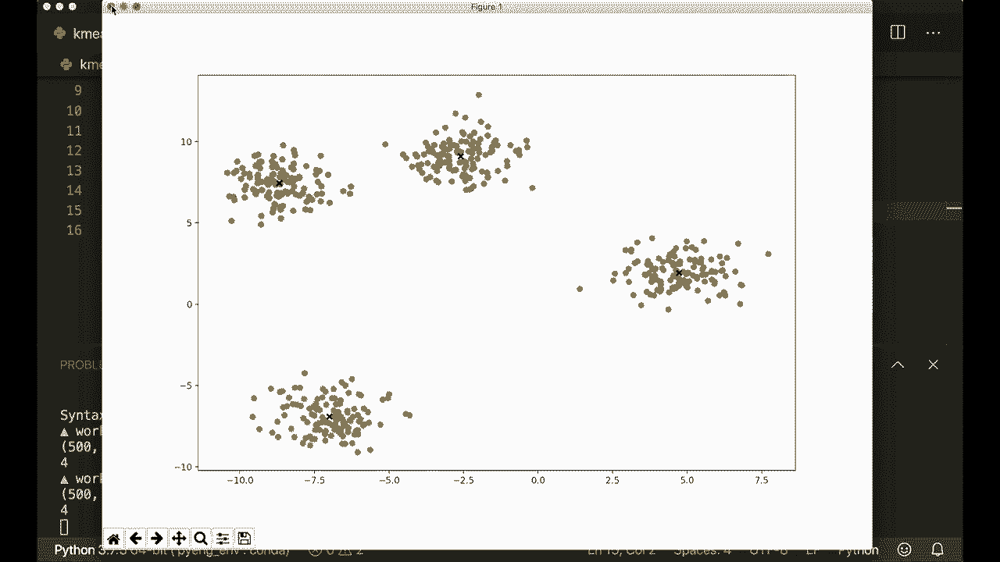
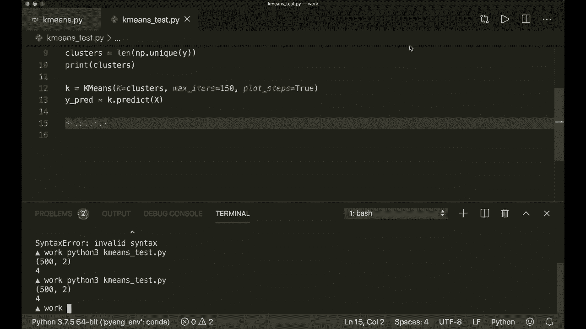

# 课程 P13：L13 - K均值聚类算法 🎯

在本节课中，我们将学习并实现K均值聚类算法。这是一种无监督学习技术，用于将未标记的数据集划分为K个不同的组（聚类）。我们将仅使用Python内置模块和Numpy库来完成这一任务。

## 概述

K均值算法的目标是将数据集中的样本分配到K个聚类中，使得每个样本都属于与其最近的聚类中心（质心）所代表的聚类。整个过程通过迭代优化来完成。

## 算法原理

上一节我们介绍了K均值的目标，本节中我们来看看其具体的工作原理。这是一种迭代优化技术，主要包含两个核心步骤。



首先，我们随机初始化K个聚类中心（质心）。然后，重复执行以下两个步骤，直到算法收敛（即质心不再发生变化）：
1.  **分配步骤**：将每个数据点分配给距离它最近的质心所在的聚类。
2.  **更新步骤**：重新计算每个聚类的质心，即该聚类中所有数据点的平均值。

以下是算法流程的简要说明：
*   初始化：随机选择K个数据点作为初始质心。
*   循环直到收敛：
    *   对于数据集中的每个点，计算其到所有质心的距离，并将其分配给最近的质心对应的聚类。
    *   对于每个聚类，计算其所有成员点的平均值，并将该平均值设为新的质心。

## 核心数学概念

实现K均值算法所需的唯一数学工具是**欧几里得距离**，用于衡量数据点之间的相似度。

两个向量 `x1` 和 `x2` 之间的欧几里得距离公式如下：

`distance = sqrt(sum((x1 - x2)^2))`

在代码中，我们可以用一行Numpy代码来实现：

```python
def euclidean_distance(x1, x2):
    return np.sqrt(np.sum((x1 - x2) ** 2))
```

## 代码实现

理解了原理和公式后，我们现在开始用Python和Numpy实现K均值算法。

首先，导入必要的库并设置随机种子以确保结果可复现。

```python
import numpy as np
import matplotlib.pyplot as plt

np.random.seed(42)
```

接下来，我们实现欧几里得距离函数。

```python
def euclidean_distance(x1, x2):
    return np.sqrt(np.sum((x1 - x2) ** 2))
```

现在，我们创建 `KMeans` 类。这个类将包含算法的主要逻辑。

```python
class KMeans:
    def __init__(self, K=5, max_iters=100, plot_steps=False):
        self.K = K
        self.max_iters = max_iters
        self.plot_steps = plot_steps
        
        # 初始化聚类列表和质心列表
        self.clusters = [[] for _ in range(self.K)]
        self.centroids = []
```

由于K均值是无监督学习，我们主要实现 `predict` 方法来对数据进行聚类。

`predict` 方法是算法的主流程，它依次执行初始化、迭代优化和返回结果。

```python
    def predict(self, X):
        self.X = X
        self.n_samples, self.n_features = X.shape
        
        # 1. 初始化质心
        random_sample_idxs = np.random.choice(self.n_samples, self.K, replace=False)
        self.centroids = [self.X[idx] for idx in random_sample_idxs]
        
        # 2. 优化循环
        for _ in range(self.max_iters):
            # 更新聚类分配
            self.clusters = self._create_clusters(self.centroids)
            
            if self.plot_steps:
                self.plot()
            
            # 更新质心
            centroids_old = self.centroids
            self.centroids = self._get_centroids(self.clusters)
            
            if self.plot_steps:
                self.plot()
            
            # 检查是否收敛
            if self._is_converged(centroids_old, self.centroids):
                break
        
        # 3. 返回聚类标签
        return self._get_cluster_labels(self.clusters)
```

以下是 `predict` 方法中调用的几个关键辅助函数。

`_create_clusters` 函数负责将每个样本点分配到最近的质心。

```python
    def _create_clusters(self, centroids):
        clusters = [[] for _ in range(self.K)]
        for idx, sample in enumerate(self.X):
            centroid_idx = self._closest_centroid(sample, centroids)
            clusters[centroid_idx].append(idx)
        return clusters
```

`_closest_centroid` 函数计算一个样本点到所有质心的距离，并返回最近质心的索引。

```python
    def _closest_centroid(self, sample, centroids):
        distances = [euclidean_distance(sample, point) for point in centroids]
        closest_idx = np.argmin(distances)
        return closest_idx
```

`_get_centroids` 函数根据当前的聚类分配，计算每个聚类的新质心（即该聚类所有点的均值）。

```python
    def _get_centroids(self, clusters):
        centroids = np.zeros((self.K, self.n_features))
        for cluster_idx, cluster in enumerate(clusters):
            cluster_mean = np.mean(self.X[cluster], axis=0)
            centroids[cluster_idx] = cluster_mean
        return centroids
```

`_is_converged` 函数通过比较新旧质心是否相同来判断算法是否已经收敛。

```python
    def _is_converged(self, centroids_old, centroids):
        distances = [euclidean_distance(centroids_old[i], centroids[i]) for i in range(self.K)]
        return sum(distances) == 0
```

`_get_cluster_labels` 函数为每个样本点生成其所属聚类的标签。

```python
    def _get_cluster_labels(self, clusters):
        labels = np.empty(self.n_samples)
        for cluster_idx, cluster in enumerate(clusters):
            for sample_idx in cluster:
                labels[sample_idx] = cluster_idx
        return labels
```

最后，我们实现一个可选的绘图函数来可视化聚类过程。

```python
    def plot(self):
        fig, ax = plt.subplots(figsize=(12, 8))
        
        for i, cluster in enumerate(self.clusters):
            point = self.X[cluster].T
            ax.scatter(*point)
        
        for point in self.centroids:
            ax.scatter(*point, marker='x', color='black', linewidth=2)
        
        plt.show()
```



## 算法运行与可视化





代码实现完成后，我们可以创建一个示例数据集并运行K均值算法。通过将 `plot_steps` 参数设为 `True`，我们可以观察算法迭代过程中聚类和质心的变化。

1.  **初始化**：随机选择K个点作为初始质心。
2.  **迭代优化**：
    *   图像显示质心如何向各自聚类的中心移动。
    *   数据点的颜色如何根据其被重新分配到的聚类而改变。
3.  **收敛**：当质心位置不再变化时，算法停止，得到最终的聚类结果。

这个过程直观地展示了K均值如何通过迭代逐步优化聚类结果。

## 总结





本节课中我们一起学习了K均值聚类算法。我们从算法原理入手，理解了其通过迭代执行“分配”和“更新”步骤来优化聚类结果的核心思想。随后，我们使用Python和Numpy从零开始实现了整个算法，包括欧几里得距离计算、质心初始化、聚类分配、质心更新以及收敛判断等关键部分。最后，我们还通过可视化观察了算法的动态迭代过程。K均值是一种基础且强大的聚类工具，希望本教程能帮助你理解其内在机制。