# 机器学习算法实现教程 P15：LDA 📊

在本节课中，我们将要学习如何使用 Python 和 Numpy 实现线性判别分析算法。LDA 是一种监督降维技术，常用于机器学习流程的预处理步骤。

## 概述

线性判别分析是一种特征降维技术。其目标是将数据集投影到一个低维空间，同时最大化不同类别之间的分离度。与无监督的 PCA 不同，LDA 是一种监督学习算法，因为它需要使用数据的标签信息。

上一节我们介绍了 PCA 算法，本节中我们来看看 LDA。两者在实现方式上有许多相似之处，但核心目标不同。

## LDA 与 PCA 的区别

LDA 与 PCA 的主要区别在于优化目标：
*   在 PCA 中，目标是找到能最大化数据方差的新坐标轴。
*   在 LDA 中，目标是找到能最大化**类间分离度**的新坐标轴，同时保证类内数据点仍具有良好的分散性。

以下是一个简单的对比：
*   **PCA**：无监督，最大化方差。
*   **LDA**：监督，最大化类间分离。

## 核心概念与数学原理

LDA 的核心是计算两个散布矩阵：**类内散布矩阵** 和 **类间散布矩阵**。

### 类内散布矩阵 (Sw)

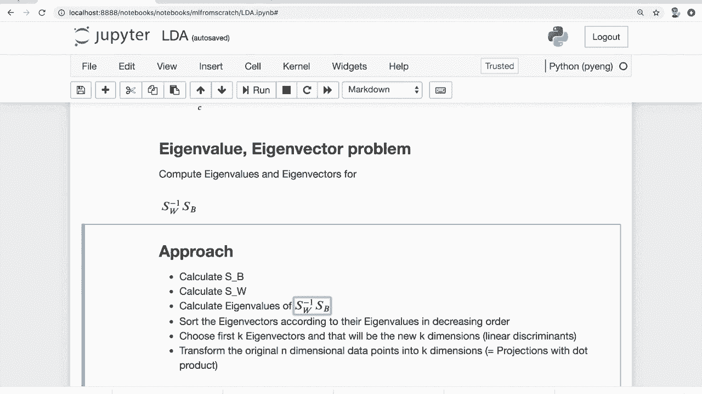

类内散布矩阵确保同一个类别内的数据点能被很好地分开。其计算公式为对所有类别求和：

**Sw = Σᵢ Σₓ (x - mᵢ)(x - mᵢ)ᵀ**

其中：
*   `x` 是属于类别 `i` 的一个样本特征向量。
*   `mᵢ` 是类别 `i` 中所有样本特征的均值向量。
*   求和遍历所有类别和各类别中的所有样本。

### 类间散布矩阵 (Sb)

类间散布矩阵确保不同类别之间能被很好地分开。其计算公式为：

**Sb = Σᵢ Nᵢ (mᵢ - m)(mᵢ - m)ᵀ**

其中：
*   `Nᵢ` 是类别 `i` 中的样本数量。
*   `mᵢ` 是类别 `i` 的均值向量。
*   `m` 是所有样本的总体均值向量。
*   求和遍历所有类别。

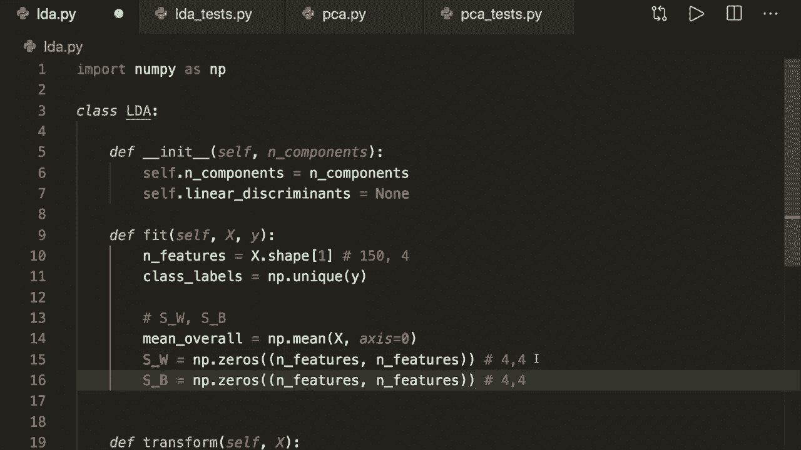

### 求解过程

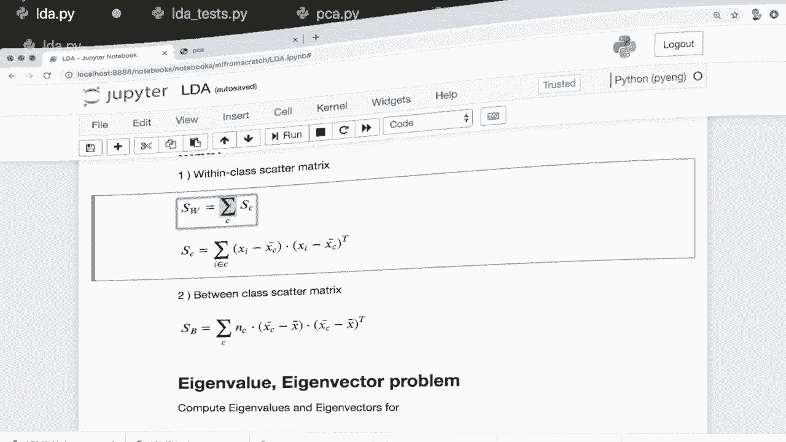

LDA 的目标是找到一个投影方向，使得类间散布与类内散布的比值最大。这通过求解以下广义特征值问题实现：

1.  计算矩阵 **Sw⁻¹Sb**。
2.  计算 **Sw⁻¹Sb** 的特征值和特征向量。
3.  将特征向量按对应特征值**降序**排列。
4.  选取前 `k` 个特征向量作为“线性判别式”，构成投影矩阵 `W`。
5.  将原始数据 `X` 投影到新空间：**X' = X · W**。

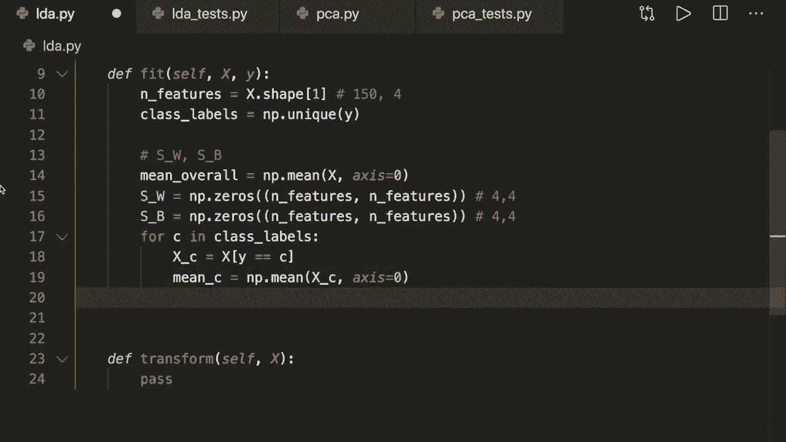

## 代码实现

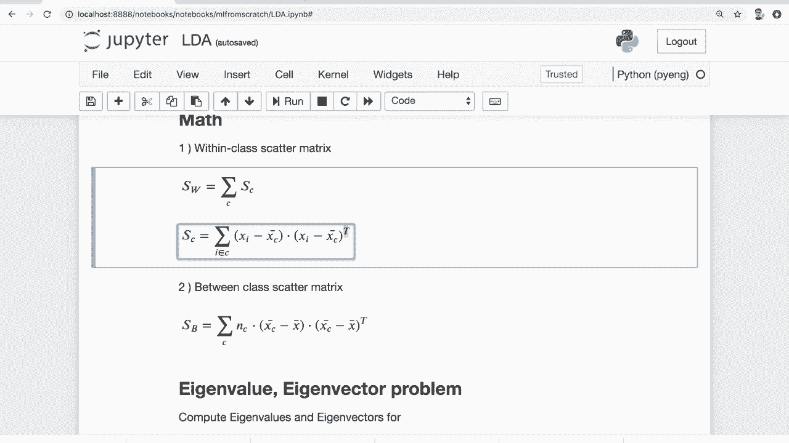

现在让我们跳到代码部分，一步步实现 LDA 算法。

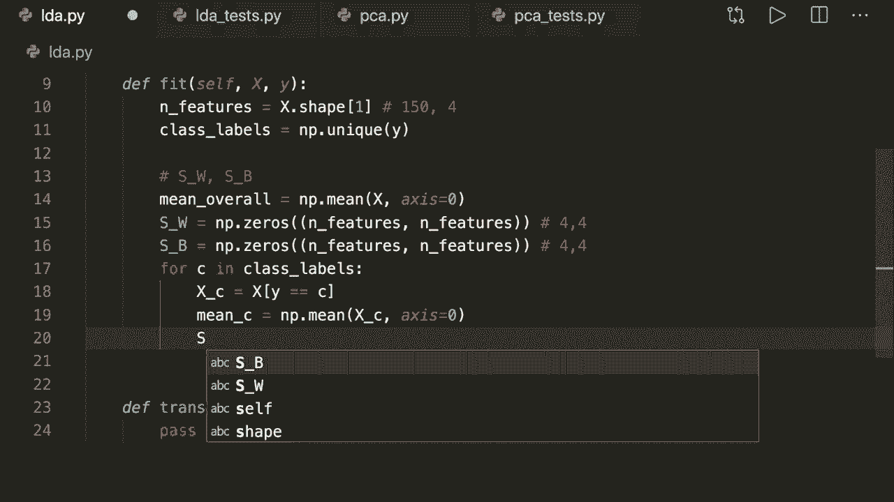

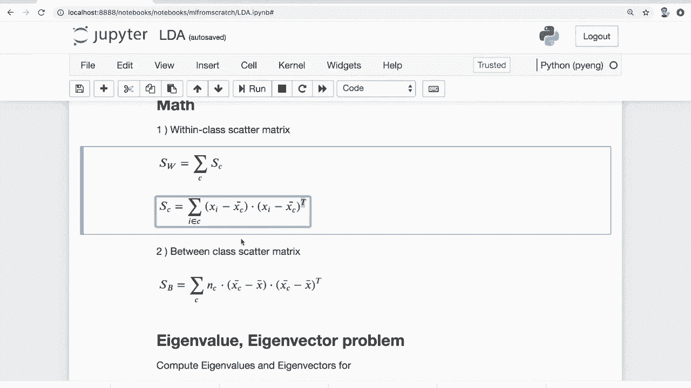

首先导入必要的库：

```python
import numpy as np
```

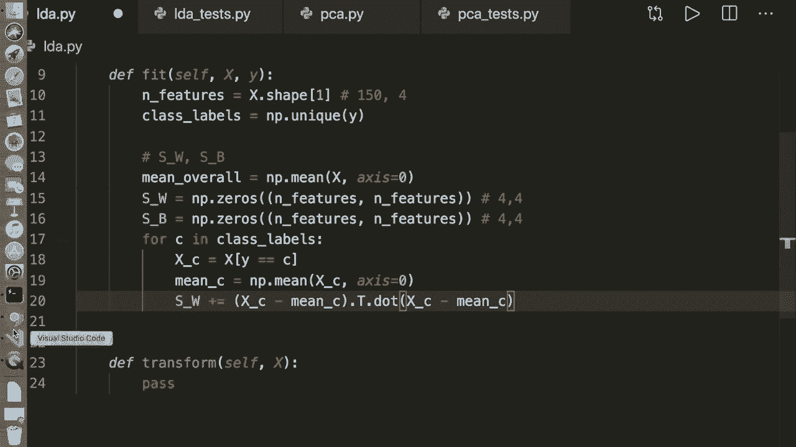

接下来定义 LDA 类：

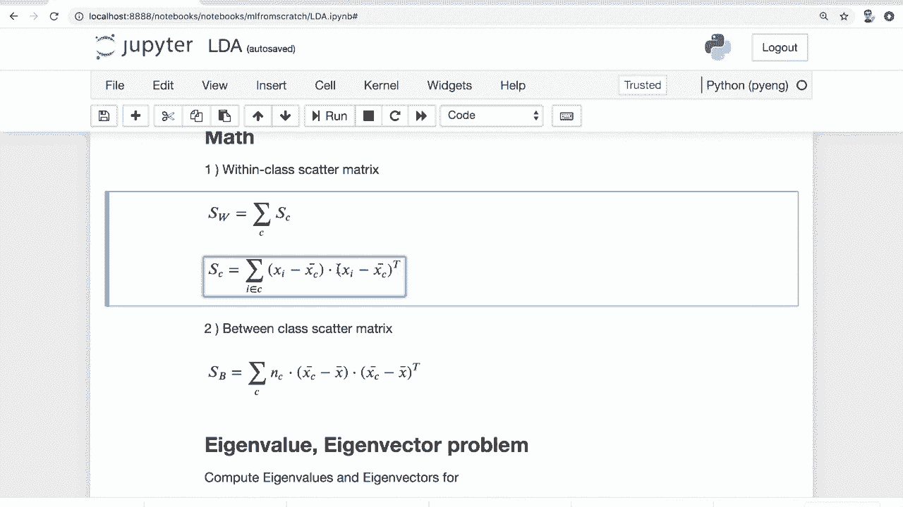

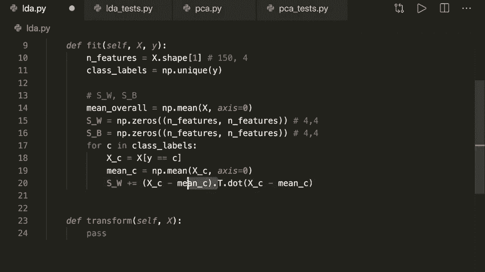

```python
class LDA:
    def __init__(self, n_components):
        self.n_components = n_components
        self.linear_discriminants = None
```

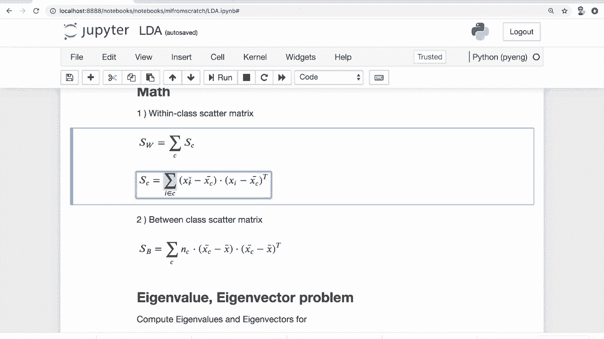

`__init__` 方法初始化类，存储要保留的成分（维度）数量，并预留一个变量来存储计算出的特征向量（线性判别式）。

### 拟合模型：`fit` 方法

`fit` 方法是核心，用于计算散布矩阵和线性判别式。

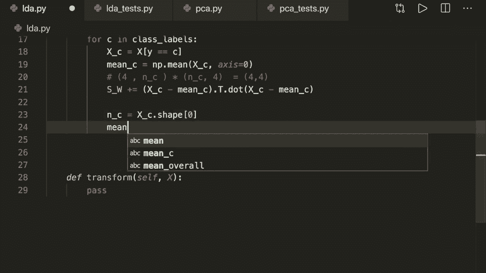

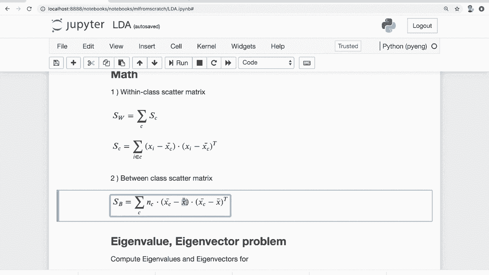

```python
    def fit(self, X, y):
        n_features = X.shape[1]
        class_labels = np.unique(y)

        # 计算总体均值
        mean_overall = np.mean(X, axis=0)

        # 初始化散布矩阵
        S_W = np.zeros((n_features, n_features))
        S_B = np.zeros((n_features, n_features))

        for c in class_labels:
            X_c = X[y == c]
            mean_c = np.mean(X_c, axis=0)
            n_c = X_c.shape[0]

            # 计算类内散布矩阵 Sw
            # (X_c - mean_c).T 是 4 x n_c, (X_c - mean_c) 是 n_c x 4
            # 点积结果是 4 x 4 矩阵
            S_W += (X_c - mean_c).T.dot((X_c - mean_c))

            # 计算类间散布矩阵 Sb
            # 重塑 mean_c 为列向量 (n_features, 1)
            mean_diff = (mean_c - mean_overall).reshape(n_features, 1)
            S_B += n_c * (mean_diff).dot(mean_diff.T)

        # 求解广义特征值问题：Sw^{-1} Sb
        A = np.linalg.inv(S_W).dot(S_B)
        eigenvalues, eigenvectors = np.linalg.eig(A)

        # 转置特征向量以便于排序
        eigenvectors = eigenvectors.T
        # 按特征值绝对值降序排序
        idxs = np.argsort(abs(eigenvalues))[::-1]
        eigenvalues = eigenvalues[idxs]
        eigenvectors = eigenvectors[idxs]

        # 存储前 n_components 个特征向量（线性判别式）
        self.linear_discriminants = eigenvectors[:self.n_components]
```

### 数据转换：`transform` 方法

`transform` 方法使用拟合阶段得到的线性判别式将数据投影到新的低维空间。

```python
    def transform(self, X):
        # 投影数据：X (n_samples, n_features) · linear_discriminants.T (n_features, n_components)
        return np.dot(X, self.linear_discriminants.T)
```

## 算法步骤总结

以下是 LDA 算法实现的关键步骤列表：

1.  **计算均值**：计算每个类别的均值向量和总体均值向量。
2.  **计算散布矩阵**：利用公式计算类内散布矩阵 `S_W` 和类间散布矩阵 `S_B`。
3.  **矩阵运算**：计算 `S_W` 的逆矩阵并与 `S_B` 相乘，得到矩阵 `A`。
4.  **特征分解**：计算矩阵 `A` 的特征值和特征向量。
5.  **排序与选择**：将特征向量按对应特征值降序排列，并选取前 `k` 个作为投影矩阵。
6.  **数据投影**：将原始数据与投影矩阵进行点积运算，得到降维后的数据。

## 测试示例

我们可以使用鸢尾花数据集来测试 LDA 的实现效果。

```python
# 示例测试代码（需自行准备数据）
# from sklearn.datasets import load_iris
# import matplotlib.pyplot as plt
#
# data = load_iris()
# X = data.data
# y = data.target
#
# lda = LDA(n_components=2)
# lda.fit(X, y)
# X_projected = lda.transform(X)
#
# plt.scatter(X_projected[:, 0], X_projected[:, 1], c=y, edgecolor='none', alpha=0.8)
# plt.xlabel('Linear Discriminant 1')
# plt.ylabel('Linear Discriminant 2')
# plt.colorbar()
# plt.show()
```

运行测试代码后，我们将得到数据在二维空间上的投影图，可以清晰地看到三个类别被有效地分离开。

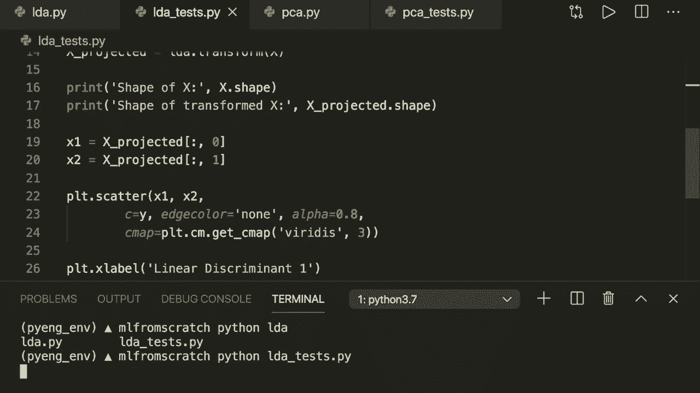

## 总结

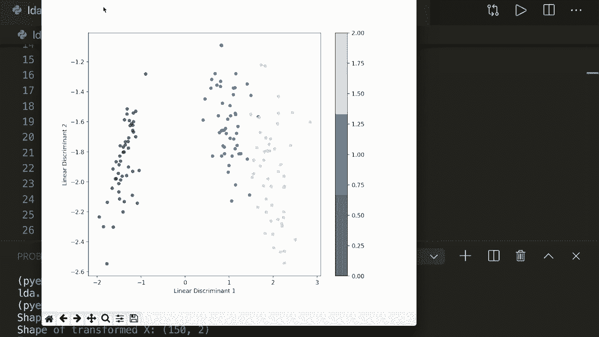

本节课中我们一起学习了线性判别分析的原理与实现。我们了解到 LDA 是一种监督降维方法，通过最大化类间散度和最小化类内散度来寻找最佳投影方向。我们实现了计算类内与类间散布矩阵、求解特征值问题以及数据投影的完整流程。通过比较 PCA 和 LDA，我们更深刻地理解了监督与无监督降维技术的区别与应用场景。