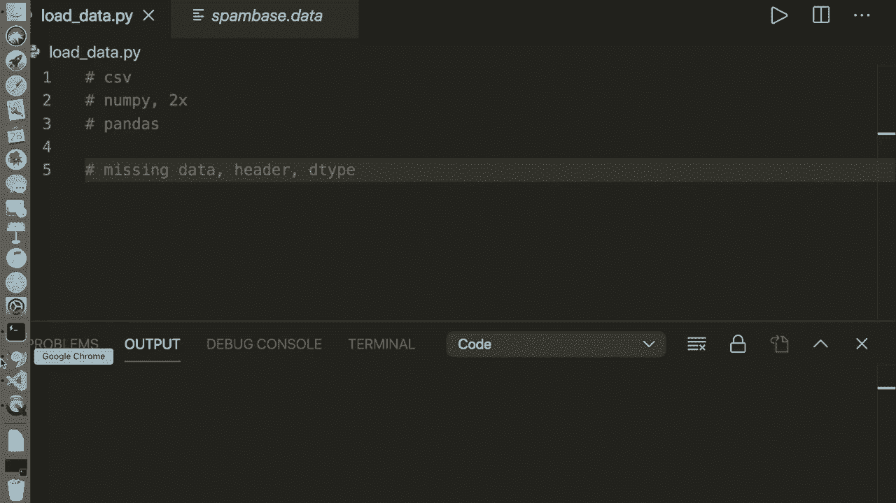
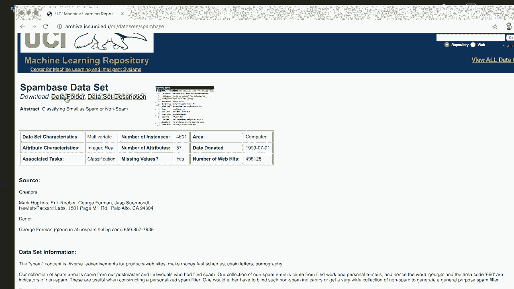
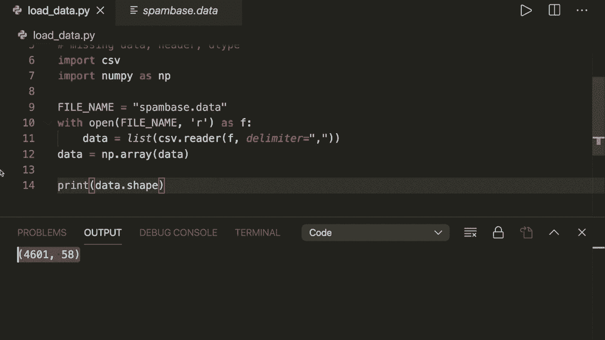
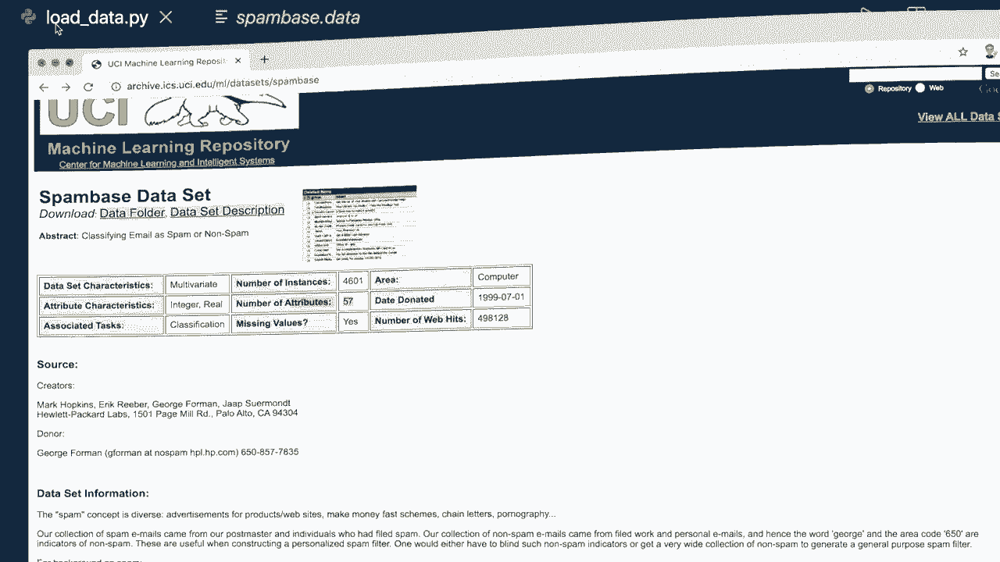
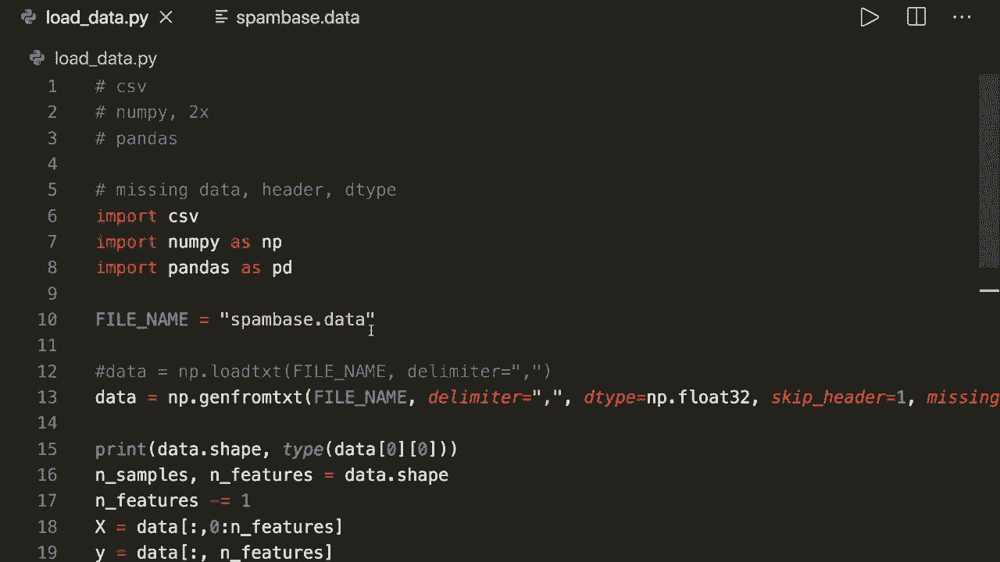

# 机器学习实战课程 P16：📂 从 CSV 加载数据


在本节课中，我们将学习如何从外部文件中加载数据，这是机器学习项目中的关键第一步。我们将介绍四种不同的方法，并重点讲解如何处理缺失数据和指定数据类型，确保数据能被算法正确使用。

---

## 数据加载方法概述

在我之前的机器学习示例中，数据直接来自 `sklearn.datasets` 模块。许多初学者询问如何加载自己的数据集。因此，本节将展示从文件中加载数据的四种方法：一种使用纯 Python，两种使用 Numpy，一种使用 Pandas 库。

我们将使用一个垃圾邮件分类数据集。该数据集的目标是将电子邮件分类为垃圾邮件或非垃圾邮件。数据文件为 CSV 格式，文件名为 `spambase.data`。

---

## 方法一：使用纯 Python 和 CSV 模块



首先，我们使用 Python 内置的 `csv` 模块来加载文件。这种方法虽然基础，但有助于理解数据加载的原理。



以下是具体步骤：

1.  导入 `csv` 模块。
2.  指定文件名并以读取模式打开文件。
3.  使用 `csv.reader` 读取文件内容，并指定分隔符为逗号。
4.  将读取器对象转换为列表。
5.  将列表转换为 Numpy 数组以便后续处理。

```python
import csv
import numpy as np

filename = 'spambase.data'
with open(filename, 'r') as f:
    data = list(csv.reader(f, delimiter=','))

data = np.array(data)
print(data.shape)
```

运行代码后，输出形状为 `(4601, 58)`。根据数据集描述，应有 4601 个样本和 57 个特征。多出的一列是类别标签。

上一节我们介绍了如何加载原始数据，本节中我们来看看如何将数据拆分为特征和标签。

我们需要将数据拆分为特征矩阵 `X` 和标签向量 `y`。标签位于最后一列。



```python
num_samples, num_features = data.shape
num_features -= 1  # 减去标签列

X = data[:, :num_features]  # 所有行，前 num_features 列
y = data[:, num_features]   # 所有行，最后一列



print(X.shape, y.shape)
```

运行后，`X.shape` 应为 `(4601, 57)`，`y.shape` 应为 `(4601,)`。现在数据格式正确，可以输入分类器进行训练。

虽然这种方法可行，但通常较慢且代码量较多。接下来，我们将介绍更高效的方法。

---

## 方法二：使用 Numpy 的 `loadtxt` 函数

Numpy 提供了更简洁的数据加载方式。`loadtxt` 函数可以一行代码完成加载。

以下是使用 `loadtxt` 的步骤：

1.  使用 `np.loadtxt` 函数。
2.  指定文件名和分隔符。

```python
import numpy as np

data = np.loadtxt('spambase.data', delimiter=',')
print(data.shape)
```

这种方法简单快捷，是 Numpy 中加载数据的基本方法。

---

## 方法三：使用 Numpy 的 `genfromtxt` 函数（推荐）

`genfromtxt` 函数比 `loadtxt` 功能更强大，提供了更多参数来处理复杂情况，如缺失值。

以下是使用 `genfromtxt` 的步骤：

1.  使用 `np.genfromtxt` 函数。
2.  指定文件名和分隔符。

```python
import numpy as np

data = np.genfromtxt('spambase.data', delimiter=',')
print(data.shape)
```

这是我推荐在 Numpy 中使用的首选方法，因为它灵活性更高。

---

## 方法四：使用 Pandas 的 `read_csv` 函数

如果你熟悉 Pandas，使用 `read_csv` 函数是另一个优秀的选择。它功能强大，且在处理大型数据集时速度较快。

以下是使用 Pandas 的步骤：

1.  使用 `pd.read_csv` 加载数据为 DataFrame。
2.  将 DataFrame 转换为 Numpy 数组。
3.  注意，如果文件没有表头，需要指定 `header=None`。

```python
import pandas as pd
import numpy as np

df = pd.read_csv('spambase.data', delimiter=',', header=None)
data = df.to_numpy()
print(data.shape)
```

Pandas 提供了丰富的数据操作功能，适合进行数据清洗和探索。

---

## 数据处理进阶技巧

我们已经学会了加载数据的基本方法。接下来，我们将探讨一些确保数据质量的关键技巧：指定数据类型、处理表头以及处理缺失值。

### 1. 指定数据类型

提前指定数据类型可以提高加载速度并避免类型推断错误。大多数机器学习算法期望特征数据为浮点型。

在 Numpy 的 `genfromtxt` 中指定数据类型：

```python
data = np.genfromtxt('spambase.data', delimiter=',', dtype=np.float32)
```

在 Pandas 的 `read_csv` 中指定数据类型：

```python
df = pd.read_csv('spambase.data', delimiter=',', header=None, dtype=np.float32)
```

也可以在加载后转换数据类型：

```python
data = np.array(data, dtype=np.float32)
```

### 2. 处理文件表头

如果数据文件包含表头行（如特征名称），我们需要在加载时跳过它。

使用 Numpy 跳过表头：

```python
data = np.genfromtxt('spambase.data', delimiter=',', skip_header=1)
```

使用 Pandas 跳过表头：

```python
df = pd.read_csv('spambase.data', delimiter=',', skiprows=1)
```

### 3. 处理缺失值

数据中常有缺失值，表现为空值、破折号或特定字符串（如 “N/A”）。加载函数通常能将空值识别为 `NaN`（Not a Number）。

如果缺失值被表示为特定字符串（如 “hello”），我们需要显式指定：

使用 Numpy 处理自定义缺失值：

```python
data = np.genfromtxt('spambase.data', delimiter=',',
                      missing_values='hello', filling_values=9999)
```

使用 Pandas 处理缺失值（加载后替换）：

```python
df = pd.read_csv('spambase.data', delimiter=',', header=None)
df.fillna(9999, inplace=True)  # 将 NaN 替换为 9999
```

通常，将缺失值填充为 0 或该特征的平均值是更合理的做法。处理缺失值是避免后续算法出错的关键步骤。

---

## 总结

本节课中我们一起学习了从 CSV 文件加载数据的四种方法：
1.  使用纯 Python `csv` 模块（理解原理）。
2.  使用 Numpy `loadtxt` 函数（简单快捷）。
3.  **使用 Numpy `genfromtxt` 函数（功能强大，推荐使用）**。
4.  使用 Pandas `read_csv` 函数（适合复杂数据处理）。

我们还掌握了三个关键的数据处理技巧：
*   **指定数据类型**（如 `dtype=np.float32`）以提高效率和准确性。
*   **跳过文件表头**（使用 `skip_header` 或 `skiprows`）。
*   **识别并填充缺失值**（使用 `missing_values` 和 `filling_values` 参数）。

对于初学者，建议从 Numpy 的 `genfromtxt` 或 Pandas 的 `read_csv` 开始，它们是进行机器学习数据准备最常用和高效的工具。



