# 机器学习算法实现教程 P3：L3 - 线性回归 📈

在本节课中，我们将学习并实现线性回归算法。线性回归是机器学习中最基础、最常用的算法之一，用于预测连续值。我们将从概念入手，理解其数学原理，然后仅使用Python内置模块和Numpy库，一步步地实现它。

---

## 概述

线性回归的目标是找到一个线性函数，使其能够最好地拟合（或近似）给定的数据点。这个线性函数的形式是 **y_hat = w * x + b**，其中 `w` 是权重（斜率），`b` 是偏差（截距）。我们的任务是找到最优的 `w` 和 `b`，使得预测值 `y_hat` 与实际值 `y` 之间的误差最小。

---

## 核心概念与数学原理

### 1. 模型与目标函数

我们使用线性函数来逼近数据。其公式为：
**y_hat = w * x + b**

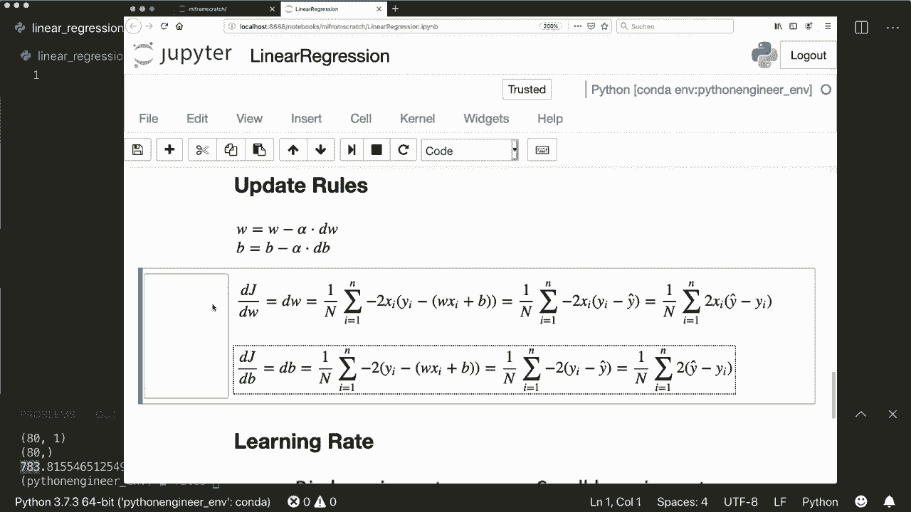

*   **y_hat**: 预测值。
*   **w**: 权重，决定了直线的斜率。
*   **b**: 偏差，决定了直线在y轴上的截距。
*   **x**: 输入特征。

### 2. 成本函数：均方误差 (MSE)

为了衡量模型预测的好坏，我们定义一个成本函数。在线性回归中，最常用的是**均方误差**。它计算所有样本预测值与真实值之差的平方的平均值。

其公式为：
**J(w, b) = (1/n) * Σ(y_i - y_hat_i)²**

*   **J(w, b)**: 成本函数，值越小表示模型拟合越好。
*   **n**: 样本数量。
*   **y_i**: 第 i 个样本的真实值。
*   **y_hat_i**: 第 i 个样本的预测值。

我们的目标就是找到使 `J(w, b)` 最小的 `w` 和 `b`。

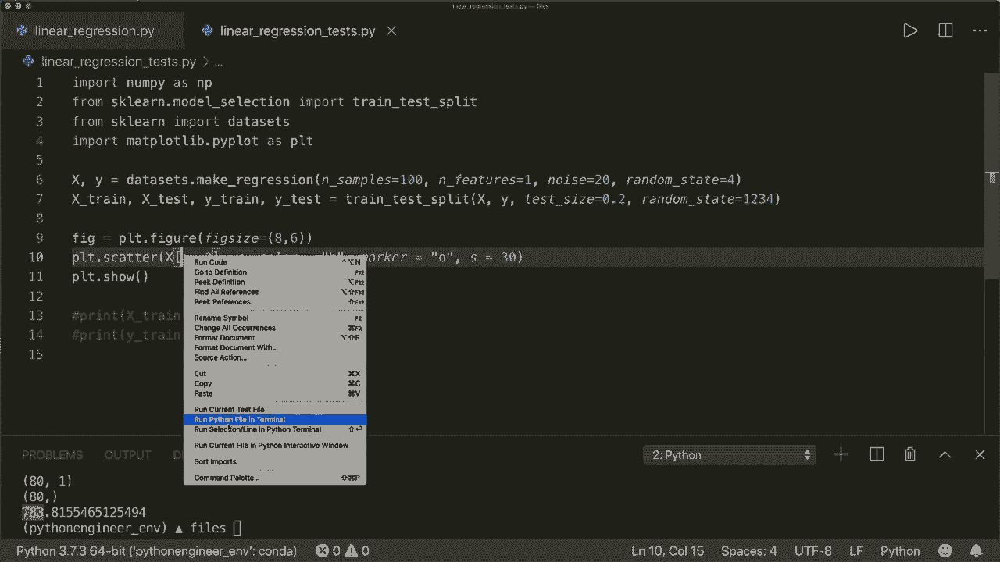

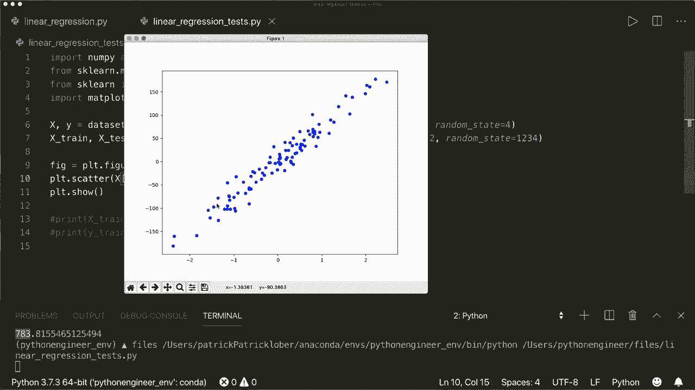

### 3. 优化方法：梯度下降

梯度下降是一种寻找函数最小值的迭代优化算法。想象你站在山坡上，想要最快下到谷底（最小值点）。最陡的下降方向就是梯度的负方向。

以下是梯度下降的步骤：
1.  随机初始化参数 `w` 和 `b`。
2.  计算成本函数 `J(w, b)` 在当前参数下的梯度（导数）。
3.  沿着梯度的负方向更新参数。
4.  重复步骤2和3，直到成本函数收敛到最小值。

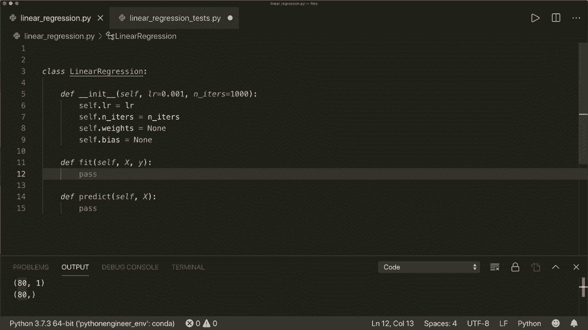

参数更新规则如下：
**w_new = w_old - α * (∂J/∂w)**
**b_new = b_old - α * (∂J/∂b)**

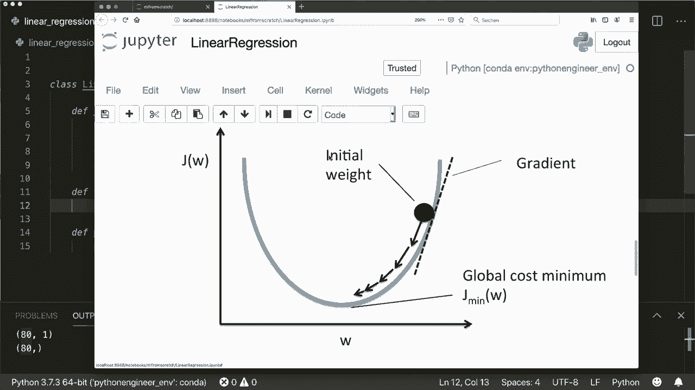

其中：
*   **α**: 学习率，控制每次更新的步长。太小会导致收敛慢，太大会导致在最小值附近震荡甚至无法收敛。
*   **∂J/∂w** 和 **∂J/∂b**: 分别是成本函数对 `w` 和 `b` 的偏导数。

对于线性回归的MSE成本函数，其偏导数公式为：
**∂J/∂w = (2/n) * Σ x_i * (y_hat_i - y_i)**
**∂J/∂b = (2/n) * Σ (y_hat_i - y_i)**

（在实际代码中，常数因子2常被吸收到学习率 `α` 中，因此公式常简化为不包含2的形式。）

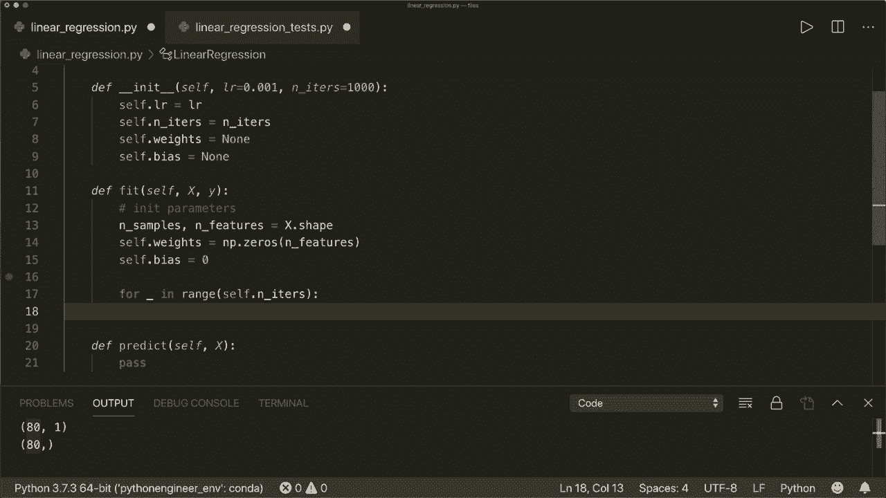

---

## 代码实现

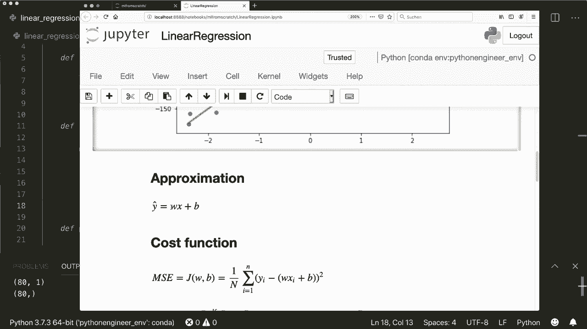

上一节我们介绍了线性回归的数学原理，本节中我们来看看如何用代码实现它。我们将创建一个 `LinearRegression` 类，它包含两个核心方法：`fit` 用于训练模型，`predict` 用于进行预测。

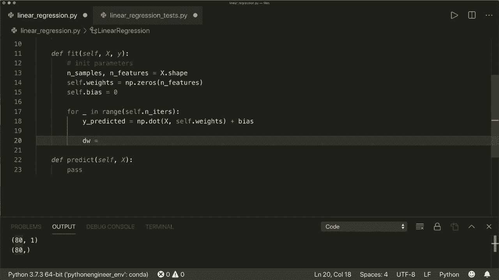

首先，我们需要导入必要的库并定义类结构。

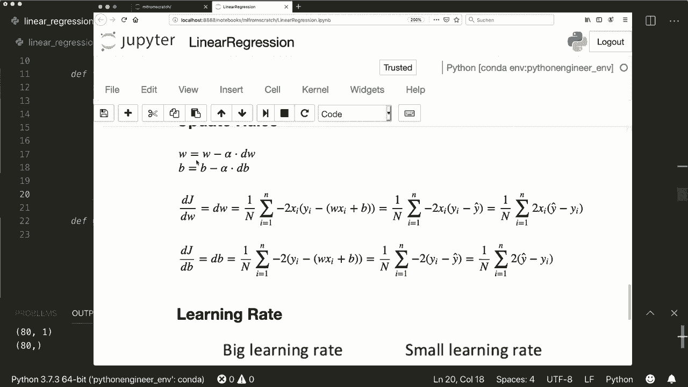

```python
import numpy as np

class LinearRegression:
    def __init__(self, learning_rate=0.001, n_iters=1000):
        self.lr = learning_rate
        self.n_iters = n_iters
        self.weights = None
        self.bias = None
```

### 实现 `fit` 方法

`fit` 方法接收训练数据 `X` 和对应的标签 `y`，并通过梯度下降法学习最优的 `w` 和 `b`。

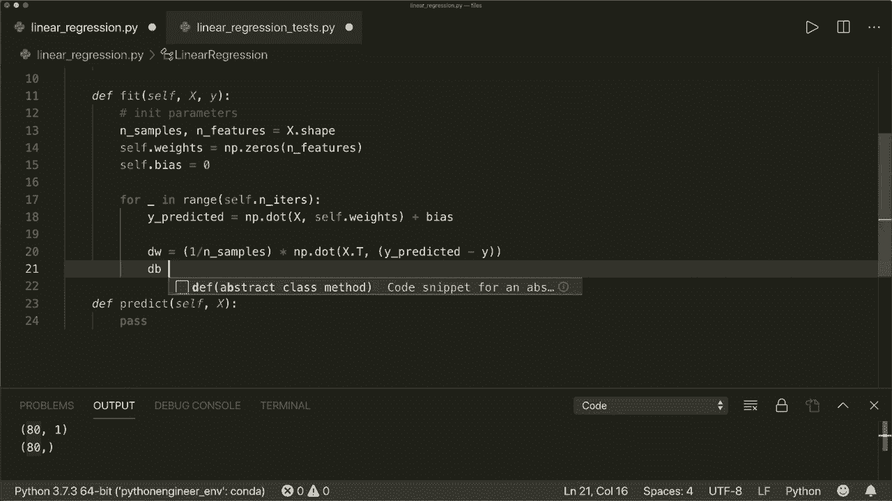

以下是 `fit` 方法的实现步骤：

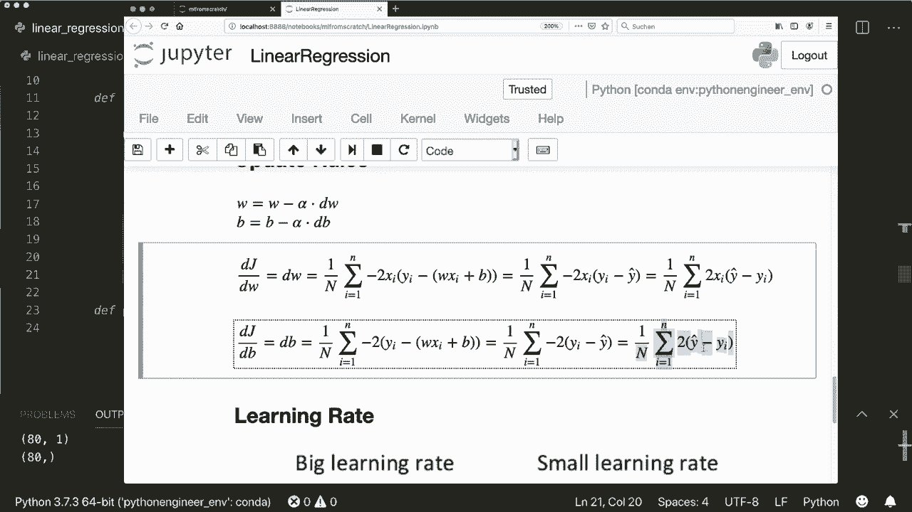

1.  **初始化参数**：将权重 `w` 初始化为0（或小的随机数），偏差 `b` 初始化为0。
2.  **梯度下降迭代**：进行指定次数的迭代，在每次迭代中：
    *   计算当前参数下的预测值 `y_pred`。
    *   计算预测值与真实值之间的误差。
    *   计算成本函数关于 `w` 和 `b` 的梯度（导数）。
    *   按照更新规则调整 `w` 和 `b`。

```python
    def fit(self, X, y):
        n_samples, n_features = X.shape

        # 1. 初始化参数
        self.weights = np.zeros(n_features)
        self.bias = 0

        # 2. 梯度下降
        for _ in range(self.n_iters):
            # 计算预测值: y_pred = X * w + b
            y_pred = np.dot(X, self.weights) + self.bias

            # 计算梯度
            # dw = (1/n) * X^T * (y_pred - y)
            dw = (1 / n_samples) * np.dot(X.T, (y_pred - y))
            # db = (1/n) * sum(y_pred - y)
            db = (1 / n_samples) * np.sum(y_pred - y)

            # 更新参数
            self.weights -= self.lr * dw
            self.bias -= self.lr * db
```

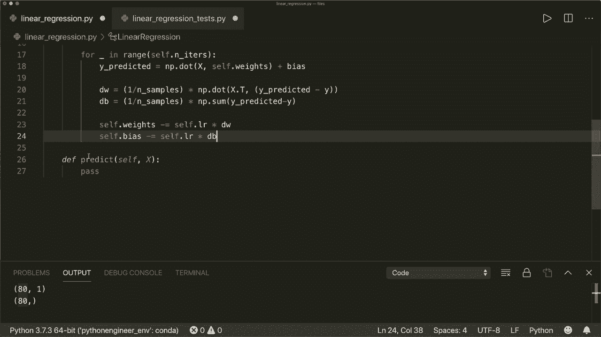

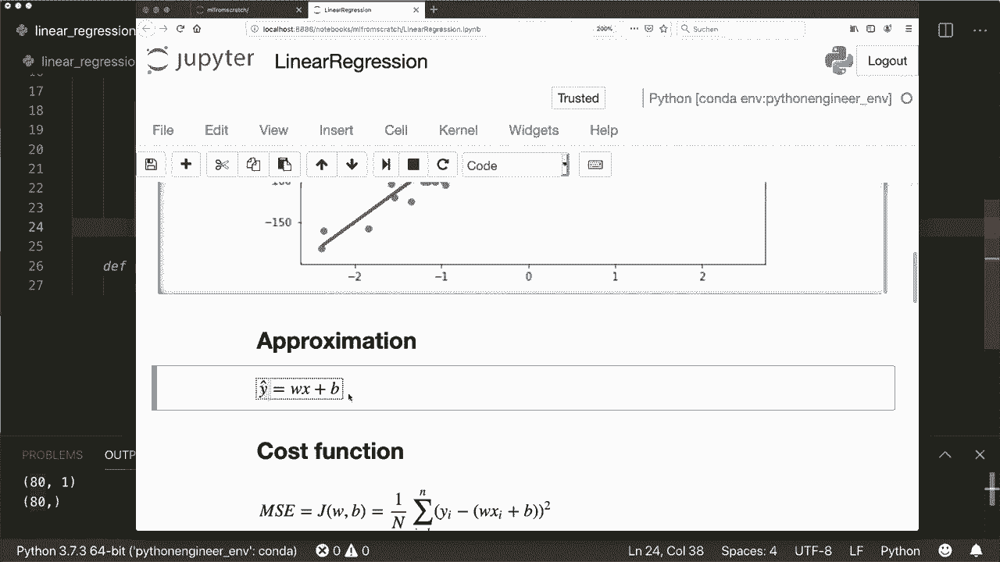

### 实现 `predict` 方法

`predict` 方法非常简单，它利用训练好的 `w` 和 `b`，对新的输入数据 `X` 进行线性预测。

```python
    def predict(self, X):
        y_approximated = np.dot(X, self.weights) + self.bias
        return y_approximated
```

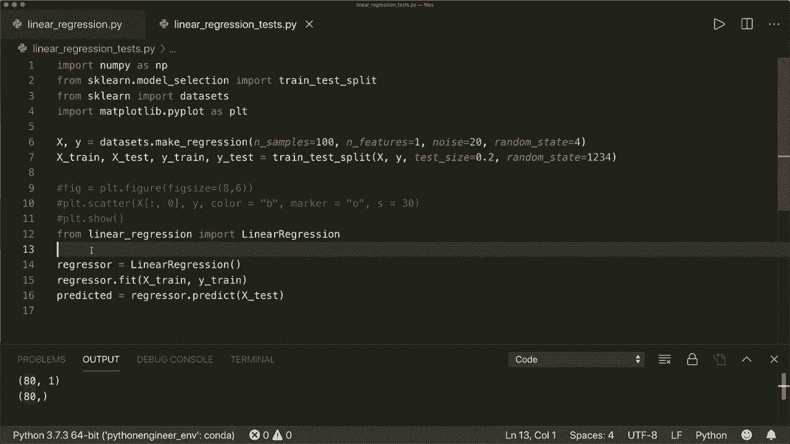

---

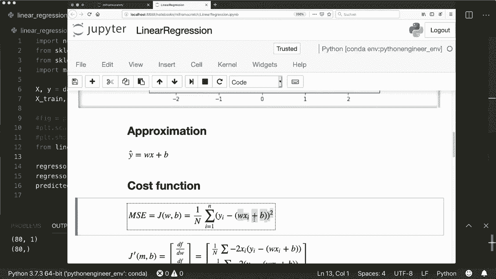

## 模型测试与评估

现在，让我们使用生成的数据来测试我们实现的线性回归模型。我们将创建一些线性数据，分割成训练集和测试集，训练模型，并进行预测和评估。

以下是测试步骤：

1.  **生成与准备数据**：使用 `sklearn` 生成线性数据，并分割为训练集和测试集。
2.  **训练模型**：实例化 `LinearRegression` 类并调用 `fit` 方法。
3.  **进行预测**：在测试集上调用 `predict` 方法。
4.  **评估模型**：使用均方误差 (MSE) 来量化模型在测试集上的表现。

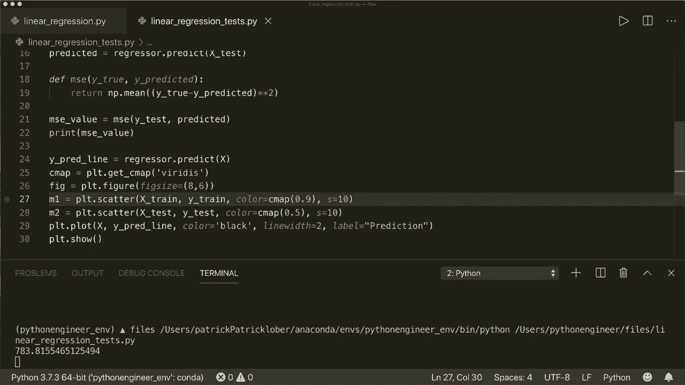

```python
# 1. 生成示例数据
from sklearn.model_selection import train_test_split
from sklearn.datasets import make_regression
import matplotlib.pyplot as plt

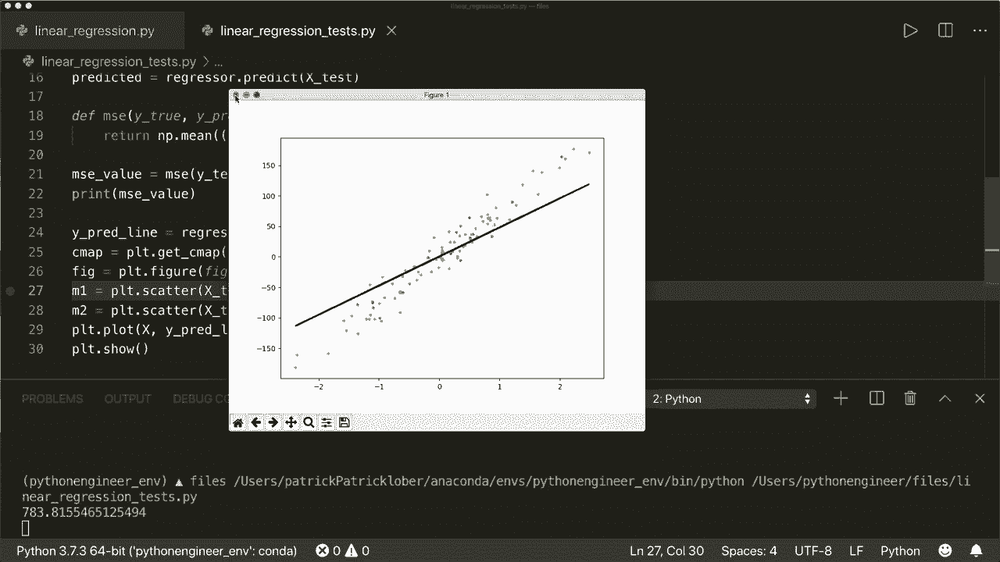

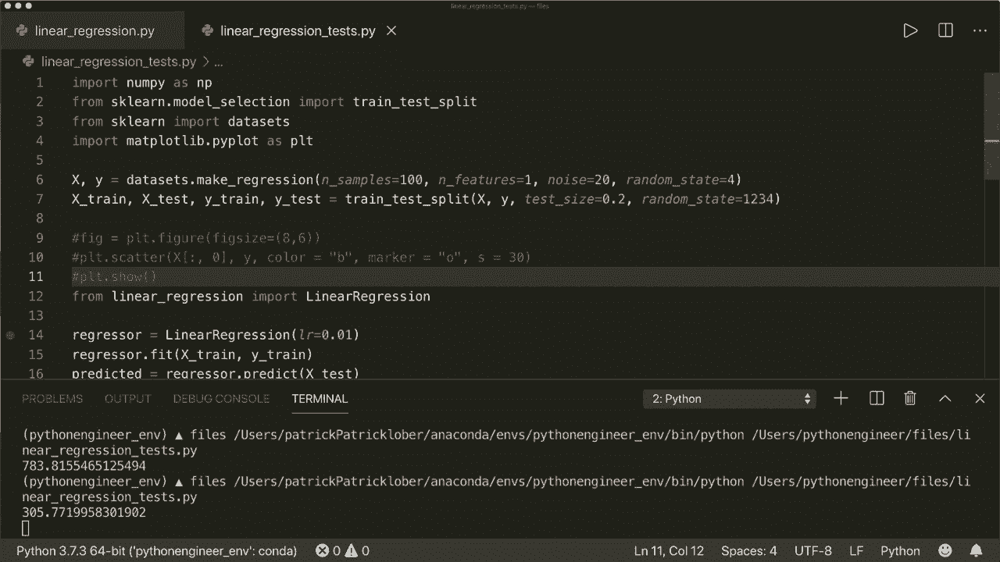

X, y = make_regression(n_samples=100, n_features=1, noise=20, random_state=42)
X_train, X_test, y_train, y_test = train_test_split(X, y, test_size=0.2, random_state=42)

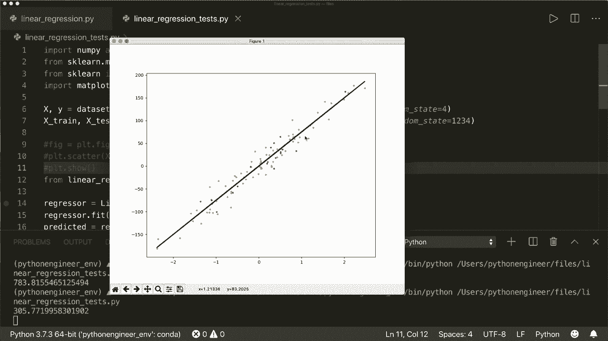

# 2. 训练模型
regressor = LinearRegression(learning_rate=0.1, n_iters=1000)
regressor.fit(X_train, y_train)

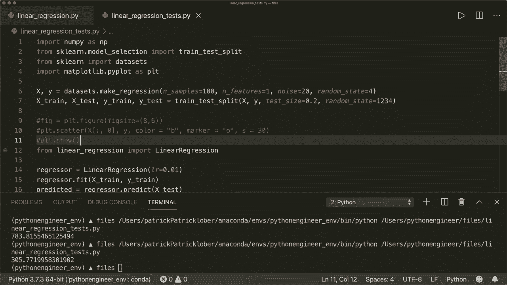

# 3. 进行预测
predictions = regressor.predict(X_test)

# 4. 评估模型：计算均方误差
def mse(y_true, y_pred):
    return np.mean((y_true - y_pred) ** 2)

mse_value = mse(y_test, predictions)
print(f"模型的均方误差 (MSE) 为: {mse_value}")

# 5. 可视化结果
plt.scatter(X_test, y_test, color='blue', label='真实数据')
plt.plot(X_test, predictions, color='red', linewidth=2, label='预测直线')
plt.xlabel('X')
plt.ylabel('y')
plt.title('线性回归拟合结果')
plt.legend()
plt.show()
```

运行上述代码，你将看到一条红色的直线拟合了蓝色的数据点，并在控制台输出模型的MSE值。通过调整 `learning_rate` 和 `n_iters` 参数，你可以观察模型拟合效果和收敛速度的变化。

---

## 总结

本节课中我们一起学习了线性回归算法。我们从最基础的线性模型公式 **y = wx + b** 出发，理解了使用**均方误差 (MSE)** 作为衡量预测好坏的**成本函数**。为了找到最小化成本函数的参数，我们学习了**梯度下降**这一核心优化算法，并推导了其参数更新公式。

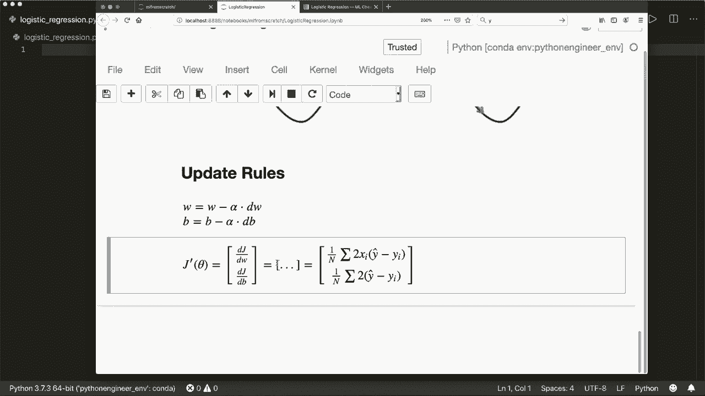

最后，我们亲自动手，使用Python和Numpy实现了完整的 `LinearRegression` 类，包括 `fit` 训练方法和 `predict` 预测方法，并通过可视化结果验证了模型的有效性。线性回归是理解更复杂机器学习模型的基石，希望你能通过本次实践牢牢掌握它。