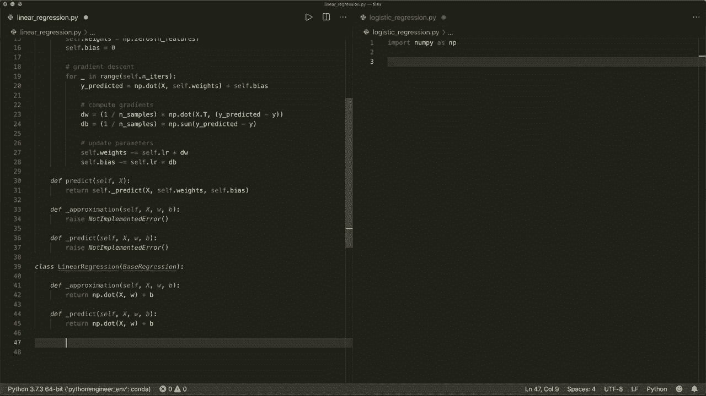
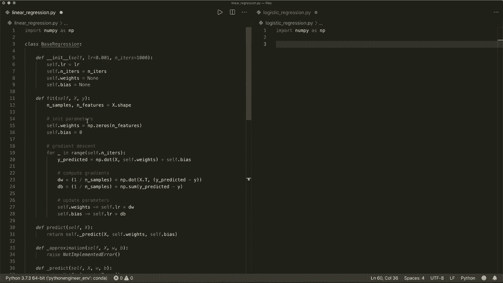

# 用 Python 和 Numpy 实现最热门的12个机器学习算法，P5：L5- 回归重构 🛠️

在本节课中，我们将学习如何重构线性回归和逻辑回归的代码。通过创建一个基类，我们可以消除重复的代码，使程序结构更清晰、更易于维护。

## 概述

在前两节课程中，我们分别实现了线性回归和逻辑回归算法。如果你比较它们的代码，会发现许多部分非常相似，例如初始化方法和训练过程。本节我们将通过重构，提取公共逻辑到一个基类中，让代码更加简洁高效。

上一节我们介绍了逻辑回归的具体实现，本节中我们来看看如何通过重构来优化这两个算法的代码结构。

## 代码重构步骤

以下是重构的核心步骤，我们将创建一个名为 `BaseRegression` 的基类。

### 1. 创建基类并提取公共初始化方法

两个回归类的 `__init__` 方法完全相同，因此可以将其移至基类中。

```python
import numpy as np

class BaseRegression:
    def __init__(self, learning_rate=0.001, n_iters=1000):
        self.lr = learning_rate
        self.n_iters = n_iters
        self.weights = None
        self.bias = None
```

### 2. 提取公共的训练方法

两个类的 `fit` 方法也几乎相同，都执行梯度下降。我们可以将这个公共的训练逻辑也放入基类。

```python
    def fit(self, X, y):
        n_samples, n_features = X.shape
        self.weights = np.zeros(n_features)
        self.bias = 0

        for _ in range(self.n_iters):
            y_predicted = self._approximation(X, self.weights, self.bias)
            dw = (1 / n_samples) * np.dot(X.T, (y_predicted - y))
            db = (1 / n_samples) * np.sum(y_predicted - y)

            self.weights -= self.lr * dw
            self.bias -= self.lr * db
```

注意，这里我们调用了一个 `_approximation` 方法来计算预测值 `y_predicted`。这个方法在不同回归算法中有所不同，因此我们在基类中将其定义为抽象方法。

### 3. 定义抽象方法

在基类中，我们定义两个必须在子类中实现的方法：`_approximation` 和 `_predict`。

```python
    def _approximation(self, X, w, b):
        raise NotImplementedError()

    def _predict(self, X, w, b):
        raise NotImplementedError()
```

公共的 `predict` 方法则可以在基类中实现，它会调用子类具体的 `_predict` 方法。

```python
    def predict(self, X):
        return self._predict(X, self.weights, self.bias)
```

### 4. 实现线性回归子类

现在，我们可以创建 `LinearRegression` 类，它继承自 `BaseRegression`，并实现特定的近似和预测逻辑。

```python
class LinearRegression(BaseRegression):
    def _approximation(self, X, w, b):
        return np.dot(X, w) + b

    def _predict(self, X, w, b):
        return np.dot(X, w) + b
```

对于线性回归，近似和预测都是简单的线性模型 **`ŷ = X · w + b`**。

### 5. 实现逻辑回归子类

同样地，我们创建 `LogisticRegression` 类。它的核心区别在于使用了 Sigmoid 函数。



```python
class LogisticRegression(BaseRegression):
    def _sigmoid(self, z):
        return 1 / (1 + np.exp(-z))

    def _approximation(self, X, w, b):
        linear_model = np.dot(X, w) + b
        return self._sigmoid(linear_model)

    def _predict(self, X, w, b):
        linear_model = np.dot(X, w) + b
        y_predicted = self._sigmoid(linear_model)
        y_predicted_cls = [1 if i > 0.5 else 0 for i in y_predicted]
        return np.array(y_predicted_cls)
```

在逻辑回归中，近似方法是线性模型经过 Sigmoid 函数 **`σ(z) = 1 / (1 + e^{-z})`** 的结果。预测方法则在此基础上进行了分类判断。

## 总结



本节课中我们一起学习了如何重构机器学习算法的代码。通过创建一个 `BaseRegression` 基类，我们成功地将线性回归和逻辑回归的公共代码（如初始化、梯度下降训练循环）提取出来。子类只需实现核心差异部分，即 `_approximation` 和 `_predict` 方法。这使得代码从近100行减少到约60行，结构更清晰，更符合面向对象的设计原则，也更容易扩展新的回归算法。