# 用 Python 和 Numpy 实现最热门的12个机器学习算法，P6：L6- 朴素贝叶斯 📊

在本节课中，我们将学习并动手实现一个经典的机器学习分类算法——朴素贝叶斯分类器。我们将从零开始，仅使用 Python 和 Numpy 库来构建它，并理解其背后的数学原理。

## 概述

朴素贝叶斯分类器是一种基于贝叶斯定理的概率分类器。它之所以被称为“朴素”，是因为它假设数据集中的所有特征都是相互独立的。尽管这个假设在现实中往往不成立，但朴素贝叶斯在许多实际问题中，尤其是文本分类领域，表现依然非常出色。

上一节我们介绍了算法的理论基础，本节中我们来看看如何用代码将其实现。

## 核心原理

朴素贝叶斯分类器的核心是贝叶斯定理。对于两个事件 A 和 B，贝叶斯定理表述为：

**公式：** `P(A|B) = [P(B|A) * P(A)] / P(B)`

将其应用于分类问题，我们试图计算在给定特征向量 **X** 的条件下，样本属于类别 **Y** 的概率（后验概率）：

**公式：** `P(Y|X) = [P(X|Y) * P(Y)] / P(X)`

其中：
*   `P(Y|X)` 是**后验概率**。
*   `P(X|Y)` 是**类条件概率**。
*   `P(Y)` 是**先验概率**。
*   `P(X)` 是**证据**。

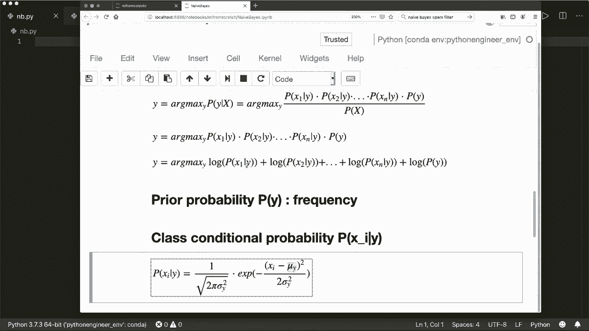

在“朴素”的独立性假设下，特征向量 **X** 的联合概率可以分解为各个特征概率的乘积：

**公式：** `P(X|Y) = P(x1|Y) * P(x2|Y) * ... * P(xn|Y)`

分类时，我们选择使后验概率 `P(Y|X)` 最大的那个类别 **Y**。由于 `P(X)` 对所有类别相同，我们可以忽略它。因此，分类规则简化为：

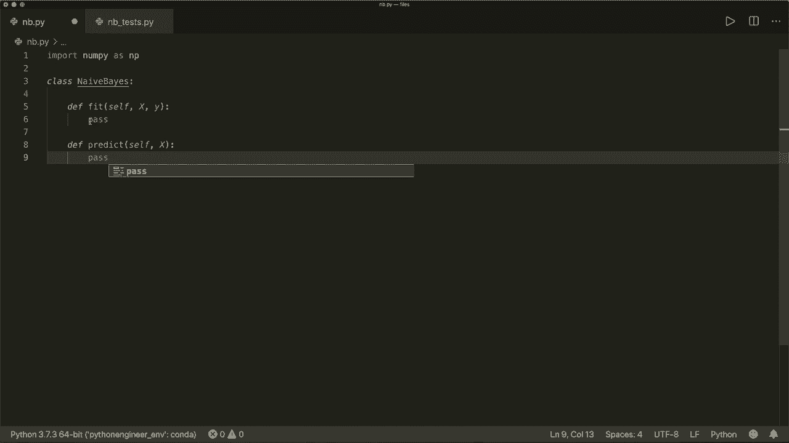

**公式：** `y_pred = argmax_y [ P(Y) * ∏ P(xi|Y) ]`

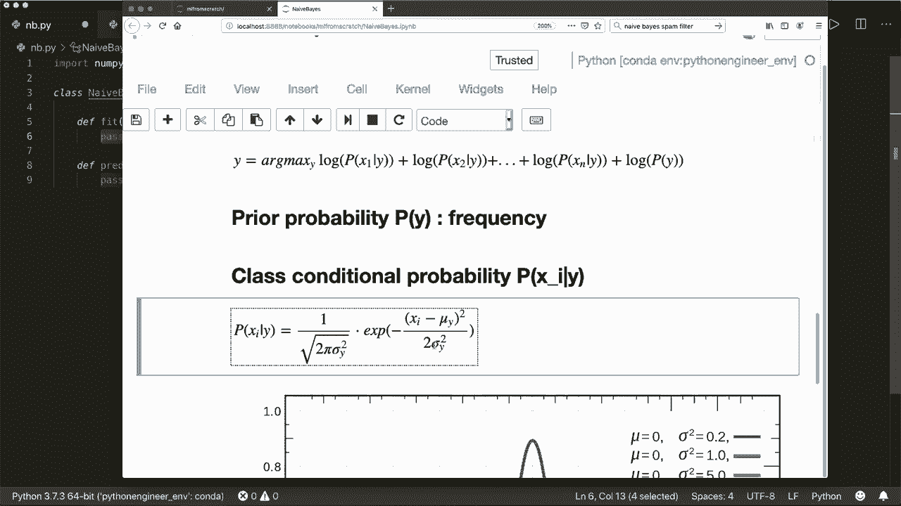

直接计算多个小概率的乘积可能导致数值下溢。因此，我们通常对其取对数，将连乘转换为连加，这是一个实用的技巧：

**公式：** `y_pred = argmax_y [ log(P(Y)) + ∑ log(P(xi|Y)) ]`

对于连续型特征，我们常用高斯分布（正态分布）来建模类条件概率 `P(xi|Y)`。高斯分布的概率密度函数为：

**公式：** `PDF(x) = (1 / √(2πσ²)) * exp( - (x - μ)² / (2σ²) )`
其中 **μ** 是均值，**σ²** 是方差。

## 代码实现

以下是使用 Python 和 Numpy 实现高斯朴素贝叶斯分类器的完整代码。

首先，我们导入必要的库并定义类结构。

```python
import numpy as np

class NaiveBayes:
    def __init__(self):
        pass
```

### 1. 拟合模型 (Fit)

`fit` 方法用于训练模型。它接收训练数据 `X` 和对应的标签 `y`，并计算每个类别下每个特征的均值、方差以及类别的先验概率。

以下是 `fit` 方法需要完成的关键步骤：

```python
    def fit(self, X, y):
        # 获取样本数和特征数
        n_samples, n_features = X.shape
        # 获取所有唯一的类别标签
        self.classes = np.unique(y)
        n_classes = len(self.classes)

        # 初始化数组：均值、方差、先验概率
        self.mean = np.zeros((n_classes, n_features), dtype=np.float64)
        self.var = np.zeros((n_classes, n_features), dtype=np.float64)
        self.priors = np.zeros(n_classes, dtype=np.float64)

        # 对每个类别进行计算
        for idx, c in enumerate(self.classes):
            # 获取属于当前类别的所有样本
            X_c = X[y == c]
            # 计算该类下每个特征的均值
            self.mean[idx, :] = X_c.mean(axis=0)
            # 计算该类下每个特征的方差
            self.var[idx, :] = X_c.var(axis=0)
            # 计算该类别的先验概率（频率）
            self.priors[idx] = X_c.shape[0] / float(n_samples)
```

### 2. 辅助函数：高斯概率密度函数

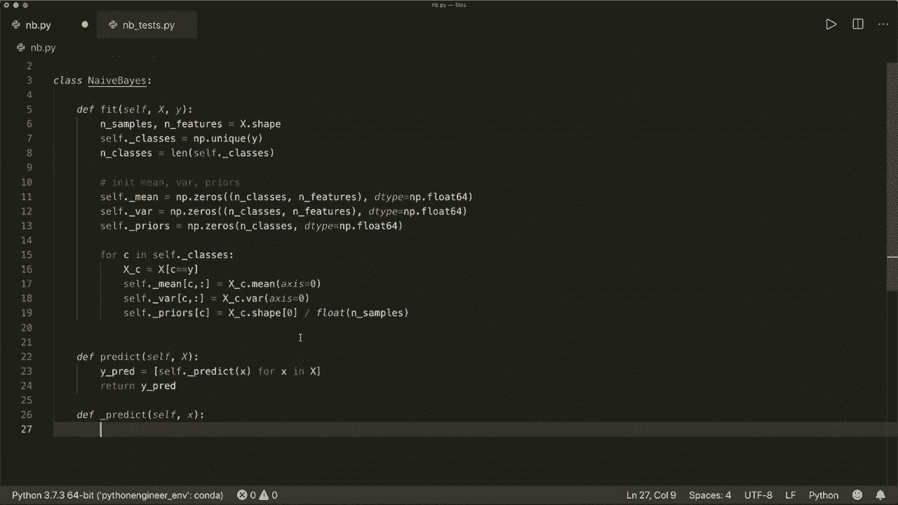

我们需要一个函数来计算给定特征值在高斯分布下的概率密度。

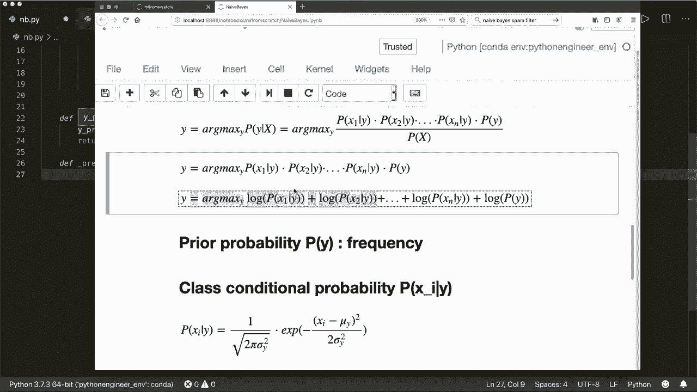

```python
    def _pdf(self, class_idx, x):
        # 获取当前类别的均值和方差
        mean = self.mean[class_idx]
        var = self.var[class_idx]
        # 应用高斯概率密度函数公式
        numerator = np.exp(-((x - mean) ** 2) / (2 * var))
        denominator = np.sqrt(2 * np.pi * var)
        return numerator / denominator
```

### 3. 预测单个样本 (Predict Single)

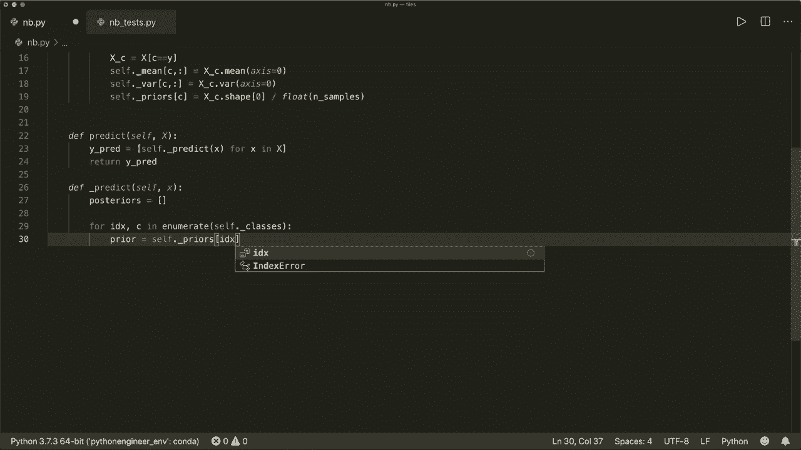

`_predict_single` 方法用于对单个样本进行预测。它计算该样本属于每个类别的对数后验概率，并选择概率最高的类别。

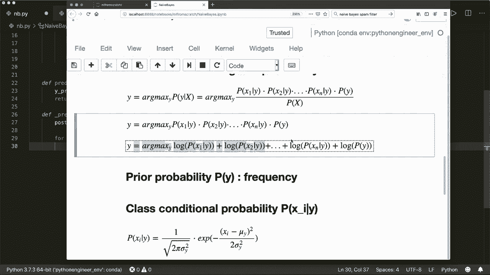

以下是预测单个样本的逻辑：

```python
    def _predict_single(self, x):
        # 存储每个类别的后验概率
        posteriors = []
        # 遍历所有类别
        for idx, c in enumerate(self.classes):
            # 获取当前类别的先验概率的对数
            prior = np.log(self.priors[idx])
            # 计算所有特征的类条件概率的对数之和
            class_conditional = np.sum(np.log(self._pdf(idx, x)))
            # 计算后验概率（对数形式）
            posterior = prior + class_conditional
            posteriors.append(posterior)
        # 返回具有最高后验概率的类别
        return self.classes[np.argmax(posteriors)]
```

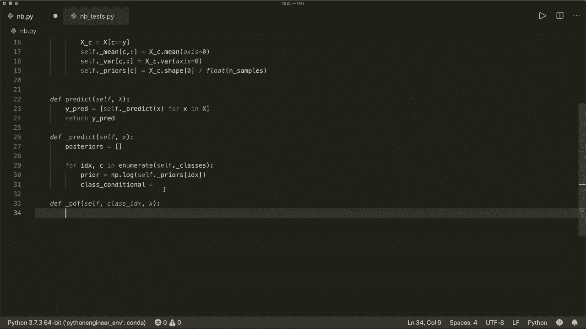

### 4. 预测 (Predict)

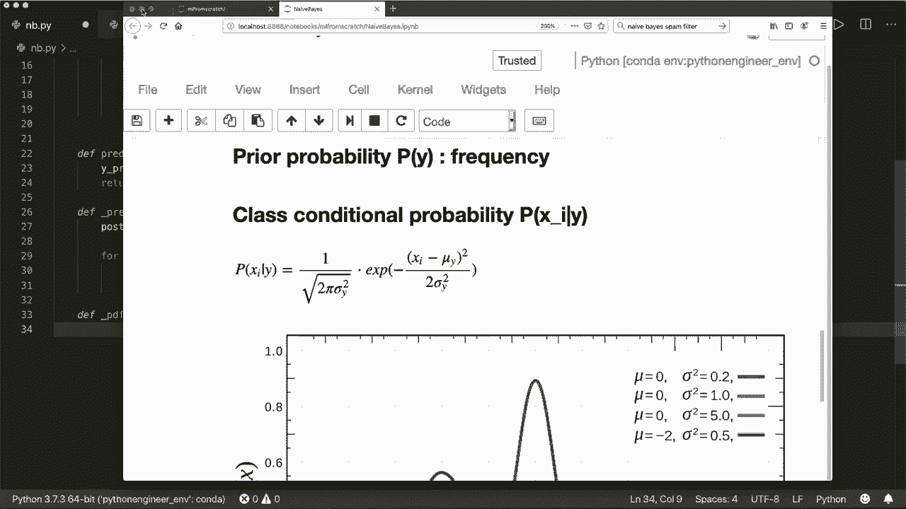

`predict` 方法用于对多个样本进行预测，它简单地遍历每个样本并调用 `_predict_single` 方法。

```python
    def predict(self, X):
        # 对输入X中的每个样本进行预测
        predictions = [self._predict_single(x) for x in X]
        return np.array(predictions)
```

## 模型测试

实现完成后，我们可以使用一个简单的数据集来测试模型的性能。

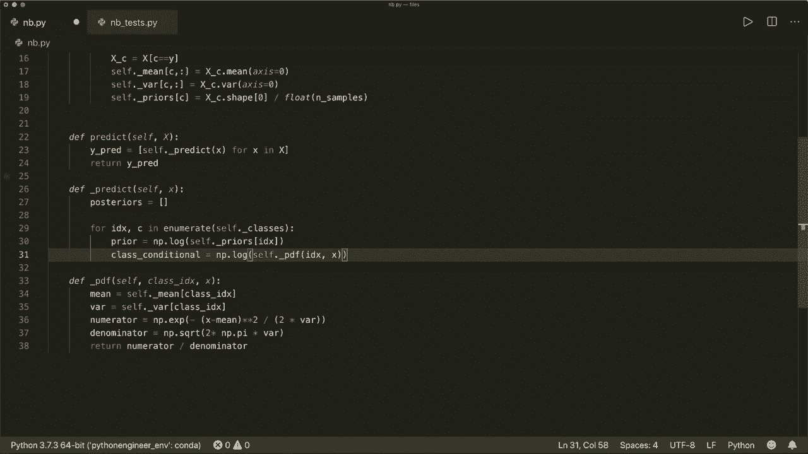

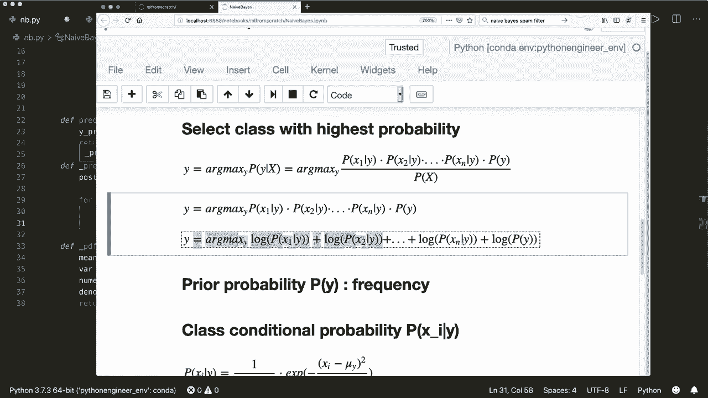

```python
# 示例：使用合成数据测试
from sklearn.datasets import make_classification
from sklearn.model_selection import train_test_split

# 生成一个简单的二分类数据集
X, y = make_classification(n_samples=1000, n_features=10, n_classes=2, random_state=42)
# 划分训练集和测试集
X_train, X_test, y_train, y_test = train_test_split(X, y, test_size=0.2, random_state=42)

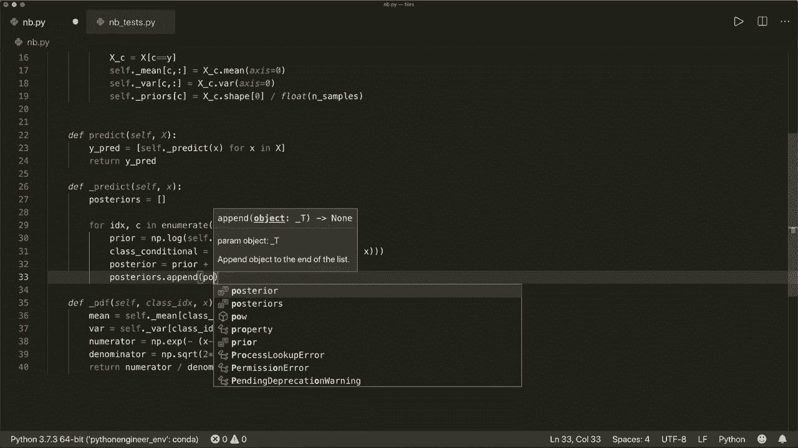

# 创建并训练模型
model = NaiveBayes()
model.fit(X_train, y_train)

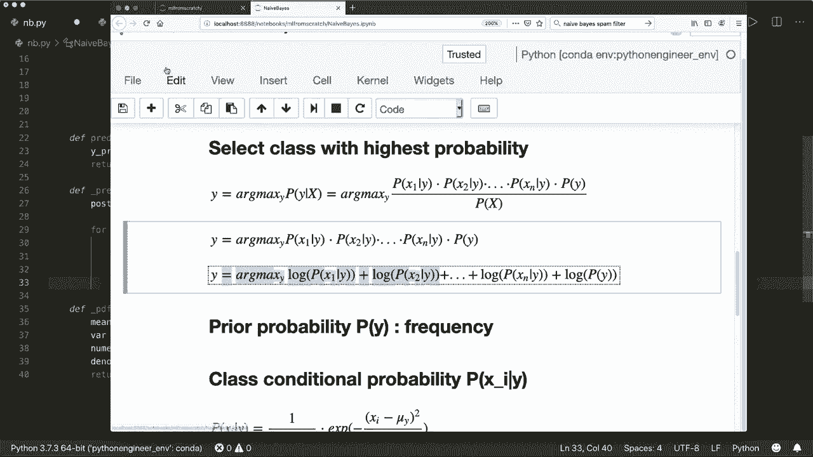

# 进行预测
y_pred = model.predict(X_test)

# 计算准确率
accuracy = np.sum(y_pred == y_test) / len(y_test)
print(f"模型准确率: {accuracy:.2f}")
```
运行上述测试代码，模型在示例数据集上应能达到不错的分类准确率。

## 总结

本节课中我们一起学习了朴素贝叶斯分类器的原理与实现。我们首先回顾了贝叶斯定理，理解了“朴素”独立性假设的含义，并推导出用于分类的对数后验概率公式。接着，我们使用 Python 和 Numpy 逐步实现了模型的训练（`fit`）和预测（`predict`）过程，其中关键步骤包括计算每个类别的先验概率、均值和方差，以及利用高斯概率密度函数计算类条件概率。

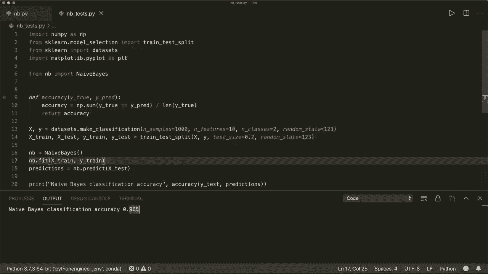

朴素贝叶斯是一种高效且易于实现的算法，特别适用于高维数据。虽然其“特征独立”的假设较强，但在许多实际场景中依然非常有效。希望本教程能帮助你牢固掌握这一经典算法。