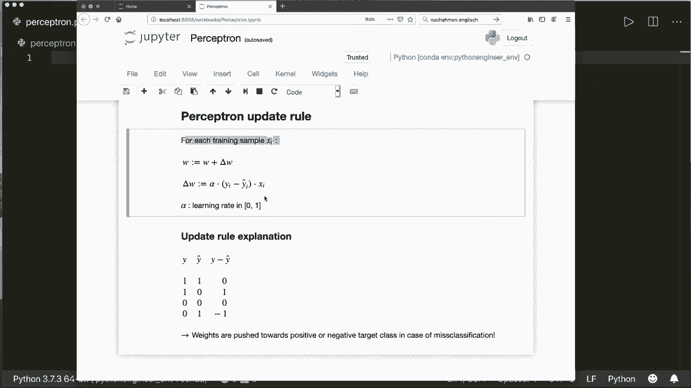
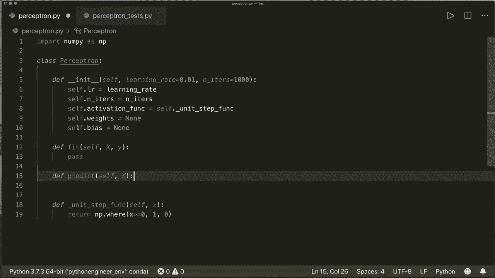
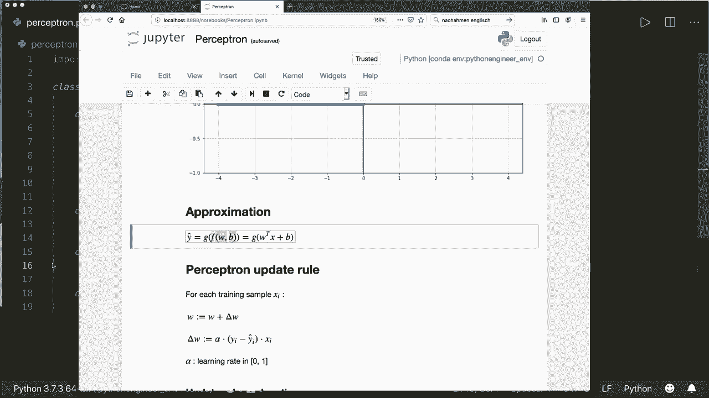
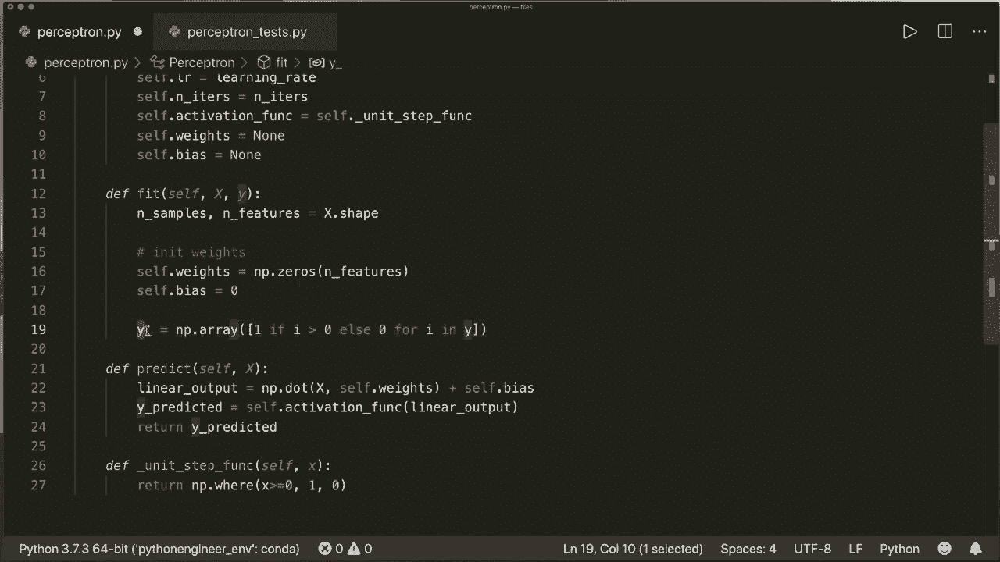
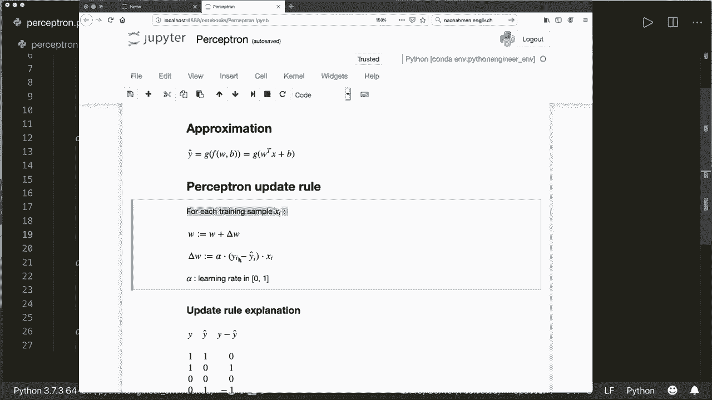
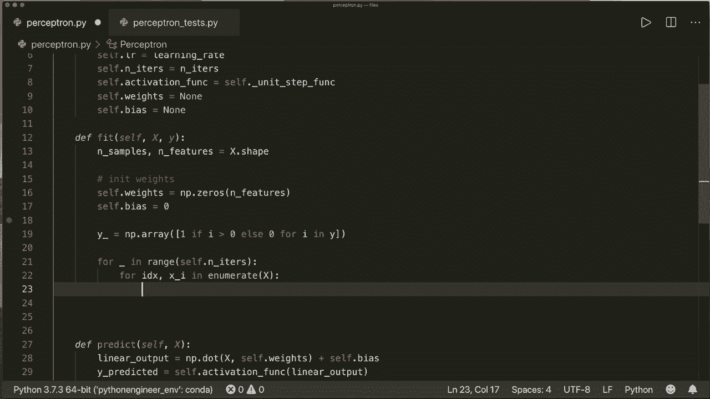
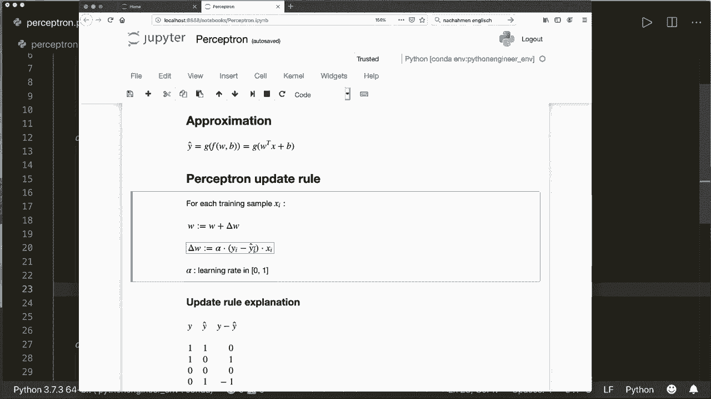
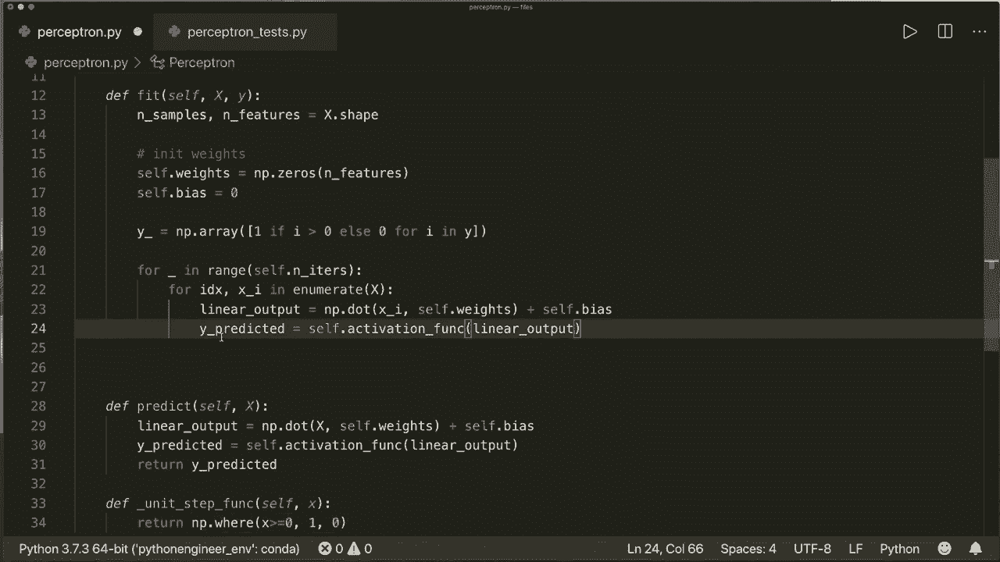
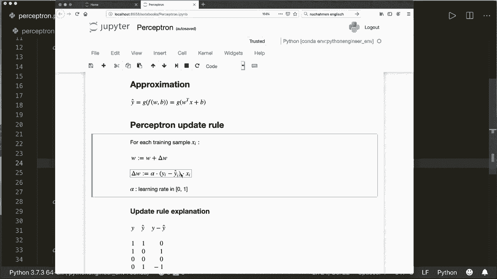
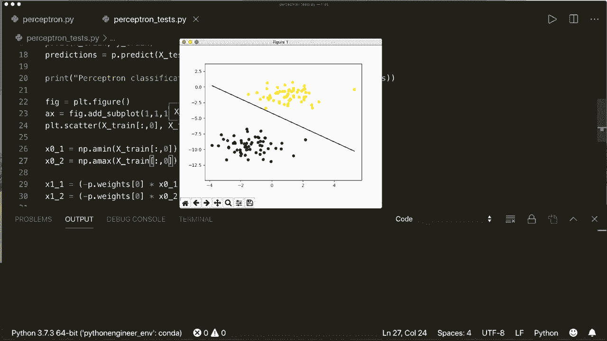

# 课程 P7：L7 - 感知器 🧠

在本节课中，我们将学习感知器算法。感知器是人工神经网络的基本单元，它模拟了单个生物神经元的行为。我们将从数学原理开始，理解其工作机制，然后仅使用 Python 和 Numpy 库，一步步实现一个完整的感知器模型。

## 概述

感知器是一种简单的线性二分类模型。它接收多个输入信号，为每个信号分配一个权重，计算加权和，然后通过一个激活函数（如单位阶跃函数）产生输出（通常是 0 或 1）。模型通过一个称为“感知器规则”的算法，根据预测错误来迭代更新权重，从而学习如何正确分类数据。

## 感知器的数学模型

感知器的计算过程分为两步：线性组合和激活函数。

**1. 线性部分**
首先，计算输入特征 `x` 与权重 `w` 的加权和，并加上偏置 `b`。其公式如下：
`线性输出 = w^T * x + b`
在代码中，这通常通过点积运算实现。

**2. 激活函数**
然后，将线性输出送入激活函数，得到最终的类别预测。对于最基本的感知器，我们使用**单位阶跃函数**：
`f(x) = 1 if x >= 0 else 0`
这个函数在阈值（通常为0）处发生阶跃，将连续值转换为离散的类别标签。

因此，感知器的完整输出公式为：
`y_pred = f(w^T * x + b)`



## 权重更新：感知器规则

模型需要通过训练数据来学习合适的权重 `w` 和偏置 `b`。感知器使用一个直观的更新规则：

`w_new = w_old + α * (y_true - y_pred) * x`
`b_new = b_old + α * (y_true - y_pred)`

其中：
*   `α` 是学习率，一个介于0和1之间的超参数，控制每次更新的步长。
*   `y_true` 是样本的真实标签。
*   `y_pred` 是模型当前的预测标签。
*   `x` 是当前训练样本的特征向量。

这个规则的含义是：
*   如果预测正确 (`y_true == y_pred`)，则更新量为0，权重保持不变。
*   如果预测为负类但实际是正类 (`y_true=1, y_pred=0`)，则更新量为正，权重会向正类方向调整。
*   如果预测为正类但实际是负类 (`y_true=0, y_pred=1`)，则更新量为负，权重会向负类方向调整。

模型会遍历训练集多次（多次迭代），反复应用此规则，直到权重收敛或达到预设的迭代次数。

## 代码实现



现在，我们将上述原理转化为代码。我们将创建一个名为 `Perceptron` 的类。



首先，导入必要的库并定义类结构：

```python
import numpy as np

class Perceptron:
    def __init__(self, learning_rate=0.01, n_iters=1000):
        self.lr = learning_rate
        self.n_iters = n_iters
        self.weights = None
        self.bias = None
        self.activation_func = self._unit_step_func

    def _unit_step_func(self, x):
        # 单位阶跃函数，能处理单个数值或数组
        return np.where(x >= 0, 1, 0)
```

接下来，我们实现核心的 `fit` 训练方法。该方法接收训练特征 `X` 和标签 `y`，并应用感知器规则更新权重。

```python
    def fit(self, X, y):
        # 获取数据维度
        n_samples, n_features = X.shape

        # 初始化权重和偏置
        self.weights = np.zeros(n_features)
        self.bias = 0

        # 确保标签为0或1
        y_ = np.array([1 if i > 0 else 0 for i in y])

        # 开始训练迭代
        for _ in range(self.n_iters):
            # 遍历每个训练样本
            for idx, x_i in enumerate(X):
                # 计算线性输出并预测
                linear_output = np.dot(x_i, self.weights) + self.bias
                y_pred = self.activation_func(linear_output)

                # 应用感知器规则更新参数
                update = self.lr * (y_[idx] - y_pred)
                self.weights += update * x_i
                self.bias += update
```

然后，我们实现 `predict` 预测方法。该方法对新数据应用学习到的权重和激活函数，生成预测结果。





```python
    def predict(self, X):
        # 计算线性输出
        linear_output = np.dot(X, self.weights) + self.bias
        # 应用激活函数得到最终预测
        y_pred = self.activation_func(linear_output)
        return y_pred
```



## 测试我们的感知器



为了验证实现是否正确，我们可以使用一个简单的数据集进行测试。以下是测试步骤：

```python
# 1. 生成模拟数据
from sklearn.model_selection import train_test_split
from sklearn.datasets import make_blobs

X, y = make_blobs(n_samples=200, centers=2, n_features=2, random_state=42)
# 将标签转换为0和1
y = np.where(y == 0, 0, 1)
X_train, X_test, y_train, y_test = train_test_split(X, y, test_size=0.2, random_state=42)





# 2. 训练模型
perceptron = Perceptron(learning_rate=0.01, n_iters=1000)
perceptron.fit(X_train, y_train)

# 3. 预测并评估
predictions = perceptron.predict(X_test)
accuracy = np.sum(predictions == y_test) / len(y_test)
print(f"感知器在测试集上的准确率: {accuracy:.2f}")
```

如果数据是线性可分的，我们的感知器应该能够画出一条直线（决策边界）完美地将两类点分开，并达到很高的准确率。

## 总结

本节课中，我们一起学习了感知器算法。我们首先了解了它作为神经网络基本单元的生物学灵感，然后深入探讨了其数学模型，包括线性加权和与单位阶跃激活函数。核心在于“感知器规则”，这是一个通过错误驱动权重更新的简单而有效的学习算法。

我们成功地从零开始，用 Python 和 Numpy 实现了完整的感知器类，包含 `fit` 训练和 `predict` 预测方法。最后，我们在模拟数据上测试了模型，验证了其对于线性可分问题的有效性。



需要注意的是，标准感知器的主要**局限性**在于它只能解决线性可分的问题。对于更复杂的非线性模式，我们需要更强大的模型，例如使用其他激活函数（如Sigmoid）和多层结构的神经网络。然而，感知器作为起点，完美地展示了机器学习中“模型、学习规则、迭代优化”的核心思想。