# 机器学习算法实现教程 P8：L8- 支持向量机 (SVM) 🎯

在本节课中，我们将学习支持向量机（SVM）算法的基本原理，并仅使用 Python 内置模块和 Numpy 库来实现它。SVM 是一种非常流行的监督学习算法，主要用于分类任务。其核心思想是寻找一个最优的线性决策边界（即超平面），以最大化不同类别数据点之间的间隔。

## 概述与核心思想

支持向量机的目标是找到一个超平面，能最好地将两类数据分开。这个“最好”的标准是**最大化间隔**，即超平面到两侧最近数据点的距离之和最大。

超平面由线性方程 **W·X - B = 0** 定义，其中 **W** 是权重向量，**B** 是偏置项。对于类别标签为 **+1** 的样本，我们希望满足 **W·X - B ≥ 1**；对于类别标签为 **-1** 的样本，则希望满足 **W·X - B ≤ -1**。这可以统一表示为约束条件：**yi * (W·Xi - B) ≥ 1**。

上一节我们介绍了 SVM 的基本目标，本节中我们来看看如何通过数学优化来实现它。

## 数学模型与损失函数

为了找到最优的 **W** 和 **B**，我们需要定义一个成本函数并进行优化。SVM 的成本函数由两部分组成：

1.  **间隔最大化项**：我们希望最大化间隔，间隔距离公式为 **2 / ||W||**。最大化间隔等价于最小化 **||W||²**。因此，我们在成本函数中加入 **λ * ||W||²** 项，其中 **λ** 是一个权衡参数。
2.  **铰链损失项**：用于确保分类的正确性。铰链损失定义为 **max(0, 1 - yi * f(xi))**，其中 **f(xi) = W·Xi - B**。

因此，完整的成本函数为：
**Cost = λ * ||W||² + (1/n) * Σ max(0, 1 - yi * f(xi))**

当样本被正确分类且函数间隔 **yi*f(xi) ≥ 1** 时，铰链损失为 0，成本函数仅由正则化项组成。否则，损失会线性增加。

## 梯度下降与参数更新

我们使用梯度下降法来最小化成本函数，从而更新权重 **W** 和偏置 **B**。需要对成本函数分别求关于 **W** 和 **B** 的偏导数。

以下是两种情况的梯度：

*   **情况一：当 yi * f(xi) ≥ 1 时**
    *   对 **W** 的梯度：**2λW**
    *   对 **B** 的梯度：**0**

*   **情况二：当 yi * f(xi) < 1 时**
    *   对 **W** 的梯度：**2λW - yi * Xi**
    *   对 **B** 的梯度：**-yi**

得到梯度后，我们使用以下更新规则：
**W_new = W_old - learning_rate * gradient_W**
**B_new = B_old - learning_rate * gradient_B**

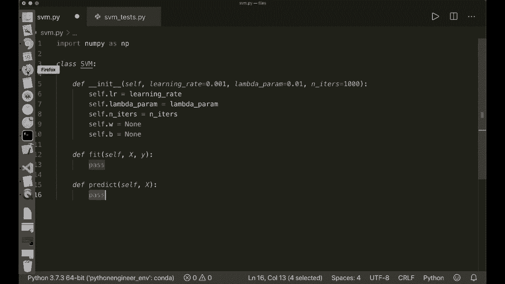

理解了数学原理和更新规则后，现在我们可以开始动手实现 SVM 算法了。

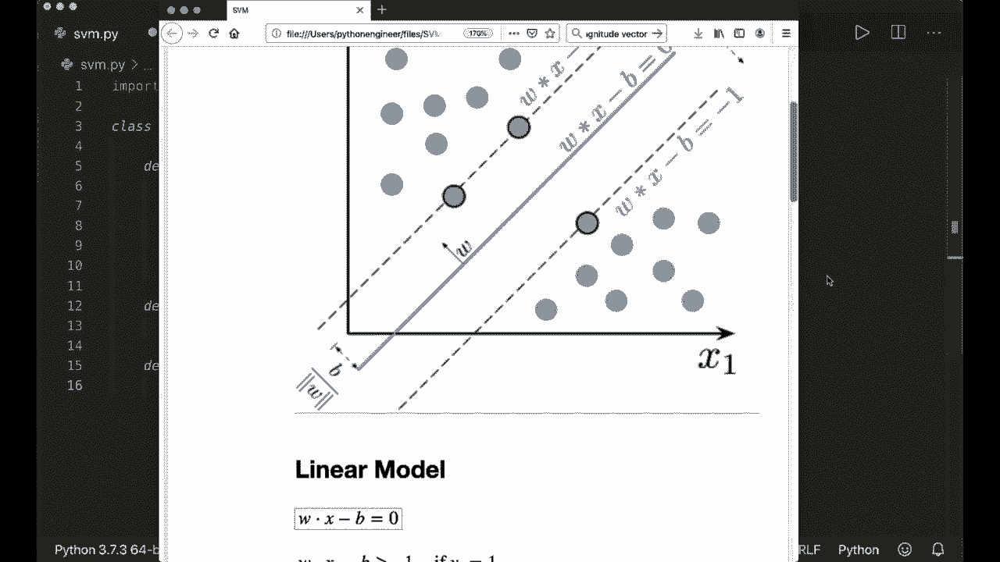

## Python 实现步骤

我们将创建一个名为 `SVM` 的类，包含初始化、训练（`fit`）和预测（`predict`）方法。

首先，导入必要的库并初始化类。

```python
import numpy as np

class SVM:
    def __init__(self, learning_rate=0.001, lambda_param=0.01, n_iters=1000):
        self.lr = learning_rate
        self.lambda_param = lambda_param
        self.n_iters = n_iters
        self.w = None
        self.b = None
```

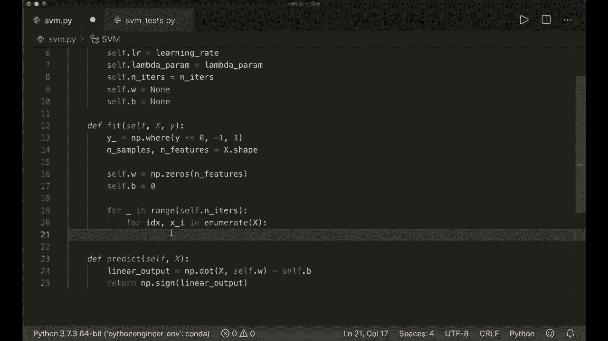

接下来，实现 `predict` 方法。预测过程很简单，计算线性模型的输出并取其符号。

```python
    def predict(self, X):
        linear_output = np.dot(X, self.w) - self.b
        return np.sign(linear_output)
```

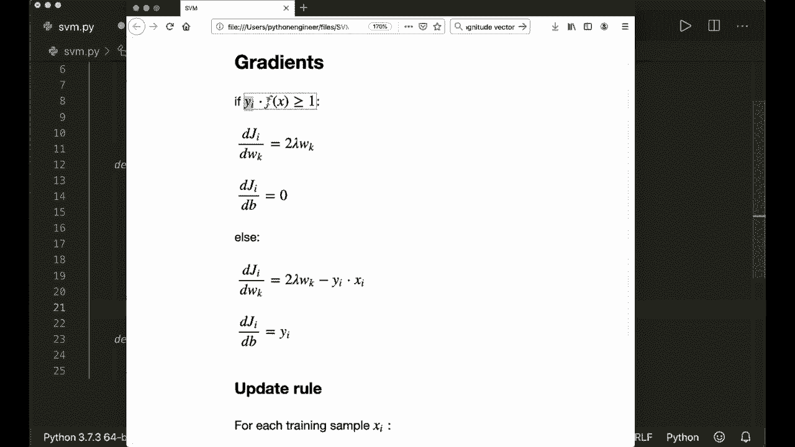

现在，实现核心的 `fit` 训练方法。训练过程包括标签转换、参数初始化以及多轮迭代的梯度下降更新。

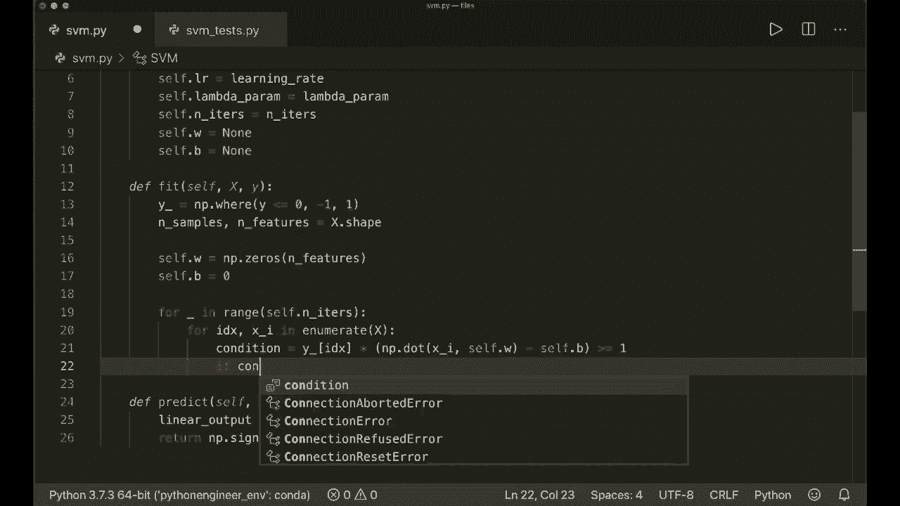

```python
    def fit(self, X, y):
        # 将标签转换为 +1 和 -1
        y_ = np.where(y <= 0, -1, 1)

        n_samples, n_features = X.shape

        # 初始化权重和偏置
        self.w = np.zeros(n_features)
        self.b = 0

        # 梯度下降
        for _ in range(self.n_iters):
            for idx, x_i in enumerate(X):
                condition = y_[idx] * (np.dot(x_i, self.w) - self.b) >= 1

                if condition:
                    # 情况一：样本分类正确且间隔足够大
                    self.w -= self.lr * (2 * self.lambda_param * self.w)
                else:
                    # 情况二：样本分类错误或间隔不足
                    self.w -= self.lr * (2 * self.lambda_param * self.w - np.dot(x_i, y_[idx]))
                    self.b -= self.lr * y_[idx]
```

## 算法测试

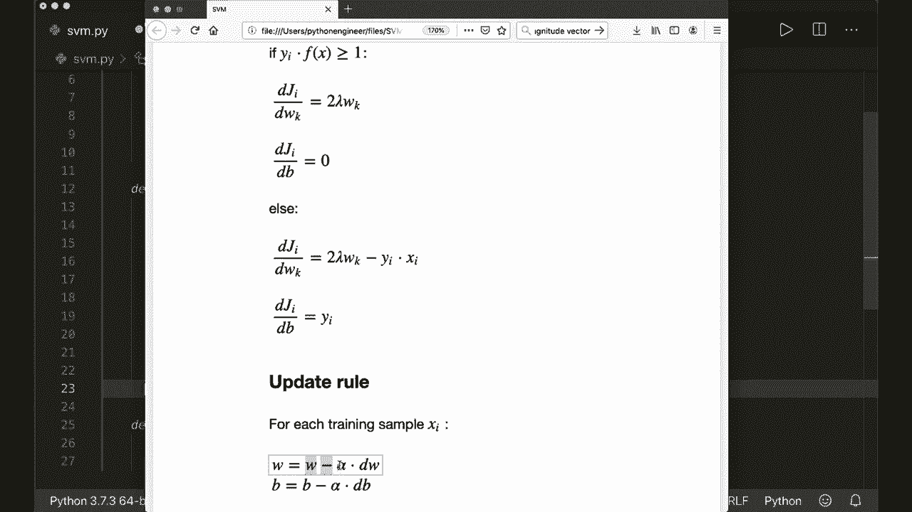

实现完成后，我们需要测试算法的有效性。以下是一个简单的测试脚本，用于生成数据并可视化决策边界。

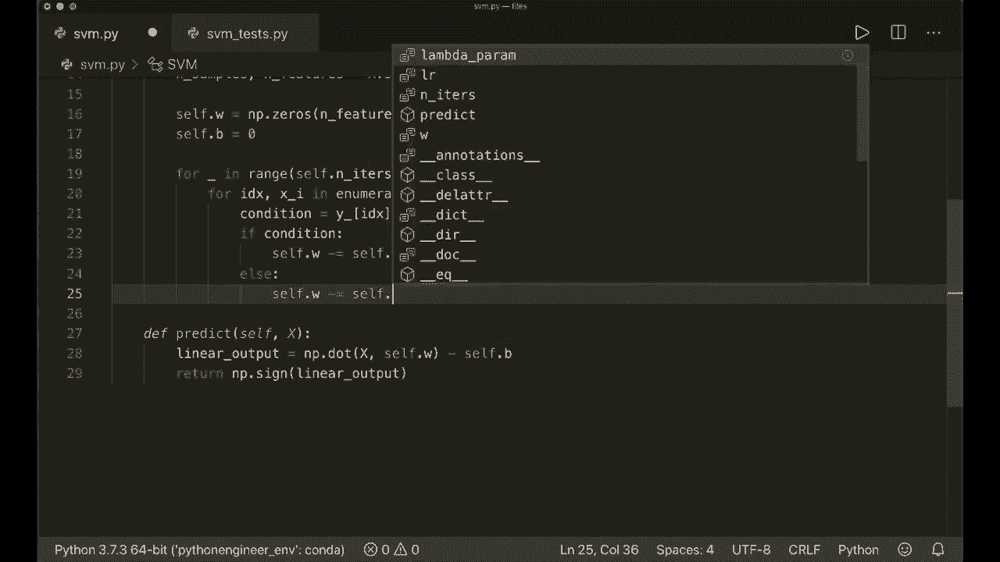

```python
# 测试脚本示例 (svm_test.py)
import matplotlib.pyplot as plt
from sklearn.model_selection import train_test_split
from sklearn import datasets
from svm import SVM  # 假设SVM类保存在svm.py文件中

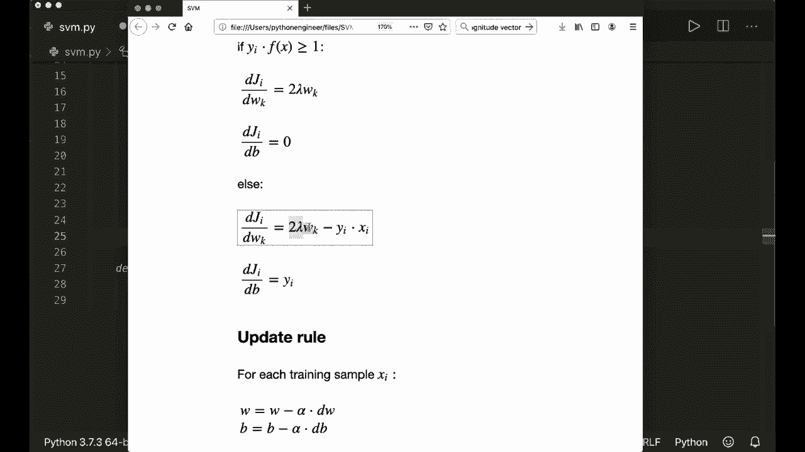

def visualize_svm():
    X, y = datasets.make_blobs(n_samples=50, n_features=2, centers=2, cluster_std=1.05, random_state=40)
    y = np.where(y == 0, -1, 1)

    clf = SVM()
    clf.fit(X, y)

    # 可视化代码（略）
    # 可绘制数据点、决策超平面及支持向量平面
    print("Training complete.")

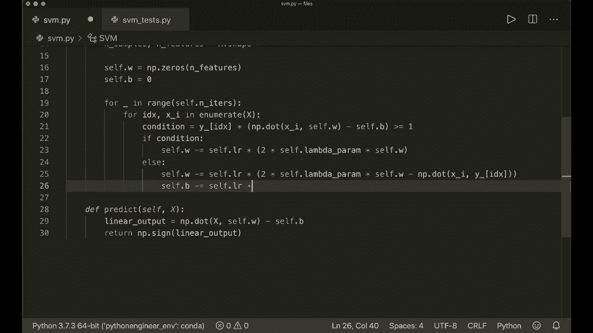

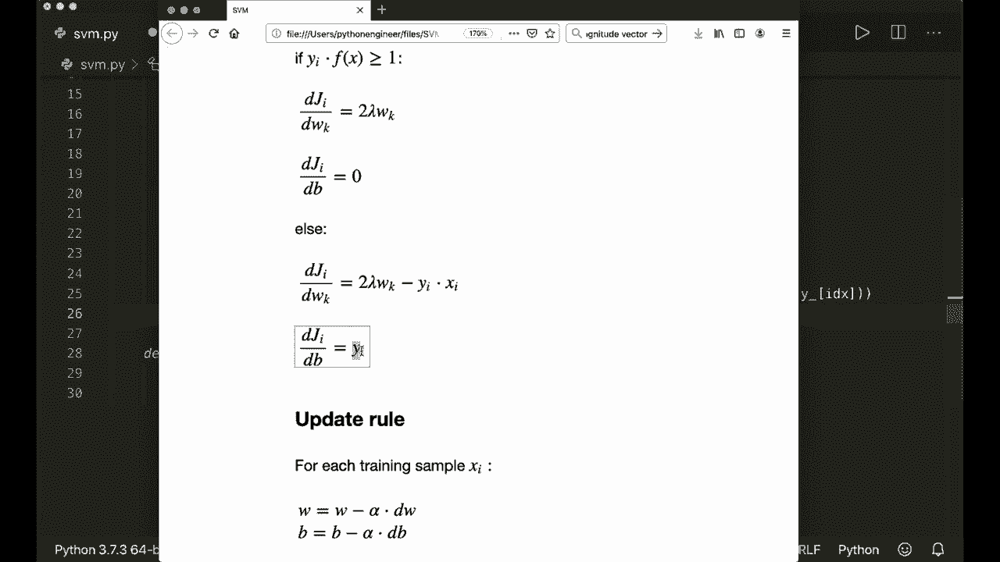

if __name__ == "__main__":
    visualize_svm()
```

运行测试脚本，算法将计算出决策超平面。可视化结果通常会显示一条区分两类数据的直线（在二维空间中），以及两侧的间隔边界线，直观展示“最大间隔”的原则。

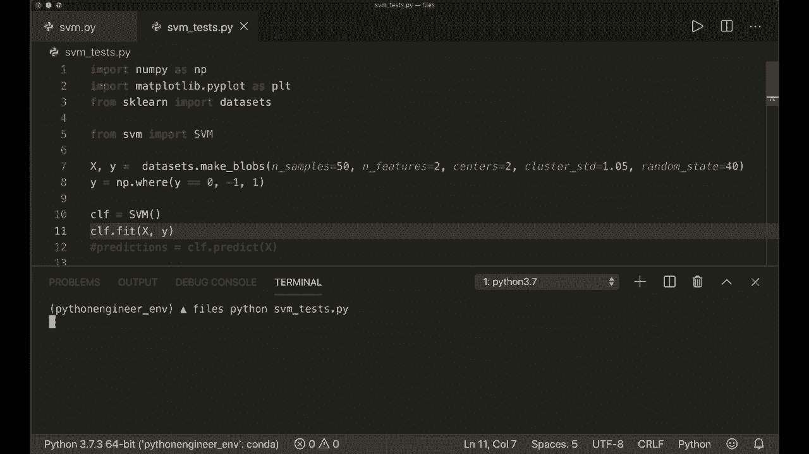

## 总结

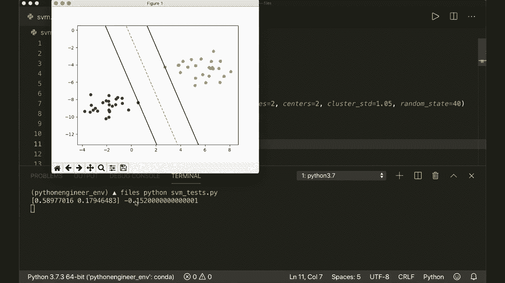

本节课中我们一起学习了支持向量机（SVM）算法。我们从其核心思想——寻找最大间隔超平面开始，逐步推导了其数学模型和铰链损失函数。接着，我们详细解释了如何利用梯度下降法来优化权重和偏置参数，并给出了清晰的参数更新规则。最后，我们使用 Python 和 Numpy 一步步实现了完整的 SVM 分类器，并通过一个简单示例验证了其功能。

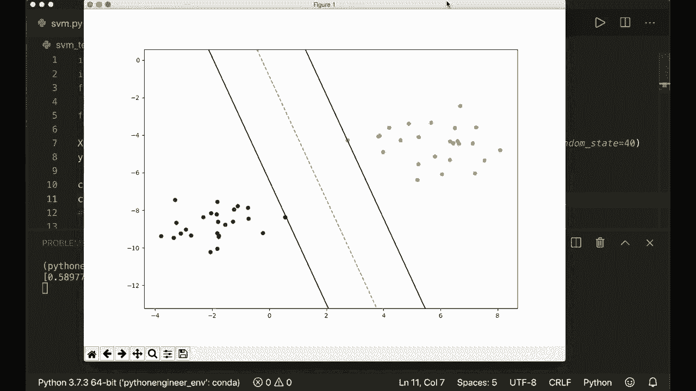

SVM 是一个强大且直观的分类算法，理解其原理和实现过程对于掌握机器学习基础至关重要。