# 用Pandas进行数据处理与分析！P1：数据分析入门 - 安装和加载数据 📊

在本节课中，我们将要学习如何开始使用Python的Pandas库进行数据分析。我们将从安装Pandas和Jupyter Notebook开始，然后学习如何下载真实世界的数据集并将其加载到我们的分析环境中。通过本课，你将能够搭建起自己的数据分析工作环境。

---

## 概述

Pandas是一个强大的Python数据分析库，它使我们能够轻松地读取、处理和分析不同类型的数据，例如CSV文件和Excel文件。对于希望进入数据科学领域的人来说，掌握Pandas是必不可少的技能。本系列课程将引导你从零开始学习Pandas。

本节是系列的第一部分，我们将专注于环境的搭建和数据的初步加载。

---

## 安装Pandas与Jupyter Notebook

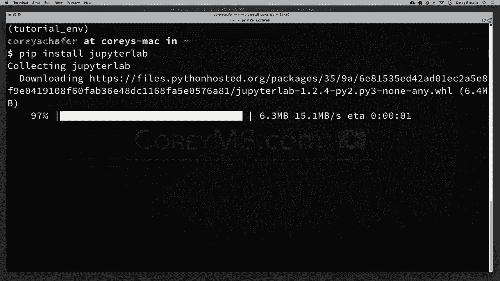

要开始使用Pandas，首先需要安装它。本节中我们来看看如何安装Pandas以及一个方便的可视化工具——Jupyter Notebook。

### 安装Pandas

安装Pandas非常简单，只需使用Python的包管理工具`pip`。在命令行中输入以下命令：

```bash
pip install pandas
```

运行此命令后，Pandas及其依赖项（如NumPy）将被自动安装。

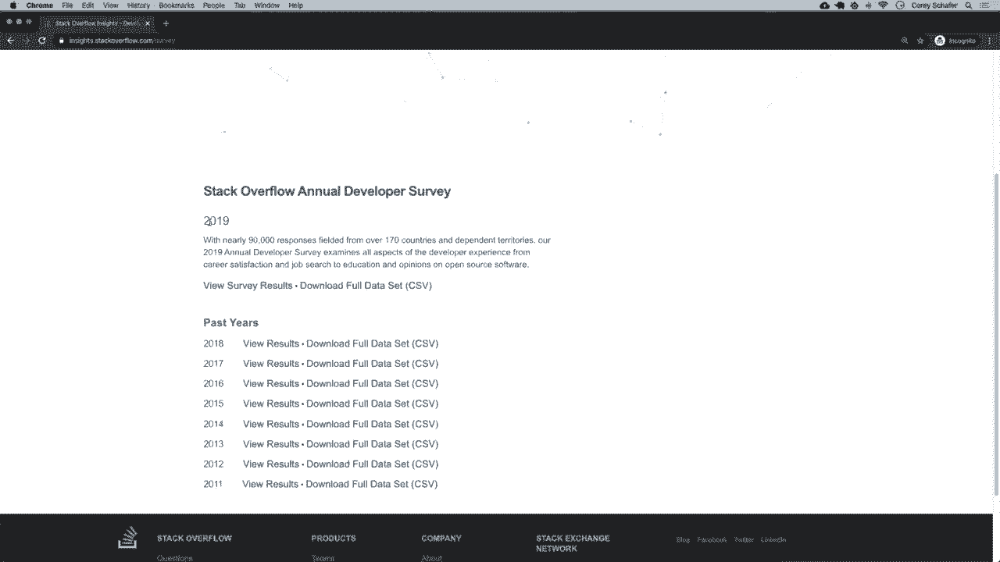

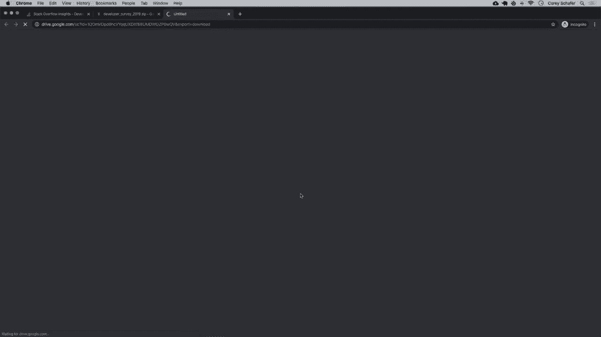

### 安装Jupyter Notebook

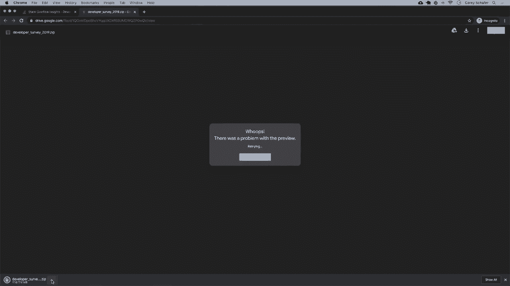

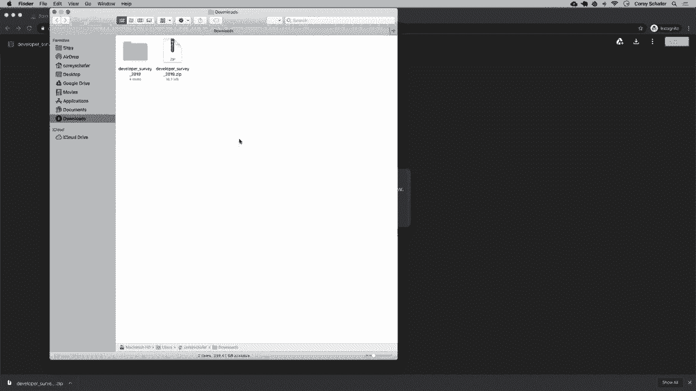

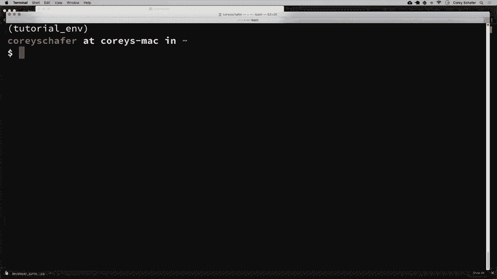

Jupyter Notebook是一个基于Web的交互式开发环境，特别适合数据分析和可视化。虽然本系列主要关注Pandas，但使用Jupyter可以更直观地展示数据表格。

要安装Jupyter Notebook，请运行以下命令：

```bash
pip install jupyterlab
```

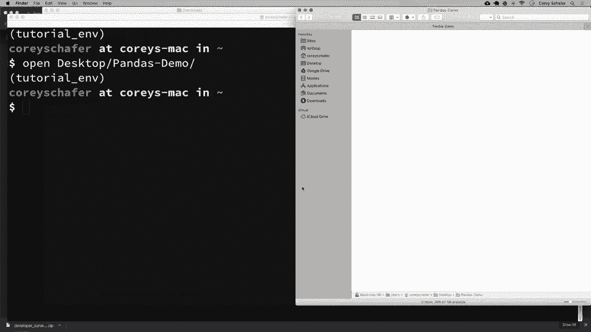

安装完成后，你可以在终端中通过运行`jupyter notebook`来启动它。启动后，Jupyter服务器将在你的浏览器中打开。

> **注意**：在使用Jupyter时，需要保持启动它的终端窗口处于打开状态。关闭终端窗口将同时关闭Jupyter服务器。

---

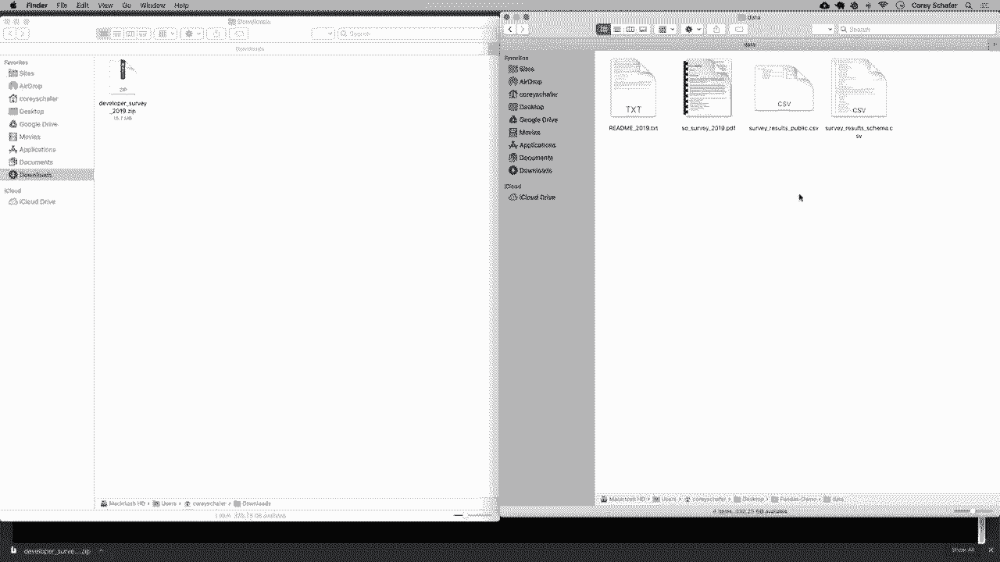

## 下载与分析数据集

上一节我们介绍了工具的安装，本节中我们来看看如何获取一个真实的数据集并加载到Pandas中。我们将使用Stack Overflow的年度开发者调查数据，这是一个内容丰富且贴近现实的数据集。

### 下载数据

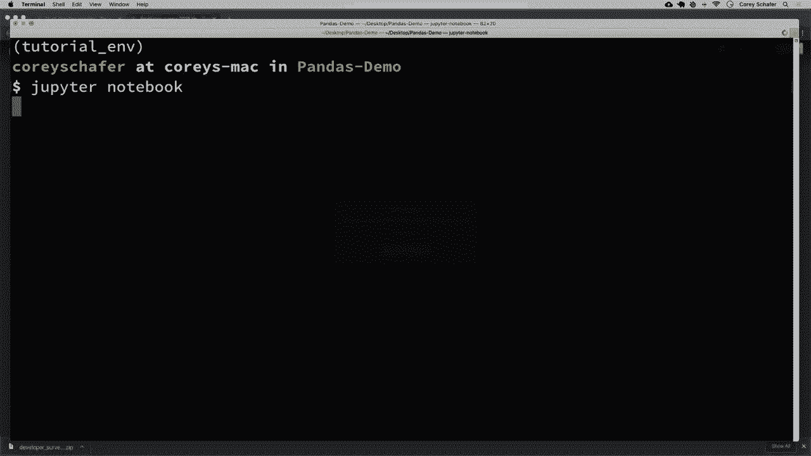

1.  访问Stack Overflow的开发者调查结果页面。
2.  选择并下载2019年的调查数据（CSV格式）。
3.  将下载的压缩包解压，你会得到几个文件，其中最主要的是`survey_results_public.csv`（包含调查结果）和`survey_results_schema.csv`（包含列名对应的具体问题说明）。
4.  建议将数据文件放在一个专门的项目文件夹中，例如重命名为`data.csv`以便于引用。

### 启动Jupyter并创建笔记本

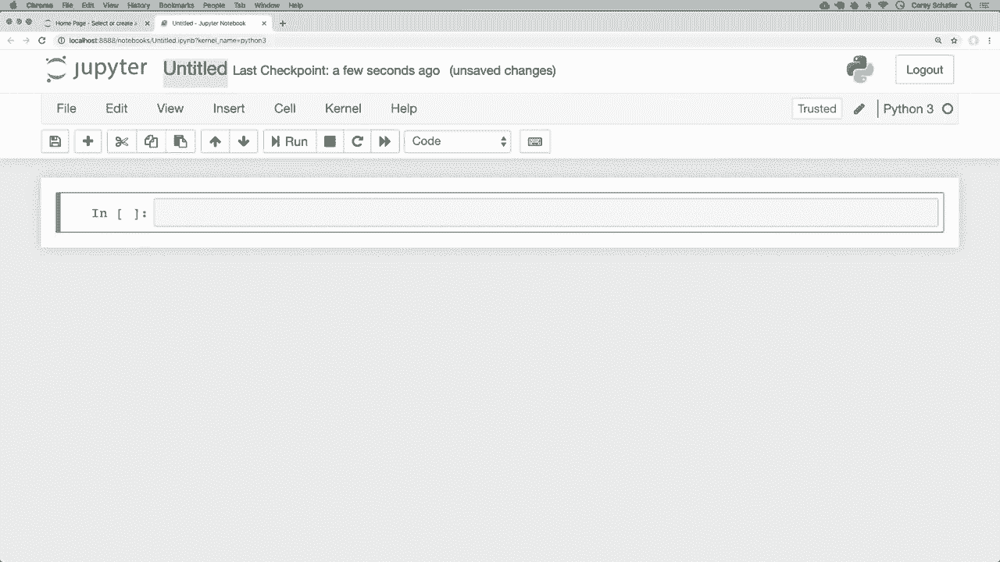

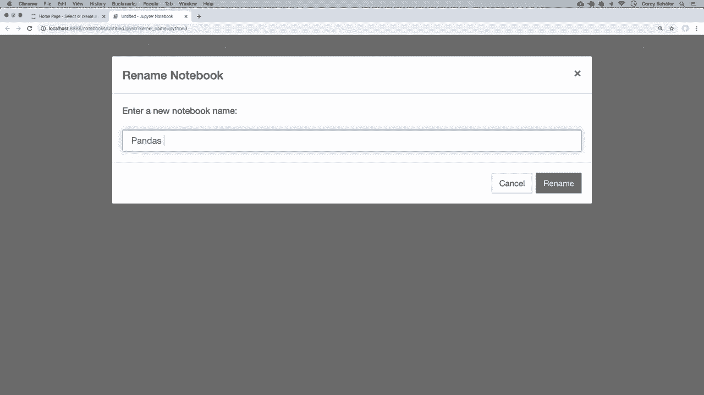

1.  在终端中，使用`cd`命令导航到你的项目文件夹。
2.  输入`jupyter notebook`启动服务器。
3.  在浏览器打开的Jupyter界面中，点击右上角的“New”按钮，选择“Python 3”创建一个新的笔记本。
4.  为笔记本命名，例如“pandas_demo”。

---

## 加载与初步查看数据

环境准备就绪后，现在我们可以开始使用Pandas来加载和探索数据了。

### 导入Pandas库

在Jupyter Notebook的第一个单元格中，输入以下代码来导入Pandas。按照惯例，我们通常将其简写为`pd`。

```python
import pandas as pd
```

按`Shift + Enter`运行该单元格。

### 读取CSV文件

Pandas的`read_csv`函数可以轻松地将CSV文件读入一个称为**DataFrame**的核心数据结构中。DataFrame可以理解为一张包含行和列的表格。

使用以下代码加载主数据文件：

```python
df = pd.read_csv(‘data/survey_results_public.csv’)
```

运行后，数据就被加载到变量`df`（DataFrame的缩写）中了。

### 查看数据概览

在Jupyter中，直接输入变量名`df`并运行，可以直观地查看DataFrame的前几行和最后几行，中间部分会以省略号表示。

为了获取数据的整体规模，我们可以使用`.shape`属性：

```python
df.shape
```

输出结果`(88883, 85)`表示这个数据集有88,883行和85列。

要获取更详细的信息，包括每列的数据类型和内存使用情况，可以使用`.info()`方法：

```python
df.info()
```

### 调整显示设置

默认情况下，Jupyter可能不会显示所有列。为了在查看时展示全部85列，我们可以修改Pandas的显示选项：

```python
pd.set_option(‘display.max_columns’, 85)
```

### 查看数据样本

我们通常不需要一次性查看所有数万行数据。以下是查看数据头尾部分样本的方法：

*   **`df.head()`**：默认显示前5行。
*   **`df.head(10)`**：显示前10行。
*   **`df.tail()`**：默认显示最后5行。
*   **`df.tail(10)`**：显示最后10行。

### 加载数据字典（模式文件）

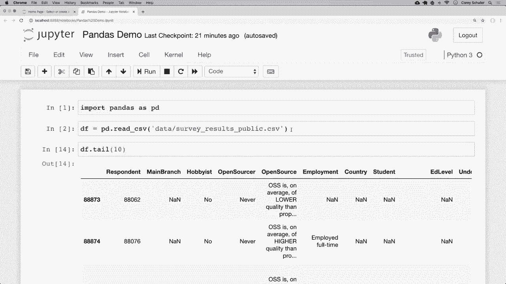

为了理解`survey_results_public.csv`中每一列数据的含义，我们可以加载模式文件：

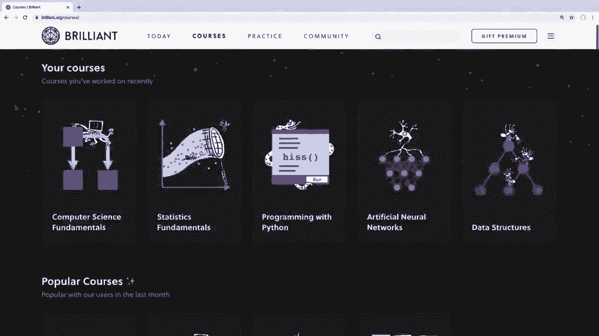

```python
schema_df = pd.read_csv(‘data/survey_results_schema.csv’)
```

同样，为了完整查看这个说明文件的所有行，我们可以设置最大行数的显示选项：

```python
pd.set_option(‘display.max_rows’, 85)
schema_df
```

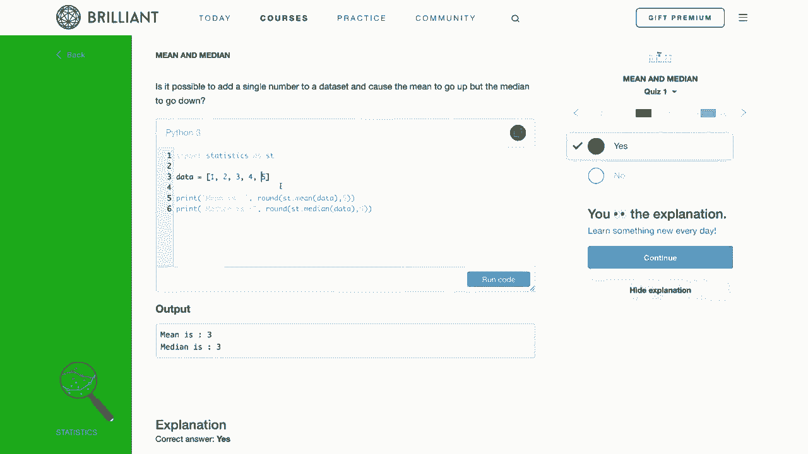

现在，你可以滚动查看所有列名及其对应的调查问题原文了。


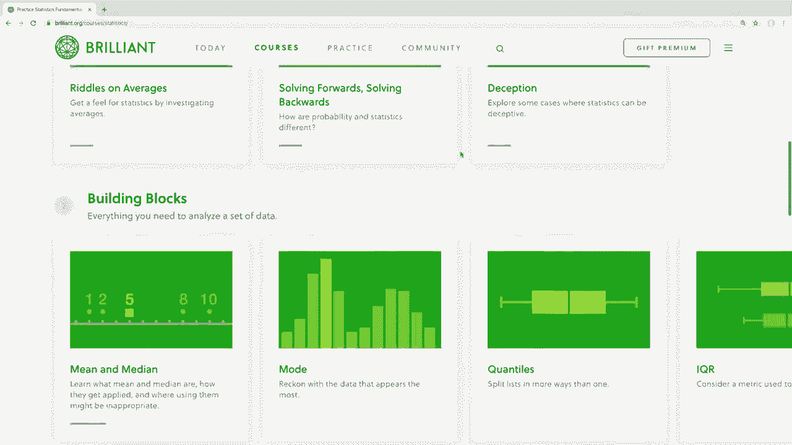

---

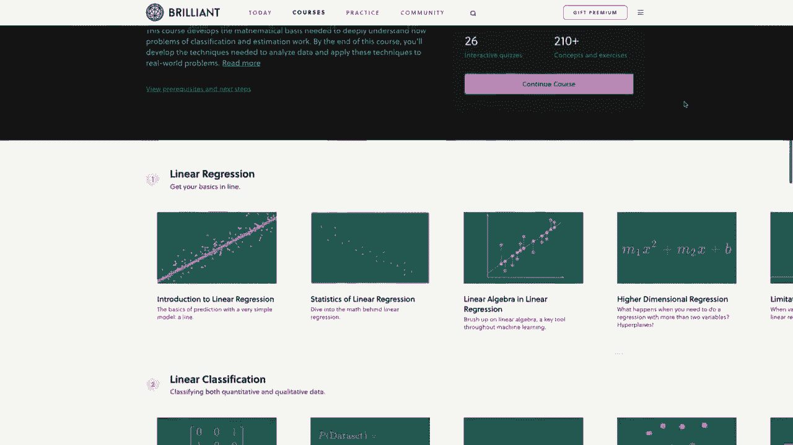

## 总结

本节课中我们一起学习了数据分析的起步步骤。我们首先安装了核心工具Pandas和Jupyter Notebook，然后下载了Stack Overflow的开发者调查数据集作为分析案例。接着，我们成功地将CSV数据加载到Pandas的DataFrame中，并学会了使用`.shape`、`.info()`、`.head()`和`.tail()`等基本方法来查看数据的规模、结构和样本内容。最后，我们还加载了数据字典文件来理解各列的具体含义。

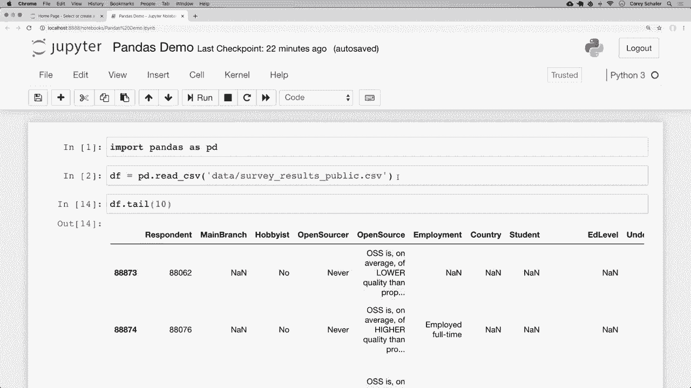

你已经成功搭建起了数据分析的环境并迈出了探索数据的第一步。在下一节课中，我们将更深入地学习DataFrame和Series数据结构，并开始学习如何筛选和操作特定的数据行与列。