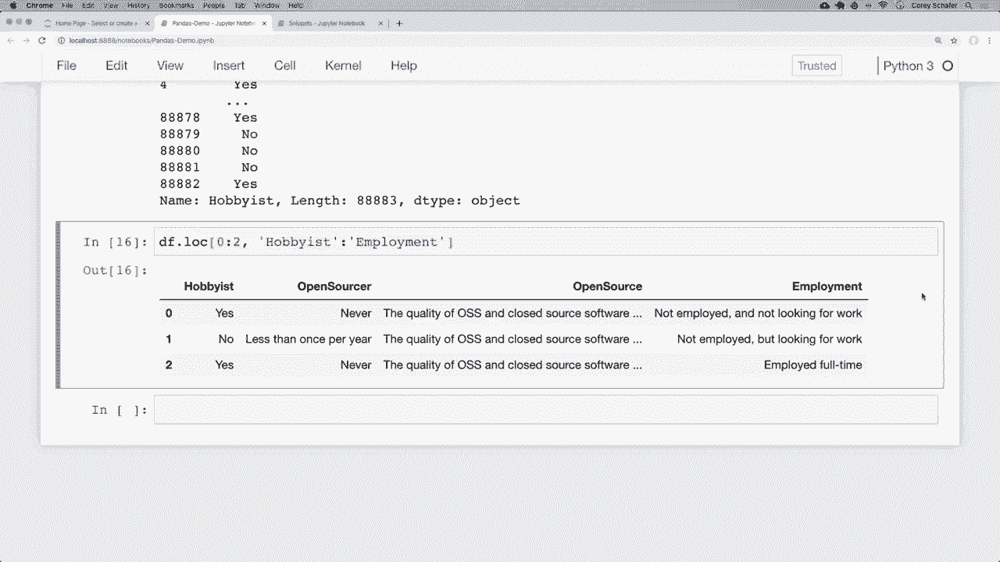
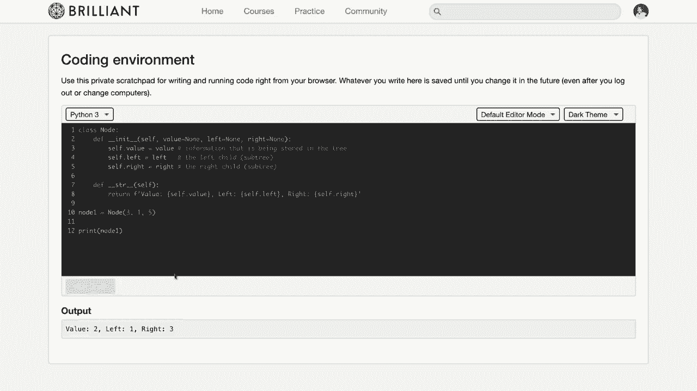
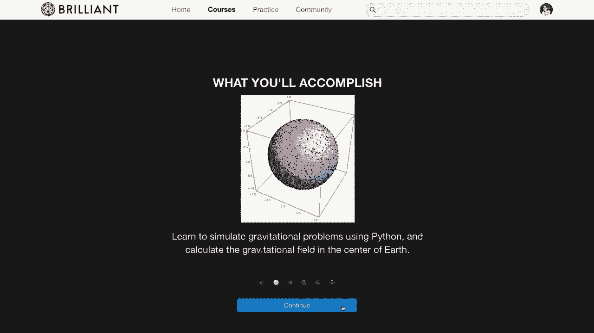
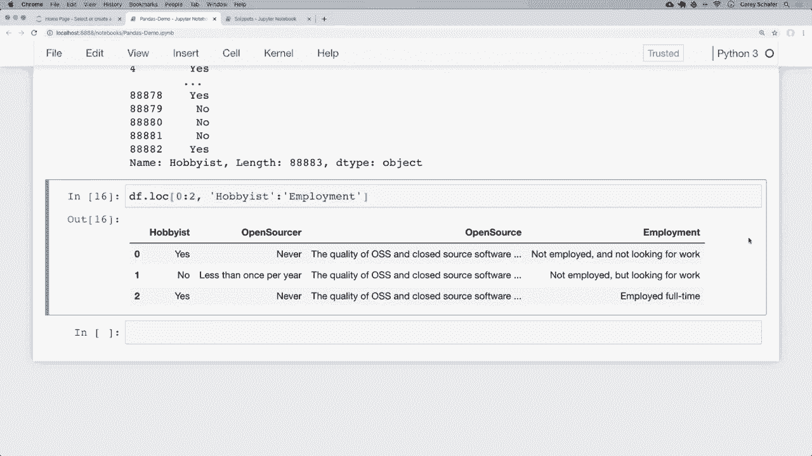

# 用Pandas进行数据处理与分析！P2：DataFrame和Series基础 - 选择行和列 📊

在本节课中，我们将要学习Pandas的两个核心数据类型：**DataFrame**和**Series**。我们将重点探讨如何从这两种数据结构中选择特定的行和列，这是进行数据操作和分析的基础。

---

## 理解DataFrame和Series

上一节我们介绍了如何加载数据。本节中，我们来看看构成Pandas核心的两种数据结构。

### 什么是DataFrame？

DataFrame是一个二维的、表格型的数据结构，包含行和列。你可以将其视为一个电子表格或一个SQL表。在Python中，一个DataFrame可以看作是一个由**Series**对象组成的字典，其中字典的键是列名，值是包含该列所有数据的Series。

**代码示例：创建一个简单的DataFrame**
```python
import pandas as pd

data = {
    'first': ['Corey', 'Jane', 'John'],
    'last': ['Schafer', 'Doe', 'Doe'],
    'email': ['CoreyMSchafer@gmail.com', 'JaneDoe@email.com', 'JohnDoe@email.com']
}

df = pd.DataFrame(data)
print(df)
```

### 什么是Series？

Series是一个一维的数组对象，可以看作是DataFrame中的单个列。它包含一个数据序列和一个与之关联的索引。

**代码示例：从DataFrame中获取一个Series**
```python
email_series = df['email']
print(type(email_series))  # 输出：<class 'pandas.core.series.Series'>
print(email_series)
```

**核心概念总结**：
*   **DataFrame** = 多个**Series**的容器（行和列）。
*   **Series** = 单列数据（一维数组）。

---

## 选择列

了解基础概念后，我们来看看如何从DataFrame中选择数据。首先，学习如何选择列。

要选择单个列，可以使用类似字典键的访问方式，或者使用点符号（但不推荐）。

**代码示例：选择单个列**
```python
# 方法1：使用类似字典键的访问方式（推荐）
emails = df['email']

# 方法2：使用点符号（需注意列名不能与DataFrame方法名冲突）
emails_dot = df.email
```

要选择多个列，需要传入一个包含列名的列表。

**代码示例：选择多个列**
```python
# 选择 ‘last’ 和 ‘email’ 两列
subset = df[['last', 'email']]
print(subset)
```

---

## 选择行

选择列之后，我们来看看如何选择特定的行。Pandas提供了 `.loc` 和 `.iloc` 两个索引器来实现。

### 使用 `.iloc` 按整数位置选择

`.iloc` 用于通过行和列的整数位置（从0开始）进行选择。

以下是使用 `.iloc` 的几种常见操作：

*   **选择单行**：`df.iloc[0]`
*   **选择多行**：`df.iloc[[0, 1]]`
*   **选择特定行和列**：`df.iloc[[0, 1], 2]` （选择前两行的第3列）
*   **使用切片选择连续行**：`df.iloc[0:3]` （选择索引0到2的行）

**代码示例：使用 `.iloc`**
```python
# 获取第一行（整数位置0）
first_row = df.iloc[0]

# 获取前两行的 ‘email’ 列（第3列，整数位置2）
emails_first_two = df.iloc[[0, 1], 2]
```

### 使用 `.loc` 按标签选择

`.loc` 用于通过行和列的索引标签进行选择。在默认情况下，行的索引标签就是整数位置，因此 `.loc` 和 `.iloc` 的行为看起来相似。但在设置自定义索引后，`.loc` 的威力才会真正显现（下节课内容）。

以下是使用 `.loc` 的几种常见操作：

*   **选择单行**：`df.loc[0]`
*   **选择多行**：`df.loc[[0, 1]]`
*   **选择特定行和列**：`df.loc[[0, 1], 'email']`
*   **选择特定行和多列**：`df.loc[[0, 1], ['last', 'email']]`

**代码示例：使用 `.loc`**
```python
# 获取标签为0的行
row_label_0 = df.loc[0]

# 获取前两行的 ‘email’ 和 ‘last’ 列
specific_data = df.loc[[0, 1], ['email', 'last']]
```

**`.loc` 与 `.iloc` 切片的重要区别**：`.loc` 的切片是**包含**结束值的，而 `.iloc` 的切片是**不包含**结束值的（与Python列表切片一致）。例如，`df.loc[0:2]` 会返回索引标签为0,1,2的三行。

---

## 在真实数据集中实践

现在，让我们将所学知识应用到一个更大的真实数据集（Stack Overflow开发者调查数据）中。

**代码示例：在真实数据集中选择数据**
```python
# 假设 df_survey 是已加载的调查数据DataFrame
# 查看数据形状（行数，列数）
print(df_survey.shape)

# 选择 ‘Hobbyist’ 这一列的所有数据
hobbyist_series = df_survey['Hobbyist']
print(hobbyist_series.head())

# 使用 .value_counts() 快速统计该列中不同值的数量（预览Pandas的强大功能）
print(hobbyist_series.value_counts())

# 选择前3行数据的 ‘Hobbyist’ 列
first_three_hobbyist = df_survey.loc[[0, 1, 2], 'Hobbyist']
# 或者使用切片
first_three_hobbyist_slice = df_survey.loc[0:2, 'Hobbyist']

# 选择前3行，从 ‘Hobbyist’ 到 ‘Employment’ 的多列数据
slice_of_data = df_survey.loc[0:2, 'Hobbyist':'Employment']
```

---




## 总结



本节课中我们一起学习了：
1.  **DataFrame** 和 **Series** 是Pandas的支柱，分别代表二维表格数据和单列一维数据。
2.  选择列的两种方式：`df[‘column_name’]`（推荐）和 `df.column_name`。
3.  选择多列需要传入列名列表：`df[[‘col1‘， ‘col2’]]`。
4.  使用 **`.iloc`** 通过整数位置选择行和列。
5.  使用 **`.loc`** 通过索引标签选择行和列，并注意其切片是包含结束值的。
6.  将选择行和列的方法组合使用，以精确提取数据子集。



掌握如何选择数据是进行数据清洗、分析和可视化的第一步。在接下来的课程中，我们将学习如何设置索引以及进行更复杂的数据查询。

---



> **赞助商声明**：本系列教程由 Brilliant.org 赞助。Brilliant 提供交互式课程，帮助您深入理解数学、科学和计算机科学的基础概念，其数据科学和统计学课程是巩固本系列所学知识的绝佳补充。