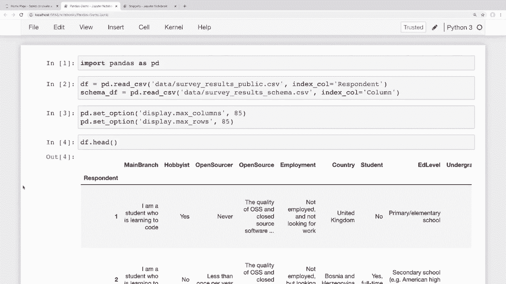
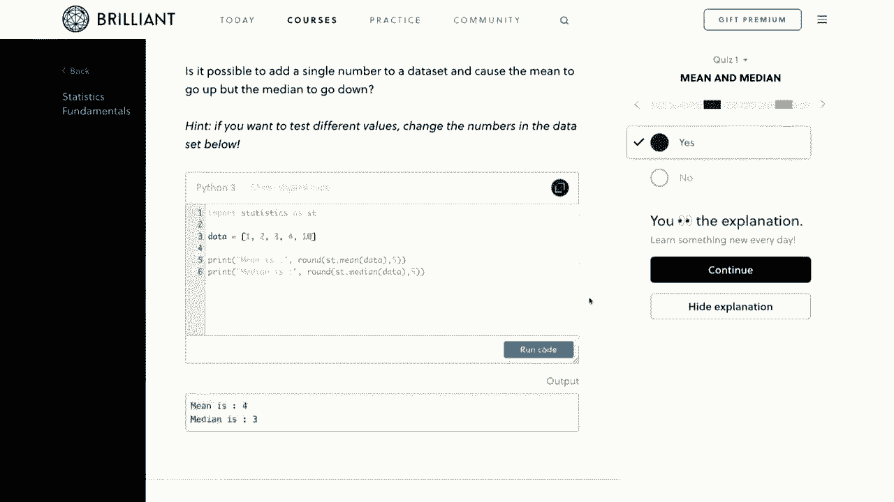
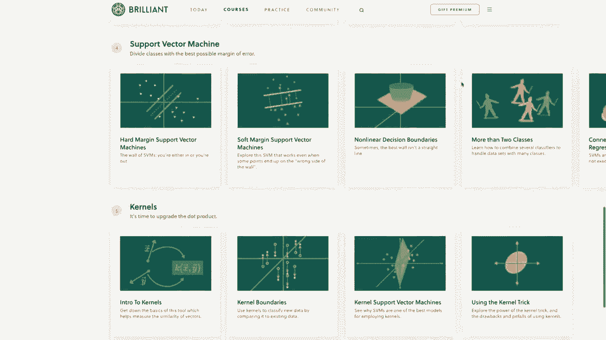
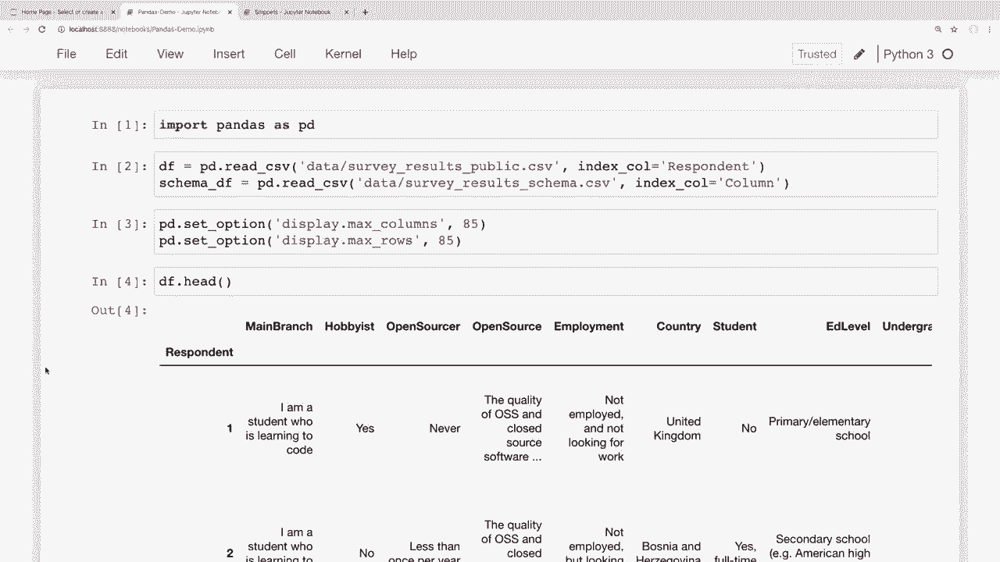

# 课程五：用Pandas进行数据处理与分析！🔄 更新 - 修改DataFrame内的行列数据

在本节课中，我们将学习如何修改Pandas DataFrame中现有的行和列数据。我们将从更新列名开始，然后深入到如何更新行中的单个或多个值，并介绍几种高级方法，如`apply`、`map`、`applymap`和`replace`。课程最后，我们会将所学知识应用到一个真实的数据集（Stack Overflow调查数据）中。

---

## 概述：更新列名

上一节我们学习了如何筛选数据，本节我们将利用类似的技术来修改数据。首先，我们来看看如何更新DataFrame的列名。

### 查看与修改所有列名

我们可以通过`.columns`属性查看所有列名。假设我们想将列名变得更具体，例如将`"first"`改为`"first name"`。

以下是几种方法：

**方法一：直接为`.columns`属性赋值**
我们可以直接传入一个新的列名列表来重命名所有列。

```python
df.columns = ['first name', 'last name', 'email']
```

**方法二：使用列表推导式批量修改**
例如，将所有列名转换为大写。

```python
df.columns = [x.upper() for x in df.columns]
```

或者，将列名中的空格替换为下划线（便于使用点表示法访问）。

```python
df.columns = df.columns.str.replace(' ', '_')
```

### 修改特定列名

如果我们只想修改少数几列，可以使用`.rename()`方法，并传入一个映射字典。

```python
df.rename(columns={'first name': 'first', 'last name': 'last'}, inplace=True)
```

注意，需要设置`inplace=True`才能使更改生效。

---

## 更新行中的数据

更新完列名后，我们来看看如何更新行中的数据。这部分内容更丰富，我们将从更新单个值开始。

### 更新单个值

我们可以使用`.loc`索引器来定位并修改特定的值。例如，将索引标签为2的行的姓氏改为`"Smith"`。

```python
df.loc[2, 'last'] = 'Smith'
```

我们也可以结合条件筛选来定位行，然后进行修改。

```python
# 先定位行
row = df[(df['first'] == 'John') & (df['last'] == 'Doe')]
# 再修改该行的特定列
df.loc[row.index, 'last'] = 'Smith'
```

对于修改单个值，Pandas还提供了`.at`索引器，其功能与`.loc`类似，但可能在某些情况下性能更优。

```python
df.at[2, 'last'] = 'Doe'
```

### 常见错误：避免使用链式赋值

一个常见的错误是尝试在不使用`.loc`或`.at`的情况下直接通过筛选结果进行赋值。这可能导致操作无效并产生警告。

```python
# 错误示例：这可能不会实际修改DataFrame，并会触发警告
df[df['email'] == 'john.doe@email.com']['last'] = 'Smith'

# 正确做法：使用.loc
df.loc[df['email'] == 'john.doe@email.com', 'last'] = 'Smith'
```

---

## 更新多行数据

现在，我们来看看如何一次性更新多行数据。

### 直接对整列进行操作

例如，如果我们想将`email`列的所有值转换为小写，可以直接对该列应用字符串方法。

```python
df['email'] = df['email'].str.lower()
```

### 使用高级方法

对于更复杂的转换，Pandas提供了几种方法：`apply`、`map`、`applymap`和`replace`。它们功能相似但各有侧重，容易混淆，下面我们逐一介绍。

**1. `apply` 方法**
`apply`可以对Series或DataFrame应用一个函数。
*   在**Series**上使用时，函数会应用于Series中的**每个值**。
*   在**DataFrame**上使用时，函数会应用于DataFrame的**每一列（或行）**（即每个Series）。

```python
# 在Series上使用apply：计算每个邮箱的长度
df['email'].apply(len)

# 在DataFrame上使用apply：获取每一列的最小值（对于字符串是按字母顺序）
df.apply(pd.Series.min)
```

**2. `applymap` 方法**
`applymap`**仅用于DataFrame**，它将函数应用于DataFrame中的**每一个单独的元素**。

```python
# 将DataFrame中所有字符串转换为小写
df.applymap(str.lower)
```

**3. `map` 方法**
`map`**仅用于Series**，它根据提供的映射关系（字典或Series）替换Series中的每个值。未在映射中指定的值会变为`NaN`。

```python
# 将‘hobbyist’列的是/否映射为布尔值
df['hobbyist'].map({'Yes': True, 'No': False})
```

**4. `replace` 方法**
`replace`也用于替换值，但它更灵活。它可以直接替换值，并且默认不会将未匹配到的值变为`NaN`。

```python
# 替换特定名字，其他值保持不变
df['first'].replace({'Cory': 'Chris', 'Jane': 'Mary'}, inplace=True)
```

---

## 实战应用：处理Stack Overflow调查数据

让我们将学到的技巧应用到一个真实的数据集上。

### 重命名列

将`converted_comp`列重命名为更易懂的`salary_usd`。

```python
df.rename(columns={'converted_comp': 'salary_usd'}, inplace=True)
```

### 映射列值

将`hobbyist`列的是/否回答映射为布尔值`True/False`。




```python
df['hobbyist'] = df['hobbyist'].map({'Yes': True, 'No': False})
```
如果确定该列只有“是”和“否”，使用`map`是合适的。如果想保留其他可能的值，则应使用`replace`。





---



## 总结

本节课中，我们一起学习了如何更新Pandas DataFrame中的行列数据。
1.  我们首先学习了如何**修改列名**，包括全部修改和特定修改。
2.  接着，我们探讨了如何**更新行中的数据**，从修改单个值到避免常见的链式赋值错误。
3.  然后，我们深入介绍了四种用于数据转换的**高级方法**：`apply`、`map`、`applymap`和`replace`，并厘清了它们之间的区别。
4.  最后，我们在**实际数据集**上演练了重命名列和映射列值的操作。



掌握这些数据更新技能，是进行数据清洗和准备的关键步骤。在下一节课中，我们将学习如何从DataFrame中添加和删除行与列。