# 用Python和Numpy实现最热门的12个机器学习算法，P4：L4- 逻辑回归 📊

在本节课中，我们将学习如何使用Python和Numpy库，从零开始实现逻辑回归算法。逻辑回归是一种广泛用于解决二分类问题的机器学习算法。我们将逐步构建一个完整的逻辑回归类，包括初始化、模型训练和预测功能。

---

## 导入库与类定义

首先，我们需要导入必要的库。我们将使用Numpy进行高效的数学运算。

```python
import numpy as np
```

接下来，我们定义一个名为 `LogisticRegression` 的类。这个类将封装我们逻辑回归模型的所有功能。

```python
class LogisticRegression:
    def __init__(self, lr=0.001, n_iters=1000):
        self.lr = lr
        self.n_iters = n_iters
        self.weights = None
        self.bias = None
```

在初始化方法中，我们设置了两个关键参数：学习率 `lr` 和迭代次数 `n_iters`。学习率通常设置得很小，例如0.001，以控制梯度下降的步长。迭代次数决定了模型训练的轮数。权重和偏置参数初始化为 `None`，稍后在训练过程中确定。

---

## 辅助方法：Sigmoid函数

在深入训练过程之前，我们需要一个关键的数学工具：Sigmoid函数。它将任何实数映射到(0,1)区间，非常适合将线性输出转换为概率。

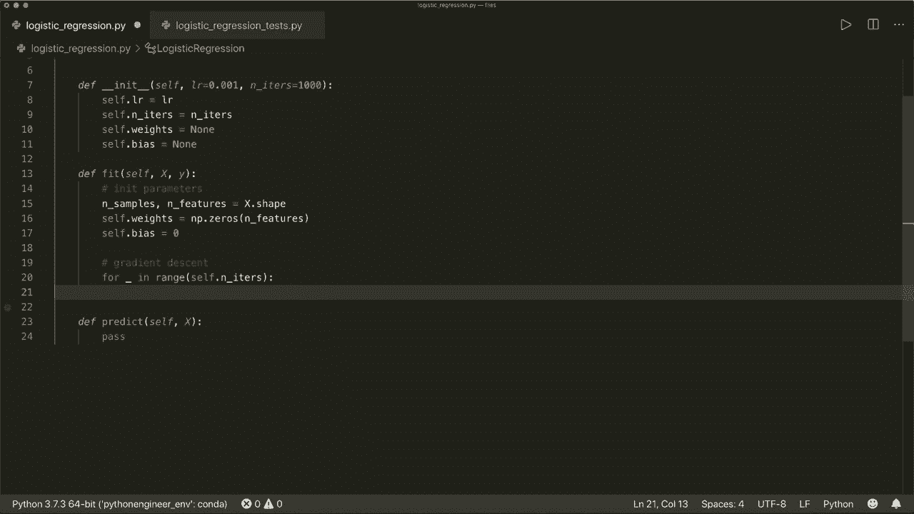

Sigmoid函数的公式如下：

**公式：σ(z) = 1 / (1 + e^{-z})**

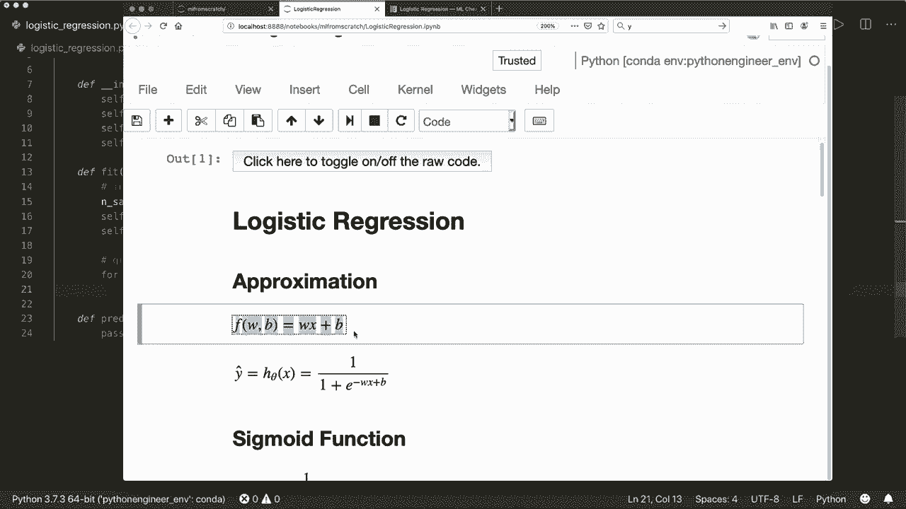

我们在类中实现一个私有方法来计算它。

```python
    def _sigmoid(self, x):
        return 1 / (1 + np.exp(-x))
```

这个方法接收一个输入 `x`（可以是标量或Numpy数组），并返回其Sigmoid变换后的值。

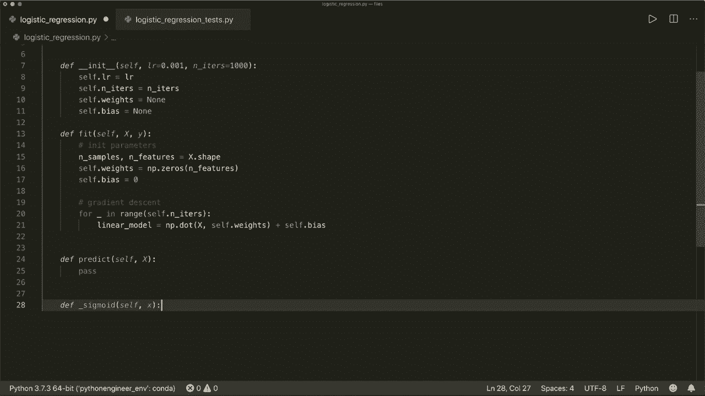

---

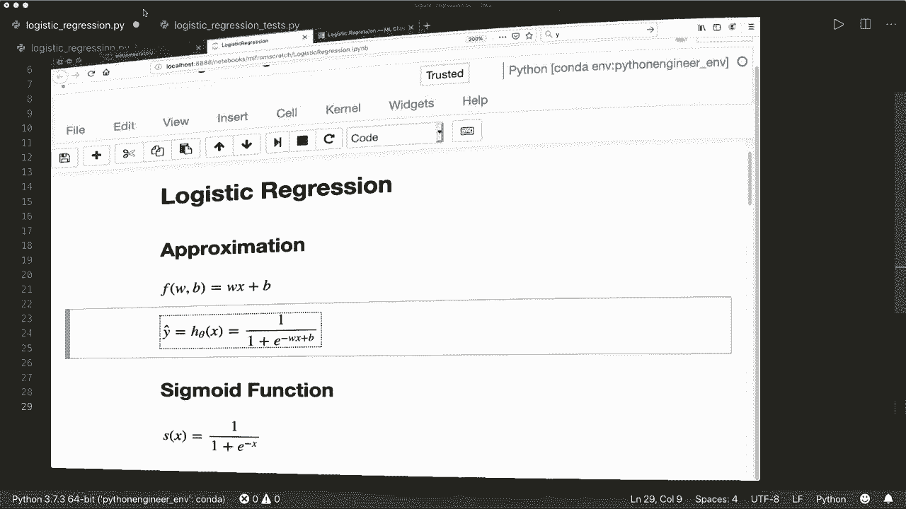

## 核心方法：拟合模型（训练）

上一节我们定义了模型的结构，本节中我们来看看如何训练模型，即 `fit` 方法。这个方法将使用梯度下降算法，根据训练数据来学习最优的权重和偏置。

以下是训练步骤的分解：

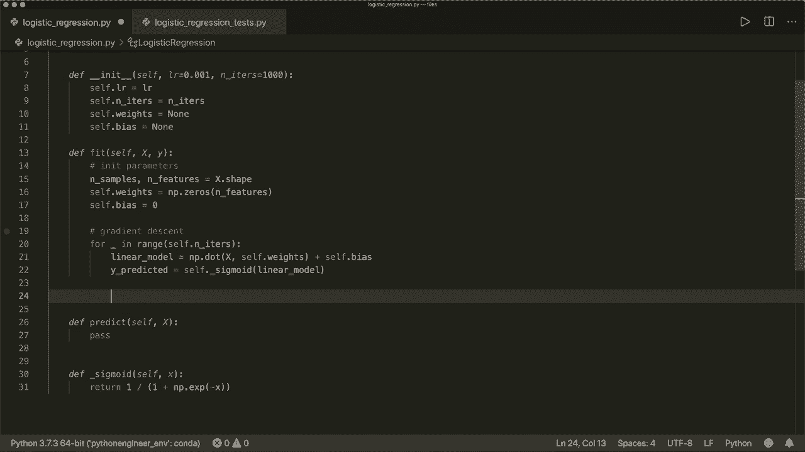

1.  **初始化参数**：将权重初始化为零向量，偏置初始化为0。
2.  **梯度下降迭代**：在指定的迭代次数内，重复以下步骤：
    *   计算当前参数下的模型预测值。
    *   计算预测值与真实值之间的误差（损失）。
    *   计算损失函数关于权重和偏置的梯度（导数）。
    *   根据梯度和学习率更新权重和偏置。


```python
    def fit(self, X, y):
        # 1. 初始化参数
        n_samples, n_features = X.shape
        self.weights = np.zeros(n_features)
        self.bias = 0

        # 2. 梯度下降
        for _ in range(self.n_iters):
            # 线性模型输出
            linear_model = np.dot(X, self.weights) + self.bias
            # 应用Sigmoid函数得到预测概率
            y_predicted = self._sigmoid(linear_model)

            # 计算梯度
            # 权重梯度公式: dw = (1/n) * X^T · (y_pred - y)
            dw = (1 / n_samples) * np.dot(X.T, (y_predicted - y))
            # 偏置梯度公式: db = (1/n) * sum(y_pred - y)
            db = (1 / n_samples) * np.sum(y_predicted - y)

            # 更新参数
            self.weights -= self.lr * dw
            self.bias -= self.lr * db
```

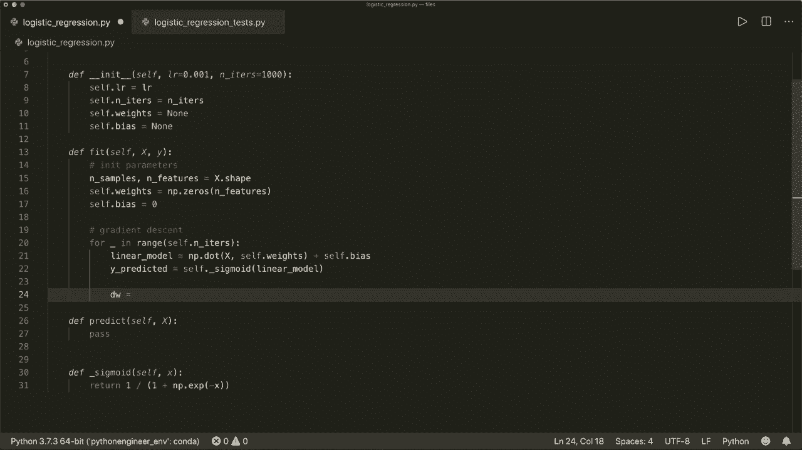

`fit` 方法接收训练特征 `X`（一个 `n_samples x n_features` 的矩阵）和训练标签 `y`（一个长度为 `n_samples` 的向量）。通过循环执行梯度下降，模型参数逐渐调整到最优值。

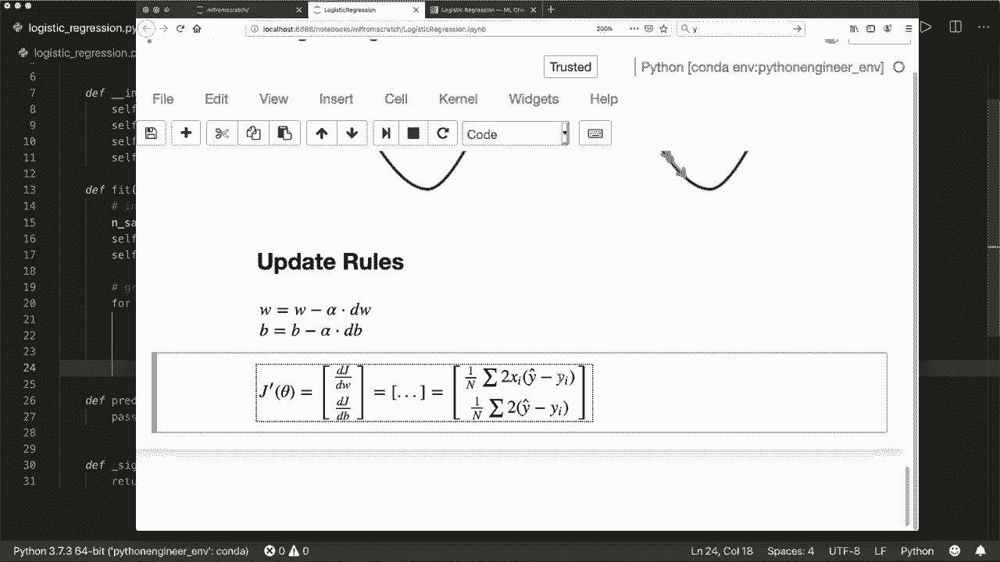

---

## 核心方法：进行预测

模型训练完成后，我们就可以用它来对新数据进行预测了。`predict` 方法接收新的特征矩阵 `X`，并返回每个样本的预测类别（0或1）。

预测过程分为两步：
1.  计算线性组合并应用Sigmoid函数，得到属于类别1的概率。
2.  根据一个阈值（通常为0.5）将概率转换为类别标签。

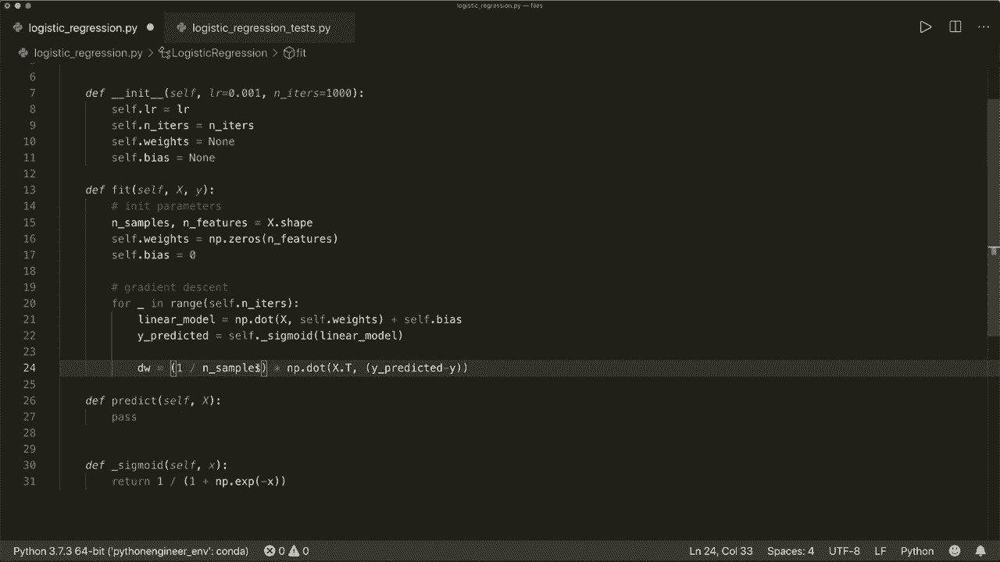

```python
    def predict(self, X):
        # 计算线性输出并应用Sigmoid
        linear_model = np.dot(X, self.weights) + self.bias
        y_predicted = self._sigmoid(linear_model)
        # 将概率转换为类别 (0 或 1)
        y_predicted_cls = [1 if i > 0.5 else 0 for i in y_predicted]
        return np.array(y_predicted_cls)
```

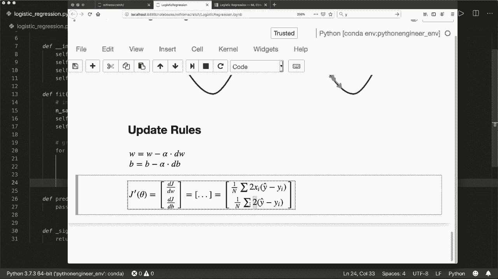

---

## 测试我们的实现

理论需要实践来检验。让我们使用一个真实的数据集来测试我们刚刚实现的逻辑回归类。我们将使用Scikit-learn库中的乳腺癌数据集，这是一个经典的二分类问题。

以下是测试脚本：

```python
# 导入测试所需库
from sklearn.model_selection import train_test_split
from sklearn import datasets

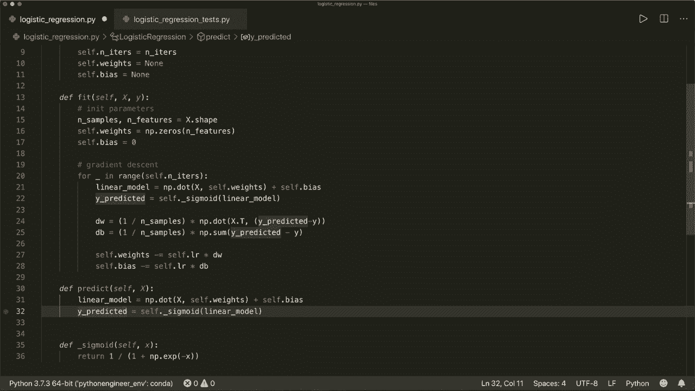

# 加载数据
bc = datasets.load_breast_cancer()
X, y = bc.data, bc.target

# 划分训练集和测试集
X_train, X_test, y_train, y_test = train_test_split(X, y, test_size=0.2, random_state=1234)

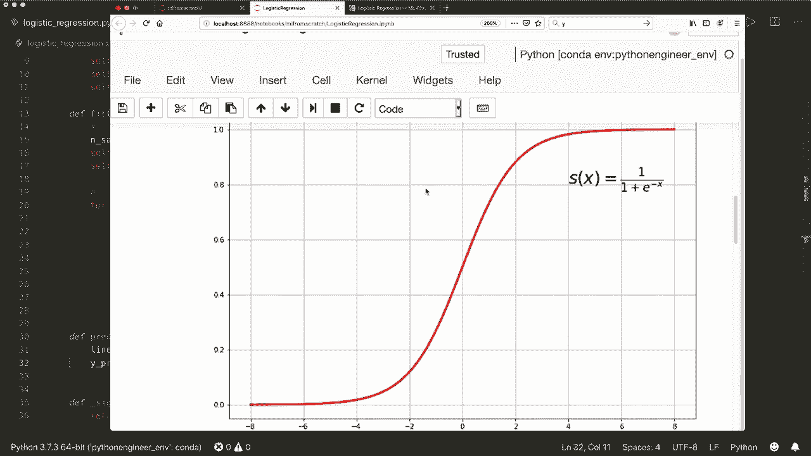

# 创建并训练模型
model = LogisticRegression(lr=0.0001, n_iters=1000)
model.fit(X_train, y_train)

# 进行预测
predictions = model.predict(X_test)

# 计算准确率
def accuracy(y_true, y_pred):
    return np.sum(y_true == y_pred) / len(y_true)

acc = accuracy(y_test, predictions)
print(f"逻辑回归模型准确率: {acc}")
```

运行上述代码，我们得到了大约92%-93%的准确率，这表明我们的逻辑回归实现是正确且有效的。

---

## 总结 🎯

本节课中我们一起学习了逻辑回归算法的原理与实现。我们从零开始，使用Python和Numpy构建了一个完整的 `LogisticRegression` 类。关键步骤包括：
*   使用Sigmoid函数将线性输出映射为概率。
*   通过梯度下降算法，最小化损失函数来训练模型参数（权重和偏置）。
*   实现预测功能，将概率输出转换为具体的类别标签。
*   在一个真实数据集上测试了模型的性能，并获得了良好的结果。

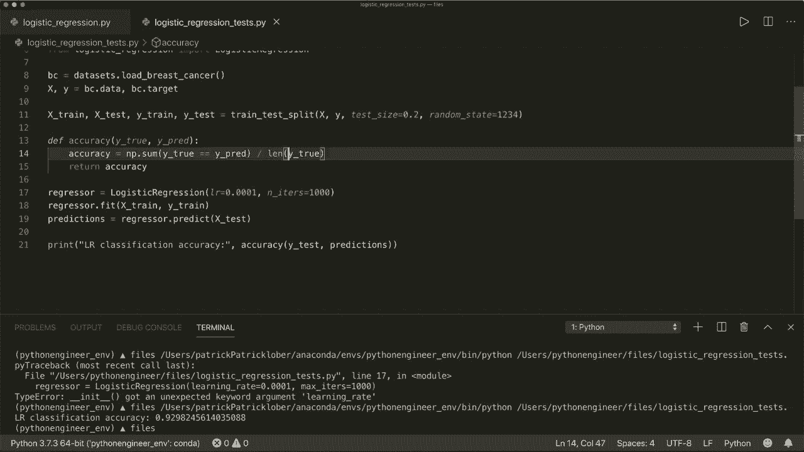

通过本教程，你不仅理解了逻辑回归背后的数学原理，也掌握了将其转化为可运行代码的实践能力。这是你机器学习之旅中坚实的一步。