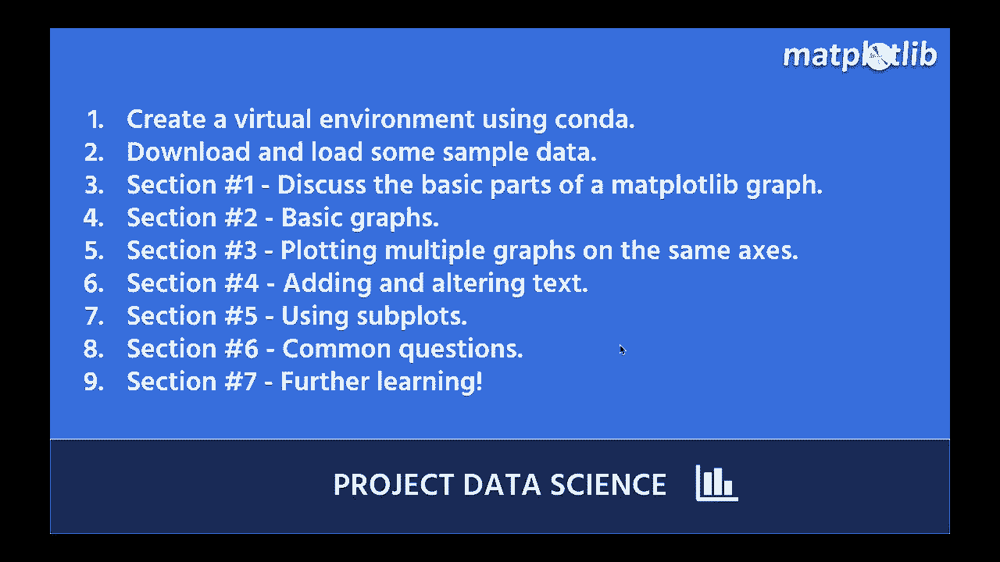

# 绘图必备**Matplotlib**，P1：介绍与基础 🎨

在本节课中，我们将要学习Python中最基础且强大的数据可视化库——**Matplotlib**。我们将从环境搭建开始，逐步了解其核心概念，并绘制一些基础图形，为后续深入学习打下坚实的基础。

## 概述 📋

Matplotlib是Python数据科学领域的核心绘图库。许多其他流行的可视化库（如Seaborn）都建立在它的基础之上。掌握Matplotlib意味着你拥有了创建几乎所有类型图表的底层能力。我们相信通过动手实践学习效果最佳，因此本教程将引导你一步步完成编码操作。

## 1. 环境搭建与数据准备 💻

首先，我们需要确保有一个可以运行Matplotlib的环境。如果你尚未安装Python或Matplotlib，我们将指导你完成安装。

**安装选项：**
*   **使用Conda创建虚拟环境**：这是管理项目依赖的推荐方式。
*   **使用Google Colab**：如果你不想在本地安装，这是一个极佳的在线入门选择。

环境准备就绪后，我们将在一个**Jupyter Notebook**中下载并加载一些示例数据，以便后续学习使用。

## 2. 理解Matplotlib图形的结构 🏗️

上一节我们准备好了环境，本节中我们来看看Matplotlib图表的基本组成部分。理解这些“零件”对于新手至关重要，能帮助你更好地控制图表的每个细节。

一个Matplotlib图形主要包含以下部分：
*   **Figure（图形）**：可以理解为整个画布。
*   **Axes（坐标轴）**：画布上的一个绘图区域，一个Figure可以包含多个Axes。
*   **Axis（轴）**：指具体的x轴、y轴对象，控制刻度和标签。
*   **Artist（艺术家）**：所有在图形上可见的元素（如线条、文本、矩形）的基类。

## 3. 绘制基础图形 📈

理解了结构之后，我们就可以开始绘制一些最常用的基础图形了。以下是几种基本图形的绘制方法：

**折线图**
```python
import matplotlib.pyplot as plt
plt.plot([1, 2, 3, 4], [1, 4, 2, 3])
plt.show()
```

**散点图**
```python
plt.scatter([1, 2, 3, 4], [1, 4, 2, 3])
plt.show()
```

**条形图**
```python
plt.bar(['A', 'B', 'C', 'D'], [10, 15, 7, 12])
plt.show()
```

## 4. 在同一坐标轴上绘制多个图形 🔄

有时我们需要在同一个图表中组合展示多种数据关系。Matplotlib可以轻松实现这一点，例如，将散点图和折线图叠加。

其核心方法是，在同一个`Axes`对象上连续调用不同的绘图函数（如`.plot()`, `.scatter()`）。

## 5. 添加与修改文本标签 🏷️

一个专业的图表离不开清晰的文本说明。本节我们将学习如何添加和修改标题、坐标轴标签等文本元素。

主要函数包括：
*   `plt.title()`：设置图表标题。
*   `plt.xlabel()` / `plt.ylabel()`：设置x轴和y轴标签。
*   `plt.text()`：在图表任意位置添加文本。

## 6. 创建子图（Subplots） 🧩

当我们需要并排比较多个图表时，就需要用到子图功能。子图允许你在一个Figure画布的不同区域绘制多个独立的坐标轴（Axes）。

创建子图最常用的函数是`plt.subplots()`，它可以返回一个包含Figure对象和Axes对象数组的元组。

## 7. 初学者常见问题与进阶资源 🚀

在掌握了以上基础知识后，初学者在实践中常会遇到一些困惑，例如图形显示问题、样式调整等。我们将在本节讨论这些常见用例的解决方案。

最后，为了帮助你持续进步，我们将提供一些未来的学习路径、官方文档、社区资源以及项目实践的想法，让你能将所学知识付诸应用。



## 总结 ✨

本节课中，我们一起学习了Matplotlib的入门知识。我们从搭建编程环境开始，理解了Matplotlib图形的核心结构，并动手绘制了折线图、散点图等基础图形。我们还探索了如何在同一图表中组合图形、添加文本标签以及创建子图布局。这些内容是使用Matplotlib进行数据可视化的基石，希望你通过跟随练习，已经掌握了这些基本技能。在接下来的课程中，我们将基于这些知识，探索更高级的定制和图表类型。