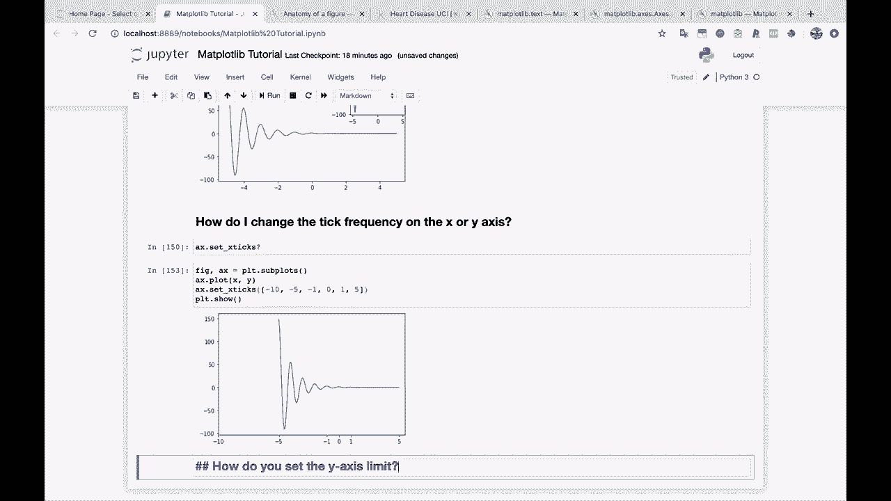
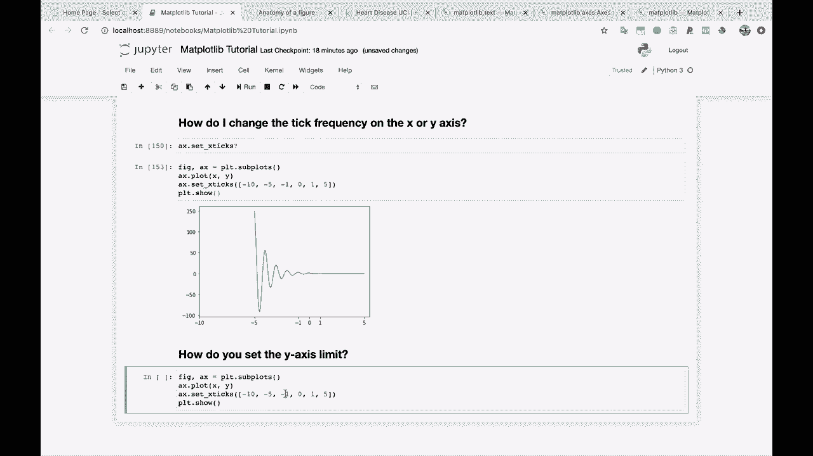
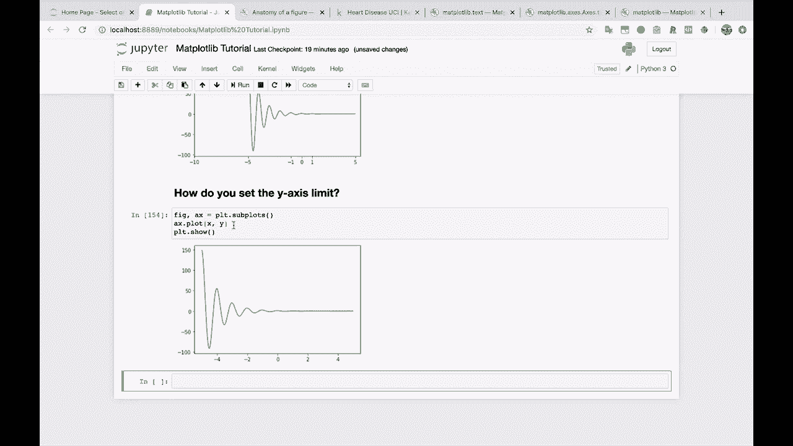
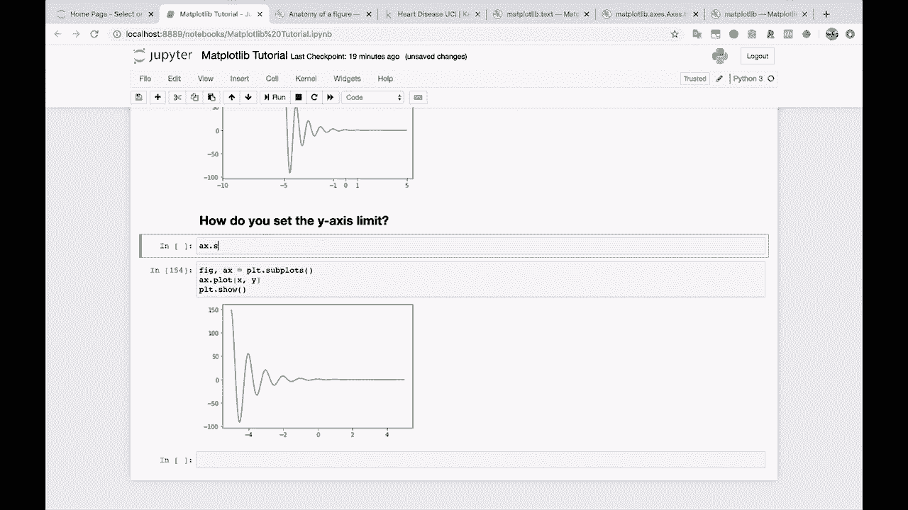
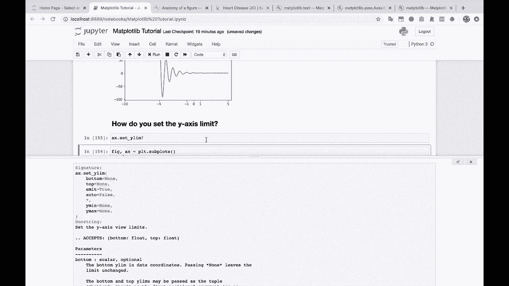
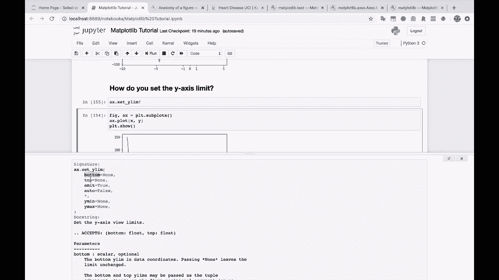
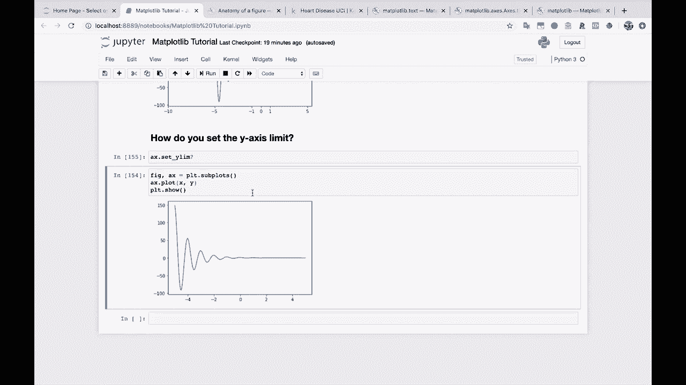
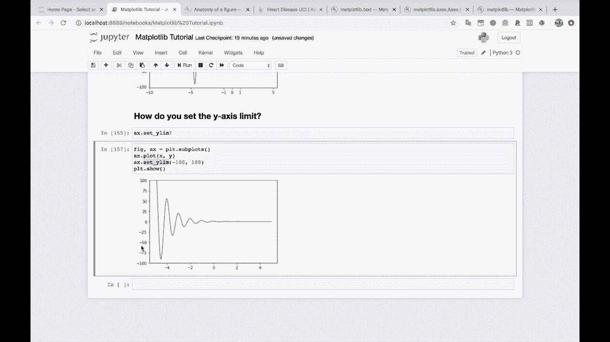

# 绘图必备 Matplotlib，P16：16）设置 y 轴上下界 📊

在本节课中，我们将学习如何使用 Matplotlib 设置 y 轴的显示范围。这对于突出图表中的特定数据区域或统一多个图表的坐标轴尺度非常有用。



## 概述

默认情况下，Matplotlib 会自动根据数据范围确定 y 轴的上下界。然而，自动设置有时无法满足我们的需求。例如，我们可能希望聚焦于某个特定的数值区间，或者让多个子图拥有统一的 y 轴范围以便比较。



上一节我们介绍了图表的基本定制，本节中我们来看看如何精确控制 y 轴的显示范围。

## 自动设置的问题

当你绘制一个普通图表时，Matplotlib 会尝试自动确定一个合适的 y 轴范围。



```python
import matplotlib.pyplot as plt
import numpy as np

x = np.linspace(0, 10, 100)
y = x ** 2

fig, ax = plt.subplots()
ax.plot(x, y)
plt.show()
```



这种自动设置有时有效，有时则无法达到理想的视觉效果。例如，当数据波动较小时，自动生成的 y 轴可能无法清晰地展示数据的变化趋势。



## 手动设置 y 轴范围

我们可以手动设置 y 轴的上下界。这是通过 `Axes` 对象的 `set_ylim` 方法来实现的。

以下是 `set_ylim` 方法的基本用法：



```python
ax.set_ylim(bottom, top)
```

*   **`bottom`**：y 轴的下界（最小值）。
*   **`top`**：y 轴的上界（最大值）。



### 应用示例

假设我们有一个数据范围在 0 到 100 左右的图表，但我们希望将 y 轴范围设置为 0 到 150，以留出一些视觉空间。

```python
fig, ax = plt.subplots()
ax.plot(x, y)
ax.set_ylim(0, 150)  # 设置 y 轴范围为 0 到 150
plt.show()
```

或者，我们也可以设置一个包含负值的范围，例如从 -100 到 100，来观察数据在这个区间内的表现。

```python
ax.set_ylim(-100, 100)  # 设置 y 轴范围为 -100 到 100
```

通过调整 `bottom` 和 `top` 参数，你可以自由地收缩或扩展 y 轴的显示范围，从而更好地呈现数据。



## 总结

本节课中我们一起学习了如何手动设置 Matplotlib 图表的 y 轴范围。我们了解到，虽然 Matplotlib 的自动设置功能很方便，但使用 `ax.set_ylim(bottom, top)` 方法可以让我们获得对图表视图更精确的控制。这是进行数据可视化和图表美化时一个非常实用的技巧。