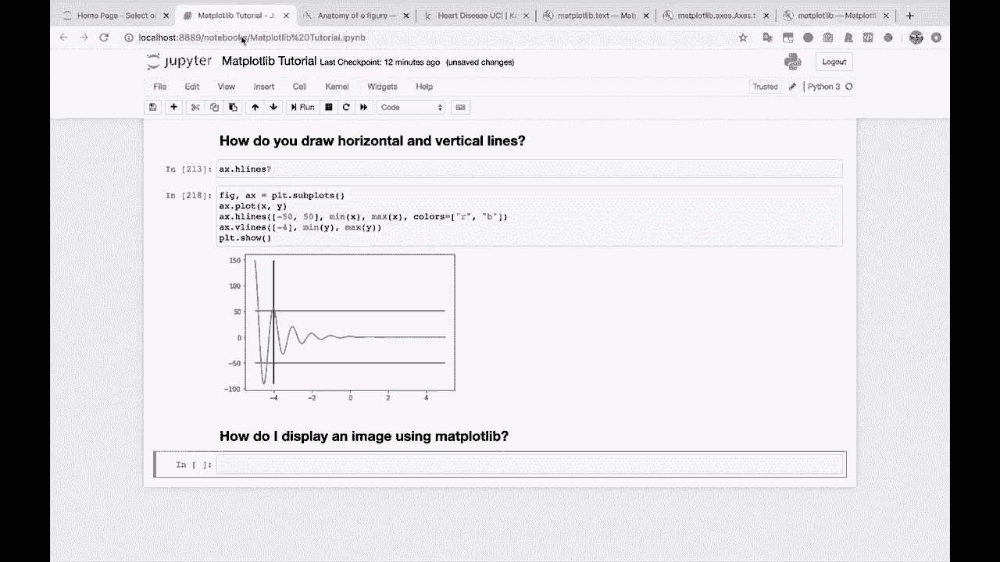
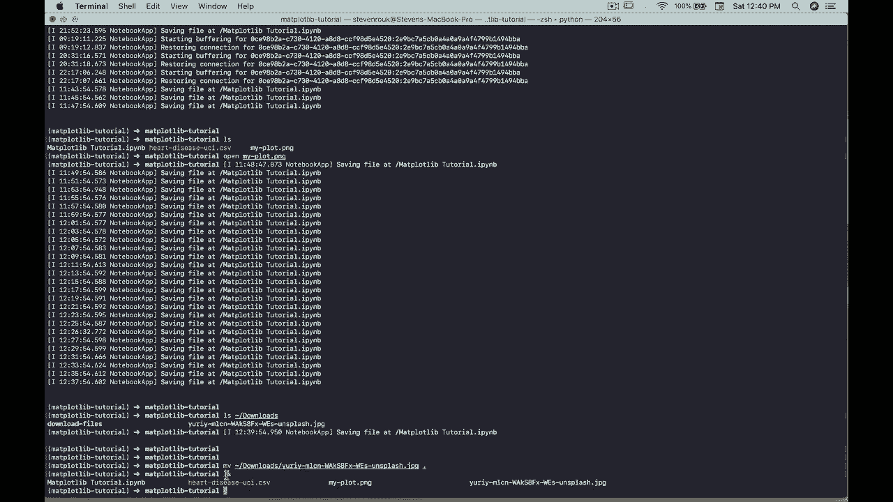
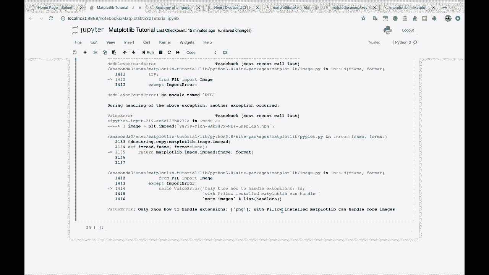
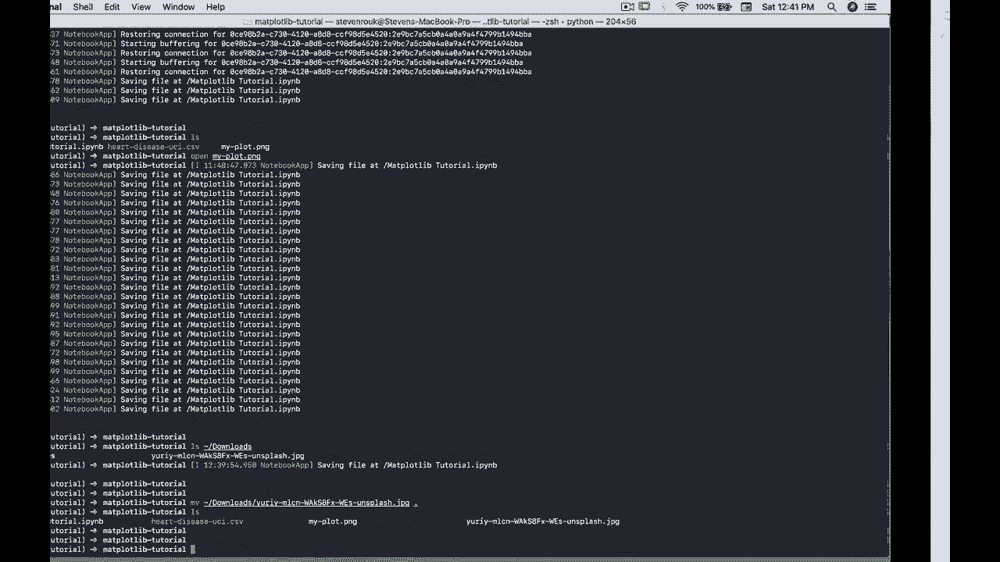

# 绘图必备 Matplotlib，P25：25）在 Matplotlib 中显示图像 🖼️

在本节课中，我们将学习如何在 Matplotlib 中加载和显示图像。这是数据科学和机器学习中一个非常实用的技能，尤其是在处理图像数据集时。

## 概述

我们将从获取一张示例图像开始，学习如何将其加载到 Python 环境中，并最终使用 Matplotlib 将其可视化。我们还会探索如何查看和操作图像的不同颜色通道。

## 获取与准备图像



首先，我们需要一张图像。你可以从任何来源获取，例如 Unsplash 这样的免费图片网站。下载后，需要将图像文件移动到你的工作目录中。

在终端中，可以使用 `mv` 命令移动文件。例如：
```bash
mv ~/Downloads/your_image.jpg .
```
这条命令将下载文件夹中的 `your_image.jpg` 移动到当前目录。

## 安装必要的库



Matplotlib 默认支持 PNG 格式，但要读取 JPG 等常见格式，需要安装 `Pillow` 库。

在 Jupyter Notebook 中，可以直接运行以下代码来安装：
```python
!pip install pillow
```

## 读取图像

安装好 `Pillow` 后，就可以使用 `matplotlib.pyplot.imread` 函数来读取图像了。

```python
import matplotlib.pyplot as plt



# 读取图像文件
image = plt.imread('your_image.jpg')
```
读取后的 `image` 变量是一个 NumPy 多维数组，它代表了图像的像素数据。



## 理解图像数据

让我们查看一下这个数组的形状和结构。

```python
print(type(image))  # 输出：<class 'numpy.ndarray'>
print(image.shape)  # 输出类似：(高度, 宽度, 通道数)
```
对于一个彩色图像，形状通常是 `(高度, 宽度, 3)`，其中 `3` 代表红（R）、绿（G）、蓝（B）三个颜色通道。

## 显示完整图像

要显示图像，我们使用 `plt.imshow()` 函数。

以下是显示图像的基本代码模板：
```python
fig, ax = plt.subplots(figsize=(10, 6))  # 创建图形和坐标轴，并设置图形大小
ax.imshow(image)                         # 在坐标轴上显示图像
ax.axis('off')                           # 关闭坐标轴显示
plt.show()                               # 展示图形
```
为了使图像显示得更清晰，我们可以根据图像的原始尺寸来动态设置图形大小。

```python
# 根据图像尺寸设置图形大小（例如，将像素尺寸除以一个系数进行缩放）
fig, ax = plt.subplots(figsize=(image.shape[1]/100, image.shape[0]/100))
ax.imshow(image)
ax.axis('off')
plt.show()
```

## 探索颜色通道

上一节我们介绍了如何显示完整的彩色图像。本节中，我们来看看如何单独查看图像的某个颜色通道（例如，只显示红色部分）。

图像数据是一个三维数组 `image[高度, 宽度, 通道]`。通道索引 `0`、`1`、`2` 通常分别对应 R、G、B 通道。

以下是提取和显示单个通道的方法：
```python
# 提取红色通道（索引为0）
red_channel = image[:, :, 0]

fig, ax = plt.subplots()
ax.imshow(red_channel)
ax.axis('off')
plt.show()
```
单独显示一个通道时，Matplotlib 默认会使用一个颜色映射（colormap）来渲染单值图像，这可能会产生彩色效果。

如果想将其显示为真正的灰度图，可以指定 `cmap='gray'` 参数。
```python
fig, ax = plt.subplots()
ax.imshow(red_channel, cmap='gray')  # 使用灰度颜色映射
ax.axis('off')
plt.show()
```
你可以尝试显示不同的通道，观察图像细节的变化。例如，绿色通道（索引1）和蓝色通道（索引2）可能突出显示原始图像中不同的信息。

```python
# 显示绿色通道
green_channel = image[:, :, 1]
# 显示蓝色通道
blue_channel = image[:, :, 2]
```
通过比较不同通道，可以进行基础的图像分析，理解颜色在图像构成中的作用。

## 应用与扩展

由于图像在 Matplotlib 中本质上就是 NumPy 数组，因此你可以利用 NumPy 的所有功能对其进行处理、分析和修改。例如：
*   调整亮度、对比度。
*   裁剪或旋转图像。
*   作为数据输入到卷积神经网络（CNN）中进行机器学习或深度学习。
*   使用 Matplotlib 绘制图像处理前后的对比结果。

## 总结

本节课中我们一起学习了在 Matplotlib 中处理图像的核心流程：
1.  **获取与准备**：将图像文件放入工作目录。
2.  **环境配置**：通过安装 `Pillow` 库来支持 JPG 等格式。
3.  **读取数据**：使用 `plt.imread()` 将图像加载为 NumPy 数组。
4.  **理解结构**：认识到彩色图像是一个形状为 `(高度, 宽度, 3)` 的三维数组。
5.  **显示图像**：使用 `ax.imshow()` 函数进行可视化，并可关闭坐标轴。
6.  **通道分析**：通过索引提取 R、G、B 单个通道，并用 `cmap='gray'` 参数将其显示为灰度图。


掌握这些技能，你就为在 Python 中进行图像数据处理和可视化打下了坚实的基础。