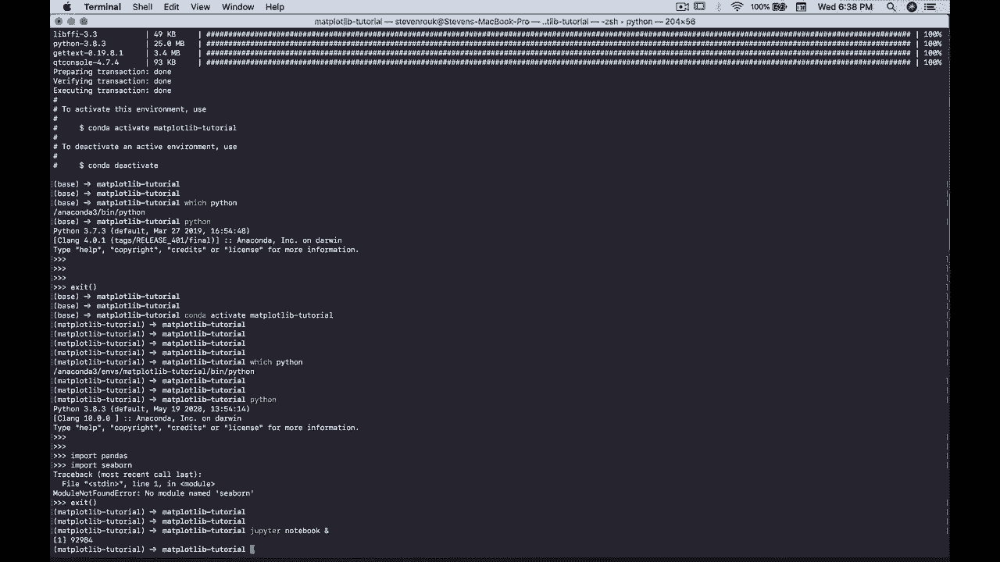
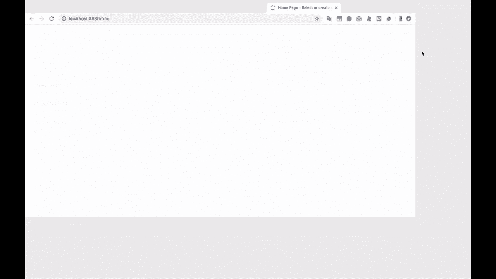
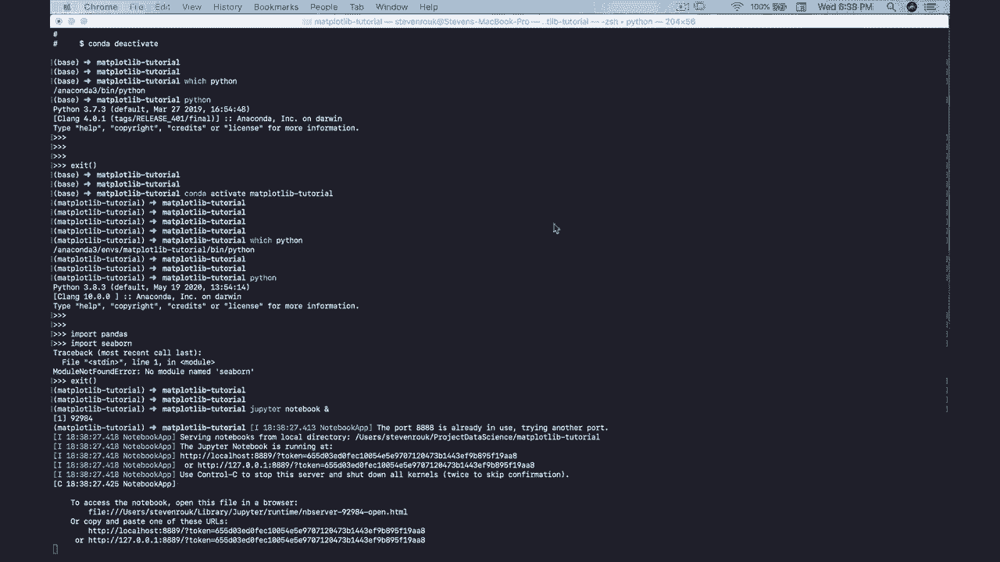
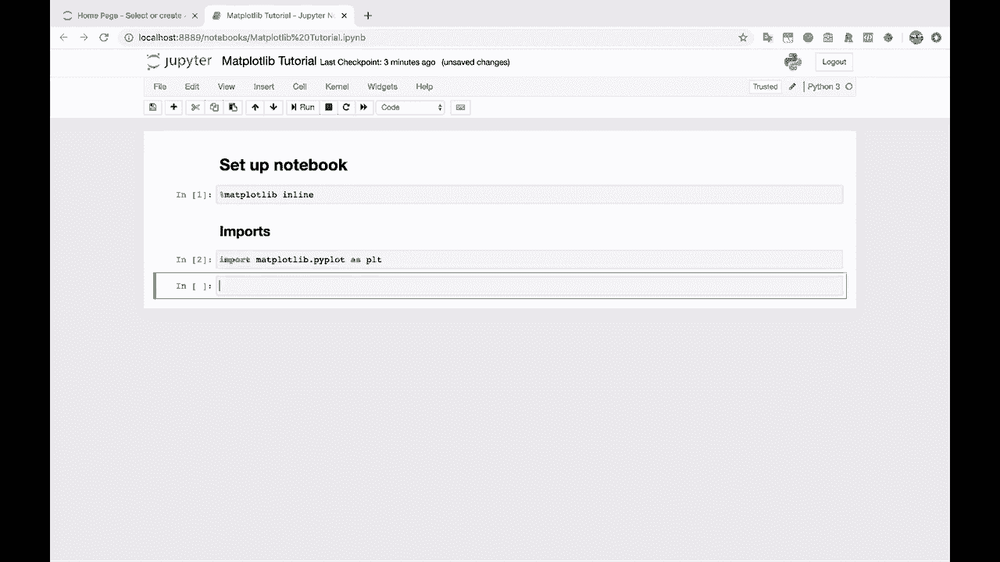

# Matplotlib 绘图教程 P4：启动 Jupyter Notebook 并设置环境 🚀

在本节课中，我们将学习如何启动 Jupyter Notebook 并完成使用 Matplotlib 进行绘图前的必要环境设置。我们将创建一个新的 Notebook，配置 Matplotlib 的显示方式，并导入核心库。

---

## 启动 Jupyter Notebook



现在，我位于我的 Matplotlib 教程文件夹中。我将运行 Jupyter Notebook，以便继续进行后续的 Matplotlib 教程。


在 Jupyter Notebook 启动后，让我们关闭其他无关的 Chrome 浏览器窗口。







现在，我们看到了 Jupyter Notebook 的主界面。接下来，我将创建一个新的 Python 3 笔记本。

---

## 创建并命名 Notebook

我将这个新笔记本命名为 “Matplotlib 教程”。创建完成后，我们就可以开始工作了。

我们要做的第一件事是创建一个 Markdown 单元格。这可以通过在单元格中输入字母 `M` 并切换到 Markdown 模式来完成。

在这个 Markdown 单元格中，我将创建一个一级标题，内容为 “设置笔记本”。😊

---

## 配置 Matplotlib 的显示方式

在 Notebook 中使用 Matplotlib 进行数据可视化时，我喜欢做的第一件事是输入以下魔法命令：

```python
%matplotlib inline
```

我们不需要在这里花费太多时间解释其原理。本质上，这个命令决定了 Matplotlib 图形在 Notebook 中的显示方式。

在 Jupyter Notebooks 中，`%matplotlib inline` 是最受欢迎和最常用的选项之一。我会把它设置为笔记本的第一个代码单元格，然后基本上就可以忘记它了。

---

## 导入 Matplotlib 核心模块

上一节我们介绍了如何设置图形显示方式，本节中我们来看看如何导入 Matplotlib 的核心绘图模块。

让我们开始深入探讨一些实际的数据可视化内容。关于 Matplotlib，你很快会发现它功能非常强大，选项繁多，这可能会让初学者感到不知所措和困惑。

我将尝试从最简单的内容开始讲解，然后逐步增加复杂性。但我希望你在开始时，只关注最核心的部分。

以下是导入 Matplotlib 并开始绘图的标准步骤：

1.  **导入 Matplotlib 库**：我们将使用的主要绘图子模块是 `pyplot`。
2.  **使用别名**：我们通常将 `matplotlib.pyplot` 导入为 `plt`，这是一种广泛采用的惯例。

让我们继续操作。首先，导入 Matplotlib：

```python
import matplotlib.pyplot as plt
```

Matplotlib 还包含各种其他子模块，你可以通过按下 `Tab` 键来查看自动补全提示，会发现有很多不同的选项。

但无论如何，我们主要使用 `pyplot`，并将其导入为 `plt`。这几乎将是你每次使用 Matplotlib 时的标准导入方式。



---


## 总结

本节课中，我们一起学习了启动和设置 Jupyter Notebook 环境以使用 Matplotlib 的完整流程。我们完成了从启动 Notebook、创建文件、使用 `%matplotlib inline` 魔法命令设置图形内嵌显示，到最终导入核心 `pyplot` 模块（别名为 `plt`）的所有步骤。现在，你的绘图环境已经准备就绪，我们可以开始创建第一个图形了。