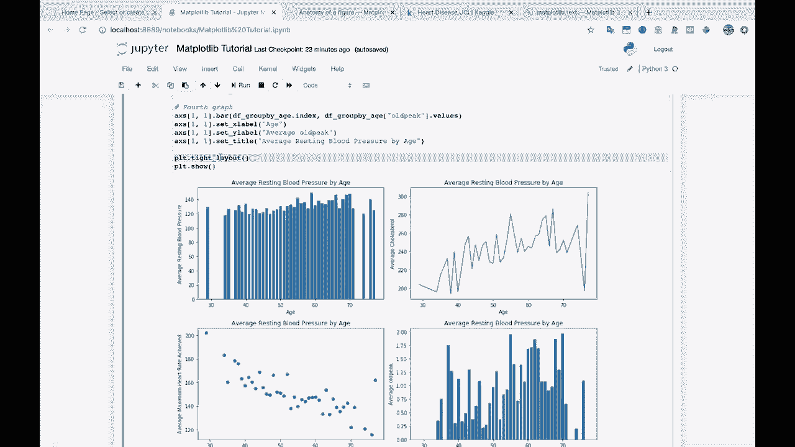
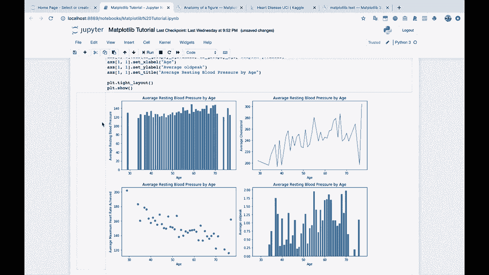
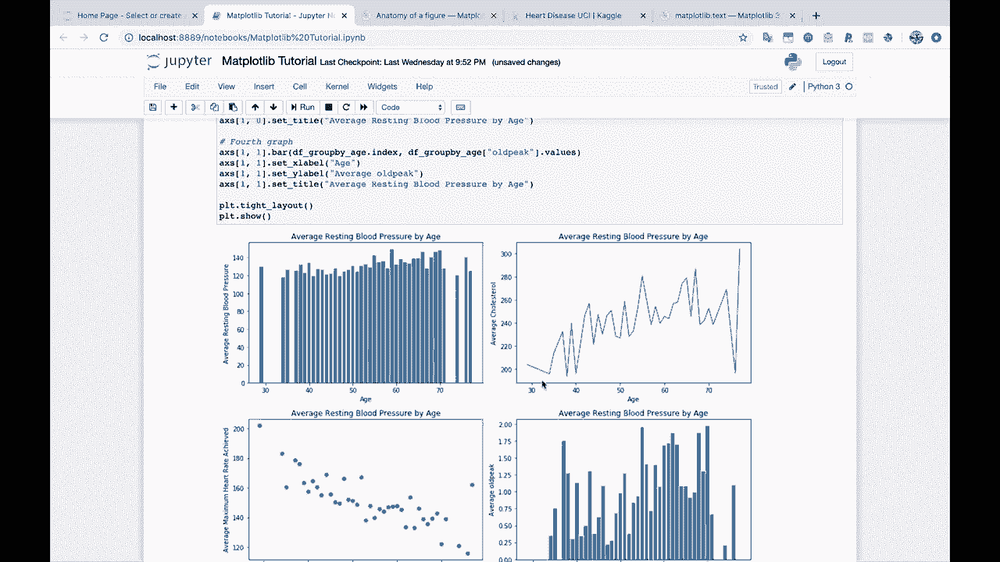
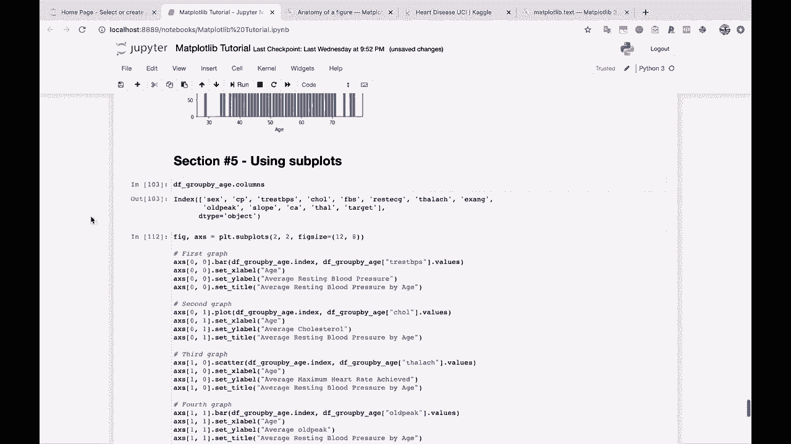
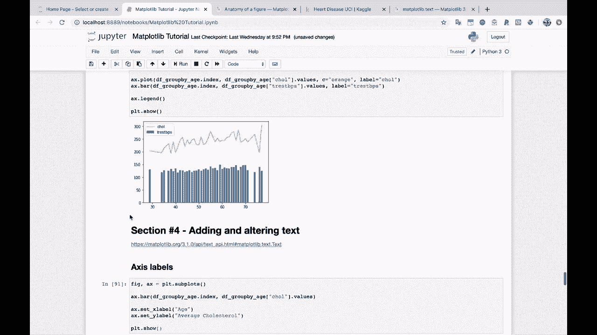
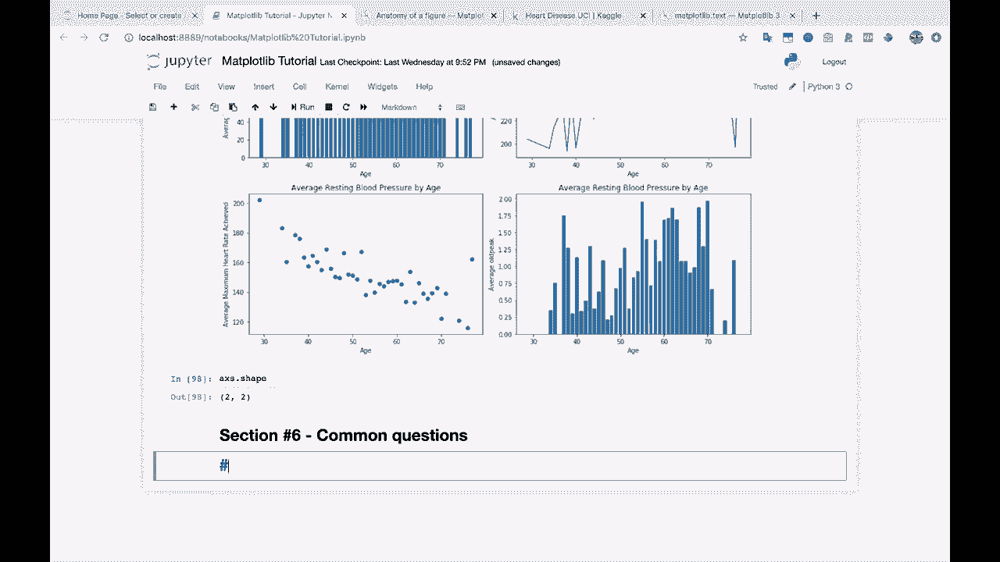

# 绘图必备Matplotlib，P10：10）Matplotlib中的常见问题 🧩



在本节课中，我们将探讨在使用Matplotlib进行数据可视化时，用户经常遇到的一些典型问题及其解决方案。你已经掌握了Matplotlib的基础知识，能够创建折线图、柱状图、散点图，并设置标题、坐标轴标签以及绘制多个子图。然而，在实际应用中，我们常常需要实现更具体的可视化效果或进行特定的图表修改。本节将为你介绍这些常见需求的实现方法。

## 常见问题与解决方案

上一节我们介绍了Matplotlib的基础绘图功能，本节中我们来看看在实际操作中，用户通常会遇到哪些具体问题以及如何解决它们。

以下是几个典型的场景及其对应的解决方案：




1.  **如何调整图形尺寸？**
    在创建图形时，可以使用`figsize`参数来指定宽度和高度（单位为英寸）。
    ```python
    import matplotlib.pyplot as plt
    plt.figure(figsize=(10, 6))
    ```



2.  **如何保存高清图片？**
    使用`savefig`函数时，通过`dpi`参数设置分辨率，并使用`bbox_inches='tight'`来避免保存时裁剪掉标签。
    ```python
    plt.savefig('my_plot.png', dpi=300, bbox_inches='tight')
    ```



3.  **如何添加图例？**
    在绘图函数中为数据系列指定`label`，然后调用`plt.legend()`来显示图例。
    ```python
    plt.plot(x, y, label='My Data')
    plt.legend()
    ```



4.  **如何设置坐标轴范围？**
    使用`plt.xlim()`和`plt.ylim()`函数可以分别设置X轴和Y轴的显示范围。
    ```python
    plt.xlim([0, 10])
    plt.ylim([-5, 5])
    ```

5.  **如何绘制子图？**
    使用`plt.subplots()`函数可以方便地创建包含多个子图的图形网格。
    ```python
    fig, axes = plt.subplots(2, 2) # 创建一个2行2列的子图网格
    axes[0, 0].plot(x, y) # 在第一个子图上绘图
    ```

## 总结



本节课中我们一起学习了Matplotlib使用过程中的几个常见问题及其解决方法，包括调整图形尺寸、保存高清图片、添加图例、设置坐标轴范围以及创建子图。掌握这些技巧将帮助你更灵活、高效地定制图表，以满足不同的数据展示需求。