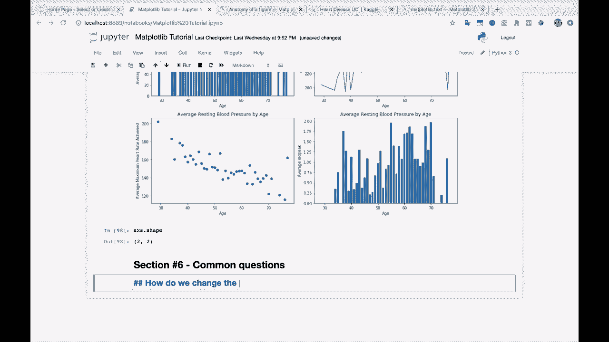
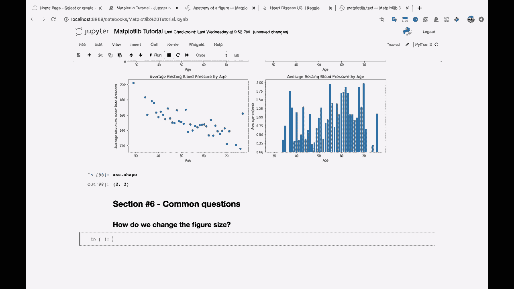
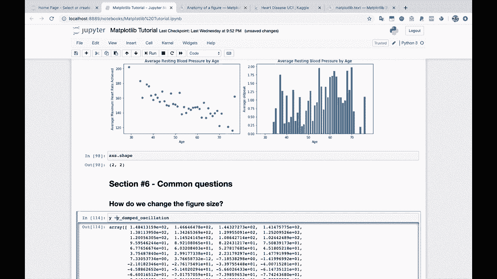
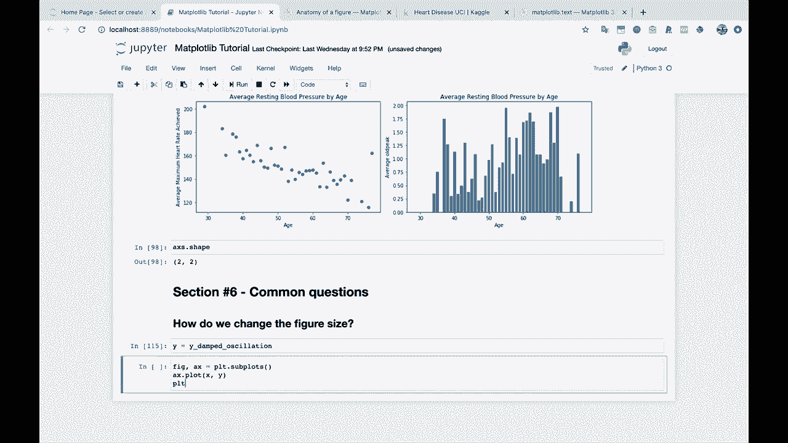
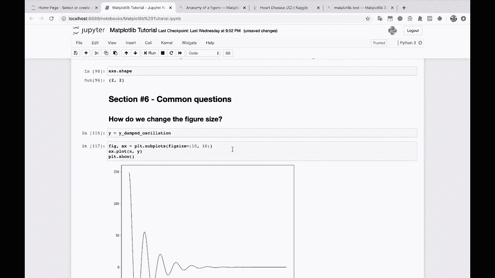
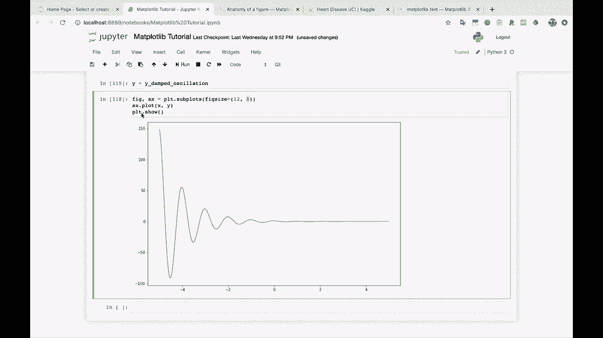
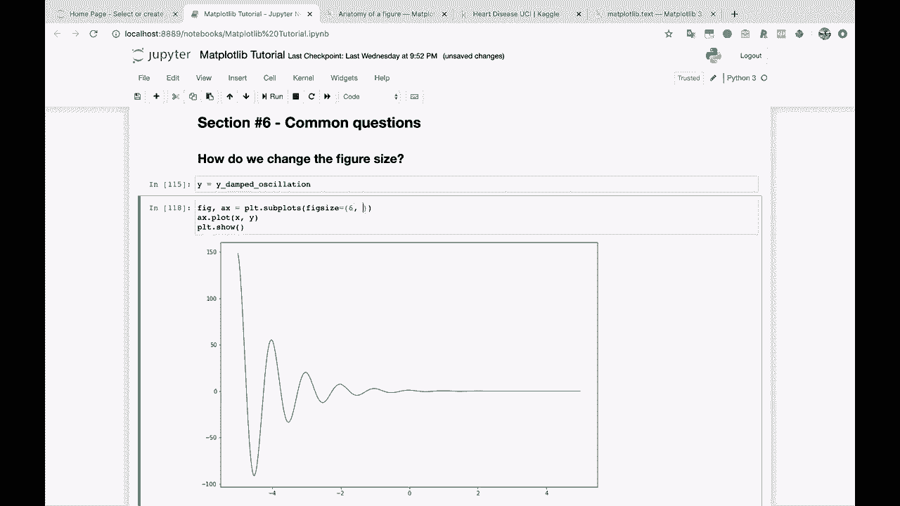
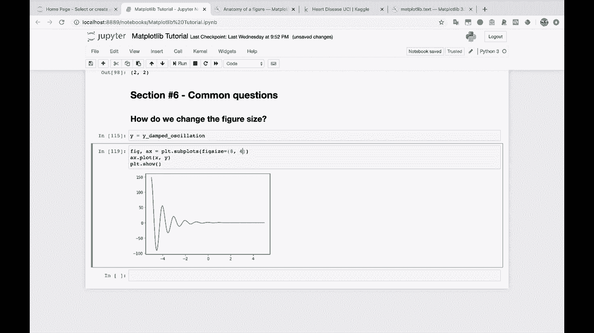

# 绘图必备Matplotlib，P11：11）改变图形大小 📏



在本节课中，我们将要学习如何调整Matplotlib绘图时图形的大小。这是控制图表最终呈现效果的重要一步。

## 概述



我们经常需要根据不同的展示需求（如报告、论文或演示文稿）来调整图形的大小。Matplotlib提供了简单的方法来实现这一点。

上一节我们介绍了基本的绘图模板，本节中我们来看看如何通过修改代码来改变图形的大小。

## 改变图形大小的方法



我们从一个标准的绘图模板开始。以下代码创建了一个简单的阻尼振荡曲线图。

```python
import matplotlib.pyplot as plt
import numpy as np

# 生成示例数据
x = np.linspace(0, 10, 100)
y = np.exp(-0.5 * x) * np.sin(2 * np.pi * x)  # 阻尼振荡

fig, ax = plt.subplots()
ax.plot(x, y)
plt.show()
```

运行这段代码会显示一个默认大小的图形。那么，如何改变这个图形的大小呢？



## 使用 `figsize` 参数

改变图形大小的核心方法是使用 `plt.subplots()` 函数中的 `figsize` 参数。这个参数允许我们指定图形的宽度和高度。

以下是具体步骤：

1.  在创建图形（Figure）和坐标轴（Axes）时，传入 `figsize` 参数。
2.  `figsize` 接受一个元组，格式为 `(宽度, 高度)`。
3.  宽度和高度的单位是英寸。



让我们修改代码，传入 `figsize=(10, 10)`。

```python
fig, ax = plt.subplots(figsize=(10, 10))
ax.plot(x, y)
plt.show()
```

运行后，你会得到一个更大的方形图。

## 理解宽度和高度

`figsize` 参数中的第一个数字控制图形的宽度，第二个数字控制图形的高度。



例如，如果我们传入 `figsize=(12, 8)`，将得到一个宽度为12英寸、高度为8英寸的图形。



```python
fig, ax = plt.subplots(figsize=(12, 8))
ax.plot(x, y)
plt.show()
```

你可以尝试不同的组合来找到最适合的尺寸。例如，`figsize=(6, 4)` 会生成一个接近原始默认大小的图形，而 `figsize=(8, 6)` 则是一个稍大、比例常见的图形。



以下是调整图形大小的关键点总结：
*   使用 `plt.subplots(figsize=(width, height))` 来设置图形尺寸。
*   参数 `width` 和 `height` 的单位是英寸。
*   第一个值 `width` 控制宽度，第二个值 `height` 控制高度。
*   通过调整这两个值，你可以轻松控制图表以适应各种展示场景。

本节课中我们一起学习了如何利用 `figsize` 参数来改变Matplotlib图形的大小。这是定制化图表外观的基础技能，请多加练习以熟悉不同尺寸的效果。