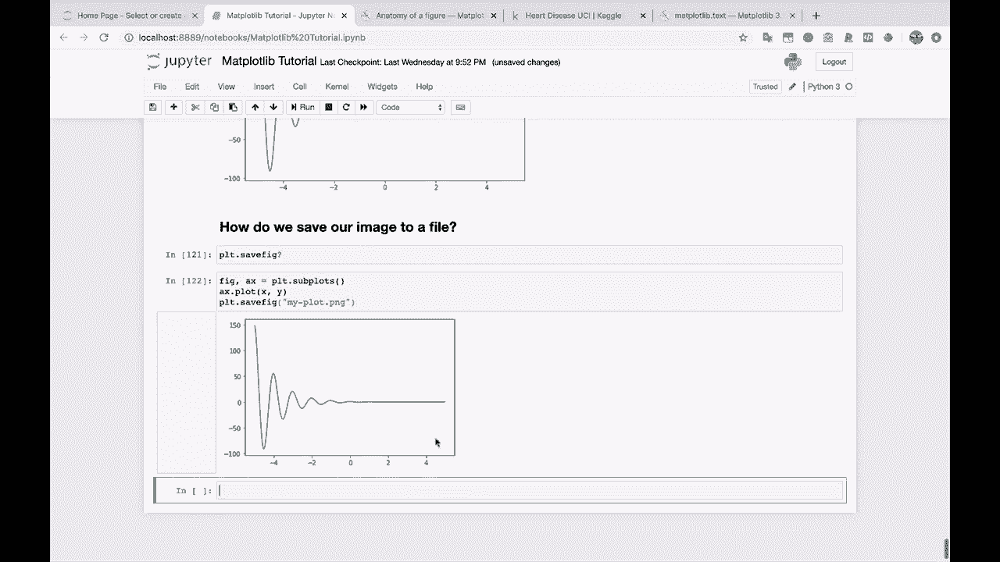
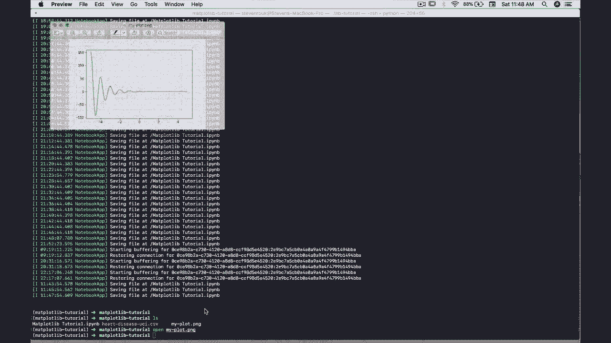
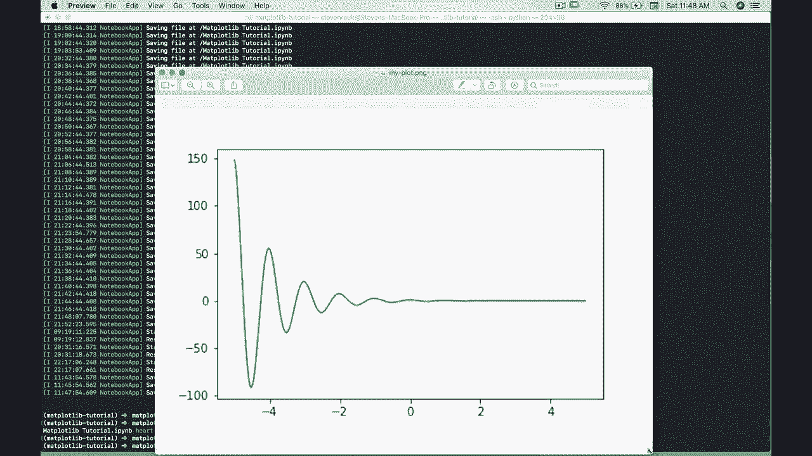
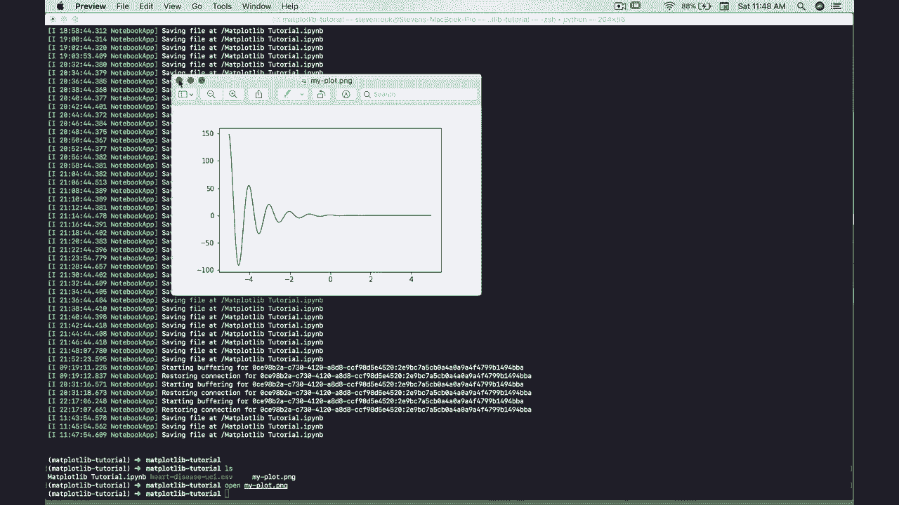
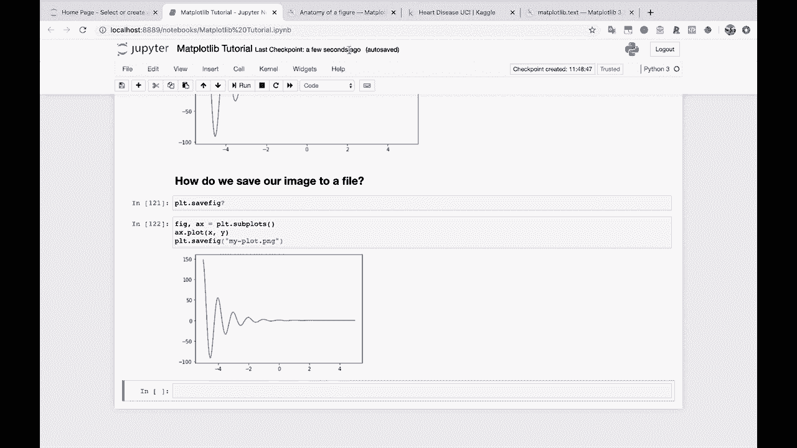

# 绘图必备Matplotlib，P12：12）将图像保存到文件 💾

在本节课中，我们将要学习如何使用Matplotlib将绘制好的图表保存为图像文件。这是数据可视化工作流程中非常关键的一步，能让你将分析结果持久化、分享或用于报告。

---

上一节我们介绍了如何创建和自定义图表，本节中我们来看看如何将这些图表保存到本地文件中。

## 保存图像的基本方法

将图表保存到文件最直接的方法是使用Matplotlib的`savefig`函数。它允许你将当前图形窗口中的内容保存为指定格式的图像文件。

以下是`savefig`函数的基本用法：

```python
plt.savefig('my_plot.png')
```

运行这行代码后，Matplotlib会在当前工作目录下生成一个名为`my_plot.png`的图像文件。Matplotlib会根据你提供的文件扩展名（如`.png`、`.jpg`、`.pdf`）自动推断并选择相应的文件格式进行保存。

## 关键参数详解

`savefig`函数提供了多个参数来控制输出图像的质量和属性。以下是几个最常用的参数：

*   **`fname`**：这是必需的参数，代表文件名（或文件路径）。例如：`‘output.jpg’` 或 `‘./figures/my_chart.pdf’`。
*   **`dpi`**：代表“每英寸点数”，用于控制图像的分辨率。数值越高，图像越清晰，但文件体积也越大。默认值通常为100。例如：`dpi=300`。
*   **`bbox_inches`**：控制保存图像的边界框。设置为`‘tight’`可以自动裁剪掉图表周围多余的空白区域。
*   **`facecolor` 与 `edgecolor`**：分别用于设置图形的背景色和边框颜色。

## 操作流程示例

让我们通过一个简单的例子来演示完整的流程。

首先，我们创建一张基本的图表：



```python
import matplotlib.pyplot as plt
import numpy as np

x = np.linspace(0, 10, 100)
y = np.sin(x)



plt.plot(x, y)
plt.title('一个简单的正弦波')
```

接着，我们不使用`plt.show()`来显示图表，而是直接调用`plt.savefig()`将其保存。

```python
# 将图表保存为PNG格式
plt.savefig('my_sine_wave.png')
```

执行后，你可以在文件系统中找到`my_sine_wave.png`。如果你想获得更高质量的图片，可以增加`dpi`参数：



```python
# 保存为高分辨率图片
plt.savefig('high_res_plot.png', dpi=300)
```



如果你想保存为其他格式，如PDF（适合印刷和文档插入）或JPG，只需更改文件扩展名即可：

```python
plt.savefig('my_plot.pdf')  # 保存为PDF
plt.savefig('my_plot.jpg')  # 保存为JPG
```



---

本节课中我们一起学习了使用Matplotlib保存图像的技能。我们掌握了`plt.savefig()`函数的基本用法，了解了如何通过文件名指定格式，以及如何利用`dpi`等关键参数来控制输出图像的质量。记住，在编写自动化脚本或生成报告时，将图表保存到文件是替代手动截图的标准且高效的方法。