# 绘图必备Matplotlib，P13：13）更改标题、轴标签和刻度标签的字体大小 📝

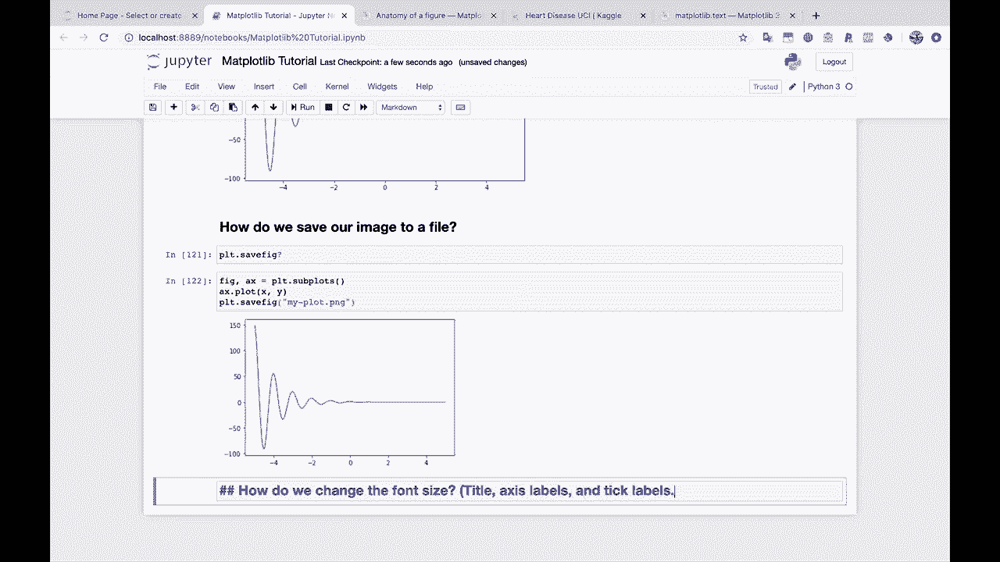

在本节课中，我们将学习如何调整Matplotlib图表中标题、坐标轴标签以及刻度标签的字体大小。这是定制图表外观、提升可读性的重要一步。

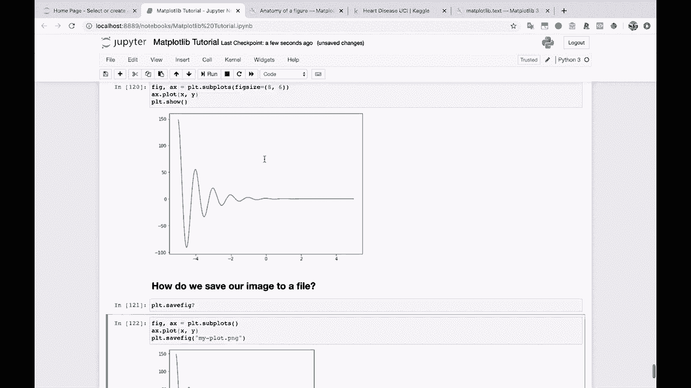

---

上一节我们介绍了如何为图表添加基本元素。本节中，我们来看看如何修改这些元素的字体大小。

首先，我们创建一个简单的图表并为其添加标题和坐标轴标签。

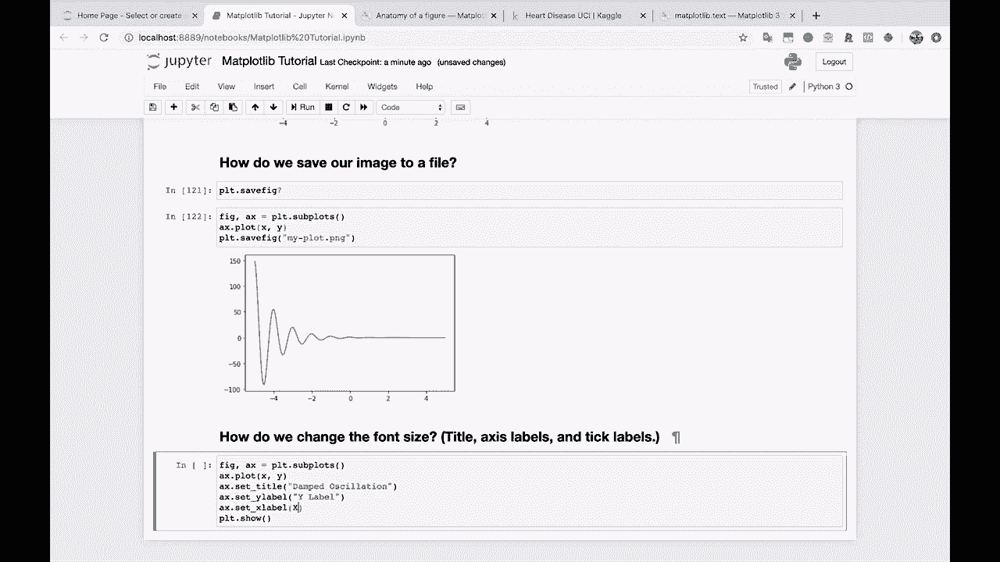

```python
import matplotlib.pyplot as plt
import numpy as np

# 生成示例数据
x = np.linspace(0, 10, 100)
y = np.exp(-0.5 * x) * np.sin(2 * np.pi * x)  # 阻尼振荡示例

fig, ax = plt.subplots()
ax.plot(x, y)

# 设置标题和坐标轴标签
ax.set_title('阻尼振荡')
ax.set_xlabel('X 标签')
ax.set_ylabel('Y 标签')
plt.show()
```

运行上述代码，Matplotlib会使用默认字体大小显示标题和标签。

---

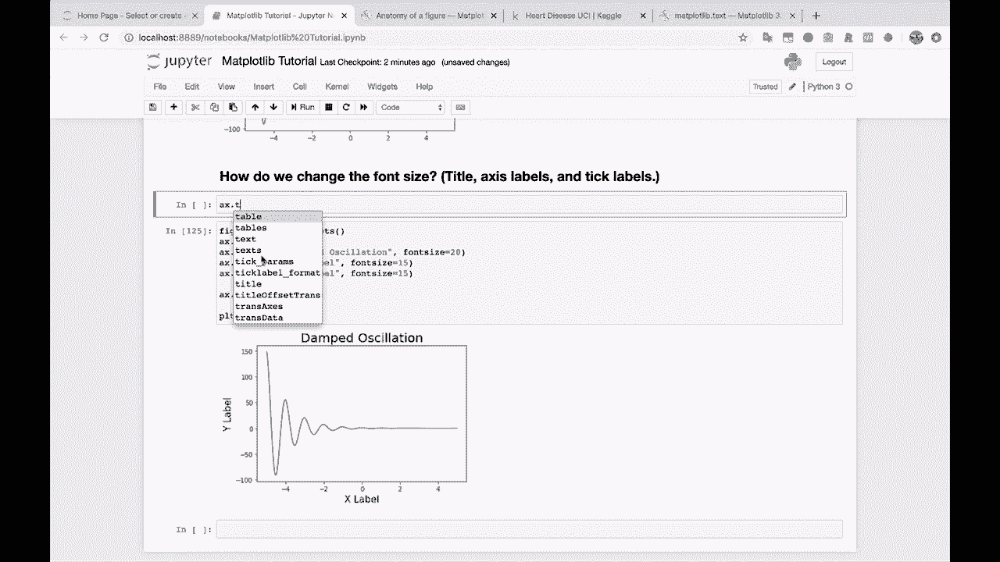

### 修改标题和坐标轴标签的字体大小

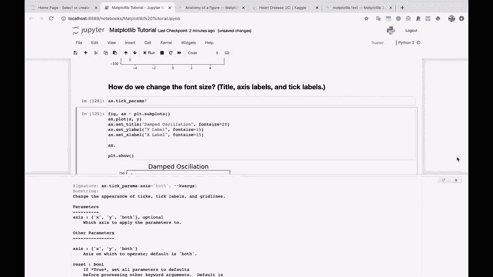

修改标题和坐标轴标签的字体大小非常简单，只需在设置方法中传入 `fontsize` 参数即可。

以下是具体方法：

*   **设置标题字体大小**：在 `ax.set_title()` 方法中使用 `fontsize` 参数。
    ```python
    ax.set_title('阻尼振荡', fontsize=20)
    ```
*   **设置坐标轴标签字体大小**：在 `ax.set_xlabel()` 和 `ax.set_ylabel()` 方法中使用 `fontsize` 参数。
    ```python
    ax.set_xlabel('X 标签', fontsize=15)
    ax.set_ylabel('Y 标签', fontsize=15)
    ```

通过这些设置，标题和标签的字体大小会相应改变。

---

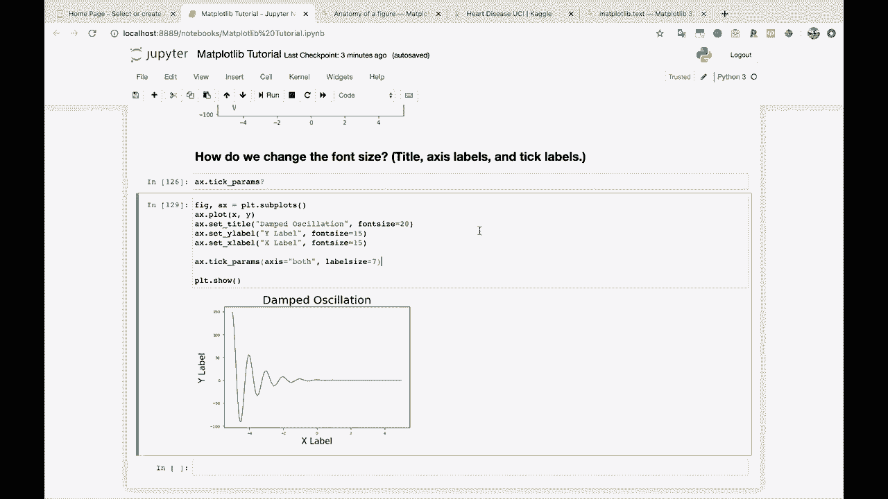

### 修改刻度标签的字体大小

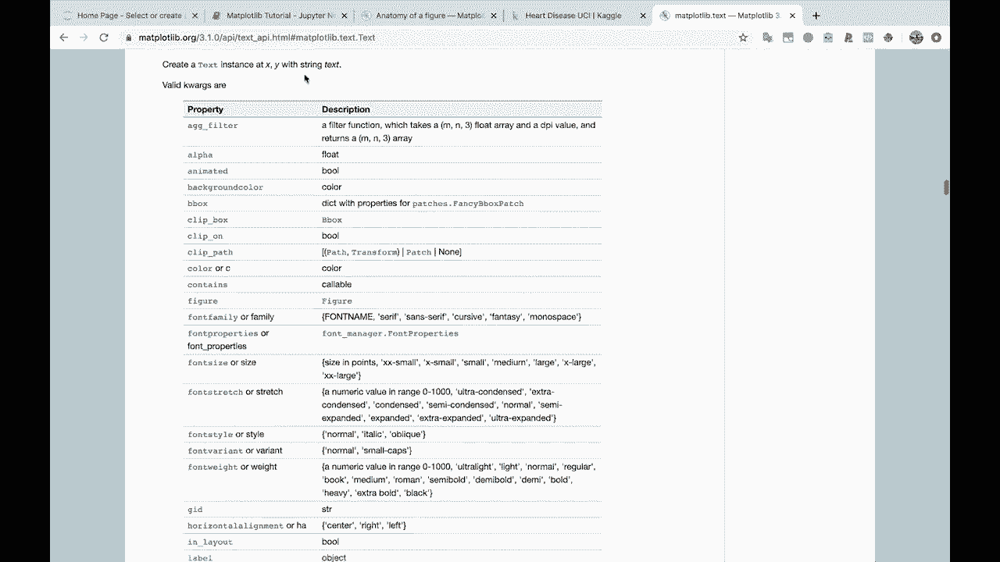

修改刻度（坐标轴上的数字）标签的字体大小方法略有不同。通常使用 `ax.tick_params()` 方法。

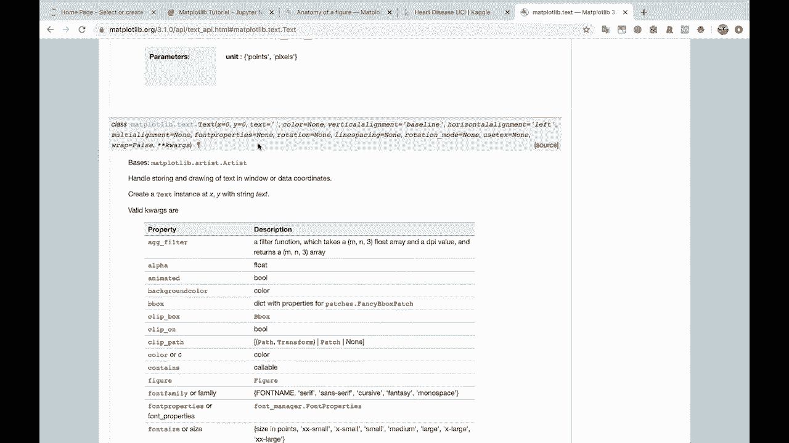

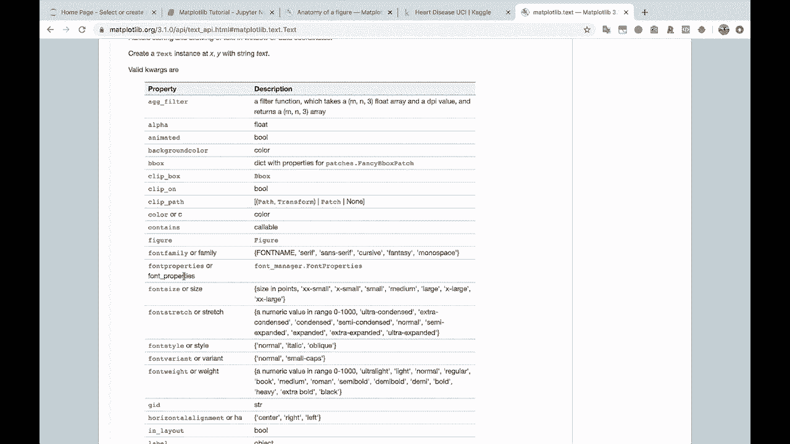

以下是具体步骤：

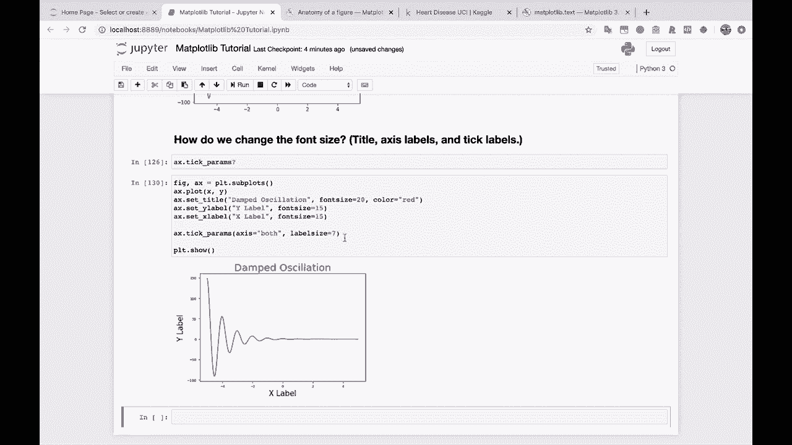

1.  使用 `ax.tick_params()` 方法。
2.  通过 `axis` 参数指定要修改的坐标轴（`‘x’`， `‘y’` 或 `‘both’`）。
3.  使用 `labelsize` 参数设置刻度标签的字体大小。

```python
# 同时修改X轴和Y轴刻度标签的字体大小
ax.tick_params(axis='both', labelsize=10)
```


`ax.tick_params()` 方法功能强大，不仅可以修改标签大小，还能调整刻度线的长度、宽度、颜色以及网格线等属性。

---

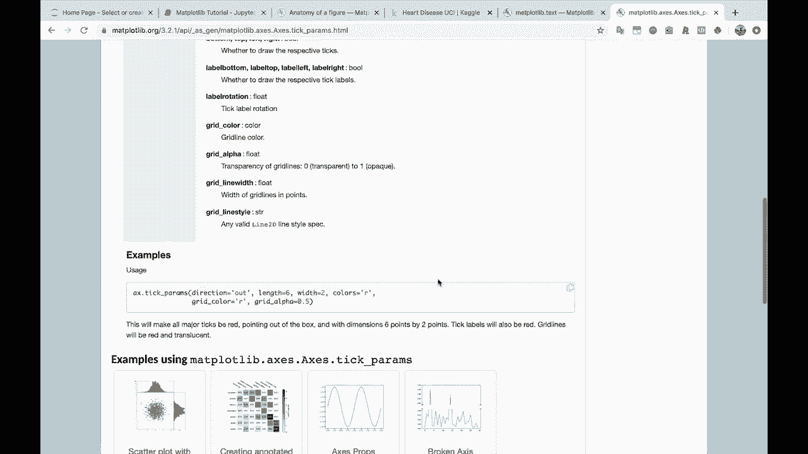

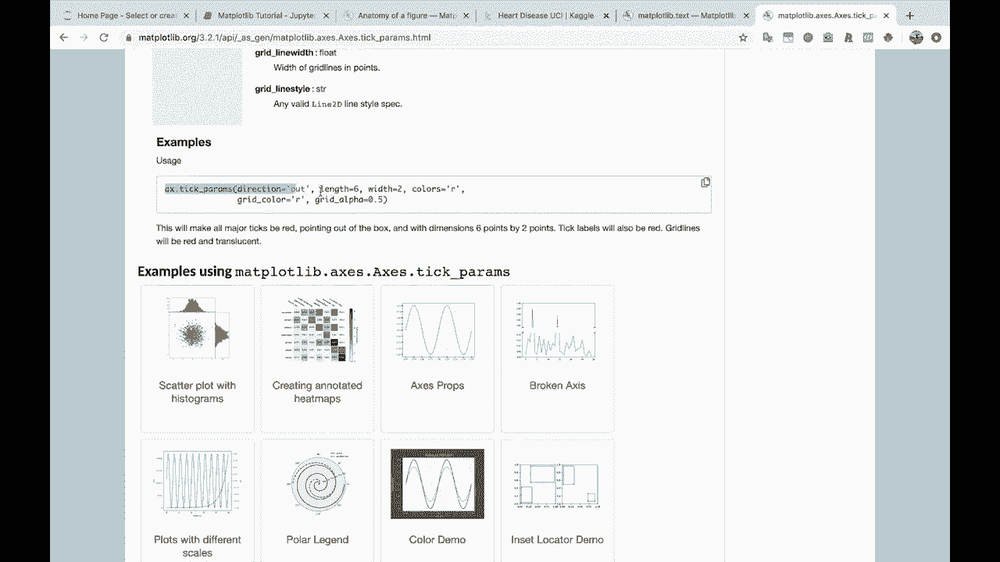

### 探索更多自定义选项

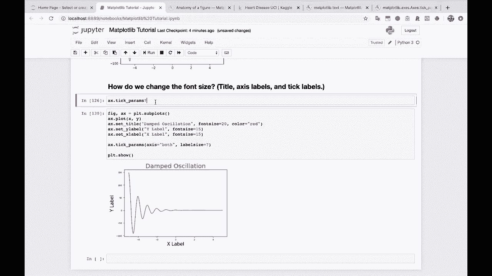

除了字体大小，你还可以为这些文本元素设置其他属性，例如颜色。

```python
ax.set_title('阻尼振荡', fontsize=20, color='red')
ax.set_xlabel('X 标签', fontsize=15, color='blue')
```

当需要实现更复杂的定制时，查阅官方文档是最好的方式。例如，搜索 “Matplotlib tick_params” 可以找到该方法的详细参数说明和示例。

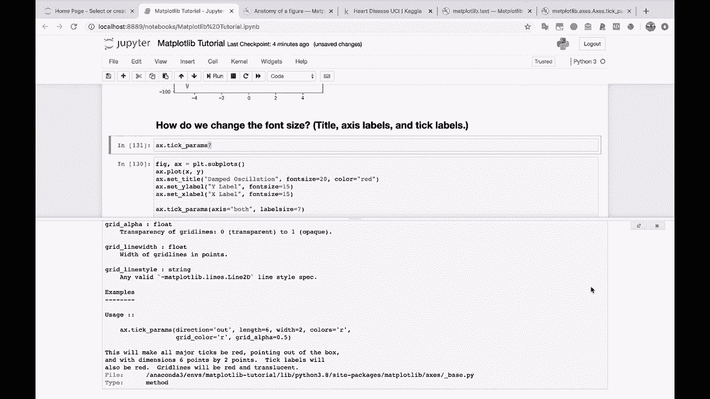

在Jupyter Notebook中，你也可以使用 `?` 来快速查看函数文档，例如 `ax.tick_params?`。

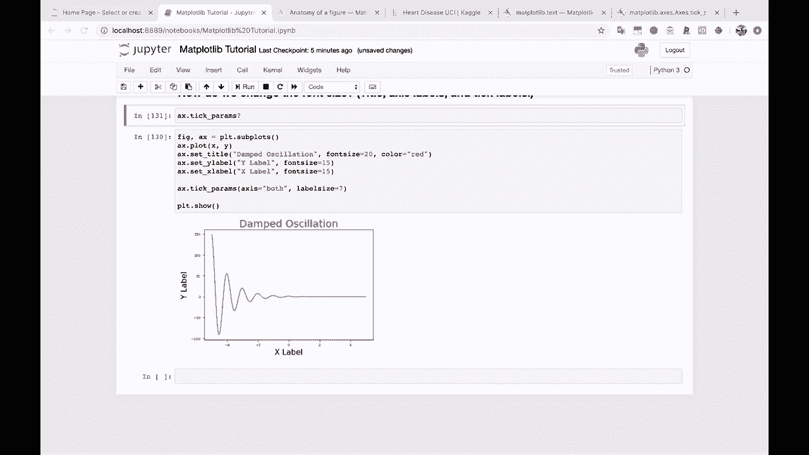

---

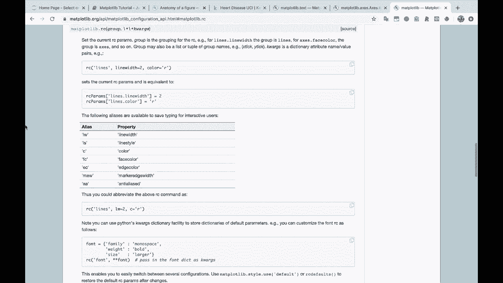

### 进阶：使用rcParams设置全局默认样式

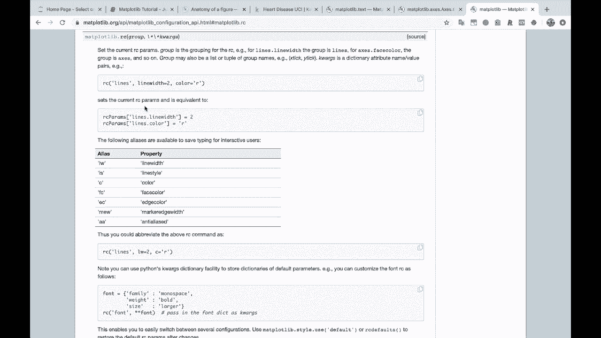

如果你希望为整个项目或会话设置统一的字体样式，而不必在每个图表中重复指定，可以使用 `rcParams`。

`rcParams` 是一个字典，用于配置Matplotlib的全局默认参数。你可以通过修改它来一次性设置字体家族、粗细、大小等。

```python
import matplotlib.pyplot as plt

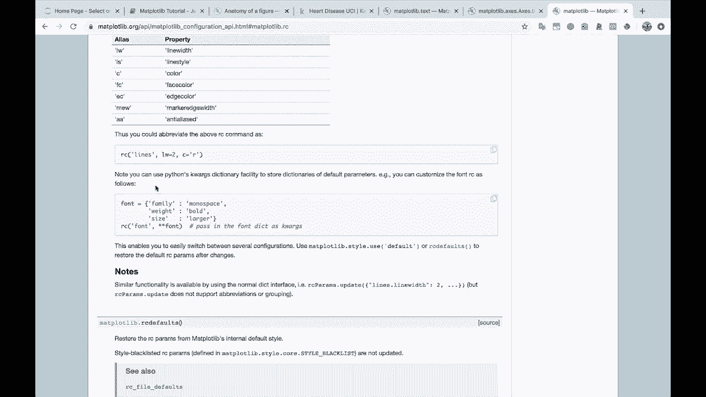

# 定义一个字体参数字典
font_settings = {
    'font.family': 'monospace', # 字体家族
    'font.weight': 'bold',      # 字体粗细
    'font.size'  : 16           # 字体大小
}

# 更新全局rcParams
plt.rcParams.update(font_settings)

# 此后创建的图表将默认使用这些字体设置
fig, ax = plt.subplots()
ax.plot([1, 2, 3], [1, 4, 9])
ax.set_title('使用rcParams的图表')
ax.set_xlabel('X轴')
ax.set_ylabel('Y轴')
plt.show()
```

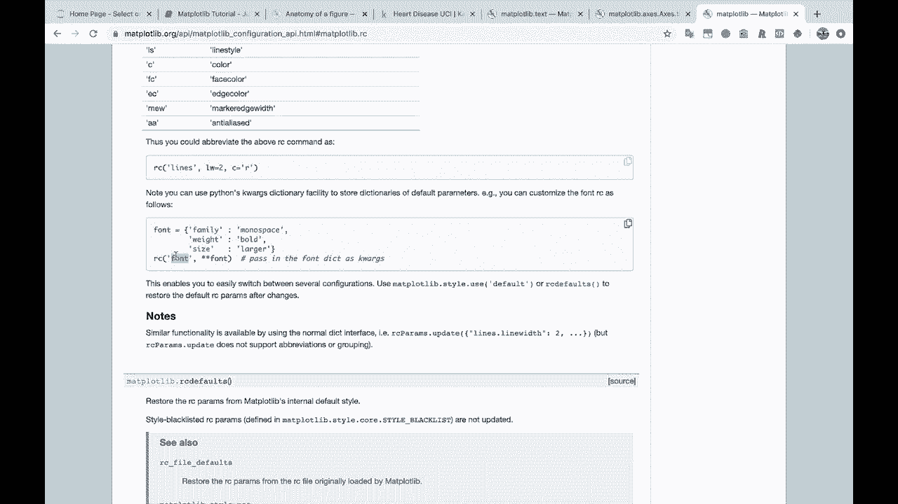

你还可以将这些配置保存到外部文件并加载，实现样式的持久化管理。这属于更高级的主题，如果你有兴趣，可以进一步研究Matplotlib关于样式表和rcParams的文档。

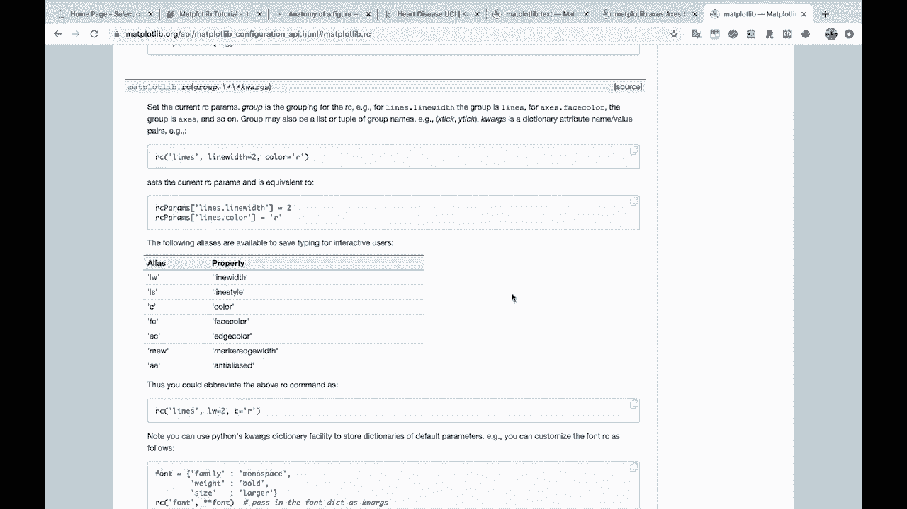

---

本节课中我们一起学习了如何调整Matplotlib图表中文本元素的字体大小。我们掌握了三种主要方法：
1.  通过 `fontsize` 参数直接设置**标题**和**坐标轴标签**的大小。
2.  使用 `ax.tick_params(labelsize=...)` 来设置**刻度标签**的大小。
3.  了解了通过 `rcParams` 设置**全局默认字体样式**的概念。

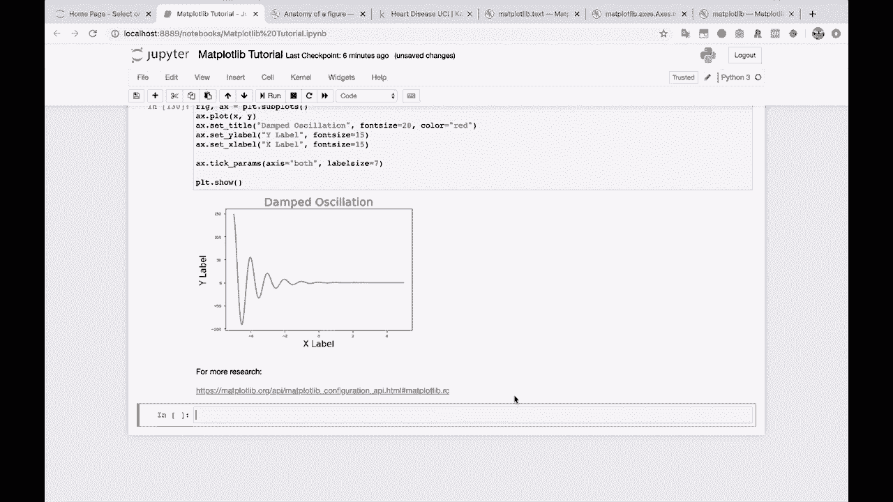

合理调整字体大小能让你的图表更加清晰和专业。记住，遇到复杂需求时，善用官方文档是解决问题的关键。