# Matplotlib绘图教程 P15：📊 更改X轴刻度频率

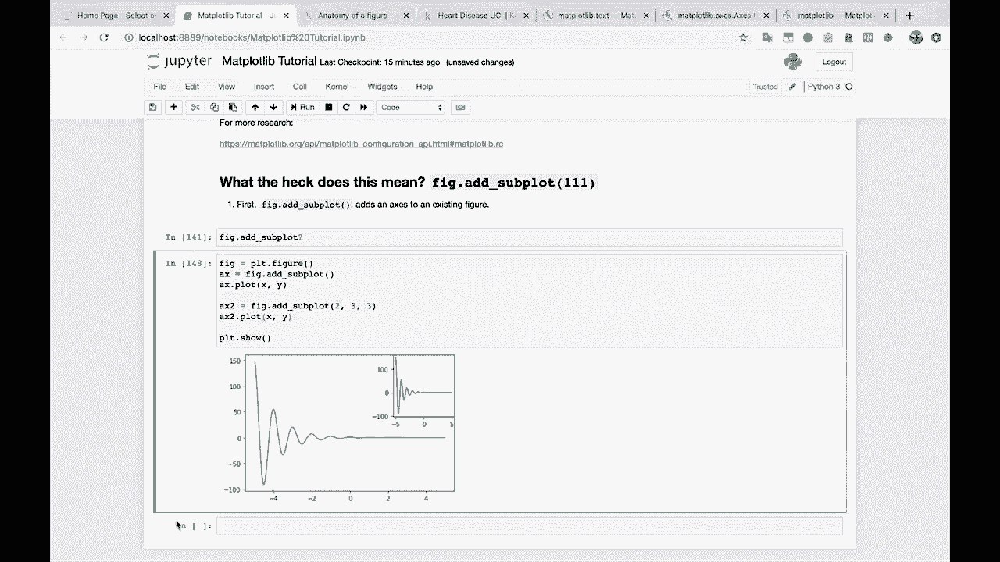

在本节课中，我们将学习如何自定义Matplotlib图表中X轴（或Y轴）的刻度位置和频率。这是调整图表可读性和呈现方式的重要技巧。

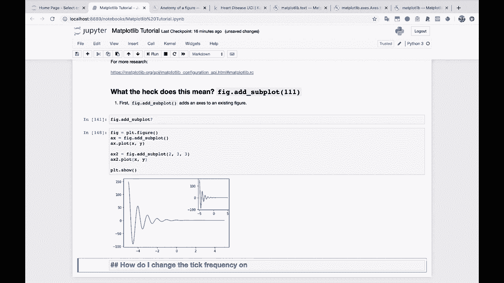

## 问题引入

另一个常见问题是：如何更改X轴或Y轴上的刻度频率？

## 基础绘图回顾

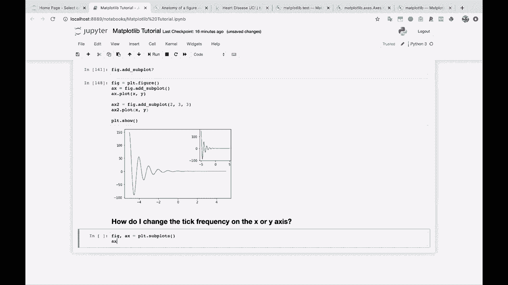

首先，让我们回顾一下基础的绘图方法。我们将创建一个简单的子图，并绘制一个X和Y的点图。

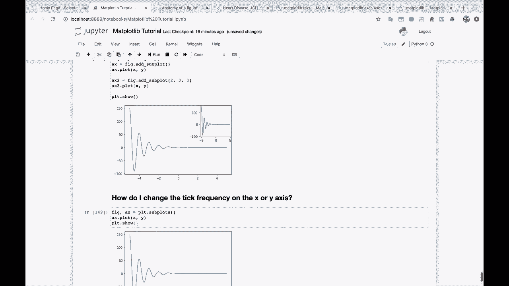

```python
import matplotlib.pyplot as plt

fig, ax = plt.subplots()
x = [-6, -4, -2, 0, 2, 4, 6]
y = [i**2 for i in x]
ax.plot(x, y)
plt.show()
```

运行上述代码后，你会看到图表。当前的X轴刻度位置是Matplotlib根据数据自动选择的。有时这很合适，但有时我们需要手动调整它。

## 手动设置X轴刻度

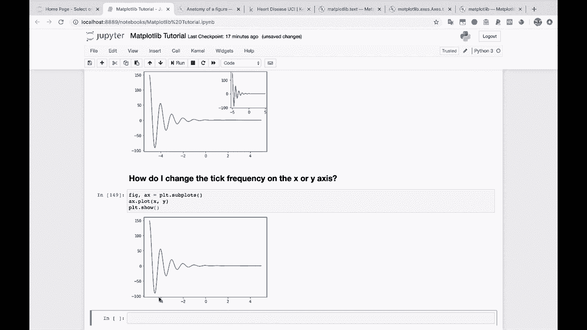

为了更改刻度，我们需要使用`Axes`对象的`set_xticks`方法。

以下是设置自定义X轴刻度的步骤：

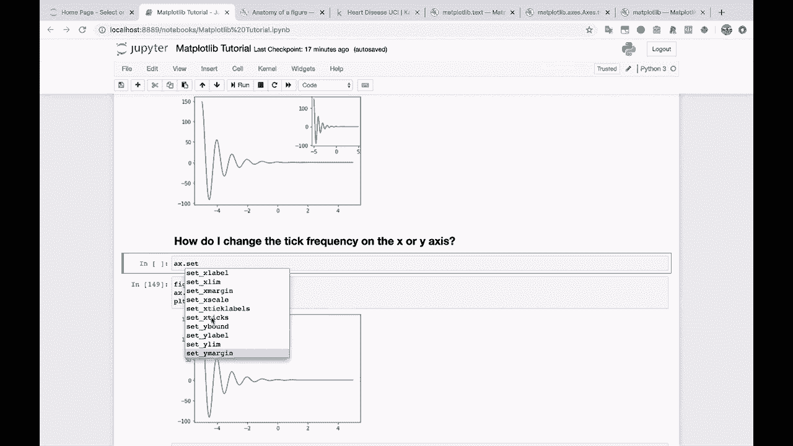

1.  首先，我们定位到`ax`对象。
2.  然后，我们调用`ax.set_xticks()`方法。
3.  该方法接受一个列表参数，列表中包含我们希望显示刻度的所有X轴位置。

让我们尝试一个例子。假设我们希望将X轴刻度从默认的偶数位置（-6, -4, -2...）改为奇数位置，并包含0。

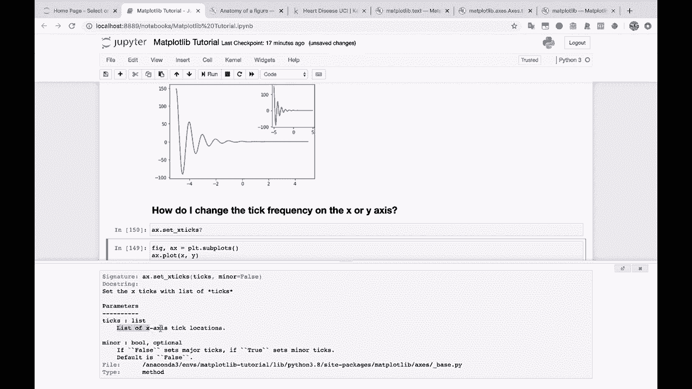

```python
import matplotlib.pyplot as plt

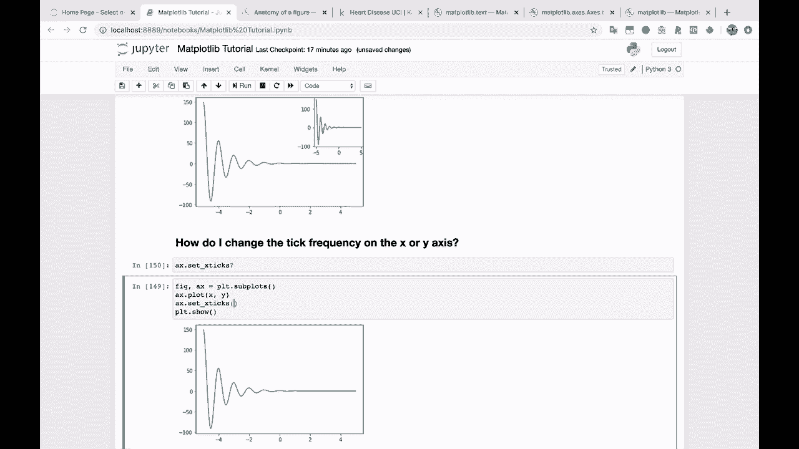

fig, ax = plt.subplots()
x = [-6, -4, -2, 0, 2, 4, 6]
y = [i**2 for i in x]
ax.plot(x, y)

# 手动设置X轴刻度位置
custom_ticks = [-5, -3, -1, 0, 1, 3, 5]
ax.set_xticks(custom_ticks)

plt.show()
```

运行代码后，你会发现X轴上的刻度标签已经变成了我们指定的列表 `[-5, -3, -1, 0, 1, 3, 5]`。

## 刻度设置的灵活性

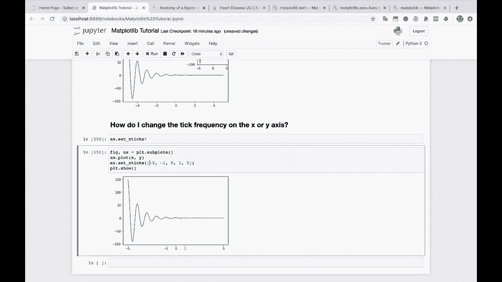

这种方法的灵活性很高。你可以根据自己的需求自由调整刻度。

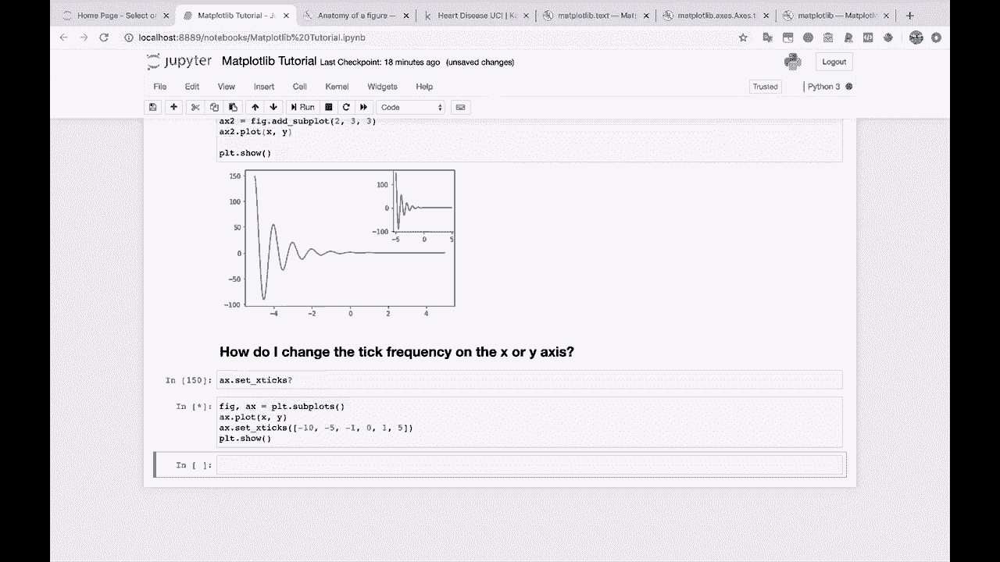

例如，你可以选择性地省略某些刻度标签，比如去掉数字3。
你也可以扩展图表的刻度范围，例如，出于某种原因在左侧加上-10这个刻度。

```python
# 示例：扩展刻度范围并选择性显示
extended_ticks = [-10, -5, -1, 0, 1, 5]
ax.set_xticks(extended_ticks)
```

通过这种方式，你可以创建各种不同的刻度模式，以满足特定的数据展示或排版需求。

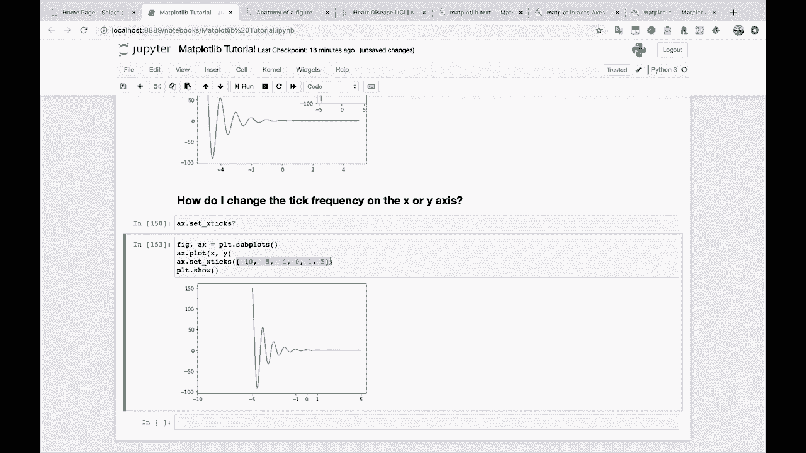

## 总结

本节课中，我们一起学习了如何手动控制Matplotlib图表的X轴刻度频率。核心方法是使用 `ax.set_xticks()` 函数，并传入一个包含所需刻度位置的列表。这使我们能够超越Matplotlib的自动选择，完全按照自己的意愿来定制坐标轴，从而让图表传达更清晰、更准确的信息。对于Y轴，操作方法完全类似，只需使用 `ax.set_yticks()` 即可。