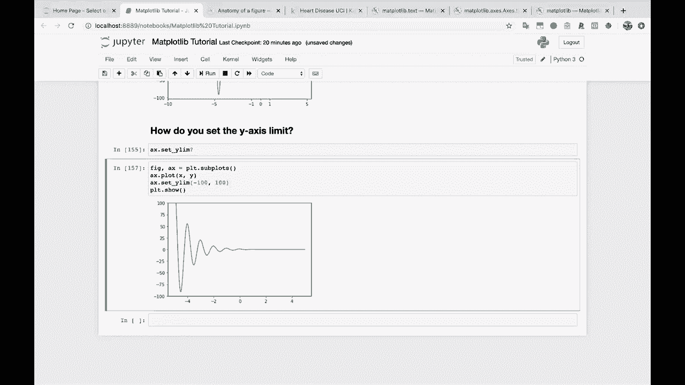
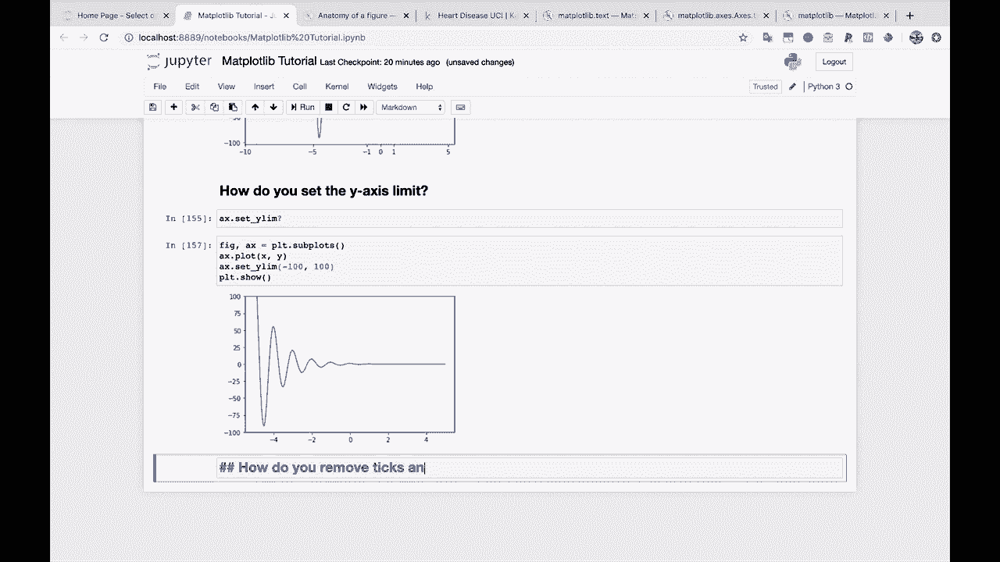
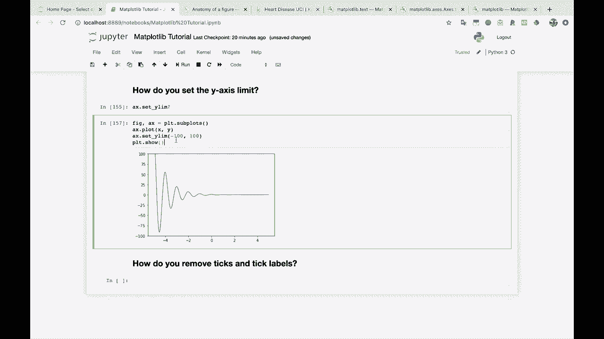
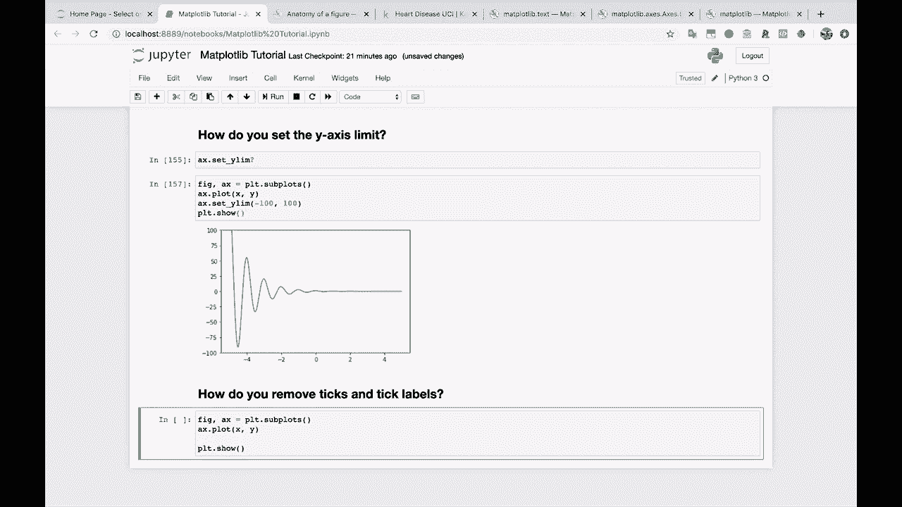
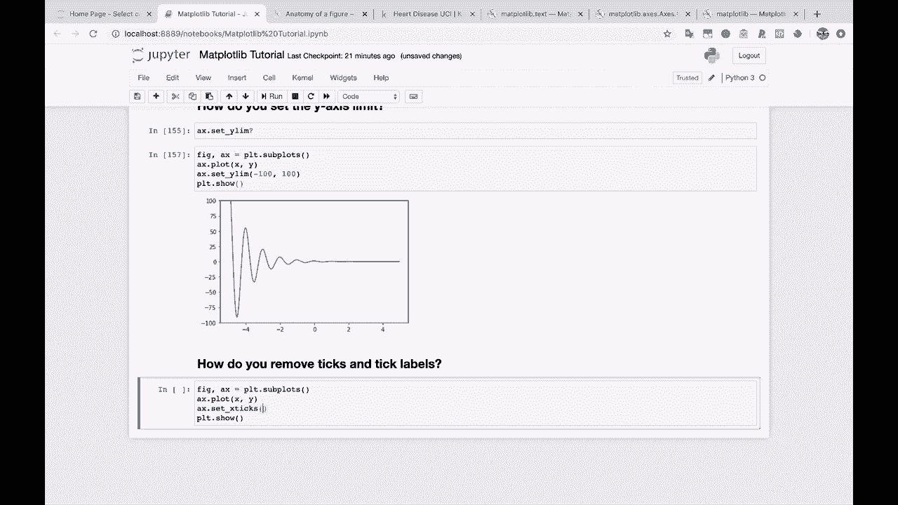
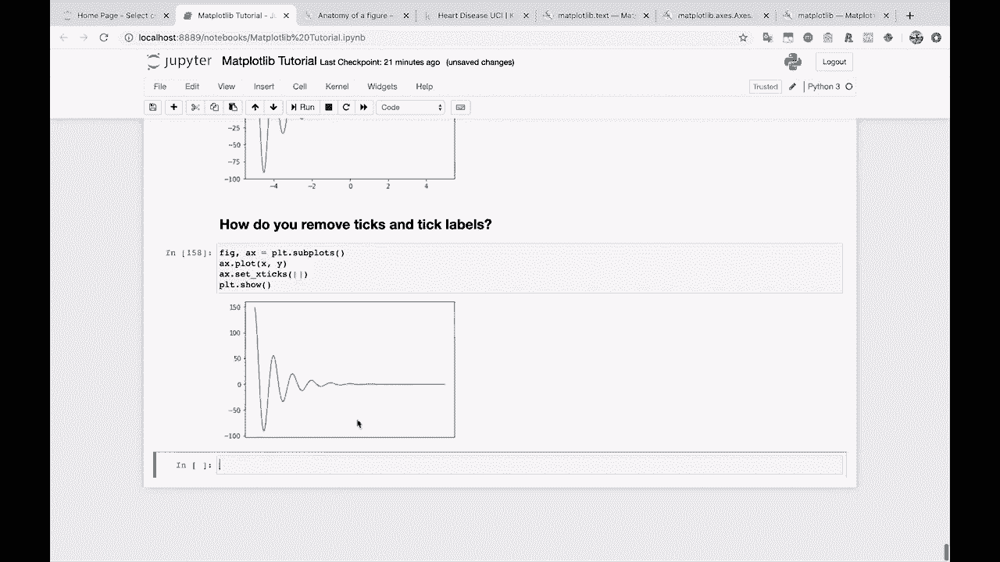
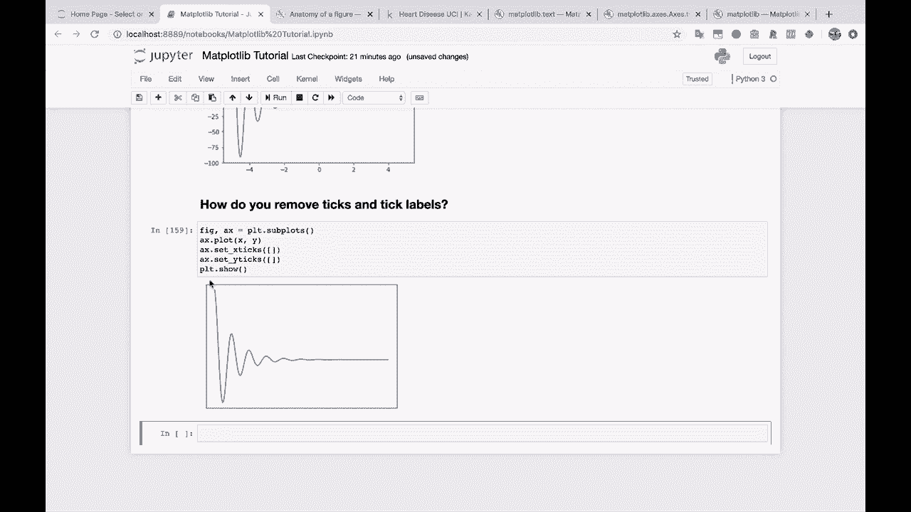

# 绘图必备Matplotlib，P17：17）去除刻度和刻度标签 🧹



在本节课中，我们将学习如何使用Matplotlib去除图表中的刻度和刻度标签。这是一种清理图表、突出核心数据的有效方法。

上一节我们介绍了如何自定义刻度和标签，本节中我们来看看如何将它们完全移除。

## 去除刻度和标签的方法



去除刻度和标签的核心思想是，向`set_xticks`和`set_yticks`方法传递一个空列表。这相当于告诉Matplotlib，我们不希望在坐标轴上显示任何刻度标记。



以下是具体操作步骤：

1.  首先，我们创建一个基本的图表。
    ```python
    import matplotlib.pyplot as plt
    import numpy as np

    x = np.linspace(0, 10, 100)
    y = np.sin(x)

    fig, ax = plt.subplots()
    ax.plot(x, y)
    ```
    



2.  接着，我们使用`set_xticks`和`set_yticks`方法，并传入空列表`[]`来移除所有刻度。
    ```python
    ax.set_xticks([])
    ax.set_yticks([])
    ```
    

3.  执行上述代码后，图表的X轴和Y轴上的刻度及标签都会被清除。
    



## 应用场景与效果

这种方法可以让图表变得非常简洁。虽然完全移除上下文可能不适用于需要精确读数的场景，但它能创造出一种干净、抽象的视觉效果。



我们可以选择只移除一个坐标轴的刻度，例如只移除X轴。
```python
ax.set_xticks([])
```


或者只移除Y轴。
```python
ax.set_yticks([])
```


最终，一个完全没有刻度和标签的图表看起来如下所示。它剥离了所有数据之外的干扰元素。




这种极简的样式在某些强调趋势而非具体数值的设计中可能很有用。


本节课中我们一起学习了如何通过`ax.set_xticks([])`和`ax.set_yticks([])`来移除Matplotlib图表中的刻度和标签。这是一个简单但强大的图表清理技巧，可以帮助你根据需要控制图表的呈现细节。