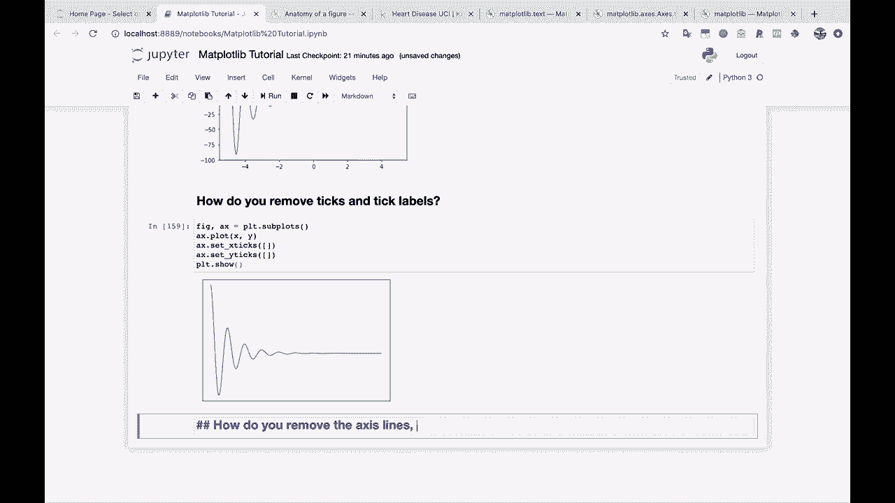
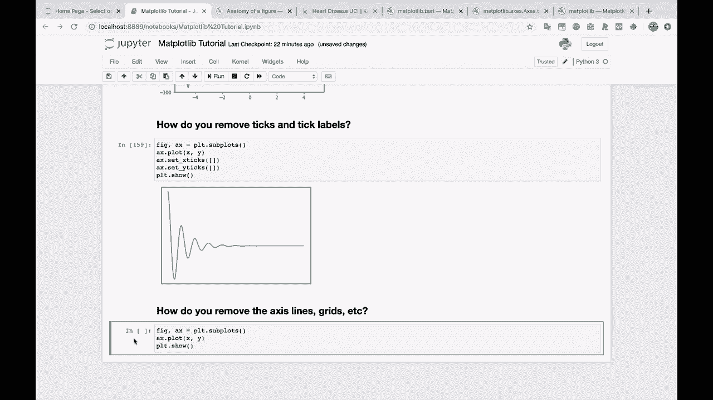
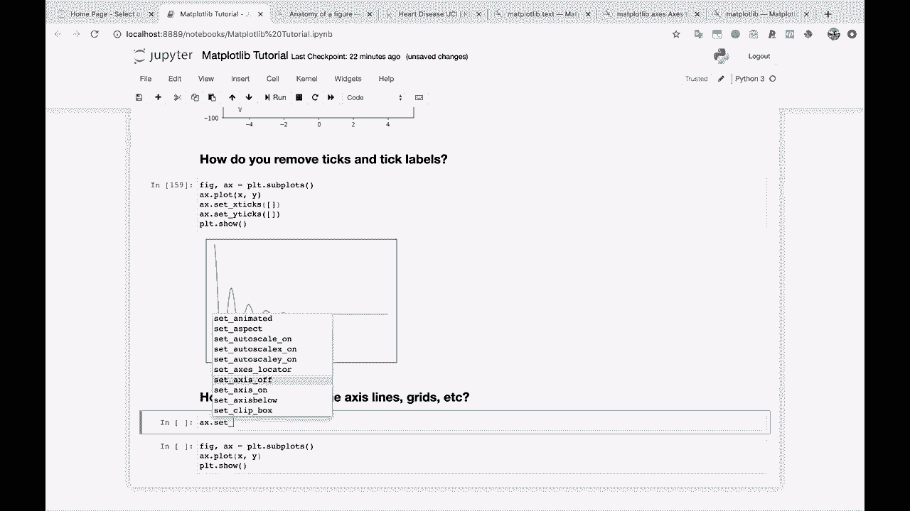
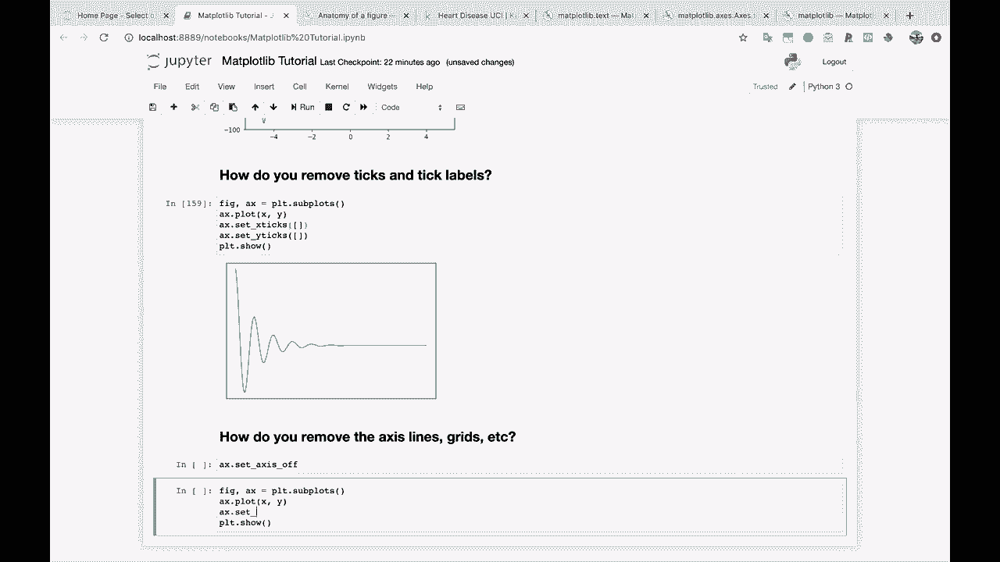
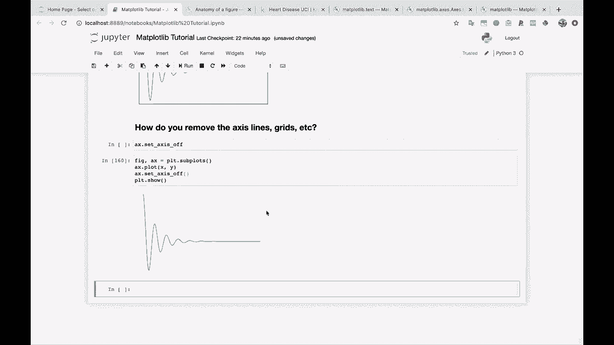
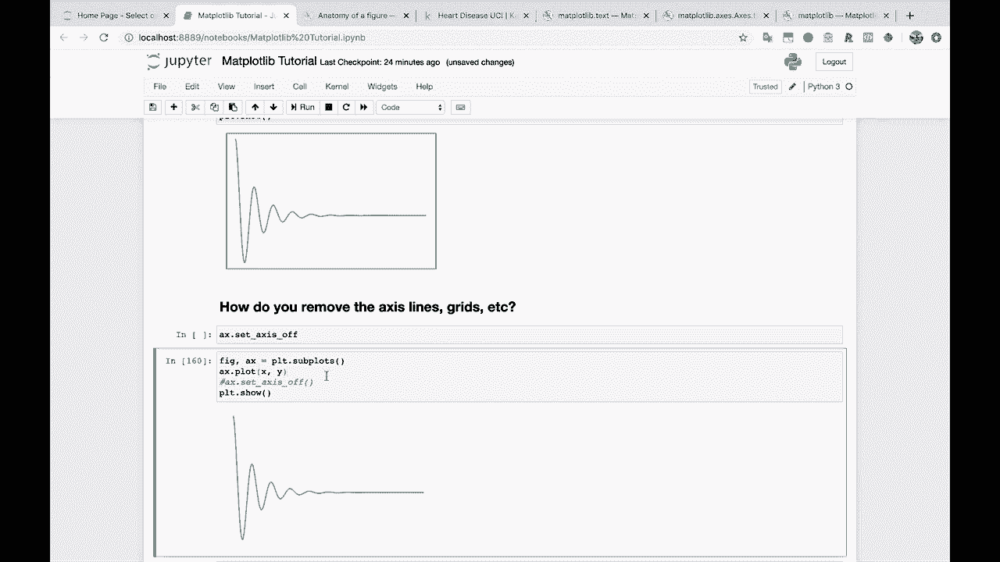
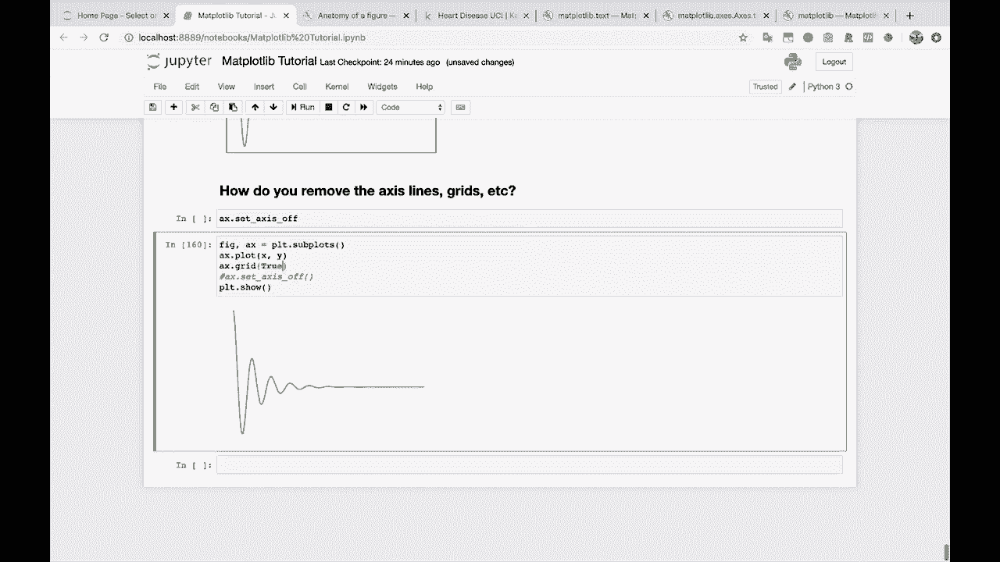
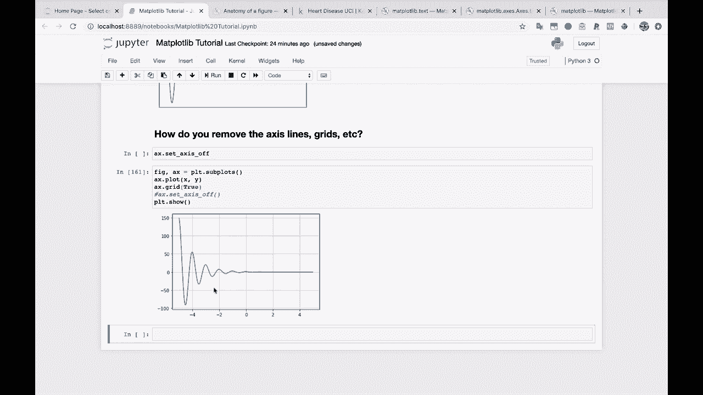
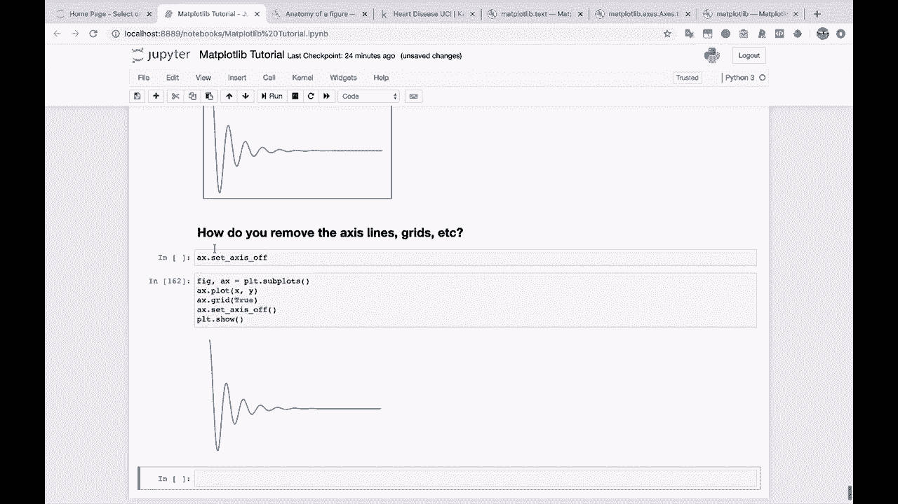

# 绘图必备Matplotlib，P18：如何关闭坐标轴 📊



在本节课中，我们将学习如何使用Matplotlib库来关闭图形的坐标轴线、刻度线以及网格线。这对于创建更简洁、专注于数据本身的图表非常有用。

上一节我们介绍了如何自定义坐标轴的刻度标签，本节中我们来看看如何完全隐藏坐标轴系统。

## 移除坐标轴线



假设我们想要移除图表四周的边框线条。首先，我们创建一个标准的图形作为示例。

```python
import matplotlib.pyplot as plt
import numpy as np

fig, ax = plt.subplots()
x = np.linspace(0, 10, 100)
y = np.sin(x)
ax.plot(x, y)
plt.show()
```



要移除坐标轴线，我们需要访问图形对象（`ax`）并设置其轴为关闭状态。



以下是关闭坐标轴的核心代码：

```python
ax.axis('off')
```



执行此命令后，图形周围的轴线将完全消失。

## 关闭网格线

顺便一提，`axis('off')`命令不仅会关闭坐标轴线，还会影响网格线。为了演示这一点，我们先为图表添加网格。

以下是添加网格的代码：



```python
ax.grid(True)
```



这会在刻度标记处生成网格线。现在，如果我们再次执行关闭坐标轴的操作：

```python
ax.axis('off')
```

可以看到，这不仅移除了图形周围的边框，也同时关闭了之前显示的网格线。



## 方法总结

本节课中我们一起学习了控制Matplotlib坐标轴显示的两个关键操作。



以下是核心方法列表：
*   **`ax.axis('off')`**：此命令用于完全关闭坐标轴系统，包括轴线、刻度线和网格线。
*   **`ax.grid(True/False)`**：此命令用于单独控制网格线的显示或隐藏。

总结来说，使用`ax.axis('off')`是快速隐藏所有坐标轴相关元素的最直接方法，而`ax.grid()`则提供了对网格线更独立的控制。