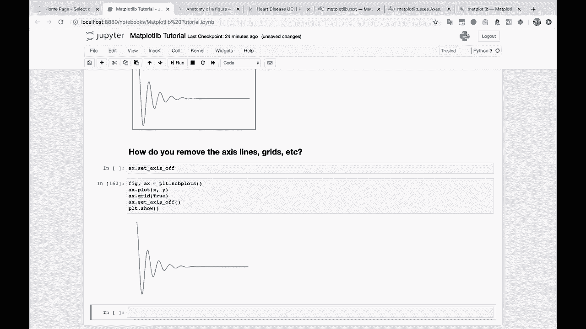
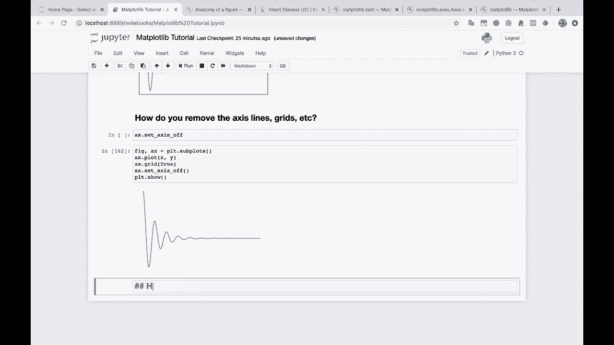
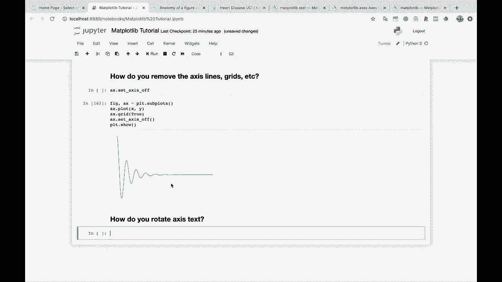
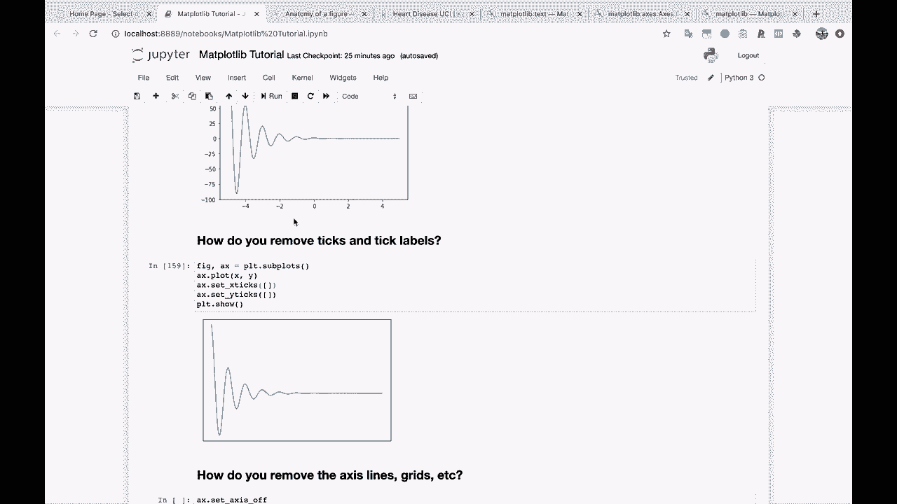
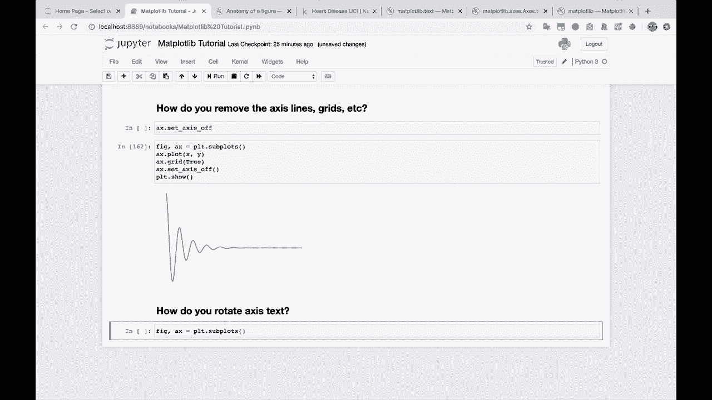
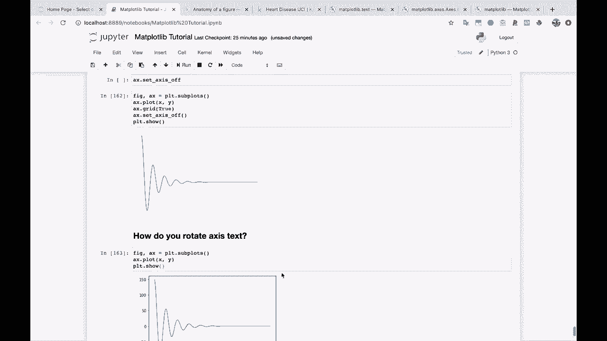
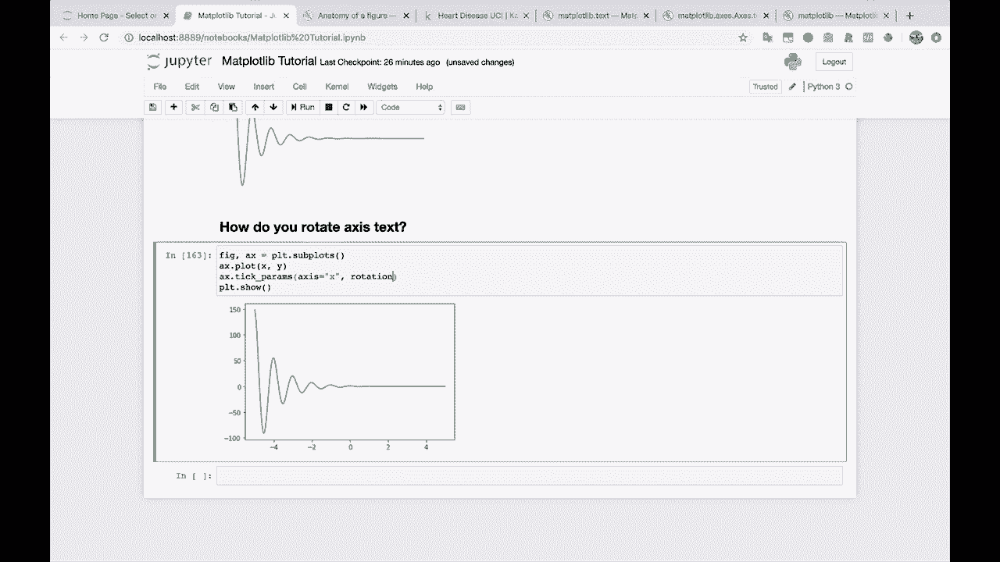
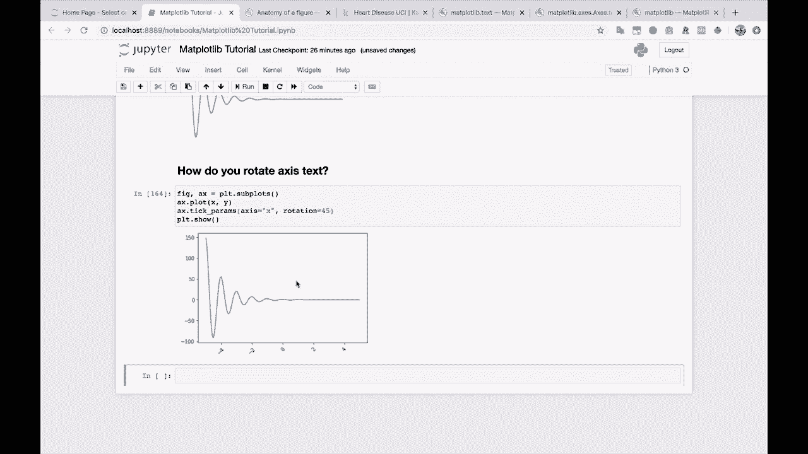

# 绘图必备Matplotlib，P19：19）旋转轴刻度标签文本 📐



在本节课中，我们将学习如何旋转Matplotlib图表中的轴刻度标签文本。当刻度标签文本过长、相互重叠导致难以辨认时，旋转标签是一个有效的解决方案。



上一节我们介绍了如何调整刻度参数，本节中我们来看看如何利用这些参数来旋转刻度标签。



## 问题背景

在数据可视化过程中，有时会遇到轴标签文本过长的情况。这些长标签可能会相互重叠，导致图表难以阅读。为了解决这个问题，我们需要旋转轴刻度标签文本。

## 旋转X轴刻度标签



我们将使用`tick_params`方法来旋转X轴刻度标签。以下是具体步骤：

首先，创建一个基本的图表。



```python
import matplotlib.pyplot as plt



fig, ax = plt.subplots()
x = [1, 2, 3, 4, 5]
y = [2, 3, 5, 7, 11]
ax.plot(x, y)
plt.show()
```

接下来，旋转X轴刻度标签。我们将使用`ax.tick_params()`方法，并传入`rotation`参数。

以下是设置旋转角度的代码示例：

```python
ax.tick_params(axis='x', rotation=45)
```



执行上述代码后，X轴刻度标签将旋转45度。这样，即使标签很长，它们也不会相互重叠，从而提高了图表的可读性。

## 总结



本节课中我们一起学习了如何旋转Matplotlib图表中的轴刻度标签文本。通过使用`ax.tick_params(axis='x', rotation=角度)`方法，我们可以轻松调整标签的旋转角度，解决长标签重叠的问题，使图表更加清晰易读。