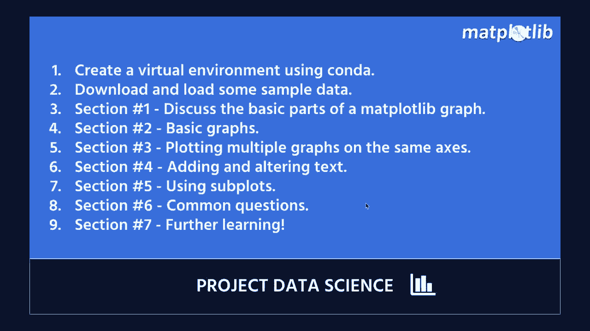
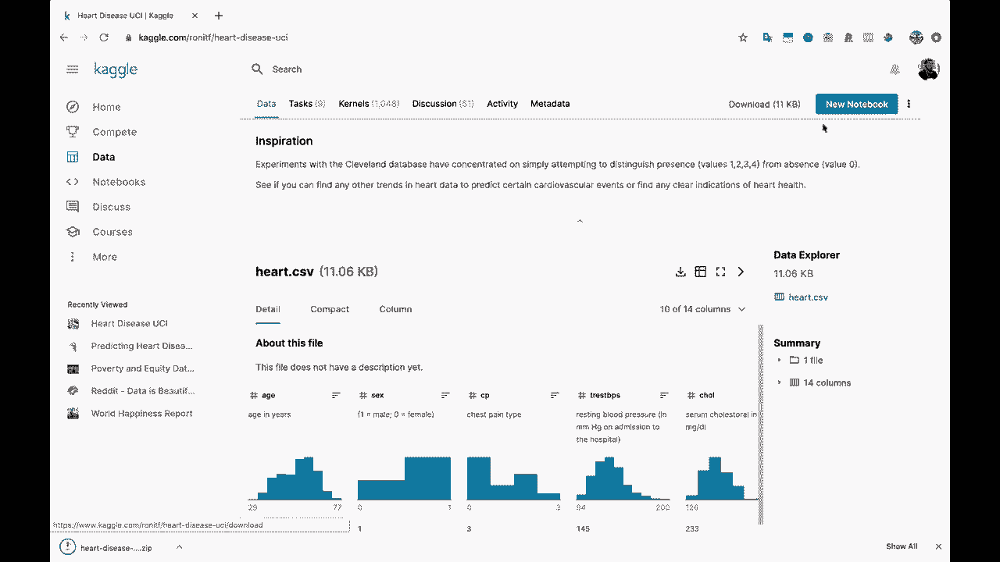
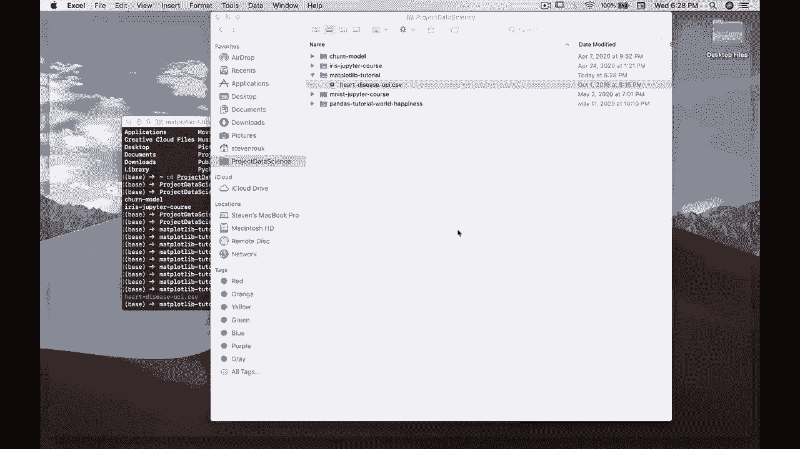
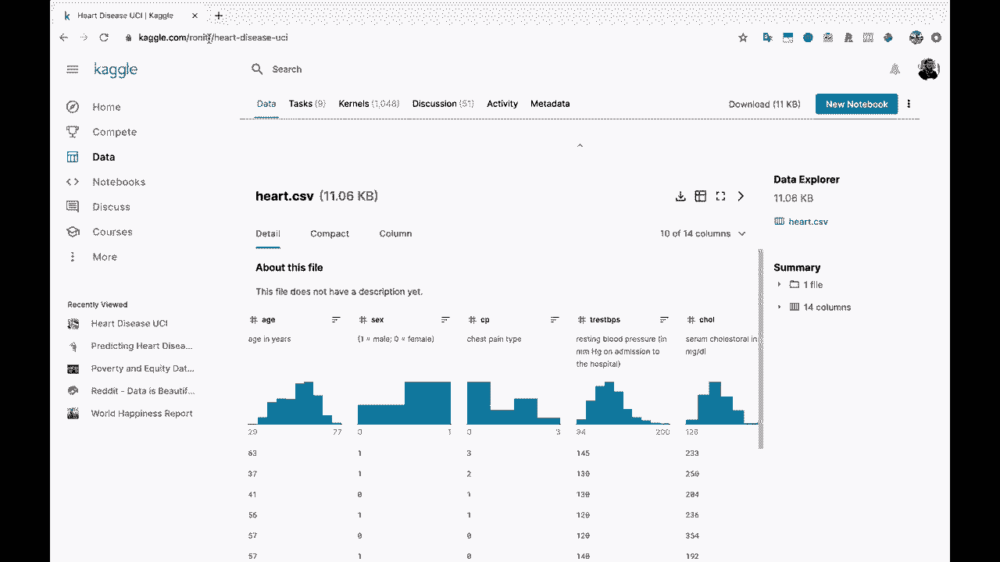

# 绘图必备Matplotlib，P2：创建项目目录并下载数据 📁



在本节课中，我们将学习如何为Matplotlib数据可视化项目搭建基础环境。具体包括：创建一个专属的项目目录，并从Kaggle平台下载我们将要使用的公开数据集——心脏病数据集。

---

## 创建项目目录 🗂️

首先，我们需要一个专门的工作空间来存放项目文件。这有助于保持代码和数据的条理性。

我将打开终端，并导航到我的主目录。我喜欢将项目统一存放在一个名为“项目数据科学”的文件夹中。

执行 `ls` 命令可以查看当前目录下的内容。

```bash
ls
```

你会看到“项目数据科学”文件夹。我将进入这个文件夹，并创建一个名为“matplotlib教程”的新目录。

```bash
cd 项目数据科学
mkdir matplotlib教程
```

创建完成后，进入这个新目录。

```bash
cd matplotlib教程
```

再次执行 `ls` 命令，可以看到目录目前是空的，因为我们还没有添加任何文件。

```bash
ls
```

至此，我们的项目目录已经准备就绪。

---

## 下载数据集 📊

上一节我们创建了项目目录，本节中我们来看看如何获取本教程将要用到的数据。

我们将使用一个公开的心脏病数据集，它来源于UCI机器学习库，并托管在Kaggle平台上。



以下是获取数据集的步骤：

1.  打开浏览器，访问Kaggle上的心脏病数据集页面。链接为：`kaggle.com/ronitf/heart-disease-uci`。
2.  该页面提供了数据集的详细描述。本实验将使用其中14个核心属性。
3.  点击页面上的“Download”按钮。如果你没有Kaggle账户，可能需要先注册一个。
4.  下载的文件是一个名为`heart-disease-uci.zip`的压缩包。解压后，你会得到一个CSV文件。

为了在项目中管理这个文件，我们需要将它移动到之前创建的项目目录中。

回到终端，并确保你位于`matplotlib教程`目录下。然后，将下载的CSV文件移动到此目录。

```bash
mv ~/Downloads/heart-disease-uci.csv .
```

移动完成后，可以使用 `ls` 命令确认文件已成功放入目录。



```bash
ls
```

现在，我们可以快速查看一下这个数据文件的内容。例如，在Excel中打开它，你会看到文件顶部是列标题（如年龄、性别等），下方是相应的数据行。性别列用0和1表示（1为男性，0为女性），其他多为数值型数据。

这些数据将是我们后续进行图表绘制的素材。



---

本节课中我们一起学习了如何为数据可视化项目搭建基础环境。我们首先创建了一个清晰的项目目录，然后从Kaggle下载了心脏病数据集，并将其移动到项目目录中。这些步骤为后续使用Matplotlib进行数据分析和绘图做好了准备。