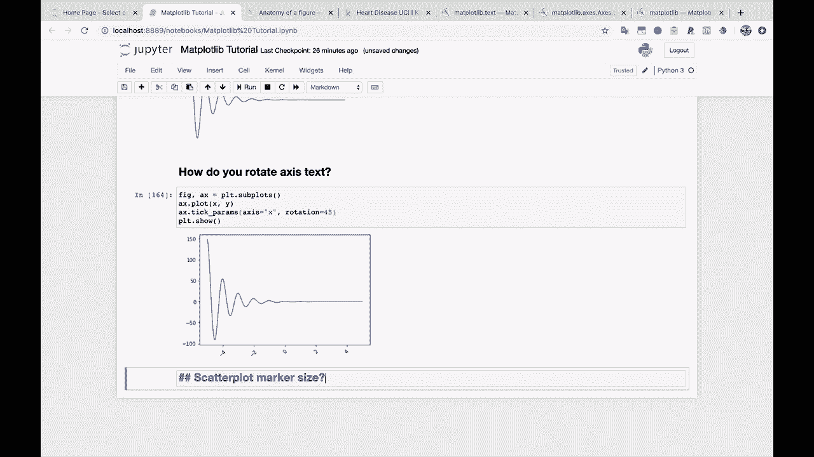
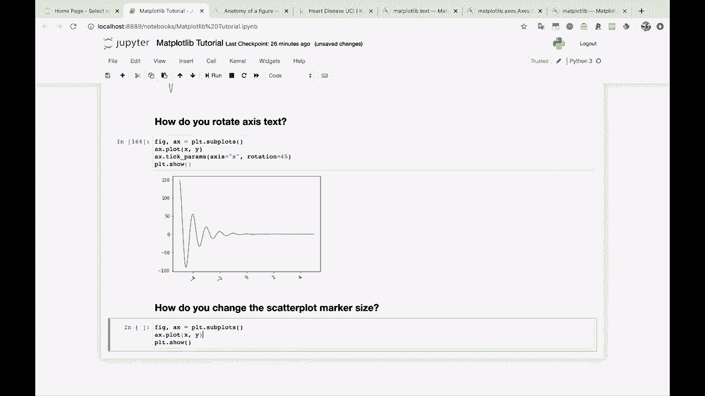
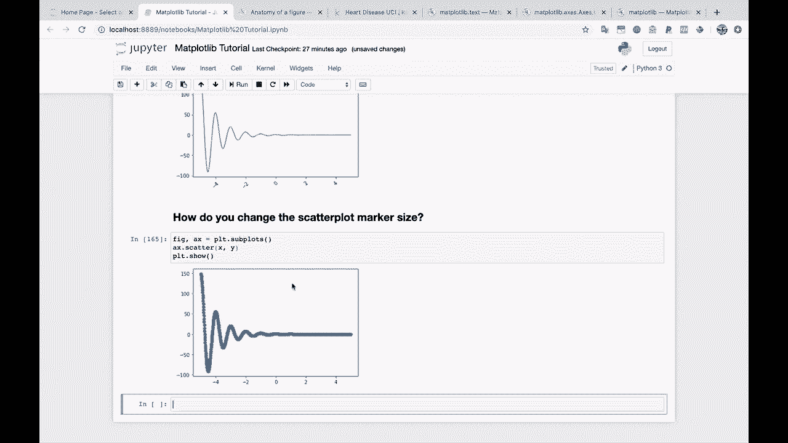
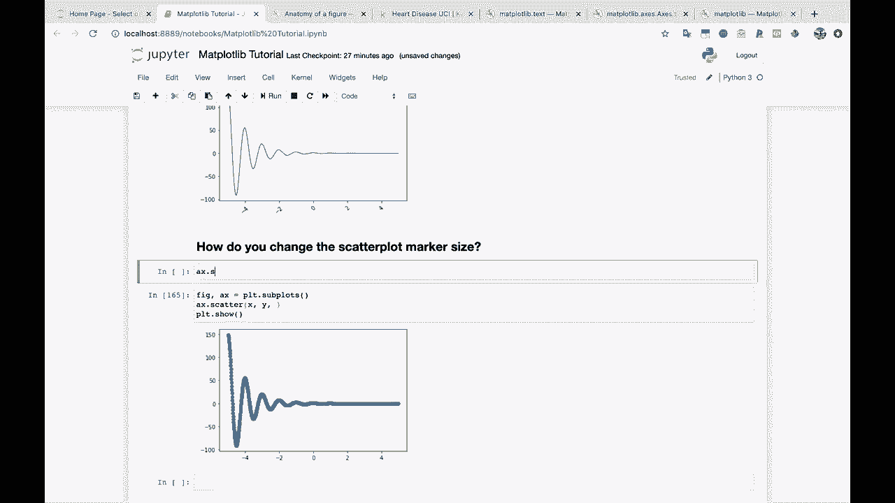
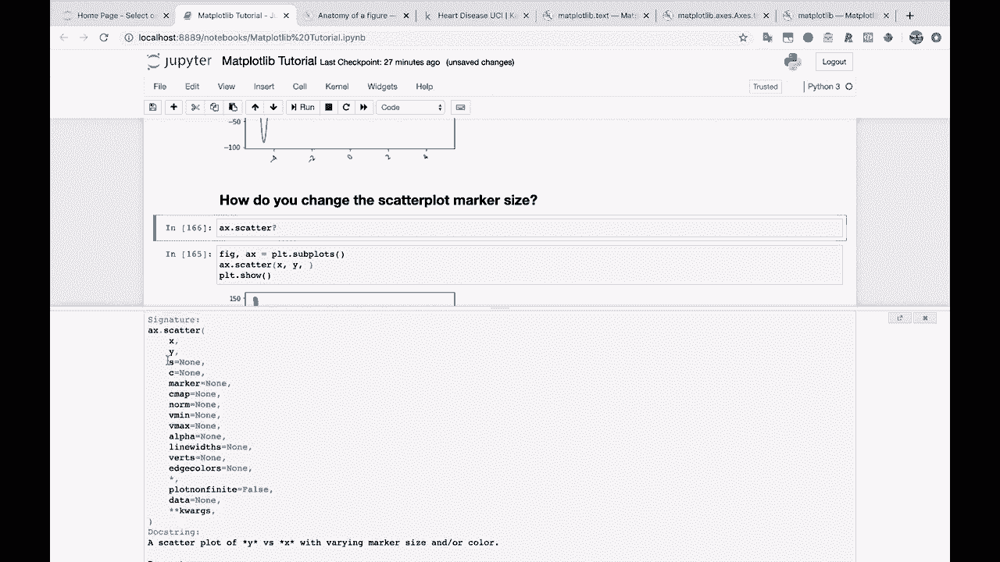
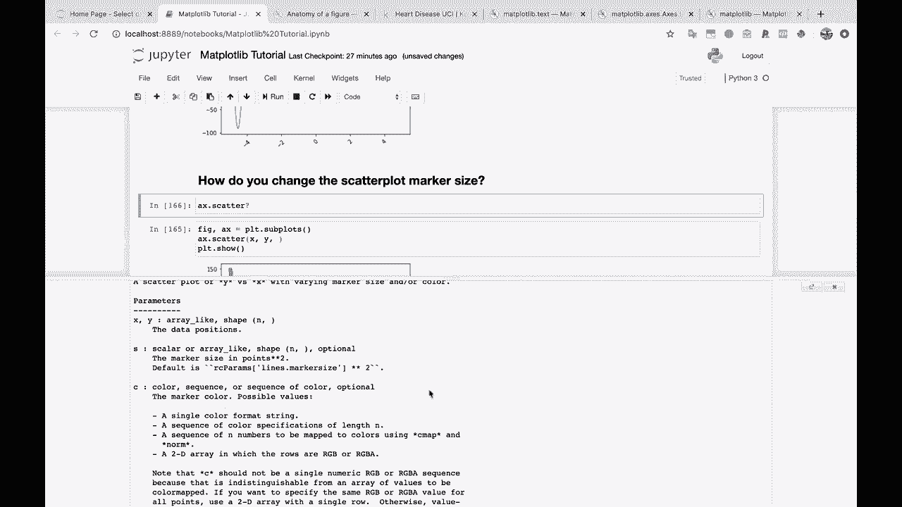
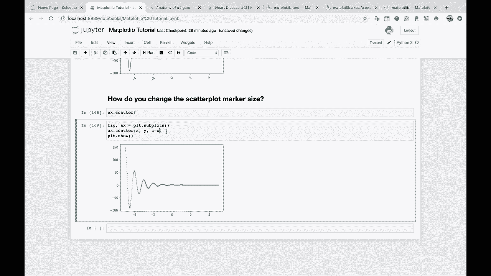
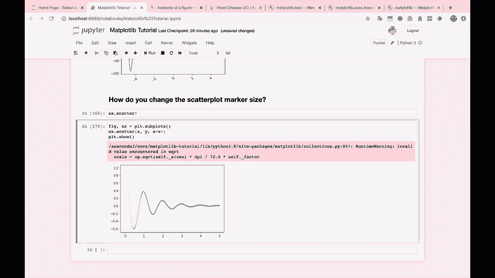
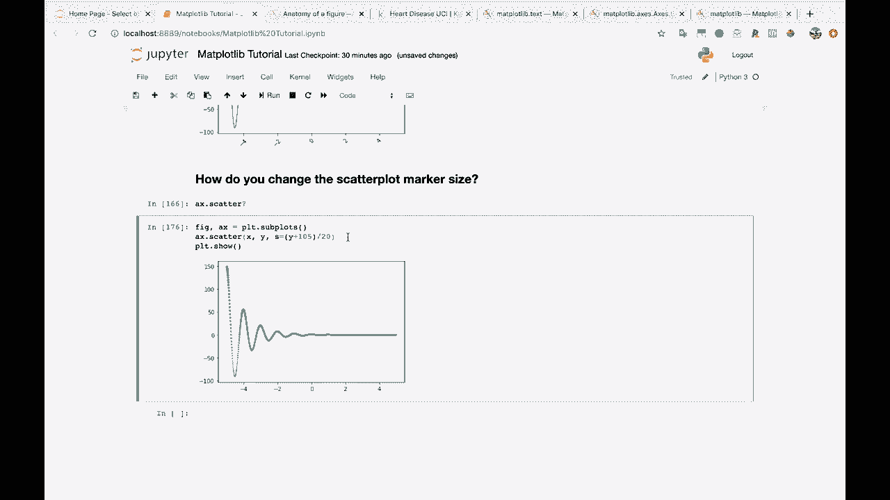

# 绘图必备Matplotlib，P20：20）更改散点图标记大小 📊



在本节课中，我们将学习如何更改Matplotlib散点图中数据点（标记）的大小。这是自定义图表外观、突出显示特定数据或创建更复杂视觉效果的重要技巧。



上一节我们介绍了散点图的基础绘制方法，本节中我们来看看如何控制每个点的大小。

## 理解标记大小参数



在Matplotlib中，`scatter`函数负责绘制散点图。要更改标记大小，我们需要关注该函数的一个特定参数。

查看`ax.scatter`函数的文档是一个好习惯，它能帮助我们了解所有可用参数。我们将重点关注其中的 `s` 参数。





以下是`scatter`函数中与大小相关的主要参数说明：
*   **`s`**：此参数控制标记的大小，单位是**点**的平方。它可以接受一个标量数值（所有点大小相同）或一个数组（为每个点指定不同的大小）。

## 设置统一的标记大小



让我们从最简单的开始：为图表中的所有点设置一个统一的大小。我们通过向 `s` 参数传递一个数字来实现。

例如，设置 `s=10` 会使点变小。如果我们将值降低到 `s=5` 甚至 `s=1`，点会变得非常小。通过这种方式，我们可以轻松调整所有点的整体尺寸。

**代码示例：统一大小**
```python
# 假设 x, y 是您的数据
ax.scatter(x, y, s=10)  # 所有点的大小为10
```



## 为每个点设置不同的大小

更强大的功能是，我们可以为散点图中的每个数据点指定不同的大小。这通过向 `s` 参数传递一个长度与数据点数量相同的数组来实现。



例如，如果我们希望点的大小随着其X轴坐标值的增加而增大，我们可以将X值数组本身（或经过计算的版本）传递给 `s` 参数。

**代码示例：大小随X值变化**
```python
sizes = x * 10  # 根据x值计算大小，这里乘以10以放大效果
ax.scatter(x, y, s=sizes)
```
请注意，大小值应为正数。如果数据中包含零或负数，可能导致绘图错误。一个常见的解决方法是给数组加上一个小的偏移量，例如 `sizes = (x + 0.1) * 10`。

我们也可以让大小基于Y值或其他任何计算逻辑。例如，使用Y值的绝对值，或者进行更复杂的变换，如 `sizes = np.abs(y) * 5`。

**代码示例：大小基于Y值**
```python
sizes = np.abs(y) * 2  # 大小与Y值的绝对值成正比
ax.scatter(x, y, s=sizes)
```

## 结合颜色与大小

值得一提的是，就像可以传递数组来控制大小一样，您也可以用同样的方式通过 `c` 参数传递数组来控制每个点的颜色。这允许您同时用大小和颜色两个视觉维度来编码数据信息，创建信息丰富的多维图表。

**代码示例：同时自定义大小和颜色**
```python
# 假设我们有一个表示类别的数组 ‘category’
colors = category  # 颜色映射到类别
sizes = x ** 2     # 大小映射到x的平方
ax.scatter(x, y, c=colors, s=sizes, alpha=0.6)
```



本节课中我们一起学习了如何更改Matplotlib散点图的标记大小。关键点在于使用 `scatter()` 函数的 `s` 参数。您既可以设置一个统一值来调整所有点，也可以传递一个数组来实现数据点大小的个性化，从而让图表更好地传达数据背后的故事。掌握这个技巧，是创建更专业、更具洞察力数据可视化作品的重要一步。