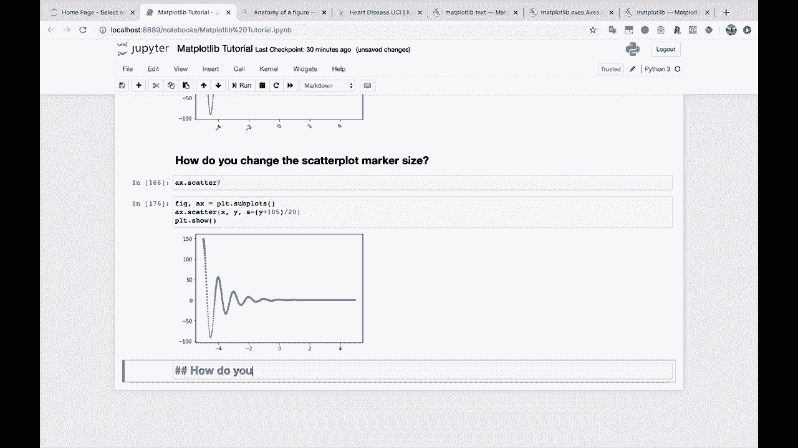
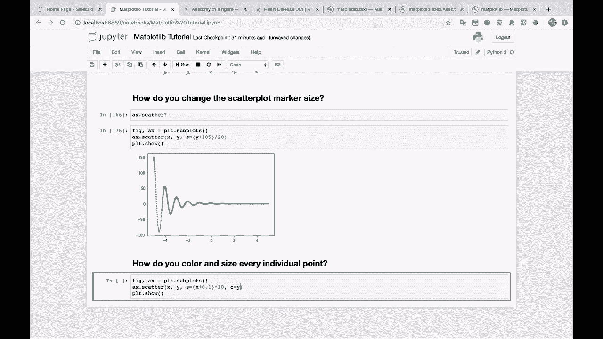
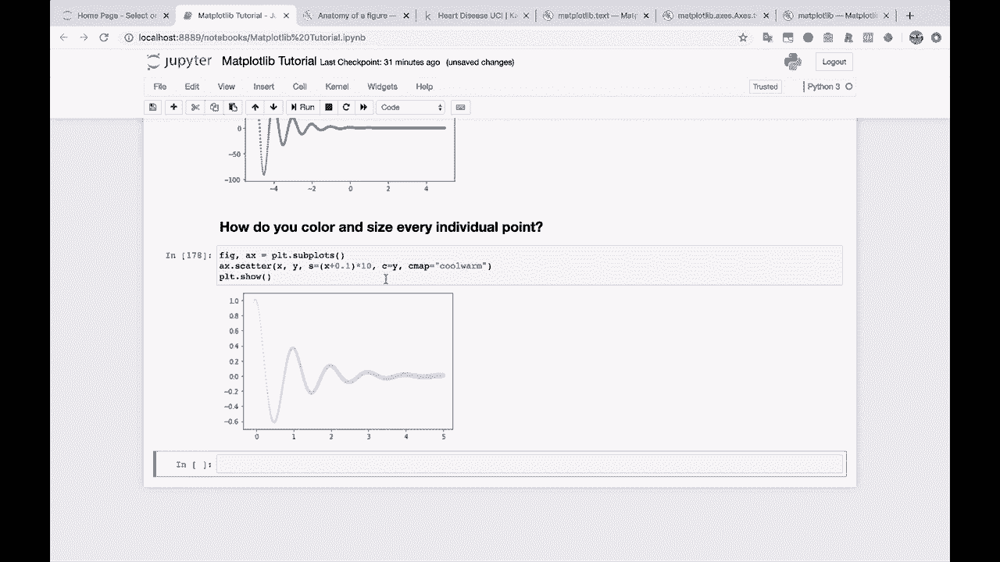
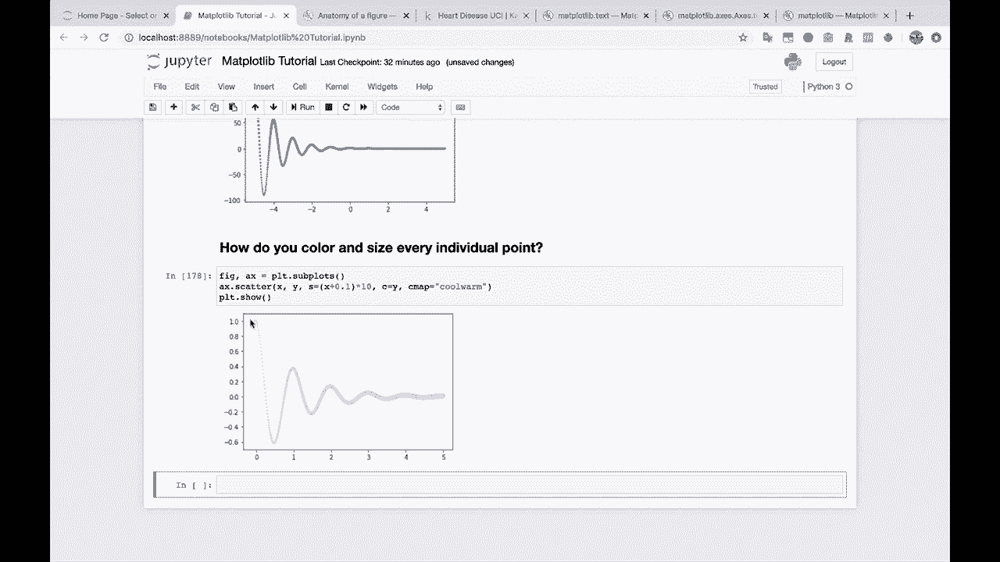
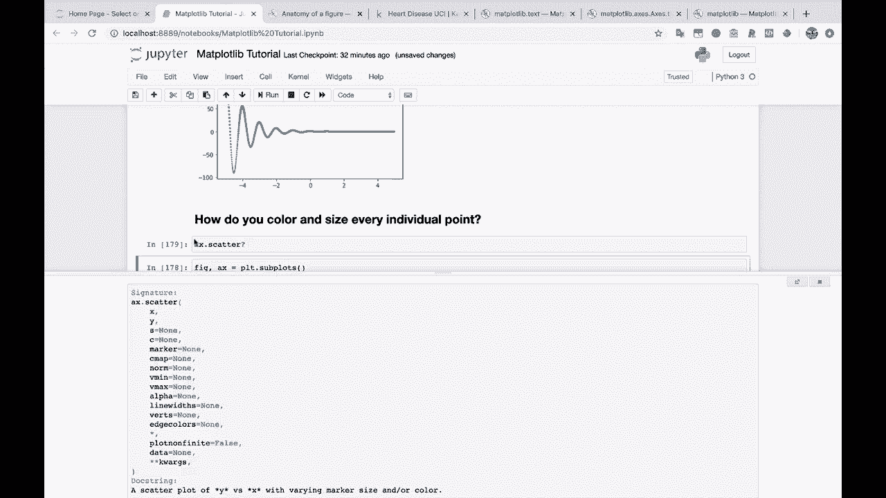
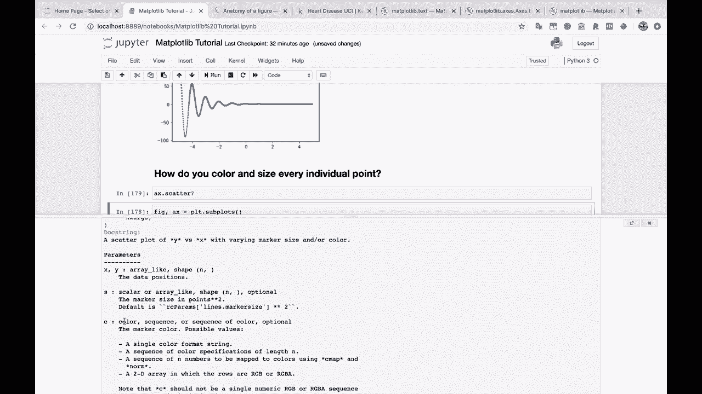
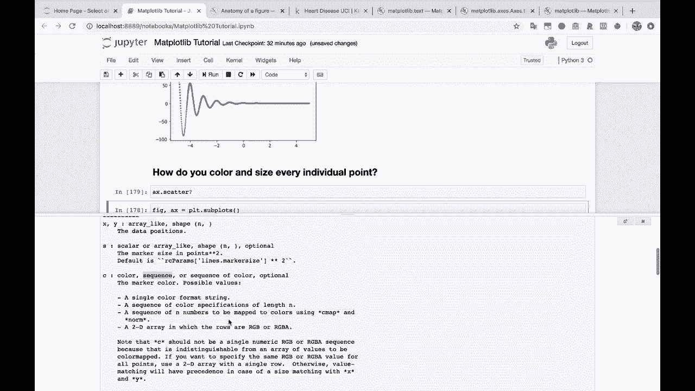
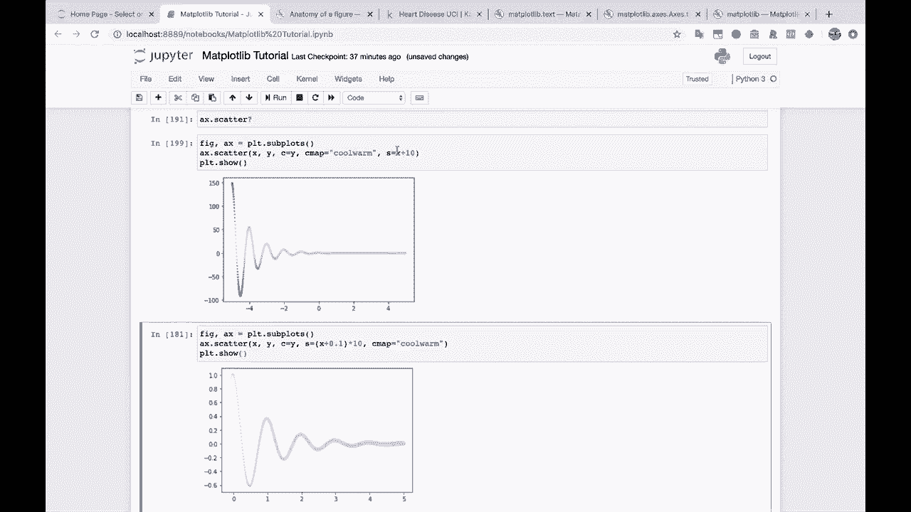
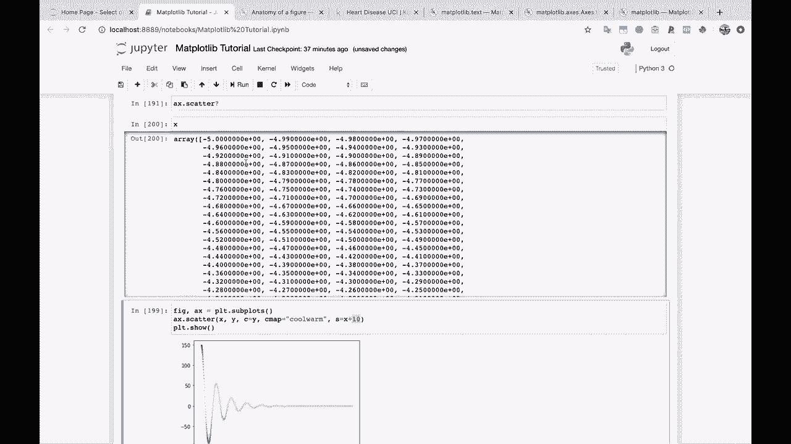
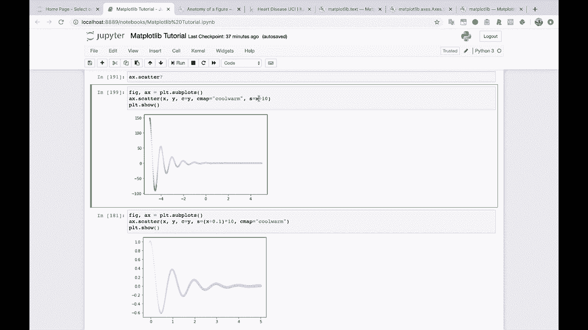

# 绘图必备Matplotlib，P21：21）更改散点图的大小和颜色 🎨



在本节课中，我们将要学习如何为散点图中的每个点设置不同的颜色和大小。这是数据可视化中突出显示数据不同维度的关键技巧。

---

上一节我们介绍了散点图的基本绘制方法。本节中我们来看看如何通过参数自定义每个点的外观。



核心操作是为 `scatter` 函数的 `s` 和 `c` 参数传入数组。`s` 控制点的大小，`c` 控制点的颜色。

```python
import matplotlib.pyplot as plt
import numpy as np

# 生成示例数据
x = np.arange(10)
y = x



# 为每个点生成大小和颜色数组
sizes = x * 10 + 0.1  # 确保所有大小为正值
colors = y  # 使用y值作为颜色映射的输入

plt.scatter(x, y, s=sizes, c=colors, cmap='viridis')
plt.show()
```



以下是关键参数的解释：
*   **`s`**：一个数组，指定每个散点的大小。
*   **`c`**：一个数组或颜色序列，指定每个散点的颜色。当传入数值数组时，通常需要配合 `cmap` 参数使用。
*   **`cmap`**：指定一个颜色映射（colormap），Matplotlib 会根据 `c` 数组中的数值，在此颜色映射中为每个点选取对应的颜色。



---



在传入 `s` 参数时，有一个重要的注意事项：所有的大小值必须是正数。如果数组中包含零或负数，可能会导致绘图错误或显示异常。



例如，如果直接使用 `x`（可能包含0）来计算大小，效果可能不理想。一个常见的做法是给数组加上一个小的正数偏移量。

```python
# 不推荐：x可能包含0，导致某些点大小为0
sizes_bad = x * 10



# 推荐：确保所有大小值为正
sizes_good = x * 10 + 0.1
```



---

当 `c` 参数传入一个数值数组时，Matplotlib 会使用指定的颜色映射（`cmap`）将这些数值映射为具体的颜色。这使得我们可以用颜色直观地表示数据的第三个维度（例如，Y值的大小）。

以下是设置颜色映射的步骤：
1.  准备一个与数据点数量相同的数值数组作为 `c` 参数。
2.  通过 `cmap` 参数指定一个颜色映射，如 `'viridis'`, `'plasma'`, `'coolwarm'` 等。

```python
plt.scatter(x, y, c=y, cmap='coolwarm')
plt.colorbar()  # 添加颜色条以显示数值与颜色的对应关系
plt.show()
```

---



本节课中我们一起学习了如何自定义散点图中每个点的外观。我们掌握了两个核心技巧：通过 `s` 参数数组控制点的大小，以及通过 `c` 参数数组配合 `cmap` 参数控制点的颜色。记住，确保大小数组中的值均为正数，这是正确绘图的关键。这项技能对于在单一图表中展示多个数据维度（例如，用点的大小表示销量，用颜色表示利润率）非常有帮助。