# 绘图必备Matplotlib，P22：22）使用对数轴绘图 📈

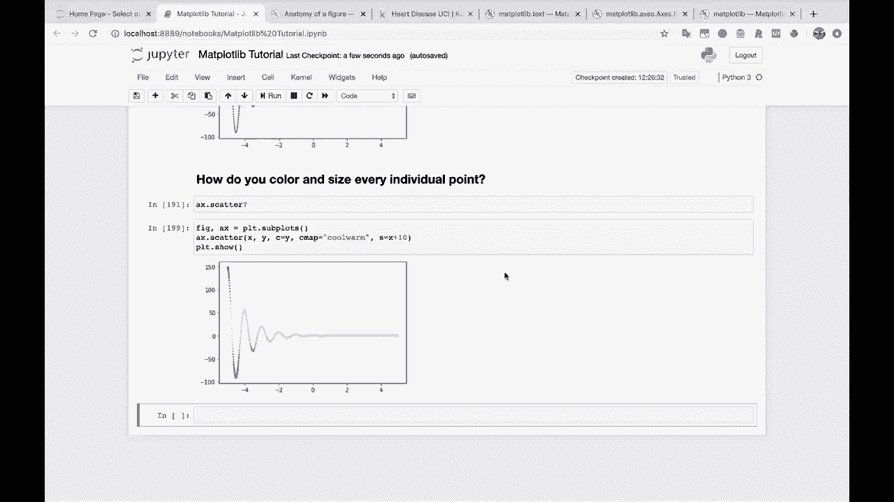

在本节课中，我们将要学习如何在Matplotlib中使用对数轴进行绘图。当数据值跨越多个数量级或呈指数增长时，使用对数轴可以更清晰地展示数据关系。

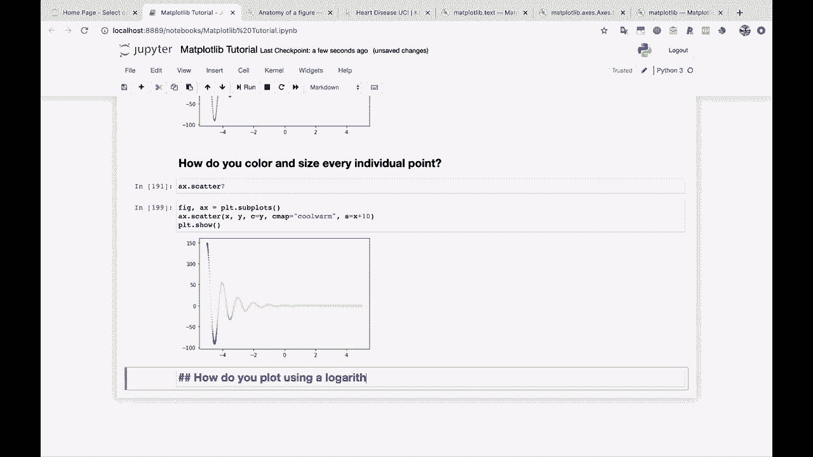

## 概述

有时，数据值会快速增长到非常大的数值，呈现指数增长趋势。在绘制图表时，这些数据可能全部聚集在图表的一侧，导致图表难以解读。使用对数轴是解决这类问题的有效方法。

## 对数轴的应用场景

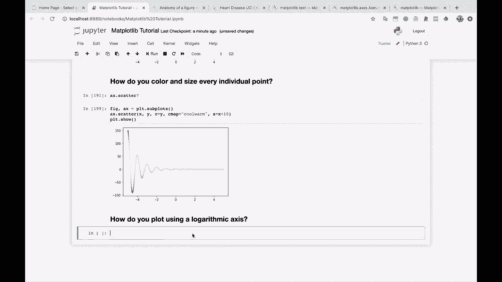

以下是几种适合使用对数轴的常见情况：
*   数据呈指数增长，跨越多个数量级。
*   直方图中，大量数据点聚集在某个狭窄区间内。
*   需要展示数据之间的比例关系，而非绝对差值。

## 实践：绘制指数函数

上一节我们介绍了对数轴的应用场景，本节中我们来看看如何具体实现。我们将通过一个指数函数的例子来演示。

首先，我们生成一组数据。X轴是从1到10，步长为0.1的序列。Y值由指数函数 `y = e^(x * 30)` 计算得出。

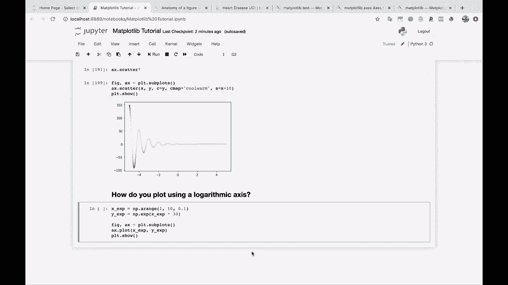

```python
import numpy as np
import matplotlib.pyplot as plt

x = np.arange(1, 10, 0.1)
y = np.exp(x * 30)
```

如果使用普通的线性坐标轴绘制这组数据，图表效果并不理想。

```python
plt.plot(x, y)
plt.show()
```


可以看到，Y轴的值增长极其迅速，最大值达到了约 `10^129` 数量级。图表左侧的数值几乎无法分辨，所有信息都压缩在图表右侧。

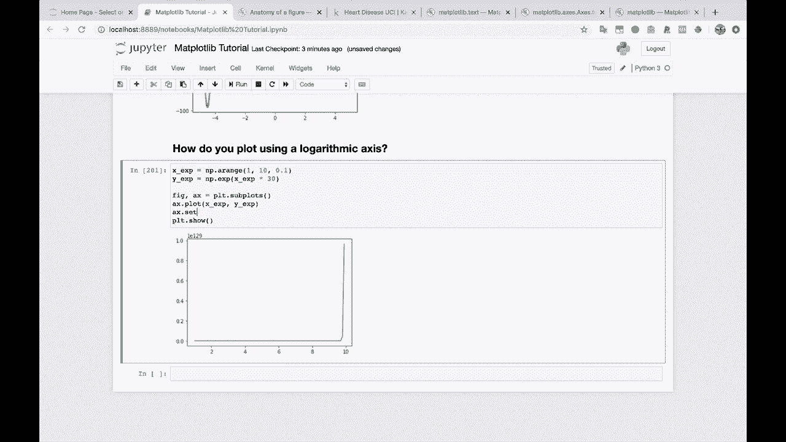

## 转换为对数轴

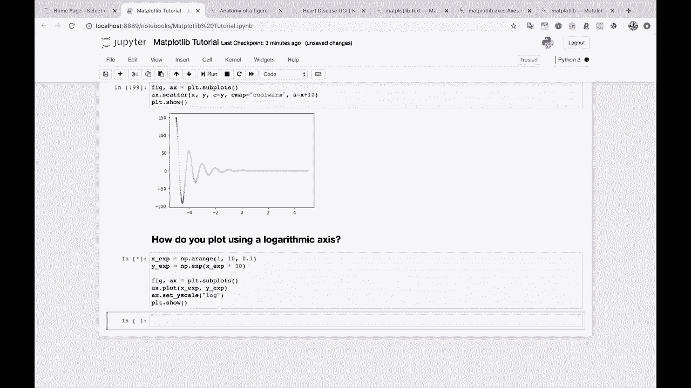

为了解决上述问题，我们可以将Y轴设置为对数刻度。Matplotlib提供了简单的方法来实现这一点。

以下是设置Y轴为对数刻度的代码：

```python
plt.plot(x, y)
plt.yscale('log')  # 设置Y轴为对数刻度
plt.show()
```

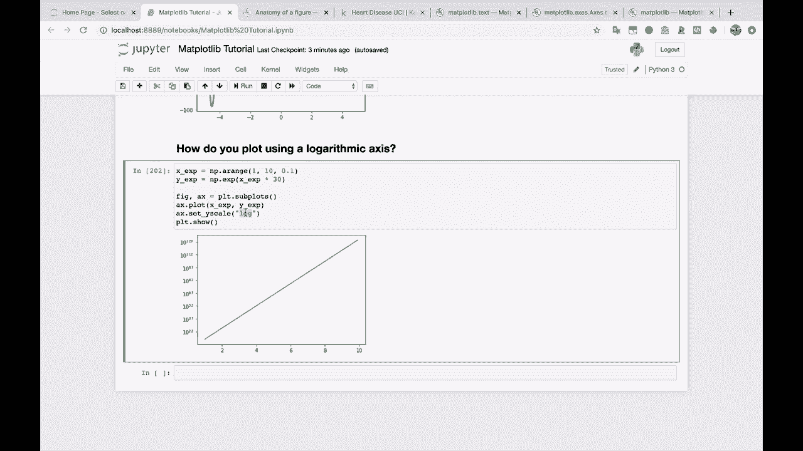


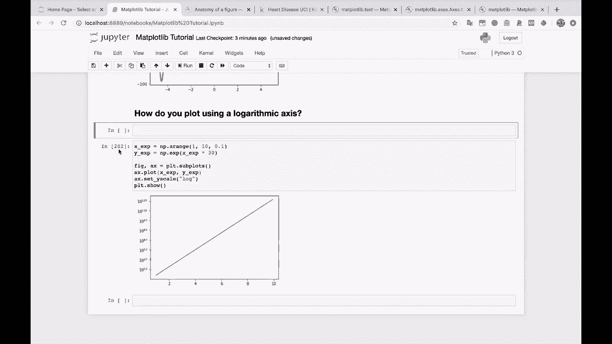

转换后，图表显示为一条美丽的直线。这表明X值与Y值的对数之间呈线性关系，这正是指数函数在对数坐标下的特征。对于展示此类数据，对数轴是一个优秀的选择。

## 其他应用：处理聚集数据

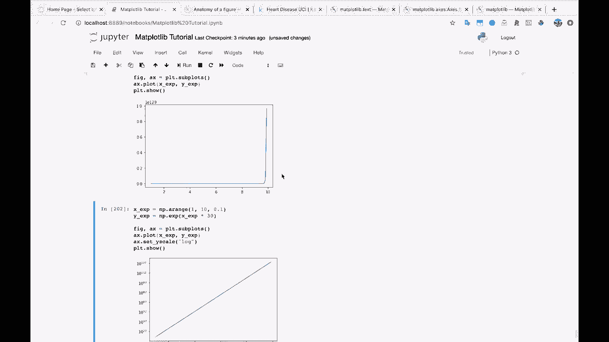

除了指数增长数据，对数轴对于处理数据分布严重不均的情况也很有帮助。例如，在直方图中，如果大部分数据都集中在某个很小的区间内，使用对数轴可以更清晰地展示整个数据分布的全貌。

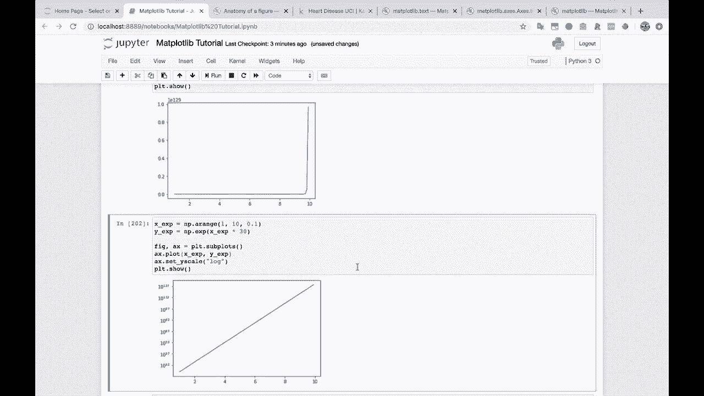


## 总结

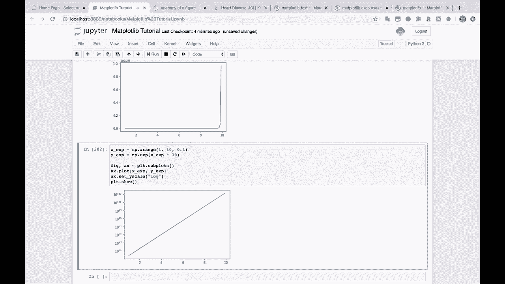

本节课中我们一起学习了在Matplotlib中使用对数轴绘图的方法。我们了解到，当数据值差异巨大或呈指数变化时，将坐标轴（通常是Y轴）设置为对数刻度（`plt.yscale('log')`），可以极大地改善图表的可读性，有效揭示数据的内在规律。这是在数据科学和可视化中处理宽范围数据的常用技巧。