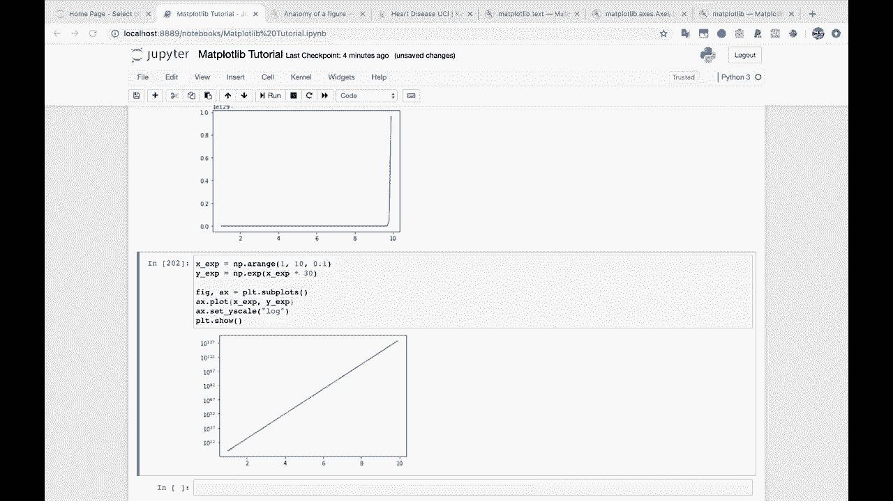
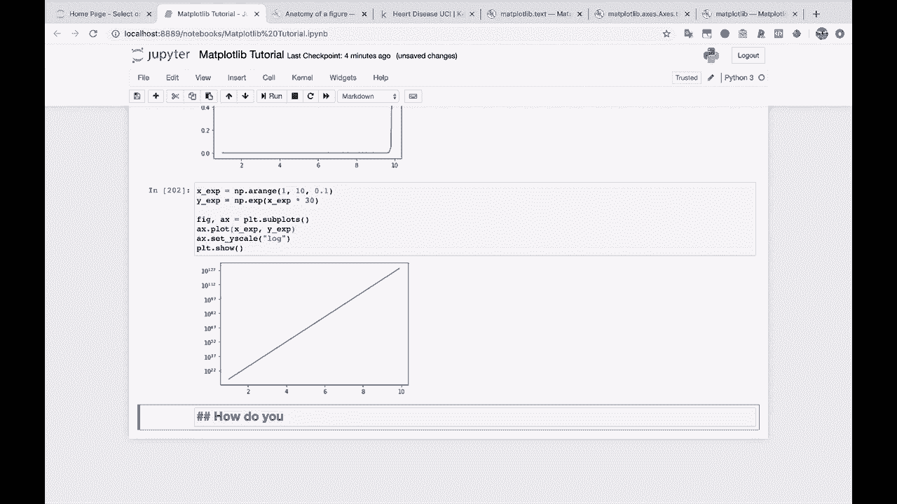
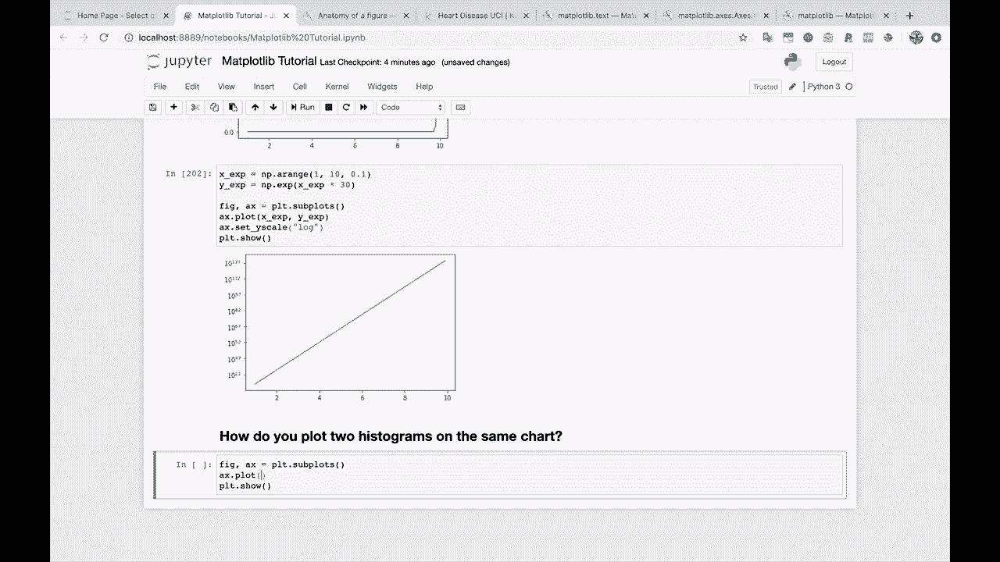
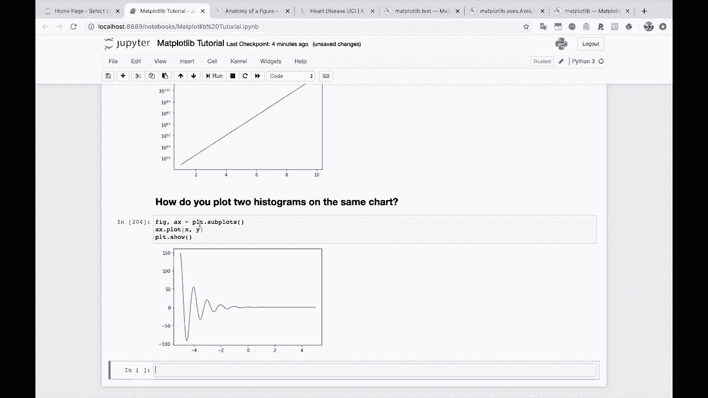
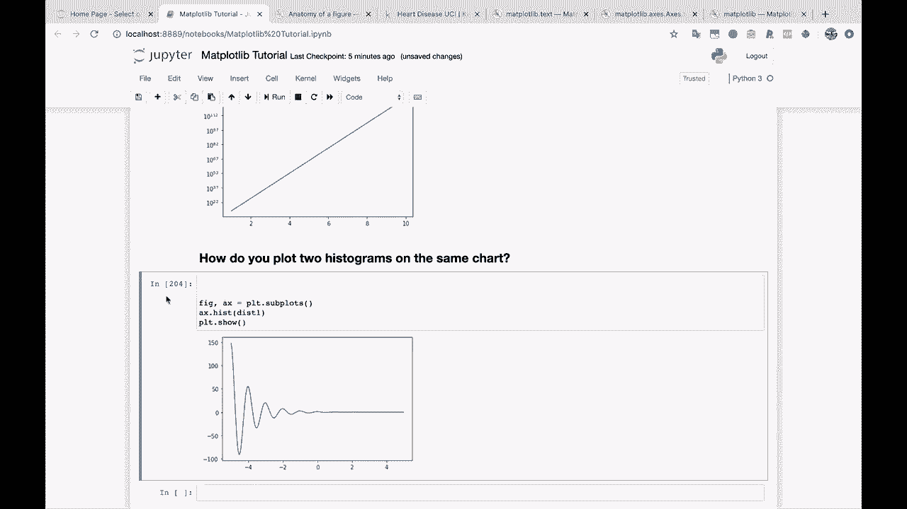
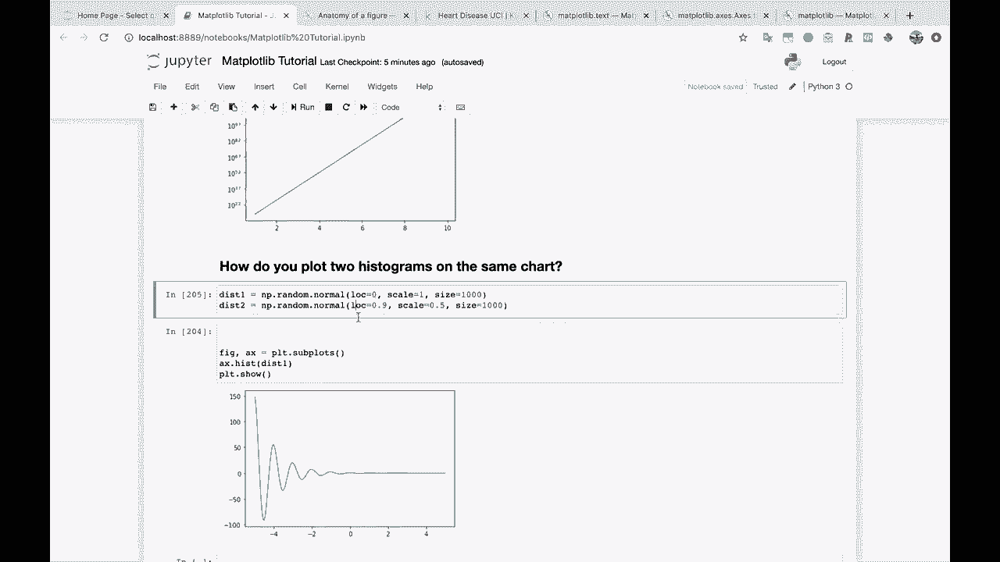
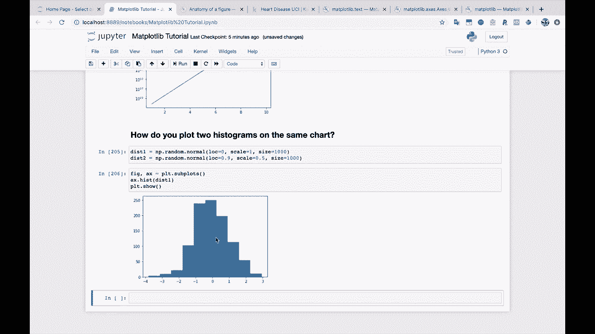
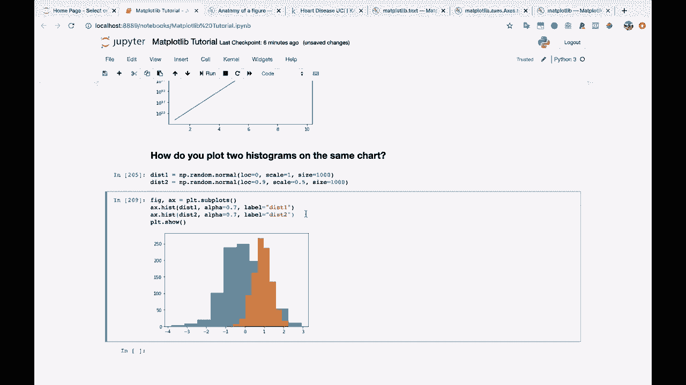
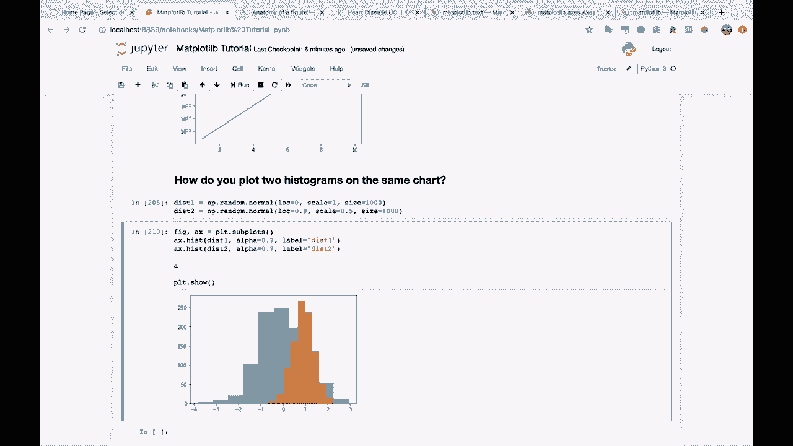
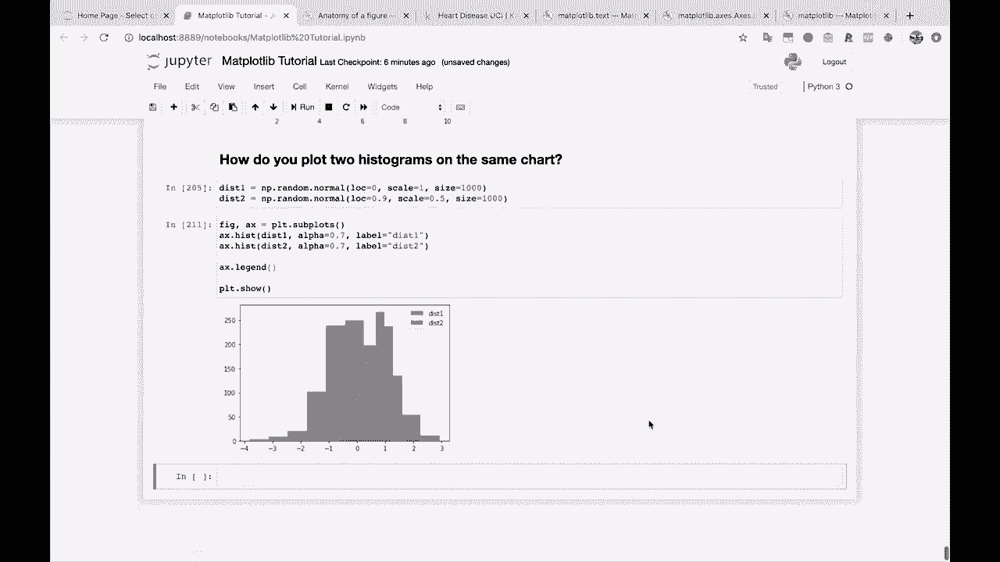

# 绘图必备Matplotlib，P23：在同一张图上绘制两个直方图 📊



在本节课中，我们将学习如何使用Matplotlib在同一张图表上绘制两个直方图。这是一个非常实用的技能，能帮助我们直观地比较两个数据集的分布情况。

## 概述



上一节我们介绍了如何绘制单个直方图。本节中，我们来看看如何将两个直方图叠加在同一坐标系中，以便进行对比分析。

## 准备数据



首先，我们需要准备两个数据集用于绘制直方图。我们将使用NumPy生成两个正态分布的数据集。

以下是生成数据的代码示例：
```python
import numpy as np



# 生成第一个正态分布数据集，均值为5，标准差为1
dist1 = np.random.normal(5, 1, 1000)
# 生成第二个正态分布数据集，均值为7，标准差为1.5
dist2 = np.random.normal(7, 1.5, 1000)
```

## 绘制第一个直方图

我们使用`ax.hist()`方法来绘制第一个直方图。

以下是绘制第一个直方图的代码：
```python
import matplotlib.pyplot as plt

fig, ax = plt.subplots()
ax.hist(dist1, label=‘Dist 1’)
plt.show()
```
运行上述代码，我们将在图表上看到第一个数据集的分布。



## 叠加第二个直方图



现在，你只需在同一个坐标系（`ax`）上再次调用`ax.hist()`方法，即可叠加第二个直方图。



以下是叠加第二个直方图的代码：
```python
ax.hist(dist2, label=‘Dist 2’)
```
这样，两个直方图就会显示在同一张图表上。方法非常简单直接。

## 使用透明度（Alpha）参数

当我们叠加多个图形时，一个非常有用的技巧是使用`alpha`参数来控制图形的透明度。这有助于我们看清被遮挡的部分。

以下是为两个直方图设置透明度的代码：
```python
fig, ax = plt.subplots()
# 绘制第一个直方图，设置透明度为0.7
ax.hist(dist1, alpha=0.7, label=‘Dist 1’)
# 绘制第二个直方图，设置透明度为0.7
ax.hist(dist2, alpha=0.7, label=‘Dist 2’)
plt.show()
```
将`alpha`值设为0.7后，两个直方图的颜色都会变得柔和，我们可以透过上层的图形看到下层的分布，对比效果更佳。

## 添加图例

为了清晰地区分两个直方图，我们需要为它们添加标签并显示图例。

以下是添加图例的完整代码示例：
```python
import numpy as np
import matplotlib.pyplot as plt

# 生成数据
dist1 = np.random.normal(5, 1, 1000)
dist2 = np.random.normal(7, 1.5, 1000)

# 创建图表和坐标系
fig, ax = plt.subplots()



# 绘制两个带标签和透明度的直方图
ax.hist(dist1, alpha=0.7, label=‘Dist 1’)
ax.hist(dist2, alpha=0.7, label=‘Dist 2’)



# 添加图例
ax.legend()

# 显示图表
plt.show()
```
运行这段代码，图表上就会显示一个图例，清楚地标明哪个颜色对应哪个数据集。



## 总结

本节课中，我们一起学习了如何在同一张Matplotlib图表上绘制两个直方图。我们掌握了生成对比数据、叠加图形、使用`alpha`参数调整透明度以及添加图例的关键步骤。这个技能是数据可视化中进行分布对比的基础，希望你能够熟练掌握。