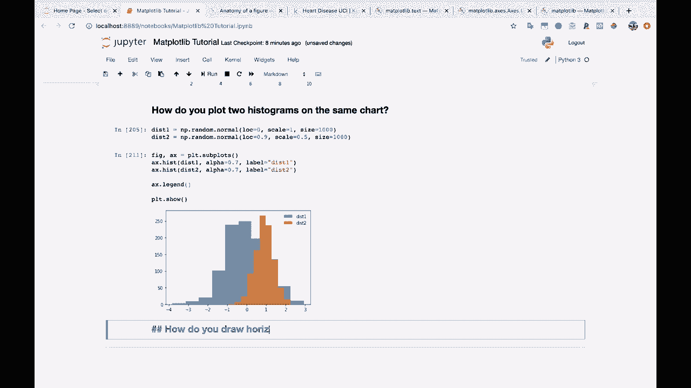
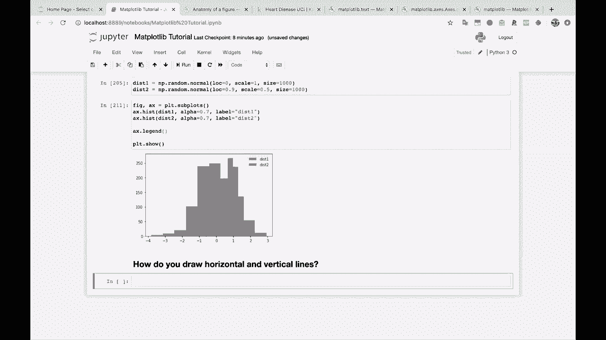
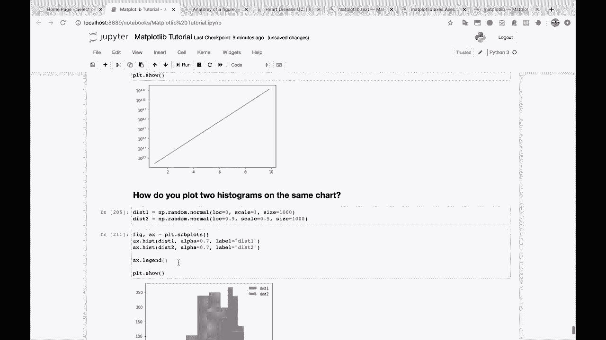
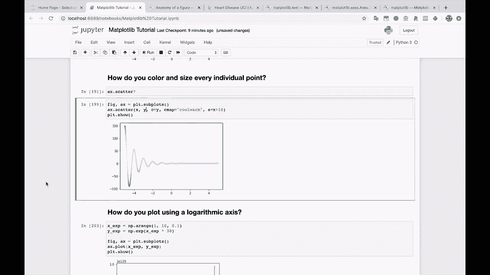
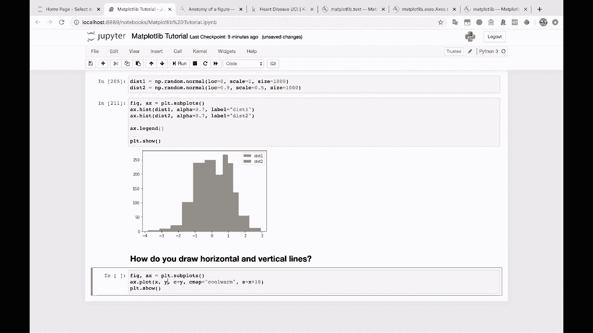
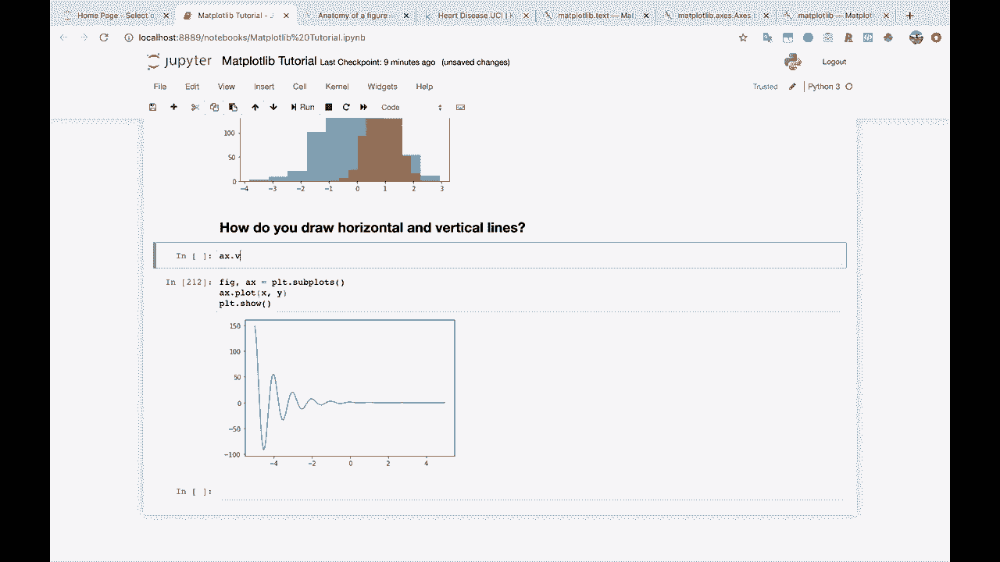
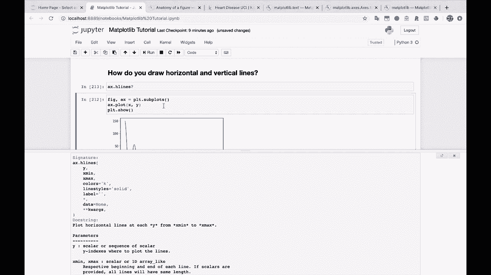
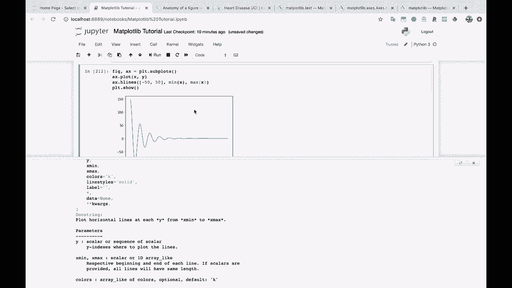
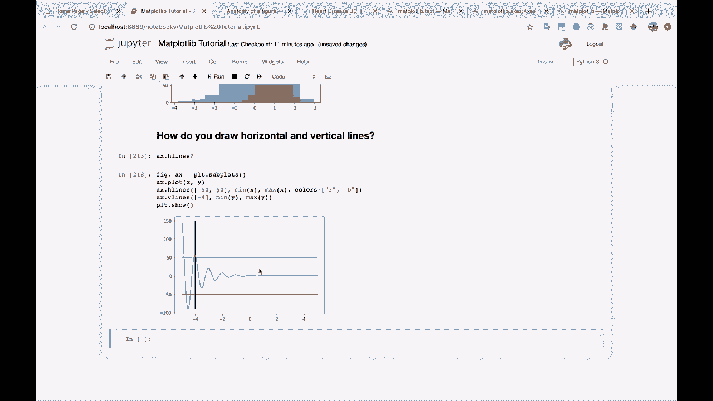

# 绘图必备Matplotlib，P24：24）绘制水平线和垂直线 📈

在本节课中，我们将学习如何使用Matplotlib在图表中绘制水平线和垂直线。这些线条常被用作参考线，以突出显示图表中的特定值或区域。

---



## 概述

绘制参考线是数据可视化中的常见需求。Matplotlib库提供了两个非常方便的函数：`axhline()` 用于绘制水平线，`axvline()` 用于绘制垂直线。本节教程将详细介绍这两个函数的使用方法。



---

## 准备绘图模板



在开始绘制线条之前，我们首先需要创建一个基础的图表作为画布。我们将使用一个简单的散点图作为示例。

```python
import matplotlib.pyplot as plt
import numpy as np



# 创建数据
x = np.linspace(-10, 10, 100)
y = x**2

# 创建图形和坐标轴
fig, ax = plt.subplots()
ax.scatter(x, y)  # 绘制散点图
```

---



## 绘制水平线

上一节我们创建了基础的散点图，本节中我们来看看如何添加水平参考线。水平线用于标记图表中特定的Y轴值。

绘制水平线使用 `ax.axhline()` 函数。该函数的核心参数是 `y`，它指定了水平线在Y轴上的位置。

以下是 `axhline()` 函数的基本用法：

*   **`y`**: 一个标量值，指定水平线的Y坐标位置。
*   **`xmin` 和 `xmax`**: 这两个参数定义了水平线在X轴上的起点和终点，取值范围在0到1之间，0表示坐标轴最左端，1表示最右端。默认值为0和1，即横跨整个图表。

例如，我们想在Y值为100、50和-50的位置绘制三条横跨整个图表的水平线：



```python
# 在Y=100处绘制一条红色水平线
ax.axhline(y=100, color='red')
# 在Y=50处绘制一条绿色水平线
ax.axhline(y=50, color='green')
# 在Y=-50处绘制一条蓝色水平线
ax.axhline(y=-50, color='blue')
```

如果你想精确控制水平线的起点和终点（例如，不从最左端开始），可以使用 `xmin` 和 `xmax` 参数。



---

## 绘制垂直线

学会了绘制水平线后，绘制垂直线就非常类似了。垂直线用于标记图表中特定的X轴值。

绘制垂直线使用 `ax.axvline()` 函数。其核心参数是 `x`，用于指定垂直线在X轴上的位置。

以下是 `axvline()` 函数的基本用法：

*   **`x`**: 一个标量值，指定垂直线的X坐标位置。
*   **`ymin` 和 `ymax`**: 这两个参数定义了垂直线在Y轴上的起点和终点，取值范围同样在0到1之间。默认值为0和1，即纵跨整个图表。

例如，我们想在X值为-4的位置绘制一条纵跨整个图表的垂直线：



```python
# 在X=-4处绘制一条紫色垂直线
ax.axvline(x=-4, color='purple')
```

与水平线一样，你也可以通过 `ymin` 和 `ymax` 参数来控制垂直线的长度。

---

## 结合使用与自定义

你可以将水平线、垂直线和原始图表自由组合。通过 `color` 参数，你可以轻松地为每条线指定不同的颜色，使其在图表中更加醒目。

完成所有绘制后，不要忘记使用 `plt.show()` 来显示最终的图表。

```python
# 显示图表
plt.show()
```

---

## 总结

本节课中我们一起学习了Matplotlib中两个绘制参考线的核心函数。



*   **`ax.axhline(y, xmin, xmax, ...)`**：用于在指定Y坐标处绘制水平线。
*   **`ax.axvline(x, ymin, ymax, ...)`**：用于在指定X坐标处绘制垂直线。

这两个函数参数简单，功能强大，是增强图表可读性和标注关键数据的实用工具。通过调整位置和颜色参数，你可以轻松地将参考线集成到各种可视化图表中。