# 绘图必备Matplotlib，P26：Matplotlib 可用的颜色 🎨

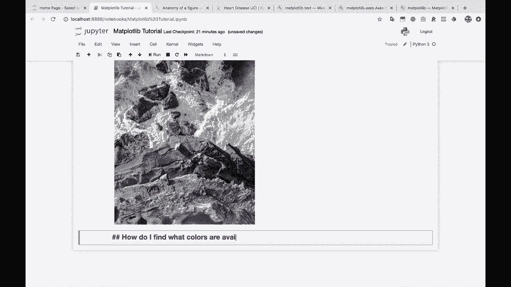

在本节课中，我们将学习如何在Matplotlib中查找和使用可用的颜色。对于初学者来说，颜色参数（如`cmap='gray'`或`color='r'`）可能会令人困惑。本节将介绍如何系统地探索Matplotlib的颜色系统。

## 导入颜色模块

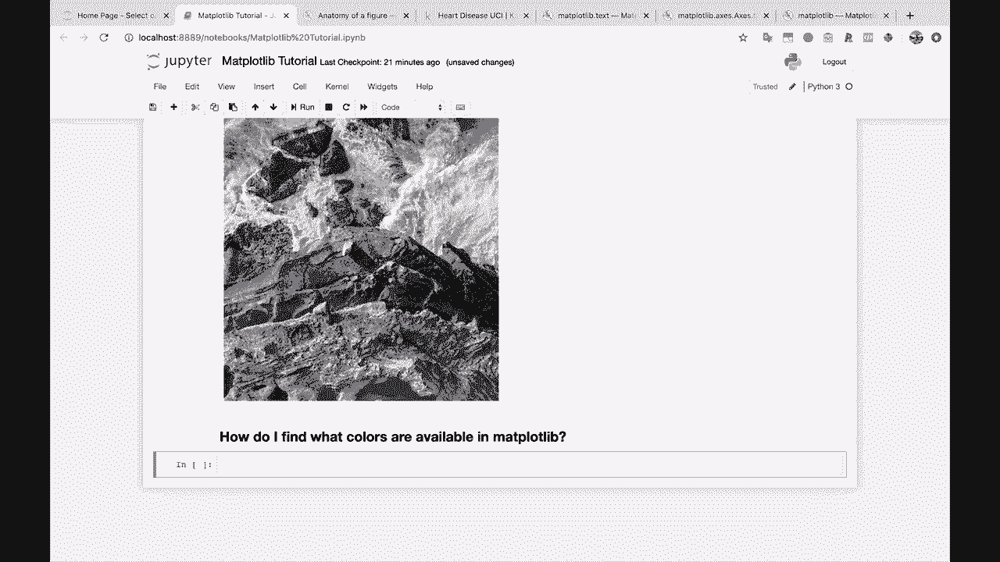


上一节我们介绍了基本的绘图参数，本节中我们来看看如何访问Matplotlib的颜色库。

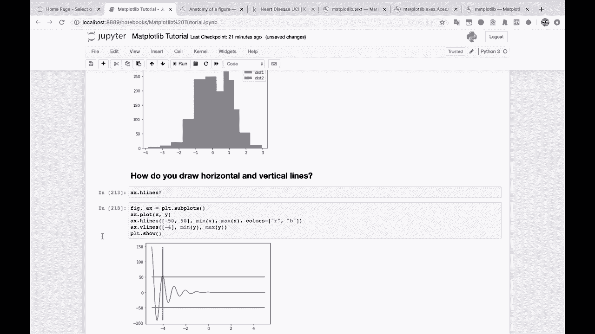

首先，我们需要从Matplotlib中导入颜色模块。

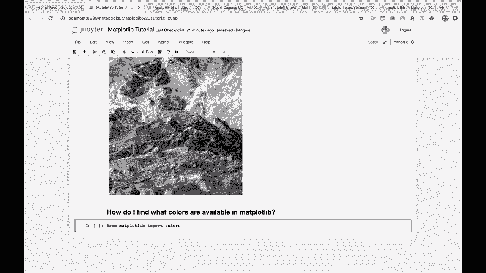

```python
import matplotlib.colors as mcolors
```

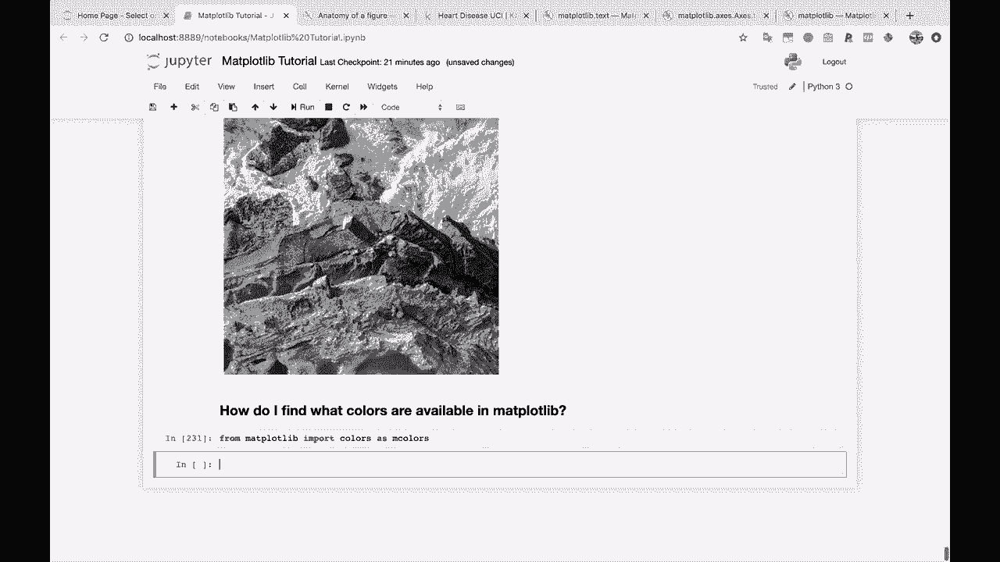

导入后，我们可以通过`mcolors`模块来探索所有可用的颜色。

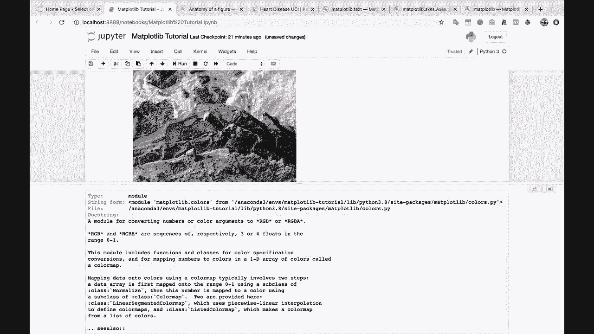

## 探索颜色列表

以下是探索`mcolors`模块中预定义颜色的方法。

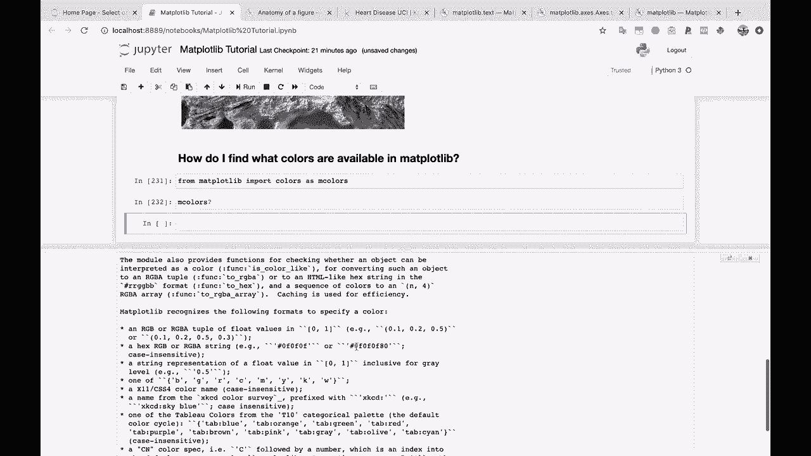

我们可以使用Python的交互功能（如Tab补全）来查看`mcolors`模块下的属性。其中一个重要的属性是`BASE_COLORS`，它包含了基本的颜色映射。

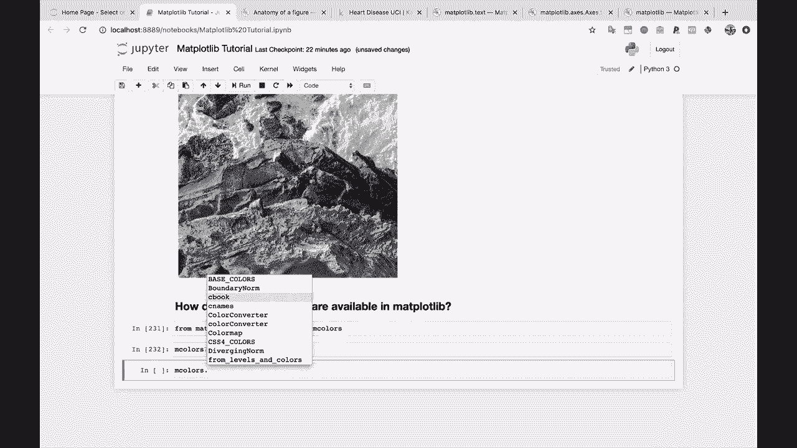

```python
print(mcolors.BASE_COLORS)
```
输出将是一个包含基本颜色名称（如`'b'`（蓝色）、`'g'`（绿色）、`'r'`（红色）和`'k'`（黑色））的字典。

继续向下探索，我们会发现`CSS4_COLORS`，这是一个更庞大的、符合CSS4标准的颜色名称列表，所有这些颜色都可以在Matplotlib中直接使用。

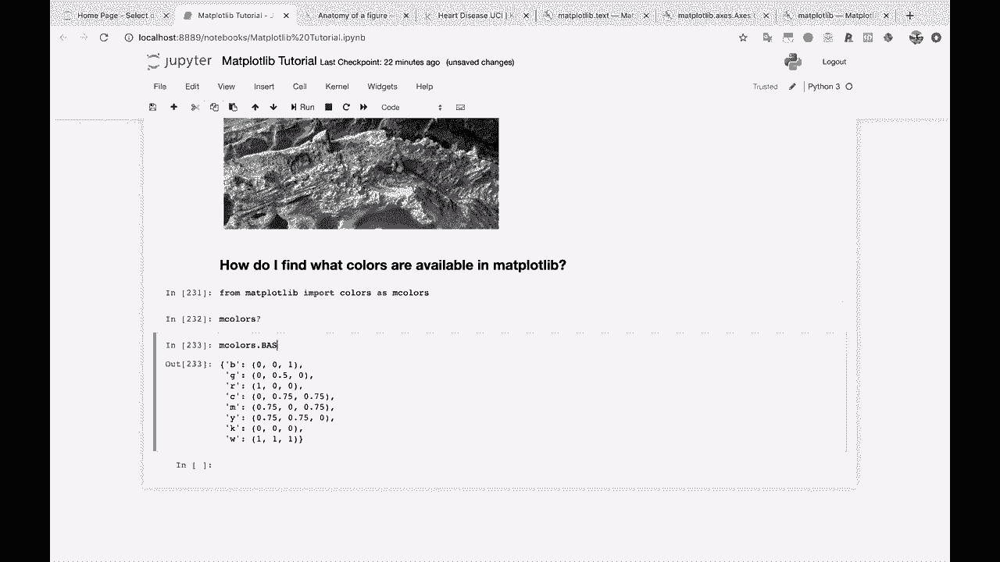

```python
print(list(mcolors.CSS4_COLORS.keys())[:10]) # 查看前10个颜色名
```

## XKCD颜色调查

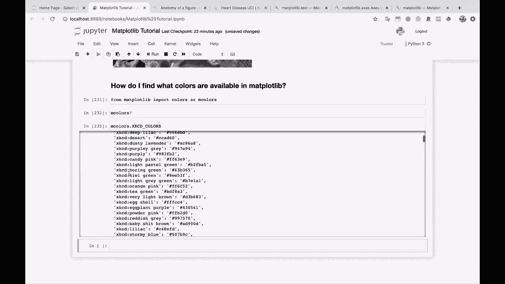

除了标准颜色，Matplotlib还包含一个有趣的“XKCD颜色”集合。这源于著名的网络漫画XKCD进行的一项颜色调查，它提供了许多富有创意且直观的颜色名称。


以下是访问XKCD颜色的方法。

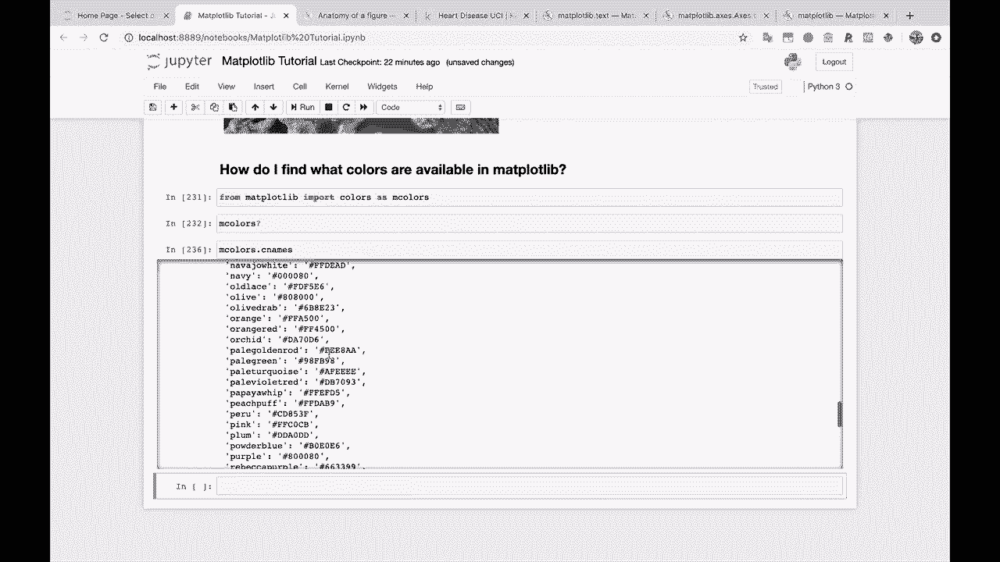

```python
print(list(mcolors.XKCD_COLORS.keys())[:10]) # 查看前10个XKCD颜色名
```
例如，你可以使用像`'xkcd:sky blue'`这样的颜色名称。

## 可视化所有命名颜色

为了更直观地了解所有可用的命名颜色，社区开发者创建了出色的可视化代码。虽然代码较长，但它能生成一个包含所有颜色及其名称的图表。

以下是生成该可视化图表的代码概要。

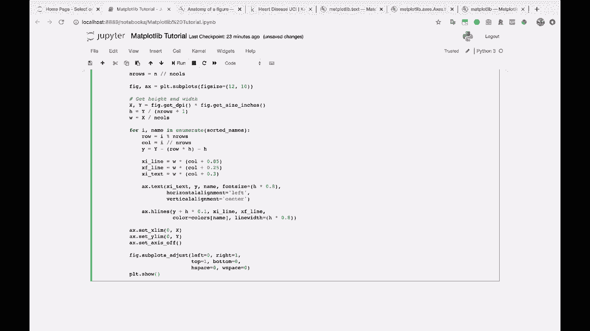

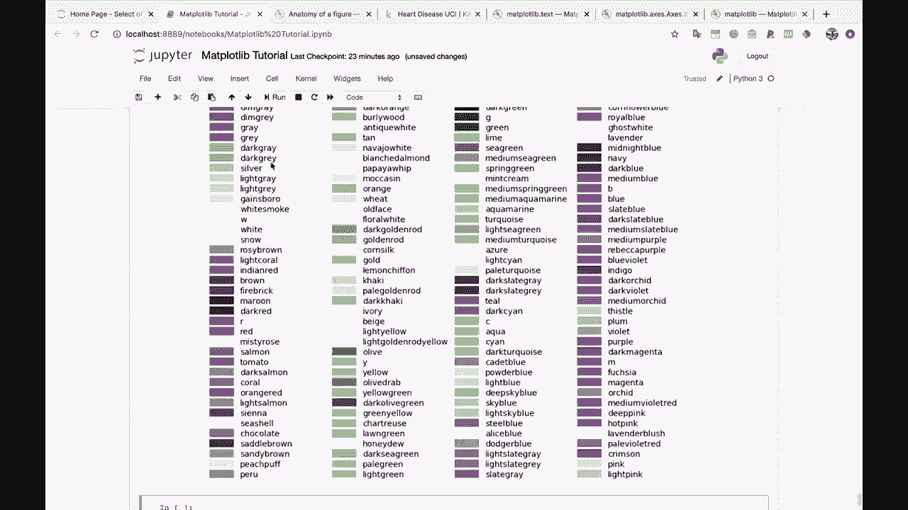

```python
# 此处应插入Stack Overflow上提供的可视化代码
# 由于代码较长，建议直接参考原链接或文档
```
运行这段代码后，你将看到一个显示Matplotlib中所有命名颜色及其对应名称的图表，这对于选择颜色非常有帮助。

## 总结

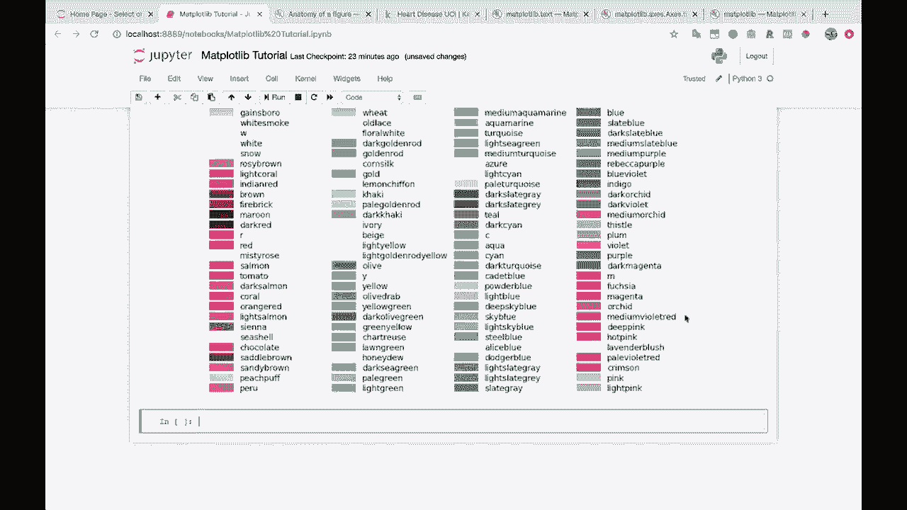

本节课中我们一起学习了如何在Matplotlib中查找和使用颜色。我们介绍了如何导入`mcolors`模块，探索了`BASE_COLORS`和`CSS4_COLORS`等基本颜色集，了解了有趣的XKCD颜色，并知道了如何通过社区资源可视化所有可用颜色。掌握这些方法将帮助你在绘图时更自如地运用色彩。