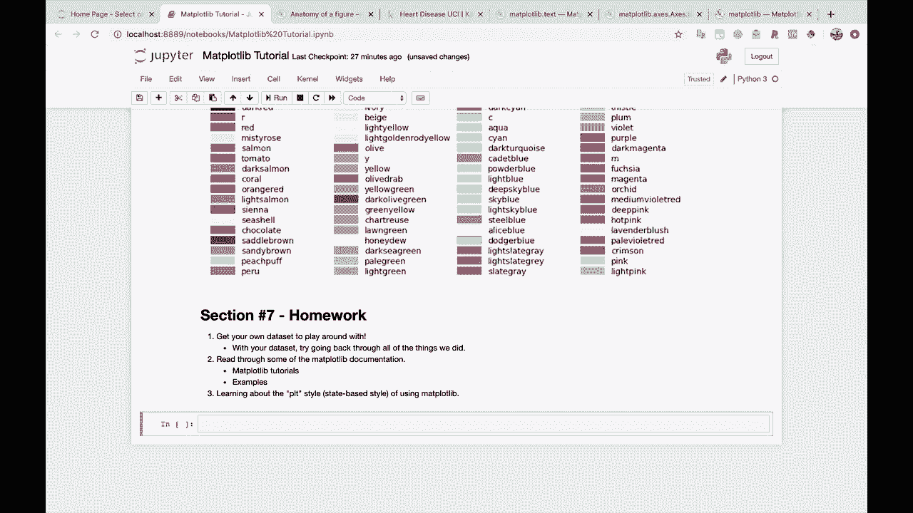
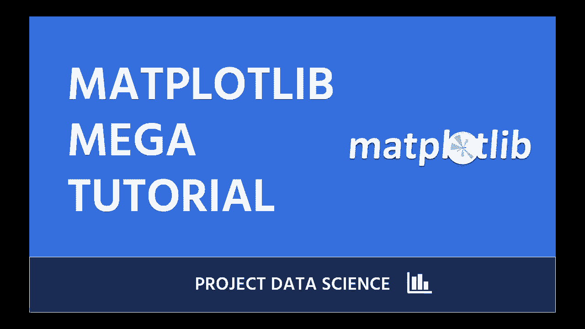

# 绘图必备Matplotlib，P27：27）进一步学习，总结与致谢 🏁

在本节课中，我们将对Matplotlib系列教程进行总结，并提供一些帮助你巩固知识和继续深入学习的建议。

---

## 教程总结

我们完成了一场信息量巨大的马拉松式教程。如果你觉得大脑难以消化所有内容，这很正常。

上一节我们介绍了高级绘图技巧，本节中我们来看看如何巩固所学并规划后续学习路径。

---

## 课后练习与建议

为了帮助你更好地掌握Matplotlib，以下是一些建议的后续学习步骤。

### 1. 实践个人数据集

当你对自己处理的数据感兴趣时，学习效果会更好。因此，请获取你感兴趣的数据集，并尝试绘制各种图表。这是巩固知识的绝佳方式。

一个小建议是：使用你自己的数据，回顾并复现我们在教程中完成的所有绘图类型。这将有助于强化你心中的知识体系。

### 2. 阅读官方文档

我建议你阅读Matplotlib的官方文档，这里有两个特别推荐的部分：
*   **Matplotlib教程**：这些教程非常出色，能帮助你巩固我们刚刚学到的许多内容。
*   **示例库**：查看官方提供的示例及其生成代码，这是学习高级技巧和获取灵感的宝贵资源。

### 3. 了解Pyplot风格

最后，我推荐你了解Pyplot风格，或者说学习使用Matplotlib的“状态机”风格。这是一种我们在教程中没有深入探讨的使用方式。

我并不一定推荐你主要使用这种风格。大多数情况下，我们教程中使用的面向对象风格是我推荐的方式。但你会看到其他人使用Pyplot风格的代码示例，因此至少了解它是什么是有益的。

---

## 致谢与展望

非常感谢你完成本教程。我希望你学到了很多知识，并能将其应用到自己的数据科学工作中。

如果你需要额外的数据科学教程，请务必查看Sentdex的其他数据科学视频和课程。欢迎留下评论，告诉我们你想学习什么，我们会尽力帮助你。

祝你在数据科学的学习之旅中愉快！我们下次再见。😊

---

本节课中，我们一起学习了如何通过实践、阅读文档和了解不同风格来巩固和扩展Matplotlib技能。恭喜你完成了整个系列的学习！