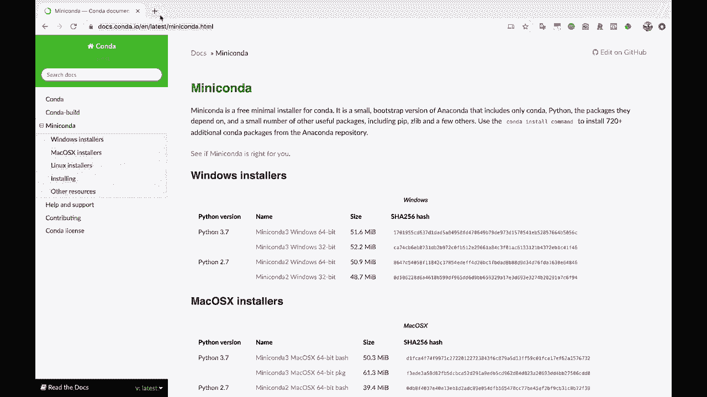
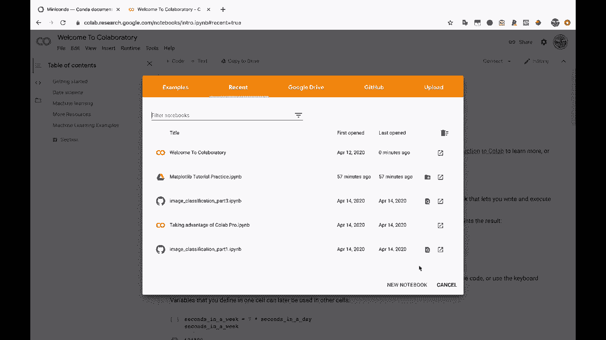
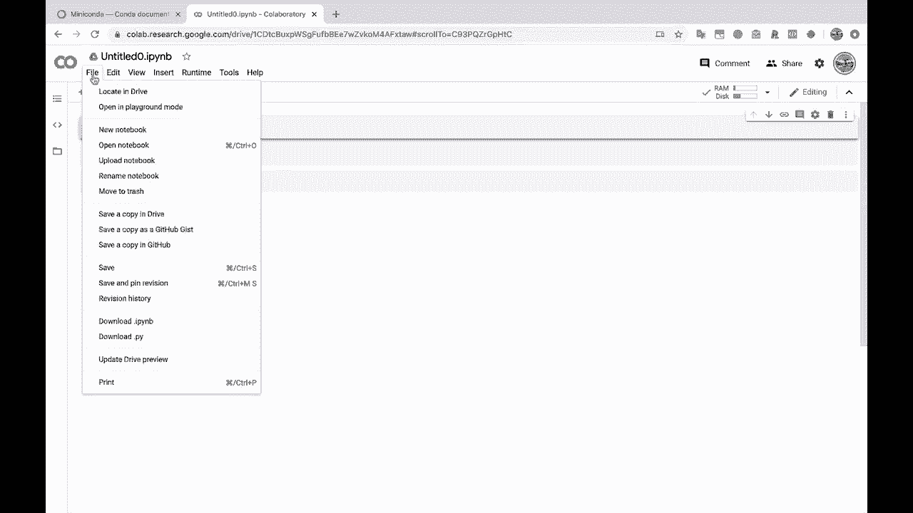
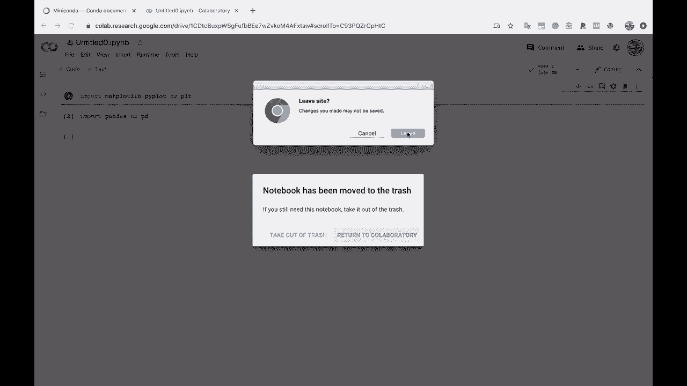
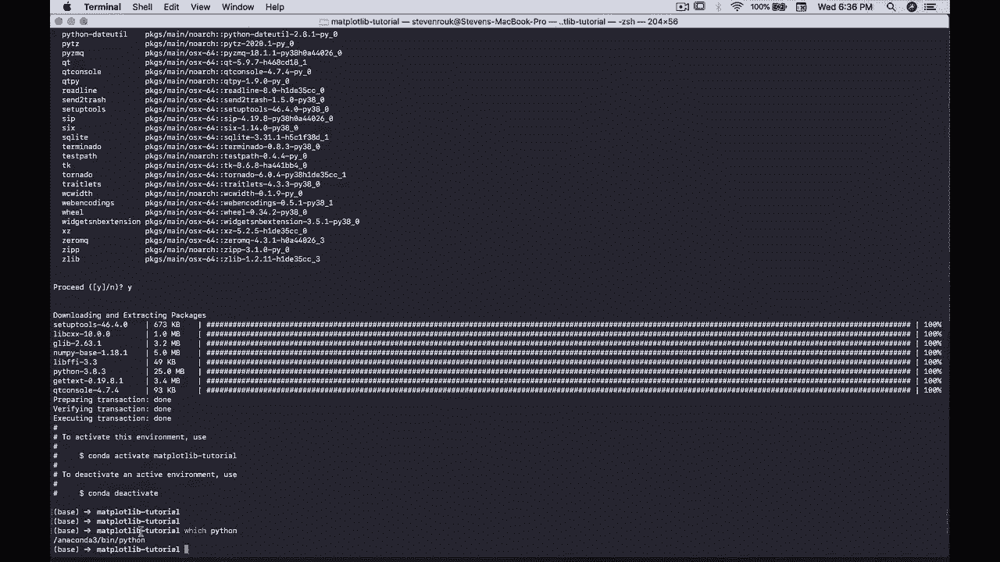
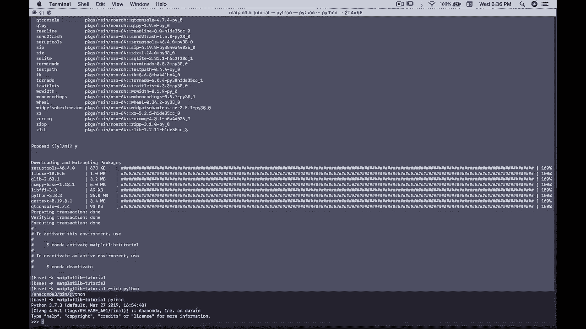
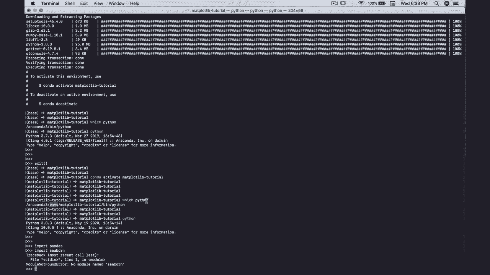

# 绘图必备Matplotlib，P3：使用虚拟环境或Colab设置Python环境 📊

在本节课中，我们将学习如何为Matplotlib绘图项目设置Python环境。我们将介绍两种主流方法：使用Conda创建本地虚拟环境，以及使用Google Colab这一云端平台。无论你是初学者还是希望保持环境整洁的开发者，都能找到适合自己的方案。

## 概述：为何需要设置环境

在开始绘图之前，我们需要一个包含必要工具（如Python、Matplotlib、Pandas和Jupyter Notebook）的工作环境。设置独立的环境是一种最佳实践，它能将项目所需的包隔离在一个目录中，避免与系统中其他项目的包发生冲突，从而保证项目的稳定性和可复现性。

---

## 方案一：使用Conda创建虚拟环境

Conda是一个强大的Python包管理器和虚拟环境管理器。如果你尚未安装，建议先访问Miniconda或Anaconda官网进行安装。



### 创建并激活虚拟环境

以下是创建名为`matplotlib_tutorial`的虚拟环境并安装所需包的核心步骤。



1.  **打开终端（或Anaconda Prompt）**，执行以下命令创建环境：
    ```bash
    conda create -n matplotlib_tutorial python jupyter matplotlib pandas numpy
    ```
    这个命令会创建一个新环境，并同时安装Python、Jupyter、Matplotlib、Pandas和Numpy。

2.  当Conda列出将要安装的包后，输入 `y` 并按回车确认安装。



3.  安装完成后，使用以下命令激活该环境：
    ```bash
    conda activate matplotlib_tutorial
    ```
    激活后，你的命令行提示符前通常会显示环境名称（如 `(matplotlib_tutorial)`），表明你已进入该环境。



### 验证环境

激活环境后，你可以验证Python解释器和包的路径是否已切换。

1.  输入 `which python`（Linux/Mac）或 `where python`（Windows）命令，查看当前使用的Python可执行文件路径。路径应指向Conda环境目录（例如 `.../anaconda3/envs/matplotlib_tutorial/bin/python`）。

2.  启动Python并尝试导入已安装的包：
    ```python
    import pandas
    import matplotlib
    ```
    如果导入成功且无报错，说明环境配置正确。你可以尝试导入一个未在此环境安装的包（如`seaborn`），将会收到 `ModuleNotFoundError`，这证明了环境的隔离性。

---

## 方案二：使用Google Colab

如果你不想在本地安装任何软件，或者希望快速开始，Google Colab是一个完美的选择。它是一个基于云端的Jupyter Notebook服务，通过浏览器即可运行。

### 开始使用Colab



以下是使用Google Colab的步骤。



1.  访问 [Google Colab](https://colab.research.google.com/)。

2.  点击“新建笔记本”，系统会自动为你创建一个新的Jupyter Notebook。

3.  Colab环境已预装了数据科学常用的库，包括Matplotlib、Pandas和Numpy。你可以在第一个代码单元格中直接运行 `import matplotlib.pyplot as plt` 进行验证。

使用Colab的优势在于无需配置，且能利用谷歌提供的免费计算资源（包括GPU），非常适合学习和快速原型开发。

---

## 总结与选择建议

本节课中，我们一起学习了两种设置Python绘图环境的方法。

*   **Conda虚拟环境**：适合需要在本地进行长期、复杂项目开发的用户。它能提供稳定、隔离且可自定义的环境。
*   **Google Colab**：适合初学者、教育场景或需要快速验证想法的用户。它提供了开箱即用的便利性和云端计算的灵活性。



对于有志于深入数据科学或数据分析的学习者，掌握本地虚拟环境的管理是一项有价值的技能。而对于希望零门槛快速上手绘图的朋友，Colab则是最佳起点。你可以根据自身需求灵活选择。在接下来的课程中，我们将在配置好的环境中开始真正的Matplotlib绘图之旅。