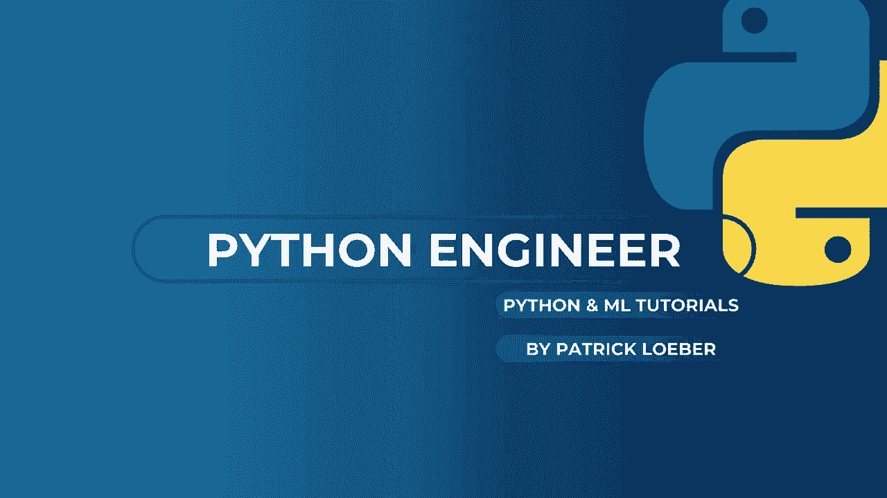
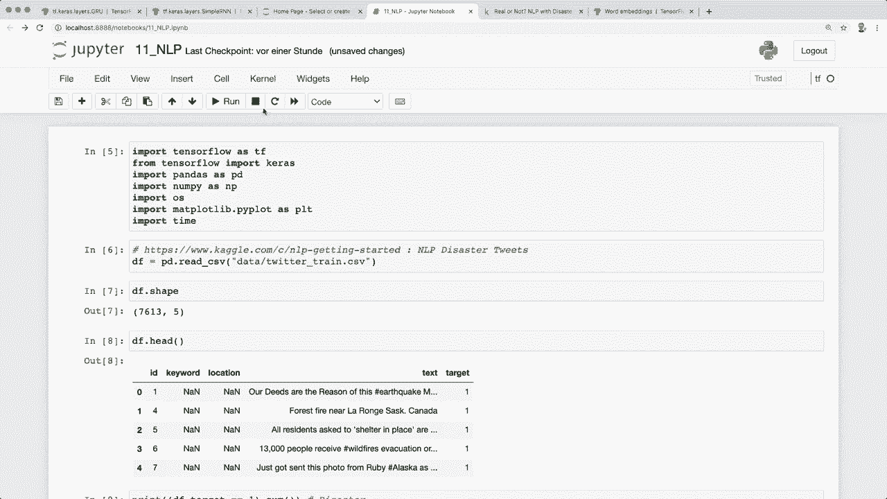

# TensorFlow 教程 P10：L11 - 文本分类 📚




在本教程中，我们将学习如何使用循环神经网络（RNN）进行文本分类。我们将分析来自Kaggle的“灾难推文”数据集，目标是预测一条推文是否与真实灾难事件有关。

## 数据加载与探索 🔍

首先，我们使用Pandas加载数据集。数据集包含7630个样本和5列。我们主要关注“text”列（推文内容）和“target”列（标签，0表示非灾难，1表示灾难）。

```python
import pandas as pd
data = pd.read_csv('train.csv')
print(data.shape)
print(data.head())
```

数据类别大致平衡，这有利于模型训练。

## 文本预处理 🧹

上一节我们加载了数据，本节中我们来看看如何对文本进行清洗和准备，以便输入模型。

以下是文本清洗的三个主要步骤：

1.  **移除URL**：使用正则表达式移除推文中的网址链接。
2.  **移除标点符号**：去除如 `!`， `?`， `.` 等字符。
3.  **移除停用词**：使用NLTK库移除“the”，“a”，“and”等常见但对语义贡献不大的词。

```python
import re
import nltk
from nltk.corpus import stopwords
nltk.download('stopwords')

def remove_url(text):
    return re.sub(r'https?://\S+|www\.\S+', '', text)

def remove_punct(text):
    return re.sub(r'[^\w\s]', '', text)

def remove_stopwords(text):
    stop_words = set(stopwords.words('english'))
    return " ".join([word for word in text.split() if word not in stop_words])

data['text'] = data['text'].map(remove_url).map(remove_punct).map(remove_stopwords)
```

## 数据划分与分词 📊

预处理完成后，我们需要将数据划分为训练集和验证集，并将文本转换为模型可以理解的数字序列。

我们将80%的数据用于训练，20%用于验证。

```python
train_size = int(0.8 * len(data))
train_df = data[:train_size]
val_df = data[train_size:]

train_sentences = train_df['text'].to_numpy()
train_labels = train_df['target'].to_numpy()
val_sentences = val_df['text'].to_numpy()
val_labels = val_df['target'].to_numpy()
```

接着，我们使用TensorFlow的`Tokenizer`将单词转换为整数索引。

```python
from tensorflow.keras.preprocessing.text import Tokenizer
from tensorflow.keras.preprocessing.sequence import pad_sequences

# 计算唯一单词数
all_words = ' '.join(train_sentences).split()
num_unique_words = len(set(all_words))

tokenizer = Tokenizer(num_words=num_unique_words)
tokenizer.fit_on_texts(train_sentences)

# 将句子转换为序列
train_sequences = tokenizer.texts_to_sequences(train_sentences)
val_sequences = tokenizer.texts_to_sequences(val_sentences)

# 对序列进行填充，使它们长度一致
max_length = 20
train_padded = pad_sequences(train_sequences, maxlen=max_length, padding='post', truncating='post')
val_padded = pad_sequences(val_sequences, maxlen=max_length, padding='post', truncating='post')
```

## 构建LSTM模型 🧠

现在数据已经准备就绪，我们可以构建模型了。我们将使用嵌入层（Embedding Layer）将单词索引转换为密集向量，然后使用LSTM层进行序列学习。

模型结构如下：
1.  **嵌入层**：将整数索引映射为固定大小的密集向量。
2.  **LSTM层**：学习文本序列中的长期依赖关系。
3.  **全连接层**：输出一个值，使用Sigmoid激活函数进行二分类（0或1）。

```python
import tensorflow as tf

model = tf.keras.Sequential([
    tf.keras.layers.Embedding(input_dim=num_unique_words, output_dim=32, input_length=max_length),
    tf.keras.layers.LSTM(64, dropout=0.1),
    tf.keras.layers.Dense(1, activation='sigmoid')
])

model.compile(loss='binary_crossentropy',
              optimizer='adam',
              metrics=['accuracy'])
model.summary()
```

## 训练与评估 🚀

我们使用训练数据来拟合模型，并在训练过程中用验证数据评估其性能。

```python
history = model.fit(train_padded, train_labels,
                    epochs=10,
                    validation_data=(val_padded, val_labels))
```

训练完成后，模型在训练集上准确率很高（例如98%），但在验证集上准确率可能较低（例如73%），这可能是过拟合的迹象。这为进一步优化模型（如调整超参数、增加正则化等）留下了空间。

## 进行预测 📈

最后，我们可以使用训练好的模型对新数据进行预测。

```python
# 对训练数据进行预测（示例）
predictions = model.predict(train_padded)
predicted_labels = (predictions > 0.5).astype("int32")

# 查看一些样本的预测结果
for i in range(5):
    print(f"原文: {train_sentences[i]}")
    print(f"真实标签: {train_labels[i]}")
    print(f"预测标签: {predicted_labels[i][0]}")
    print("-" * 50)
```

## 总结 ✨

本节课中我们一起学习了如何使用TensorFlow进行文本分类。我们涵盖了从数据加载、文本清洗、分词、序列填充到构建和训练一个LSTM模型的完整流程。核心步骤包括：
*   使用正则表达式和NLTK进行文本预处理。
*   使用 `Tokenizer` 和 `pad_sequences` 将文本转换为等长的数字序列。
*   构建一个包含 **嵌入层**、**LSTM层** 和 **全连接层** 的序列模型。
*   使用 `model.fit()` 进行训练，并观察训练与验证指标以评估模型性能。

通过本教程，你已经掌握了应用基本自然语言处理技术和RNN模型进行文本分类的基础知识。



