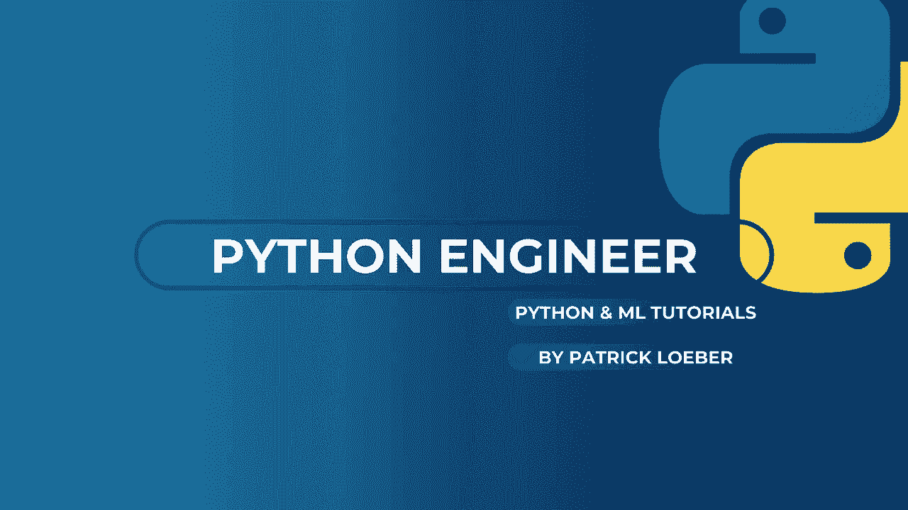
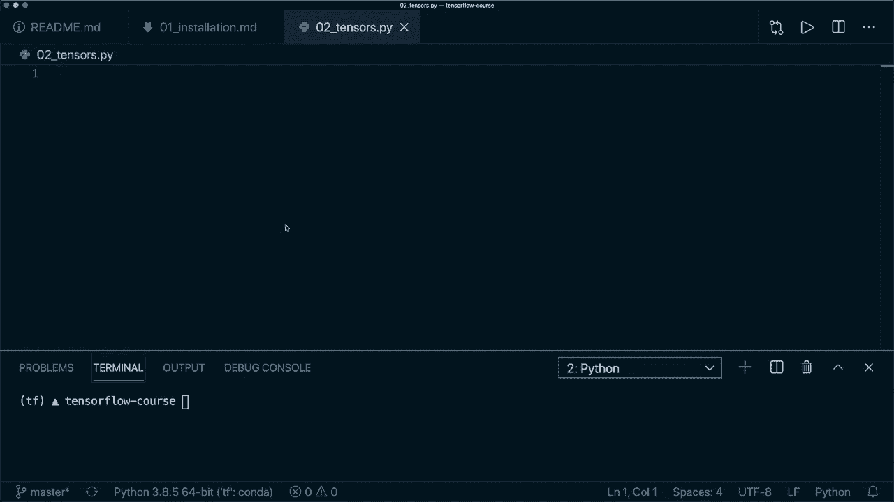
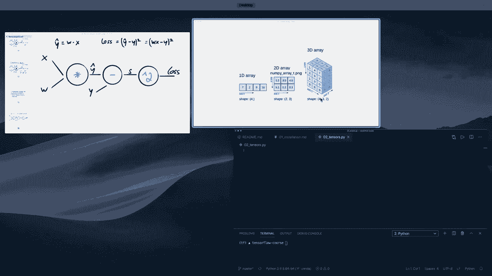
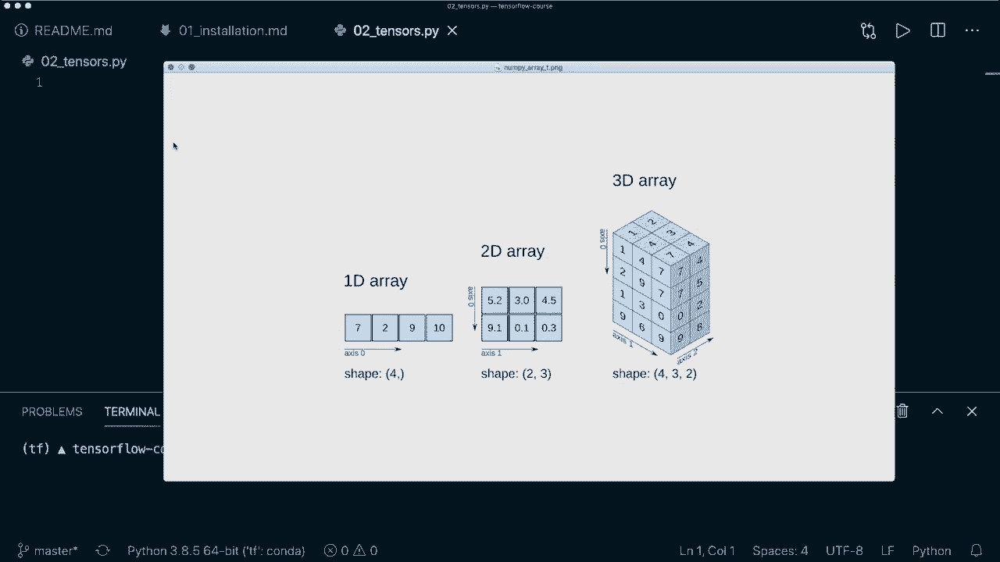
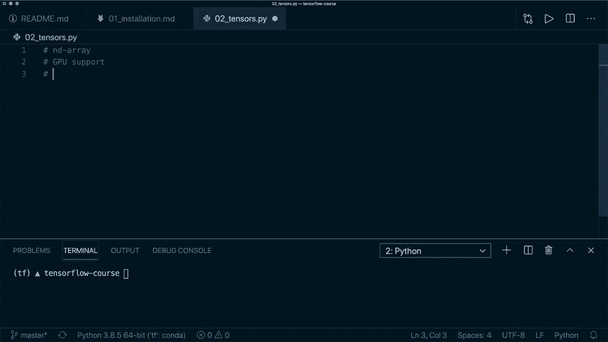
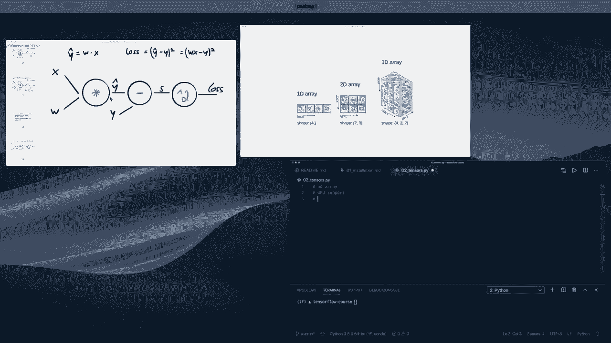
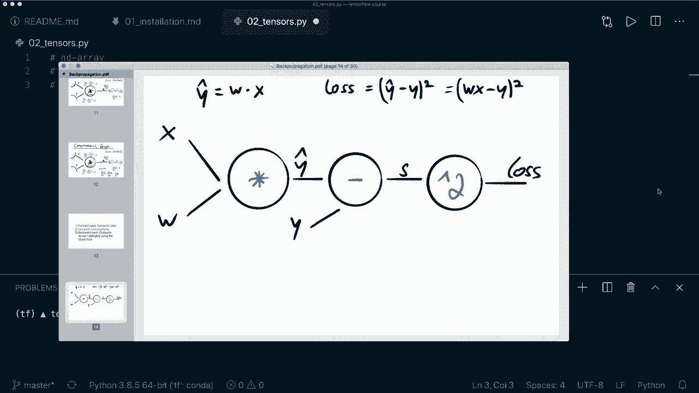
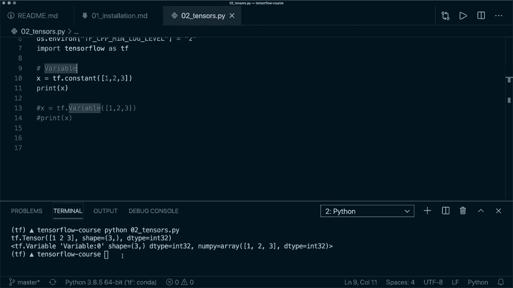

# TensorFlow 初学者教程 P2：📊 张量基础



在本教程中，我们将学习 TensorFlow 的核心对象——张量。我们将了解张量的定义、如何创建它们、如何对它们进行操作，以及一些实用的转换和切片技巧。

---



## 概述



张量是 TensorFlow 库中的核心对象，所有操作都基于张量。张量类似于 N 维数组，可以表示 1D、2D、3D 甚至更高维度的数据。它们的设计支持 GPU 加速，并能用于构建计算图以跟踪计算和反向传播。

---



## 什么是张量？

张量是 N 维数组，其设计使其具有 GPU 支持。此外，张量用于构建计算图，以便后续进行梯度计算和反向传播。例如，将两个张量相乘是计算图中的一个操作，后续的减法也是另一个操作。这些操作被记录下来，用于计算梯度。

张量是不可变的，这意味着不能直接更新张量中的内容，只能创建一个新的张量。





---



## 创建张量

首先，我们需要导入 TensorFlow 库。

```python
import tensorflow as tf
```

为了消除可能的警告信息，可以添加以下代码：

```python
import os
os.environ['TF_CPP_MIN_LOG_LEVEL'] = '2'
```

### 创建常量张量

使用 `tf.constant` 函数可以创建张量。

```python
x = tf.constant(5)
print(x)
```

这将创建一个包含单个标量值的张量。我们还可以指定张量的形状和数据类型。

```python
x = tf.constant(5, shape=(1, 1), dtype=tf.float32)
print(x)
```

现在，张量不仅是一个标量值，而是一个矩阵，并且具有指定的数据类型。

### 创建多维张量

我们可以创建包含列表的张量。

```python
# 创建 1D 张量（秩为1）
x = tf.constant([1, 2, 3])
print(x)

# 创建 2D 张量（秩为2）
x = tf.constant([[1, 2, 3], [4, 5, 6]])
print(x)
```

### 使用特定值填充张量

TensorFlow 提供了几种用特定值初始化张量的方法。

以下是几种常用的初始化方法：

```python
# 创建全1张量
ones_tensor = tf.ones((3, 3))
print(ones_tensor)

# 创建全0张量
zeros_tensor = tf.zeros((3, 3))
print(zeros_tensor)

# 创建单位矩阵
eye_tensor = tf.eye(3)
print(eye_tensor)
```

### 创建随机张量

我们可以从不同的分布中生成随机值来初始化张量。

```python
# 从正态分布中抽取随机值
normal_tensor = tf.random.normal((3, 3), mean=0, stddev=1)
print(normal_tensor)

# 从均匀分布中抽取随机值
uniform_tensor = tf.random.uniform((3, 3), minval=0, maxval=1)
print(uniform_tensor)
```

### 创建范围张量

使用 `tf.range` 函数可以创建类似 Python `range` 的张量。

```python
range_tensor = tf.range(10)
print(range_tensor)
```

默认数据类型是 `int32`。如果需要转换数据类型，可以使用 `tf.cast` 函数。

```python
range_tensor_float = tf.cast(range_tensor, dtype=tf.float32)
print(range_tensor_float)
```

---

## 张量操作

所有张量操作都是逐元素进行的。让我们创建两个张量并演示基本操作。

```python
x = tf.constant([1, 2, 3])
y = tf.constant([4, 5, 6])
```

### 逐元素加法

```python
# 使用 tf.add 函数
c = tf.add(x, y)
print(c)

# 使用 + 运算符
c = x + y
print(c)
```

### 逐元素减法

```python
# 使用 tf.subtract 函数
c = tf.subtract(x, y)
print(c)

# 使用 - 运算符
c = x - y
print(c)
```

### 逐元素除法

```python
# 使用 tf.divide 函数
c = tf.divide(x, y)
print(c)

# 使用 / 运算符
c = x / y
print(c)
```

### 逐元素乘法

```python
# 使用 tf.multiply 函数
c = tf.multiply(x, y)
print(c)

# 使用 * 运算符
c = x * y
print(c)
```

### 点积

使用 `tf.tensordot` 函数可以计算两个张量的点积。

```python
c = tf.tensordot(x, y, axes=1)
print(c)
```

### 逐元素指数运算

使用 `**` 运算符可以进行逐元素的指数运算。

```python
c = x ** 3
print(c)
```

### 矩阵乘法

对于矩阵乘法，可以使用 `tf.matmul` 函数或 `@` 运算符。

```python
x = tf.random.normal((2, 3))
y = tf.random.normal((3, 4))

# 使用 tf.matmul 函数
c = tf.matmul(x, y)
print(c)

# 使用 @ 运算符
c = x @ y
print(c)
```

---

## 张量切片与索引

张量的切片和索引方式与 NumPy 数组或 Python 列表类似。

```python
x = tf.constant([[1, 2, 3, 4], [5, 6, 7, 8]])
```

### 访问特定行

```python
# 访问第一行
row = x[0]
print(row)
```

### 访问特定列

```python
# 访问所有行的第一列
col = x[:, 0]
print(col)
```

### 访问子集

```python
# 访问第一行的第二和第三列
subset = x[0, 1:3]
print(subset)
```

### 访问特定元素

```python
# 访问第一行第二列的元素
element = x[0, 1]
print(element)
```

---

## 张量重塑

使用 `tf.reshape` 函数可以改变张量的形状。

```python
x = tf.random.normal((2, 3))
print("原始形状:", x.shape)

# 重塑为 3x2 形状
x_reshaped = tf.reshape(x, (3, 2))
print("重塑后形状:", x_reshaped.shape)

# 使用 -1 自动推断维度
x_auto = tf.reshape(x, (-1, 2))
print("自动推断形状:", x_auto.shape)
```

---

## 张量与 NumPy 数组的转换

张量可以轻松转换为 NumPy 数组，反之亦然。

### 转换为 NumPy 数组

```python
x_tensor = tf.constant([1, 2, 3])
x_numpy = x_tensor.numpy()
print("NumPy 数组:", x_numpy)
print("类型:", type(x_numpy))
```

### 转换为张量

```python
x_tensor_again = tf.convert_to_tensor(x_numpy)
print("张量:", x_tensor_again)
print("类型:", type(x_tensor_again))
```

---

## 字符串张量与变量

### 字符串张量

张量不仅可以包含数字，还可以包含字符串。

```python
string_tensor = tf.constant("Hello")
print(string_tensor)

string_list_tensor = tf.constant(["Alice", "Bob", "Max"])
print(string_list_tensor)
```

### TensorFlow 变量

除了常量张量，TensorFlow 还提供了变量张量，用于存储和更新模型参数。

```python
# 创建常量张量
const_tensor = tf.constant([1, 2, 3])
print(const_tensor)

# 创建变量张量
var_tensor = tf.Variable([1, 2, 3])
print(var_tensor)
```

变量张量在训练过程中用于更新权重，但通常我们使用更高级的 API（如 Keras）来处理这些细节。

---

## 总结



在本教程中，我们一起学习了 TensorFlow 张量的基础知识。我们了解了张量的定义、如何创建各种类型的张量、如何进行基本的数学操作、如何切片和索引、如何重塑张量，以及如何在张量和 NumPy 数组之间进行转换。此外，我们还简要介绍了字符串张量和 TensorFlow 变量。掌握这些基础知识是使用 TensorFlow 进行更高级操作的关键。