# TensorFlow 初学者教程 P3：L3 - 第一个神经网络（训练、评估和预测） 🧠


在本节课中，我们将学习如何使用 TensorFlow 的 Keras API 构建、训练、评估你的第一个神经网络，并用它进行预测。我们将使用经典的手写数字 MNIST 数据集来完成一个多类别分类任务。

## 概述 📋

我们将按照以下步骤进行：
1.  导入必要的库并加载数据。
2.  对数据进行预处理（归一化）。
3.  使用 Keras Sequential API 构建神经网络模型。
4.  编译模型，指定损失函数、优化器和评估指标。
5.  在训练数据上训练模型。
6.  在测试数据上评估模型性能。
7.  使用训练好的模型对新数据进行预测。

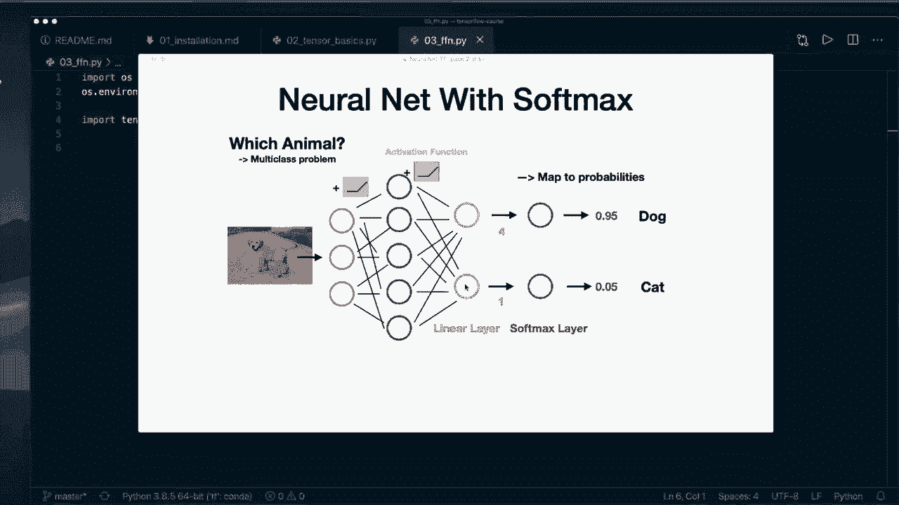

---

## 1. 环境准备与数据加载

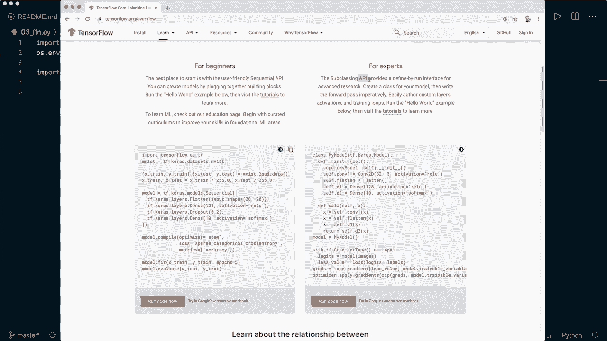

首先，我们需要导入 TensorFlow 和其他必要的库，并加载 MNIST 数据集。

```python
import tensorflow as tf
from tensorflow import keras
import numpy as np
import matplotlib.pyplot as plt

# 加载 MNIST 数据集
(x_train, y_train), (x_test, y_test) = keras.datasets.mnist.load_data()
```

MNIST 数据集包含 60,000 张训练图像和 10,000 张测试图像，每张图像是 28x28 像素的手写数字灰度图。让我们查看一下数据的形状。

```python
print(x_train.shape) # 输出: (60000, 28, 28)
print(y_train.shape) # 输出: (60000,)
```

---

## 2. 数据预处理

原始图像的像素值范围是 0 到 255。为了帮助模型更好地学习，我们将其归一化到 0 到 1 之间。

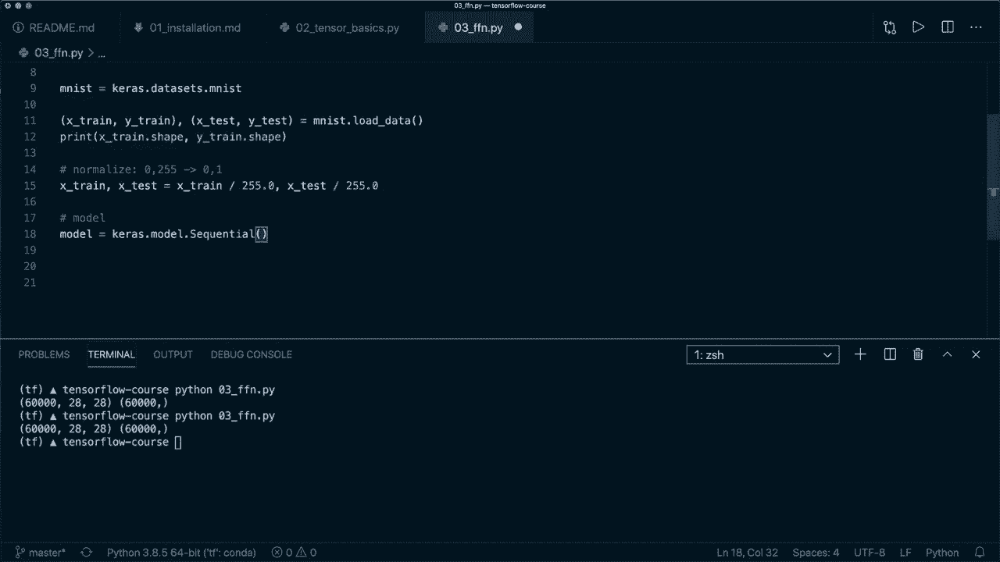

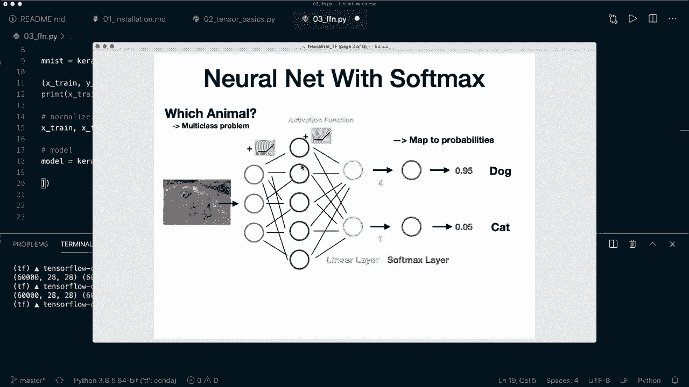

```python
# 数据归一化
x_train, x_test = x_train / 255.0, x_test / 255.0
```

我们可以可视化前几个训练样本，以确认数据加载正确。

```python
# 可视化前6个训练样本
plt.figure(figsize=(10, 5))
for i in range(6):
    plt.subplot(2, 3, i+1)
    plt.imshow(x_train[i], cmap='gray')
    plt.title(f"Label: {y_train[i]}")
    plt.axis('off')
plt.show()
```

---

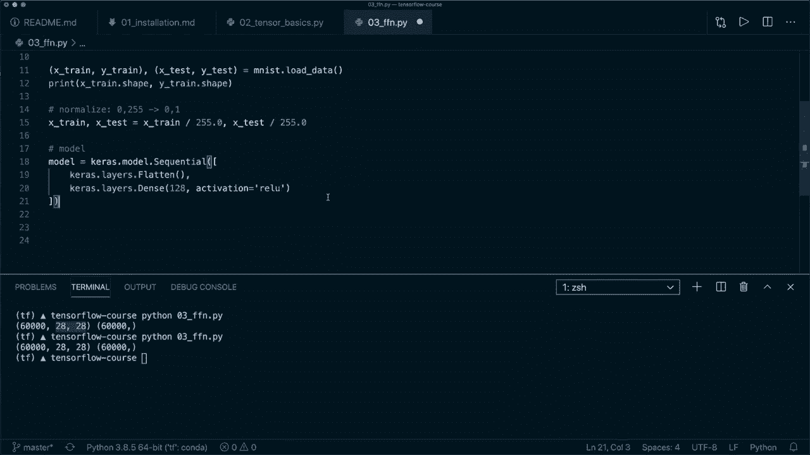

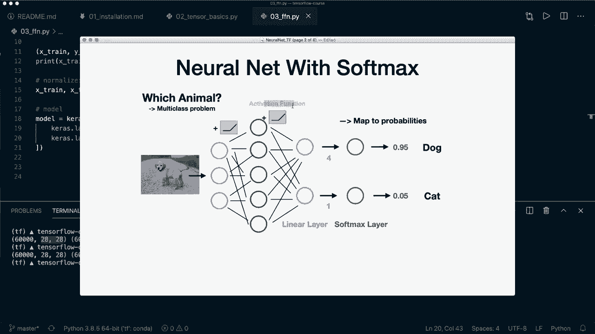

## 3. 构建神经网络模型 🏗️

现在，我们使用 Keras Sequential API 来构建模型。这个 API 允许我们通过堆叠层来轻松定义模型。

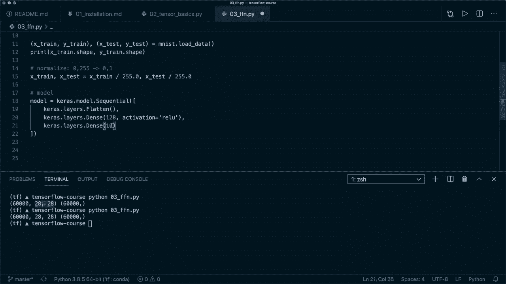

我们的网络结构如下：
*   **输入层**：一个 `Flatten` 层，将 28x28 的二维图像展平为 784 个像素的一维向量。
*   **隐藏层**：一个具有 128 个神经元（单元）的 `Dense`（全连接）层，使用 ReLU 激活函数。
*   **输出层**：一个具有 10 个神经元的 `Dense` 层，对应 10 个数字类别（0-9）。我们将在损失函数中处理 Softmax 转换。

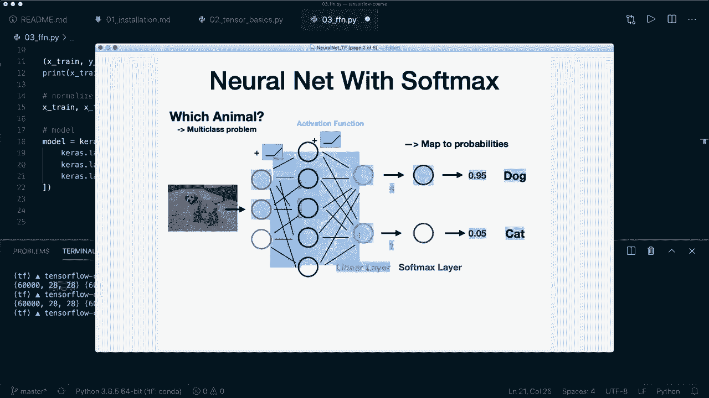

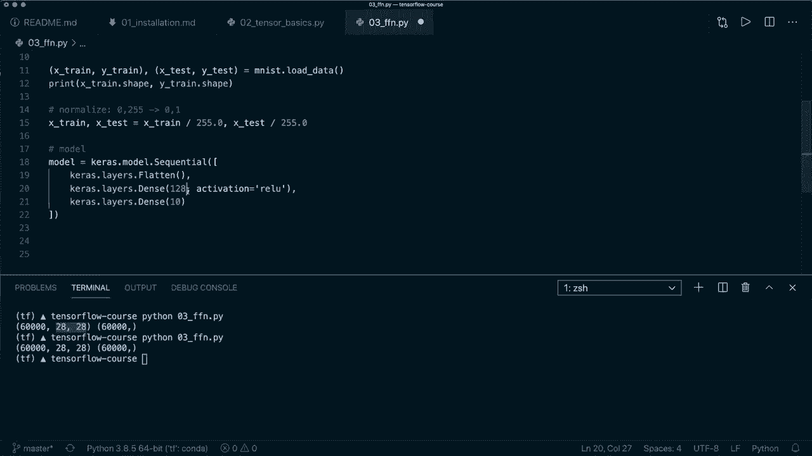

```python
# 使用 Sequential API 构建模型
model = keras.Sequential([
    keras.layers.Flatten(input_shape=(28, 28)), # 输入层，展平图像
    keras.layers.Dense(128, activation='relu'), # 隐藏层，128个神经元，ReLU激活
    keras.layers.Dense(10) # 输出层，10个神经元
])

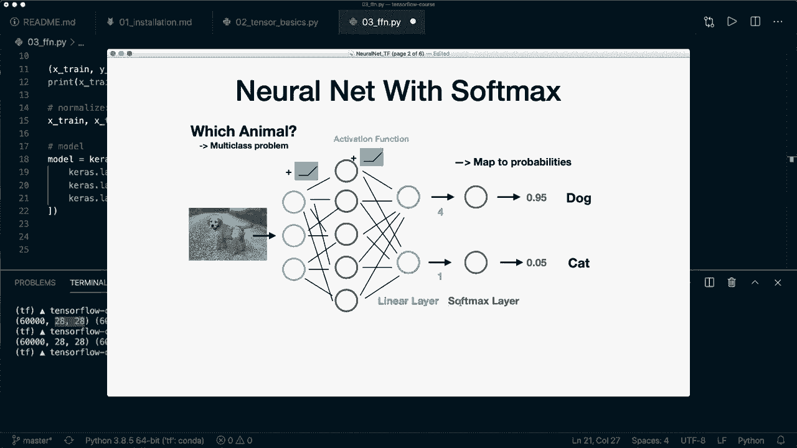

# 打印模型结构摘要
model.summary()
```

`model.summary()` 会显示每层的类型、输出形状和参数数量，帮助你理解模型结构。

---

## 4. 编译模型 ⚙️

在训练模型之前，我们需要通过编译来配置学习过程。这需要指定三个关键要素：
*   **损失函数 (Loss Function)**：衡量模型在训练数据上的表现。对于多分类问题，我们使用 `SparseCategoricalCrossentropy`（因为标签是整数，而非 one-hot 编码）。设置 `from_logits=True` 是因为我们的输出层没有使用 Softmax 激活。
*   **优化器 (Optimizer)**：决定如何根据损失函数更新权重。这里我们使用流行的 `Adam` 优化器。
*   **评估指标 (Metrics)**：用于监控训练和测试过程。我们使用 `accuracy`（准确率）。

```python
# 定义损失函数、优化器和评估指标
loss_fn = keras.losses.SparseCategoricalCrossentropy(from_logits=True)
optimizer = keras.optimizers.Adam(learning_rate=0.0001)
metrics = ['accuracy']

# 编译模型
model.compile(optimizer=optimizer,
              loss=loss_fn,
              metrics=metrics)
```

---

## 5. 训练模型 🏃‍♂️

模型编译完成后，我们就可以使用 `fit` 方法在训练数据上进行训练了。我们需要指定批量大小和训练轮数（epochs）。

```python
batch_size = 64
epochs = 5

# 开始训练模型
history = model.fit(x_train, y_train,
                    batch_size=batch_size,
                    epochs=epochs,
                    shuffle=True, # 每个epoch前打乱数据
                    verbose=2) # 控制训练日志的输出详细程度
```

训练过程中，控制台会输出每个 epoch 后的损失和准确率。你会看到损失逐渐下降，准确率逐渐上升。

---

## 6. 评估模型 📊

训练结束后，我们需要在独立的测试集上评估模型的泛化能力，看看它是否真的学会了识别数字，而不是仅仅记住了训练数据。

```python
# 在测试集上评估模型
test_loss, test_acc = model.evaluate(x_test, y_test,
                                     batch_size=batch_size,
                                     verbose=2)
print(f"\n测试集损失: {test_loss:.4f}")
print(f"测试集准确率: {test_acc:.4f}")
```

通常，测试集准确率会略低于训练集准确率，这是正常现象。

---

## 7. 使用模型进行预测 🔮

模型训练并评估好后，就可以用来预测新数据的类别了。由于我们的输出层是原始 logits（未经过 Softmax），在预测时我们需要将其转换为概率。

以下是几种进行预测的方法：

**方法一：创建包含 Softmax 的新概率模型**

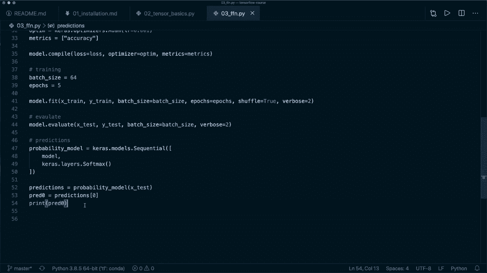

```python
# 创建一个包含原始模型和Softmax层的新模型
probability_model = keras.Sequential([
    model,
    keras.layers.Softmax()
])

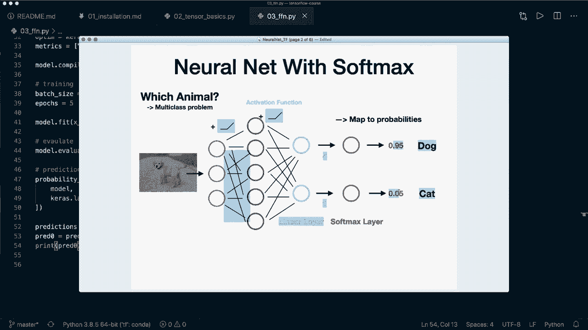

# 对测试集进行预测
predictions = probability_model.predict(x_test, batch_size=batch_size)
# 获取第一个测试样本的预测概率和类别
first_pred_prob = predictions[0]
first_pred_label = np.argmax(first_pred_prob)
print(f"第一个样本的预测概率: {first_pred_prob}")
print(f"第一个样本的预测类别: {first_pred_label}")
```

**方法二：使用原始模型预测后手动应用 Softmax**

```python
# 使用原始模型得到 logits
logits = model.predict(x_test, batch_size=batch_size)
# 手动应用 Softmax 得到概率
probabilities = tf.nn.softmax(logits).numpy()
# 同样获取第一个样本的预测
first_pred_label_manual = np.argmax(probabilities[0])
print(f"(手动Softmax)第一个样本的预测类别: {first_pred_label_manual}")
```

**方法三：批量预测并获取多个结果**

```python
# 预测前5个样本
predictions_5 = probability_model.predict(x_test[:5], batch_size=batch_size)
# 获取这5个样本的预测标签
predicted_labels_5 = np.argmax(predictions_5, axis=1)
print(f"前5个样本的预测形状: {predictions_5.shape}")
print(f"前5个样本的预测标签: {predicted_labels_5}")
print(f"前5个样本的真实标签: {y_test[:5]}")
```

---

## 总结 🎉

在本节课中，我们一起完成了第一个神经网络的完整流程：

1.  **数据准备**：我们加载并归一化了 MNIST 数据集。
2.  **模型构建**：使用 Keras Sequential API，我们构建了一个包含 `Flatten` 层和两个 `Dense` 层的简单神经网络。
3.  **模型编译**：我们指定了 `SparseCategoricalCrossentropy` 损失函数、`Adam` 优化器和 `accuracy` 评估指标。
4.  **模型训练**：通过调用 `model.fit()`，我们在训练数据上训练了模型。
5.  **模型评估**：使用 `model.evaluate()` 在测试集上评估了模型的性能。
6.  **模型预测**：我们学习了三种方法将模型输出的 logits 转换为概率并进行类别预测。

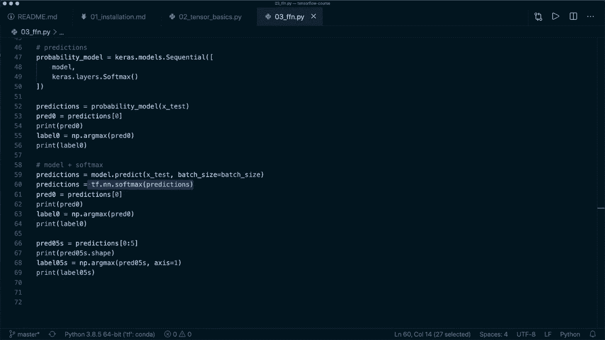

你已经成功迈出了使用 TensorFlow 构建深度学习模型的第一步！这个简单的流程是许多复杂项目的基础。在接下来的课程中，我们将探索更复杂的网络结构、处理不同的数据类型，并学习如何保存和加载模型。