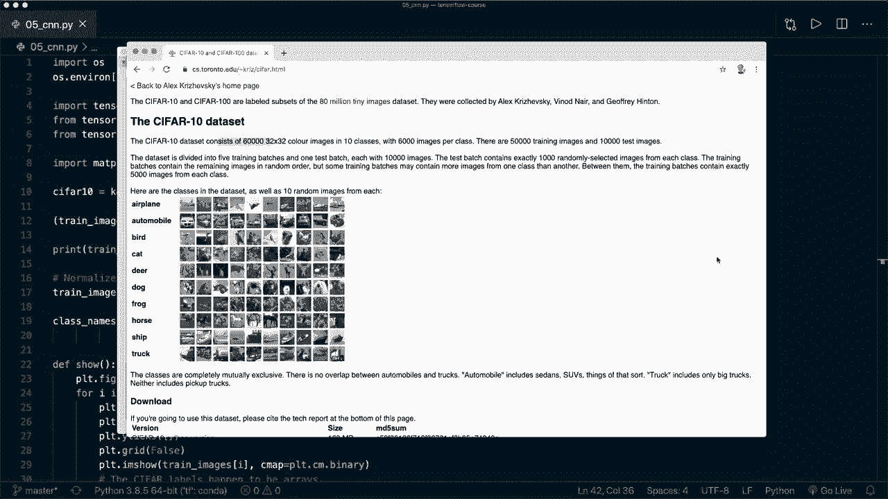
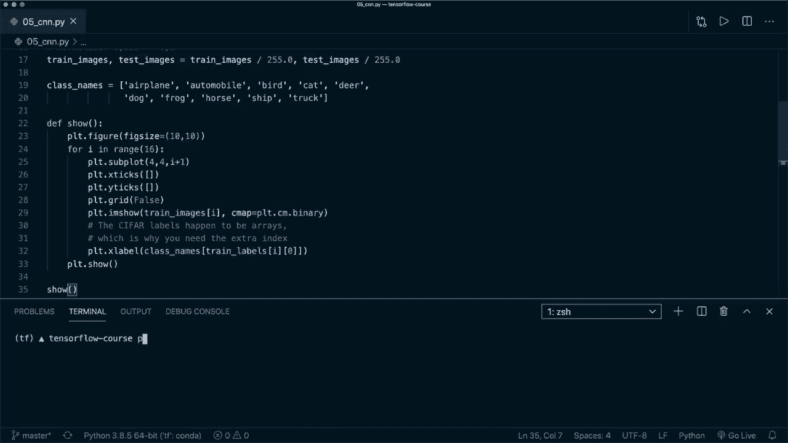
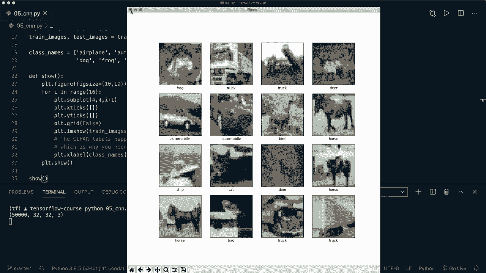
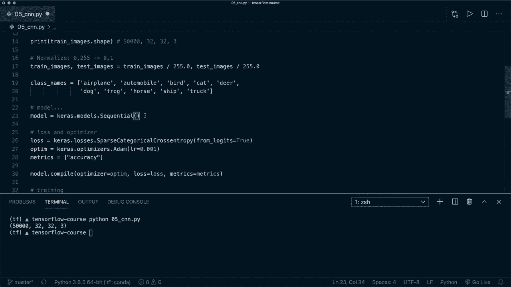
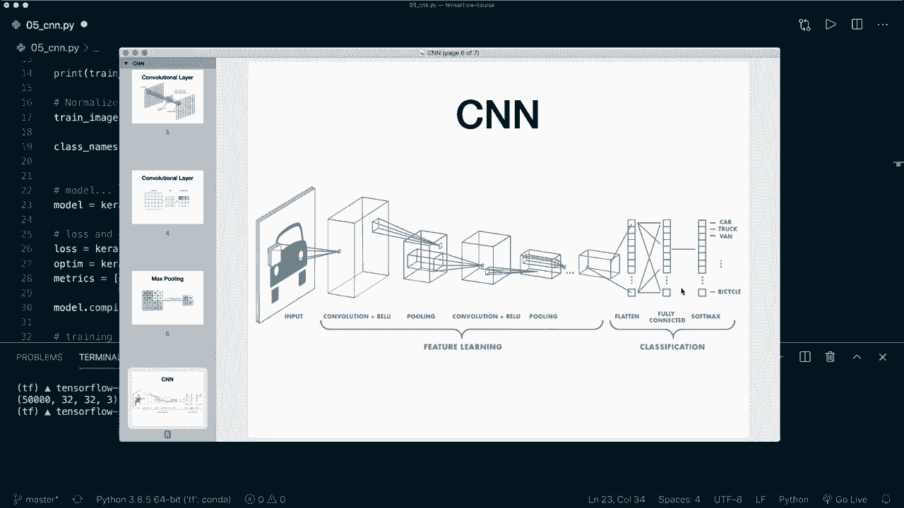
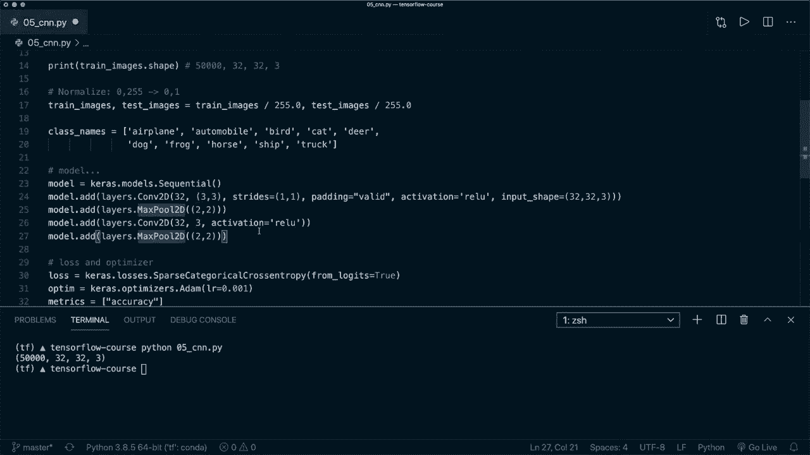
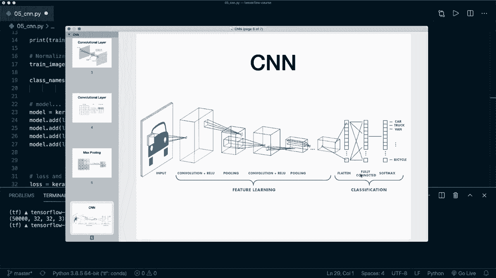
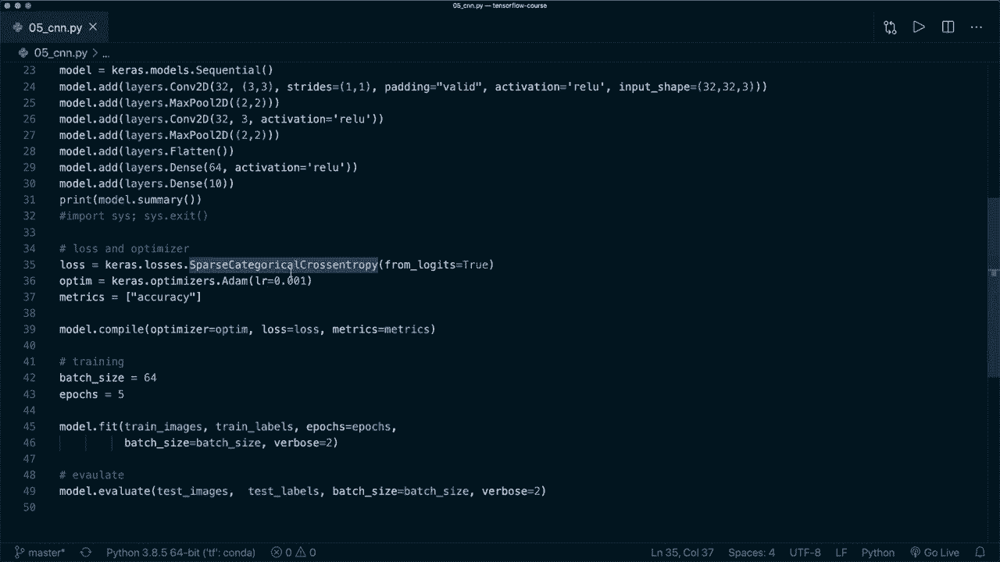

# TensorFlow 教程 P5：L5 - 卷积神经网络 (CNN) 🧠


在本节课中，我们将学习如何实现第一个卷积神经网络。卷积神经网络与前馈神经网络相似，主要区别在于它使用卷积滤波器，而不仅仅是密集层。

## 概述

我们将介绍卷积神经网络的基本概念，包括卷积层、池化层和全连接层。然后，我们将使用 TensorFlow 和 Keras 构建一个 CNN 模型，用于对 CIFAR-10 数据集中的图像进行分类。

## 卷积神经网络架构

一个典型的卷积神经网络架构包括输入图像、卷积层、激活函数、池化层和全连接层。

以下是卷积网络的基本流程：
1.  输入图像。
2.  应用卷积层和激活函数（如 ReLU）。
3.  应用池化层以减少图像尺寸。
4.  重复步骤 2 和 3。
5.  将图像展平为一维。
6.  使用全连接层（密集层）和 Softmax 激活函数进行分类。

### 卷积层

卷积层使用卷积滤波器在图像上滑动，计算新值并写入输出图像。

卷积操作可以表示为：
`output = conv2d(input, filters)`

### 池化层

池化层用于减少图像尺寸。例如，最大池化使用一个 2x2 的滤波器，计算区域内的最大值并写入输出。



最大池化操作可以表示为：
`output = max_pooling2d(input, pool_size=(2, 2))`

## 实现卷积神经网络

上一节我们介绍了 CNN 的基本架构，本节中我们来看看如何使用 TensorFlow 和 Keras 实现它。



我们将使用 CIFAR-10 数据集，该数据集包含 60000 张 32x32 的彩色图像，分为 10 个类别，如飞机、汽车、鸟、猫等。



### 导入库和加载数据

首先，我们需要导入必要的库并加载 CIFAR-10 数据集。

```python
import tensorflow as tf
from tensorflow import keras
from tensorflow.keras import layers
import matplotlib.pyplot as plt

# 加载 CIFAR-10 数据集
(train_images, train_labels), (test_images, test_labels) = keras.datasets.cifar10.load_data()



# 归一化数据到 0-1 范围
train_images = train_images / 255.0
test_images = test_images / 255.0

# 类别名称
class_names = ['airplane', 'automobile', 'bird', 'cat', 'deer', 'dog', 'frog', 'horse', 'ship', 'truck']
```

### 定义模型架构



以下是构建 CNN 模型的步骤：

1.  添加卷积层：使用 `layers.Conv2D` 定义卷积层，指定过滤器数量、内核大小和激活函数。
2.  添加池化层：使用 `layers.MaxPooling2D` 定义最大池化层。
3.  重复卷积和池化层。
4.  展平层：使用 `layers.Flatten` 将图像展平为一维。
5.  全连接层：使用 `layers.Dense` 定义密集层。

```python
model = keras.Sequential()

# 第一组卷积和池化层
model.add(layers.Conv2D(32, (3, 3), strides=(1, 1), padding='valid', activation='relu', input_shape=(32, 32, 3)))
model.add(layers.MaxPooling2D((2, 2)))

# 第二组卷积和池化层
model.add(layers.Conv2D(64, (3, 3), activation='relu'))
model.add(layers.MaxPooling2D((2, 2)))

# 展平层
model.add(layers.Flatten())

# 全连接层
model.add(layers.Dense(64, activation='relu'))
model.add(layers.Dense(10))
```



### 编译和训练模型



接下来，我们需要编译模型并开始训练。

以下是编译和训练模型的步骤：

1.  定义损失函数和优化器。
2.  指定评估指标。
3.  编译模型。
4.  使用训练数据拟合模型。
5.  使用测试数据评估模型。

```python
# 定义损失函数和优化器
loss = keras.losses.SparseCategoricalCrossentropy(from_logits=True)
optimizer = keras.optimizers.Adam()

# 指定评估指标
metrics = ['accuracy']

# 编译模型
model.compile(optimizer=optimizer, loss=loss, metrics=metrics)

# 训练模型
model.fit(train_images, train_labels, epochs=5, validation_data=(test_images, test_labels))

# 评估模型
test_loss, test_accuracy = model.evaluate(test_images, test_labels)
print(f'Test accuracy: {test_accuracy}')
```

## 总结



本节课中我们一起学习了卷积神经网络的基本概念和实现方法。我们介绍了卷积层、池化层和全连接层的作用，并使用 TensorFlow 和 Keras 构建了一个 CNN 模型，用于对 CIFAR-10 数据集中的图像进行分类。通过调整学习率或尝试不同的架构，可以进一步提高模型的准确性。