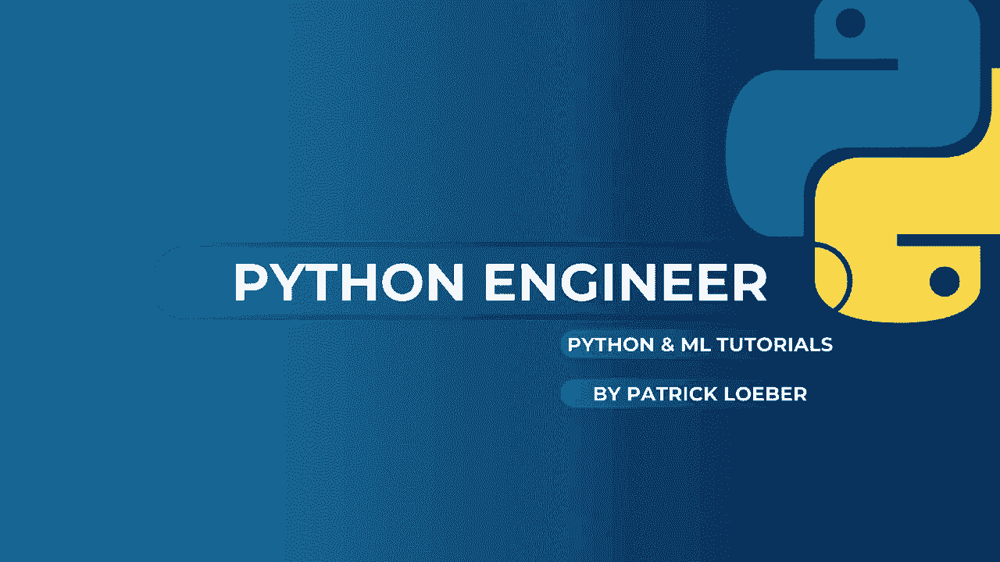
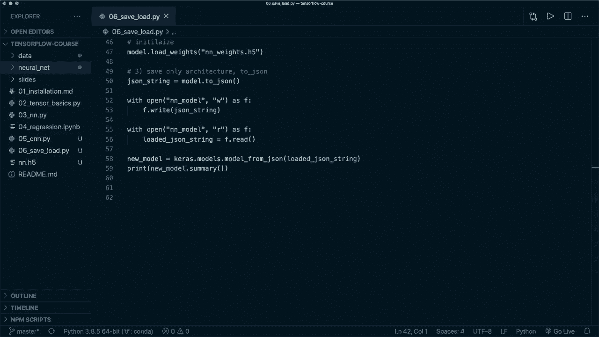

# TensorFlow 初学者教程 P6：L6 - 保存和加载模型 🗂️




在本节课中，我们将学习如何使用 TensorFlow API 保存和加载训练好的模型。这是将你的工作成果持久化、分享或在未来项目中复用的关键步骤。我们将介绍三种不同的保存方式：保存整个模型、仅保存权重以及仅保存模型架构。

## 概述

我们将从一个简单的神经网络示例开始，该网络用于处理 MNIST 数据集。在模型训练和评估之后，我们将演示三种保存模型的方法，并展示如何重新加载它们以供后续使用。

## 准备工作

首先，我们使用与之前教程相同的代码来构建、编译和训练一个简单的前馈神经网络。

```python
import tensorflow as tf
from tensorflow import keras

# 加载数据
mnist = keras.datasets.mnist
(train_images, train_labels), (test_images, test_labels) = mnist.load_data()
train_images, test_images = train_images / 255.0, test_images / 255.0

# 构建模型
model = keras.Sequential([
    keras.layers.Flatten(input_shape=(28, 28)),
    keras.layers.Dense(128, activation='relu'),
    keras.layers.Dense(10, activation='softmax')
])

# 编译模型
model.compile(optimizer='adam',
              loss='sparse_categorical_crossentropy',
              metrics=[keras.metrics.SparseCategoricalAccuracy(name='accuracy')])

# 训练模型
model.fit(train_images, train_labels, epochs=5)

# 评估模型
test_loss, test_acc = model.evaluate(test_images, test_labels, verbose=2)
print(f'\n原始模型测试准确率：{test_acc}')
```

上一节我们完成了模型的训练和评估。本节中，我们来看看如何保存这个模型。

## 方法一：保存和加载整个模型

这是最直接的方法，它会保存模型的所有内容：架构、权重和训练配置。

以下是保存整个模型的两种格式：

1.  **TensorFlow SavedModel 格式**：这是 TensorFlow 推荐的默认格式。保存时只需指定一个目录名（无特定后缀）。
2.  **HDF5 格式**：这是一种通用的文件格式。保存时需要指定 `.h5` 后缀。

```python
# 保存整个模型 - SavedModel 格式
model.save('my_neural_network')

# 保存整个模型 - HDF5 格式
model.save('my_neural_network.h5')
```

运行上述代码后，你会看到生成了一个名为 `my_neural_network` 的文件夹（SavedModel格式）和一个名为 `my_neural_network.h5` 的文件（HDF5格式）。

加载保存的模型同样简单：

```python
# 加载 HDF5 格式的模型
new_model = keras.models.load_model('my_neural_network.h5')

# 评估加载的模型
new_test_loss, new_test_acc = new_model.evaluate(test_images, test_labels, verbose=2)
print(f'\n加载模型测试准确率：{new_test_acc}')
```

**注意**：在 TensorFlow 2.3 版本中，如果在编译时使用字符串（如 `metrics=['accuracy']`）定义指标，加载模型后评估可能会出现问题。建议使用 `keras.metrics` 对象（如示例代码所示）。此问题预计在 2.4 版本中修复。

## 方法二：仅保存和加载模型权重

有时，你可能只想保存模型的权重参数，而不是整个模型对象。这在需要自定义训练循环或迁移学习时非常有用。

以下是保存和加载权重的步骤：

```python
# 仅保存模型的权重
model.save_weights('my_model_weights.h5')

# 为了加载权重，你需要先创建一个结构完全相同的模型
new_model_for_weights = keras.Sequential([
    keras.layers.Flatten(input_shape=(28, 28)),
    keras.layers.Dense(128, activation='relu'),
    keras.layers.Dense(10, activation='softmax')
])
new_model_for_weights.compile(optimizer='adam',
                              loss='sparse_categorical_crossentropy',
                              metrics=[keras.metrics.SparseCategoricalAccuracy(name='accuracy')])

# 加载之前保存的权重
new_model_for_weights.load_weights('my_model_weights.h5')

# 现在模型就拥有了训练好的权重，可以直接评估
new_model_for_weights.evaluate(test_images, test_labels, verbose=2)
```

## 方法三：仅保存和加载模型架构

如果你只想保存模型的结构（即各层是如何连接的），而不包含权重和优化器状态，可以保存模型的架构为 JSON 字符串。

以下是具体操作：

```python
# 将模型架构保存为 JSON 字符串
model_json_string = model.to_json()

# 将 JSON 字符串保存到文件
with open('my_model_architecture.json', 'w') as f:
    f.write(model_json_string)

# 从文件加载 JSON 字符串
with open('my_model_architecture.json', 'r') as f:
    loaded_json_string = f.read()

# 从 JSON 字符串重建模型架构
new_model_from_json = keras.models.model_from_json(loaded_json_string)

# 打印模型摘要，确认架构相同
new_model_from_json.summary()

# 注意：此模型尚未编译，也没有权重，需要重新编译和训练
new_model_from_json.compile(optimizer='adam',
                            loss='sparse_categorical_crossentropy',
                            metrics=['accuracy'])
```

## 总结

本节课中我们一起学习了在 TensorFlow 中保存和加载模型的三种主要方法：

1.  **保存整个模型**：使用 `model.save()` 和 `keras.models.load_model()`。最简单全面，但文件体积最大。
2.  **仅保存权重**：使用 `model.save_weights()` 和 `model.load_weights()`。适用于需要灵活控制训练过程或进行迁移学习的场景。
3.  **仅保存架构**：使用 `model.to_json()` 和 `keras.models.model_from_json()`。仅保存模型结构，最轻量，但需要重新编译和训练。

根据你的具体需求（如部署、继续训练、分享架构等），可以选择最合适的方法。TensorFlow 的 API 使得这些操作变得非常简便。



