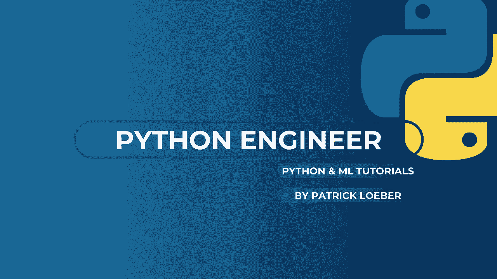
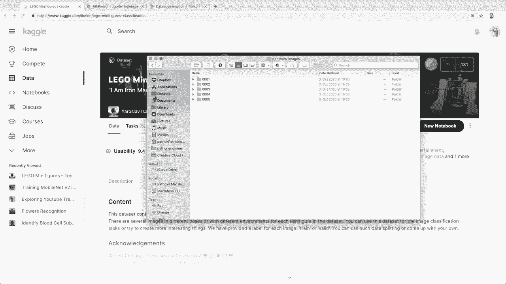
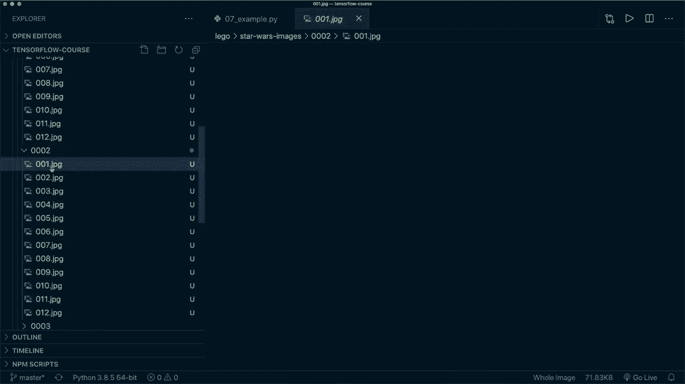
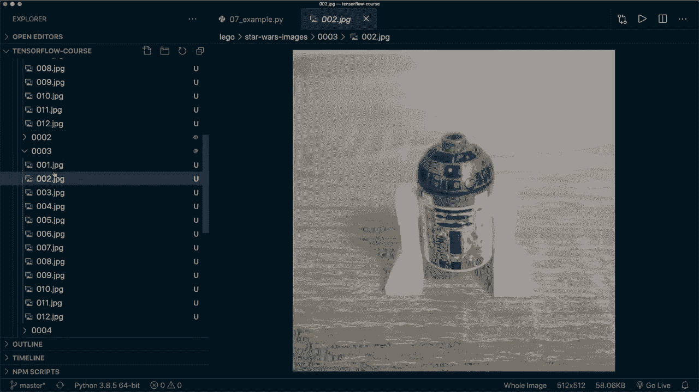

# TensorFlow 教程 P7：L8 - 乐高星球大战小人仔分类项目完整流程 🧩




在本教程中，我们将学习一个完整的深度学习项目流程。我们将使用来自Kaggle的真实数据集，对乐高星球大战小人仔图像进行分类。教程将涵盖数据下载与组织、图像加载与预处理、卷积神经网络构建、模型训练与保存等核心步骤。过程中还会介绍图像增强和Keras回调等新概念。

## 数据准备与组织 📂

上一节我们介绍了项目目标，本节中我们来看看如何准备和组织数据。

首先，从Kaggle下载数据集。本教程仅使用其中的“星球大战”类别，并选取前五个角色（如尤达、卢克·天行者）以简化流程。

为了便于使用TensorFlow的图像加载器，我们需要重新组织文件夹结构。目标是将数据集分为训练集、验证集和测试集，并在每个集合内为每个角色创建独立的子文件夹。

以下是创建文件夹结构的代码示例：

```python
import os
import shutil
import random



# 设置基础路径和角色名称
base_dir = ‘./lego_star_wars_images‘
character_names = [‘yoda‘, ‘luke_skywalker‘, ‘r2d2‘, ‘mace_windu‘, ‘general_grievous‘]
random.seed(42) # 确保可重复性



# 创建训练、验证、测试文件夹
for split in [‘train‘, ‘val‘, ‘test‘]:
    for name in character_names:
        os.makedirs(os.path.join(base_dir, split, name), exist_ok=True)
```

接着，我们需要将原始图像按照一定比例（例如60%训练，25%验证，15%测试）复制到对应的文件夹中。

以下是分配和复制图像的代码逻辑：



```python
# 假设 all_images 是某个角色所有图像的路径列表
train_split = 0.6
val_split = 0.25
# test_split 为剩余部分

random.shuffle(all_images)
train_count = int(len(all_images) * train_split)
val_count = int(len(all_images) * val_split)

train_images = all_images[:train_count]
val_images = all_images[train_count:train_count+val_count]
test_images = all_images[train_count+val_count:]

# 将图像文件复制到对应目录
# ... 复制操作代码 ...
```

完成上述步骤后，你的目录结构应如下所示：
```
lego_star_wars_images/
├── train/
│   ├── yoda/
│   ├── luke_skywalker/
│   └── ...
├── val/
│   ├── yoda/
│   ├── luke_skywalker/
│   └── ...
└── test/
    ├── yoda/
    ├── luke_skywalker/
    └── ...
```

## 使用ImageDataGenerator加载数据 🔄

上一节我们准备好了数据，本节中我们来看看如何使用TensorFlow的`ImageDataGenerator`来加载和预处理图像数据。

`ImageDataGenerator`可以方便地进行图像归一化、数据增强等操作。我们为训练、验证和测试集分别创建生成器。

以下是设置数据生成器的代码：

```python
from tensorflow.keras.preprocessing.image import ImageDataGenerator

# 图像归一化：将像素值缩放到0-1之间
train_datagen = ImageDataGenerator(rescale=1./255)
val_datagen = ImageDataGenerator(rescale=1./255)
test_datagen = ImageDataGenerator(rescale=1./255)

# 从目录创建数据流
train_generator = train_datagen.flow_from_directory(
    directory=‘./lego_star_wars_images/train‘,
    target_size=(256, 256), # 统一调整图像大小
    batch_size=32,
    class_mode=‘sparse‘, # 标签为单个整数
    shuffle=True,
    color_mode=‘rgb‘
)

val_generator = val_datagen.flow_from_directory(
    directory=‘./lego_star_wars_images/val‘,
    target_size=(256, 256),
    batch_size=32,
    class_mode=‘sparse‘,
    shuffle=False # 验证集无需打乱
)

test_generator = test_datagen.flow_from_directory(
    directory=‘./lego_star_wars_images/test‘,
    target_size=(256, 256),
    batch_size=32,
    class_mode=‘sparse‘,
    shuffle=False
)
```

## 应用图像增强技术 🌀

上一节我们加载了基础数据，本节中我们来看看如何使用图像增强来增加数据的多样性，这有助于提升模型的泛化能力。

图像增强通过对训练图像应用随机变换（如旋转、翻转、平移等）来生成新的训练样本。我们只需在训练数据生成器中添加相应参数即可。

以下是启用图像增强的示例：

```python
# 仅对训练数据应用增强
augmented_train_datagen = ImageDataGenerator(
    rescale=1./255,
    rotation_range=20,       # 随机旋转角度范围
    horizontal_flip=True,    # 随机水平翻转
    width_shift_range=0.2,   # 随机水平平移
    height_shift_range=0.2,  # 随机垂直平移
    shear_range=0.2,         # 随机剪切变换
    zoom_range=0.2           # 随机缩放
)

augmented_train_generator = augmented_train_datagen.flow_from_directory(
    # ... 参数与基础train_generator相同 ...
)
```

> **注意**：由于本教程数据集较小，过度增强可能导致模型混淆。因此后续模型训练将暂时不使用增强，但你可以自行尝试其效果。

## 构建卷积神经网络模型 🧠

上一节我们处理了数据，本节中我们来看看如何构建用于图像分类的卷积神经网络模型。

我们将构建一个包含卷积层、池化层和全连接层的简单CNN。最后一层有5个神经元，对应5个角色类别。

以下是模型定义的代码：

```python
from tensorflow.keras import layers, models

model = models.Sequential([
    # 第一个卷积块
    layers.Conv2D(32, (3, 3), activation=‘relu‘, input_shape=(256, 256, 3)),
    layers.MaxPooling2D((2, 2)),
    # 第二个卷积块
    layers.Conv2D(64, (3, 3), activation=‘relu‘),
    layers.MaxPooling2D((2, 2)),
    # 第三个卷积块
    layers.Conv2D(128, (3, 3), activation=‘relu‘),
    layers.MaxPooling2D((2, 2)),
    # 展平层
    layers.Flatten(),
    # 全连接层
    layers.Dense(128, activation=‘relu‘),
    # 输出层：5个类别，未使用激活函数（from_logits=True）
    layers.Dense(5)
])

model.summary() # 打印模型结构
```

## 编译模型与使用回调函数 ⚙️

上一节我们构建了模型，本节中我们来看看如何编译模型，并引入Keras回调函数来优化训练过程。

我们使用Adam优化器、稀疏分类交叉熵损失函数，并监控准确率指标。特别需要注意的是，由于输出层未使用激活函数，编译时需要设置`from_logits=True`。

此外，我们将使用`EarlyStopping`回调函数，当验证损失在一定周期内不再改善时自动停止训练，防止过拟合。

以下是编译模型和设置回调的代码：

```python
model.compile(
    optimizer=‘adam‘,
    loss=tf.keras.losses.SparseCategoricalCrossentropy(from_logits=True),
    metrics=[‘accuracy‘]
)

from tensorflow.keras.callbacks import EarlyStopping

# 定义早停回调：监控验证损失，耐心值设为5
early_stopping_callback = EarlyStopping(
    monitor=‘val_loss‘,
    patience=5,
    restore_best_weights=True # 恢复最佳权重
)
```

## 训练模型与结果分析 📊

上一节我们准备好了训练设置，本节中我们来看看模型的训练过程并分析其结果。

我们使用`model.fit`方法进行训练，并传入之前定义的回调函数列表。

以下是训练模型的代码：

```python
history = model.fit(
    train_generator,
    epochs=30,
    validation_data=val_generator,
    callbacks=[early_stopping_callback] # 传入回调函数
)
```

训练可能会因早停回调而提前结束。例如，如果验证损失连续5个周期未改善，训练将在第10周期停止。

训练完成后，我们可以在测试集上评估模型性能，并进行预测。

以下是评估和预测的代码：

```python
# 在测试集上评估模型
test_loss, test_accuracy = model.evaluate(test_generator)
print(f"测试集损失: {test_loss}, 测试集准确率: {test_accuracy}")

# 对测试批次进行预测
test_images, test_labels = next(test_generator)
predictions = model.predict(test_images)

# 应用softmax获取概率分布（因为输出层是logits）
predictions_prob = tf.nn.softmax(predictions).numpy()
# 获取预测类别
predicted_classes = predictions_prob.argmax(axis=1)
```

分析训练历史图表可能显示训练准确率很高，但验证和测试准确率较低，这是过拟合的典型迹象。原因可能是训练数据量不足。

## 保存模型与项目总结 💾

上一节我们训练并评估了模型，本节中我们来看看如何保存训练好的模型，并总结整个项目流程。

使用Keras的`save`方法可以轻松保存整个模型。

以下是保存模型的代码：

```python
model.save(‘lego_star_wars_classifier.h5‘)
```

保存的模型文件（`.h5`）包含了模型架构、权重和训练配置，之后可以随时加载并使用。

---

本节课中我们一起学习了使用TensorFlow处理真实图像分类项目的完整流程。我们从数据下载与组织开始，学习了如何使用`ImageDataGenerator`加载和增强图像。接着，我们构建并训练了一个卷积神经网络模型，并引入了`EarlyStopping`回调来优化训练。最后，我们评估了模型性能并保存了训练结果。

尽管当前模型在训练集上表现良好，但在验证集和测试集上出现了过拟合现象。这主要是由于训练数据量有限。在下一个教程中，我们将学习**迁移学习**技术，它能帮助我们在小数据集上获得更好的泛化性能。