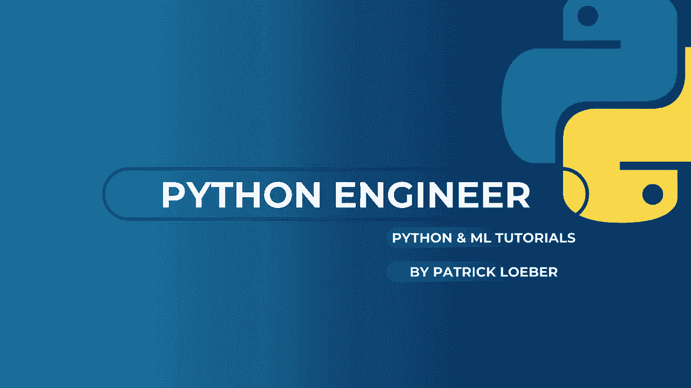
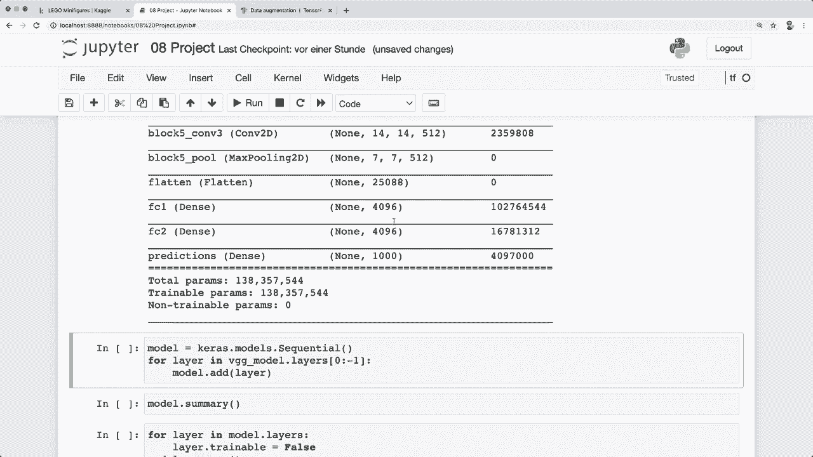
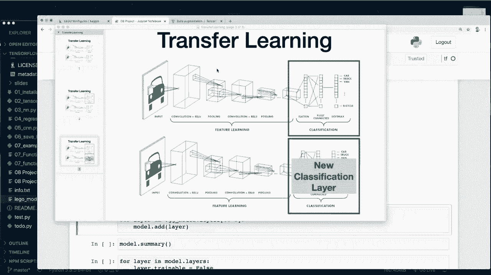
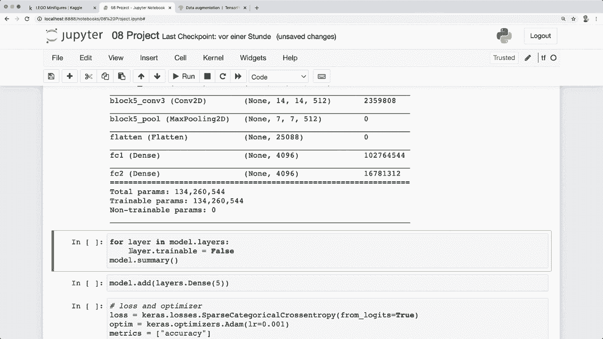
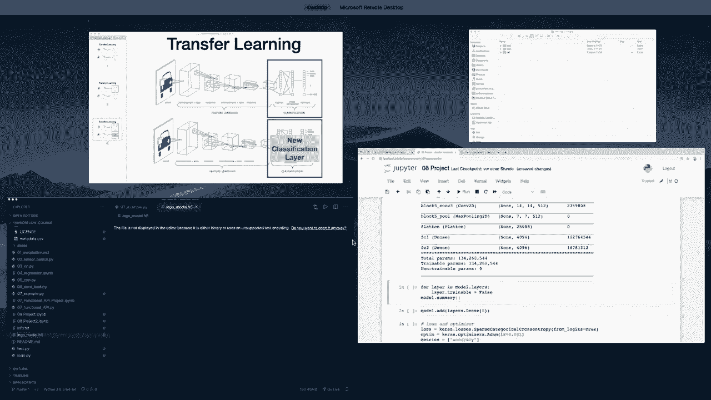
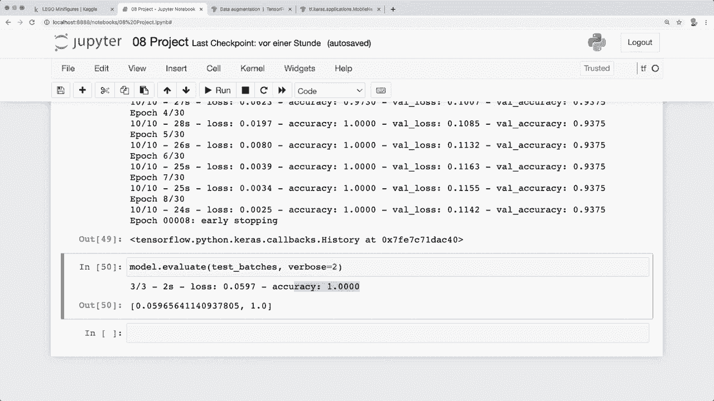

# TensorFlow 初学者教程 P8：L9 - 迁移学习 🚀




在本节课中，我们将学习如何应用迁移学习来提升模型性能。迁移学习是一种利用预训练模型的知识来解决新问题的强大技术，尤其适用于数据量有限的情况。

上一节我们构建了一个卷积神经网络，但在验证集和测试集上表现不佳，出现了过拟合问题。本节中，我们将通过迁移学习来解决这个问题。

## 迁移学习概述

迁移学习的核心概念是：使用一个在大型数据集上预训练好的模型，移除其最后的分类层，然后添加并训练适合我们自己任务的新分类层。这样，我们可以快速获得一个高性能的模型，同时避免从头开始训练的巨大开销。

## 实现步骤

以下是实现迁移学习的关键步骤。

### 1. 加载预训练模型

首先，我们需要从 Keras 中加载一个预训练模型。Keras 提供了许多流行的模型，例如 VGG16。

```python
from tensorflow.keras.applications import VGG16





base_model = VGG16(weights='imagenet')
base_model.summary()
```

运行上述代码会下载 VGG16 模型并显示其架构摘要。

### 2. 移除最后一层并冻结参数

接下来，我们需要移除预训练模型的最后一层（通常是密集分类层），并冻结所有剩余层的参数，使其在后续训练中不被更新。

```python
from tensorflow.keras.models import Sequential

# 将功能模型转换为顺序模型，并排除最后一层
model = Sequential()
for layer in base_model.layers[:-1]:
    model.add(layer)

# 冻结所有层的参数，使其不可训练
for layer in model.layers:
    layer.trainable = False

model.summary()
```



转换后，模型摘要将不再显示原来的最后一层，并且所有参数都被标记为“不可训练”。



### 3. 添加新的分类层

现在，我们需要为我们的特定任务添加一个新的分类层。在我们的例子中，数据有5个类别。

```python
from tensorflow.keras.layers import Dense

model.add(Dense(5, activation='softmax'))
```

默认情况下，新添加的层是可训练的。

### 4. 编译模型

像往常一样，我们需要为模型指定损失函数和优化器，并进行编译。

```python
model.compile(loss='categorical_crossentropy',
              optimizer='adam',
              metrics=['accuracy'])
```

### 5. 准备数据

我们需要使用与预训练模型相匹配的预处理函数来准备图像数据。这可以通过 `preprocess_input` 函数实现。

```python
from tensorflow.keras.preprocessing.image import ImageDataGenerator
from tensorflow.keras.applications.vgg16 import preprocess_input

# 创建数据生成器，并应用VGG16的预处理函数
train_datagen = ImageDataGenerator(preprocessing_function=preprocess_input)
val_datagen = ImageDataGenerator(preprocessing_function=preprocess_input)
test_datagen = ImageDataGenerator(preprocessing_function=preprocess_input)

# 从目录加载数据
train_generator = train_datagen.flow_from_directory(...)
validation_generator = val_datagen.flow_from_directory(...)
test_generator = test_datagen.flow_from_directory(...)
```

### 6. 训练模型

现在我们可以开始训练模型。为了防止过拟合，我们可以使用早停法回调函数。

```python
from tensorflow.keras.callbacks import EarlyStopping

early_stopping = EarlyStopping(monitor='val_loss', patience=5)

history = model.fit(
    train_generator,
    validation_data=validation_generator,
    epochs=30,
    callbacks=[early_stopping]
)
```

### 7. 评估模型

最后，我们在独立的测试集上评估模型的性能。

```python
test_loss, test_acc = model.evaluate(test_generator)
print(f'测试准确率: {test_acc}')
```

## 结果与总结

通过应用迁移学习，我们在仅训练了少数几个周期后，就在测试数据集上获得了显著的性能提升（例如达到100%的准确率）。这证明了迁移学习在数据有限的情况下是一种非常有效的技术。

本节课中我们一起学习了迁移学习的基本概念和实现步骤。我们加载了预训练的VGG16模型，冻结了其参数，添加了新的分类层，并使用匹配的预处理方法训练了模型。

作为练习，你可以尝试使用其他预训练模型，如 MobileNetV2 或 ResNet，来观察性能差异。请注意，并非所有模型架构都是线性的，如果遇到转换问题，可以参考 Keras 功能 API 的相关教程。



希望本教程对你有所帮助。