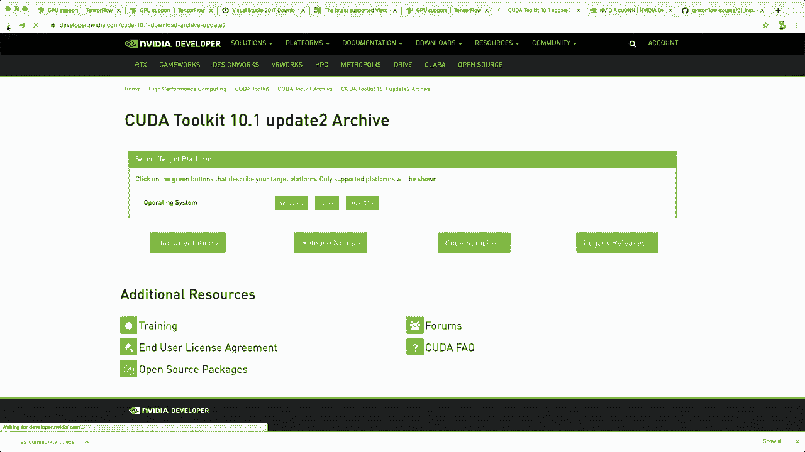
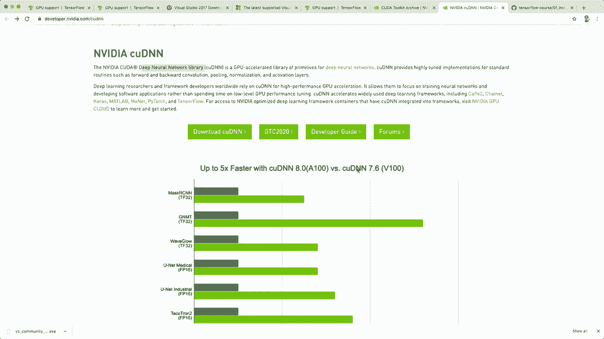
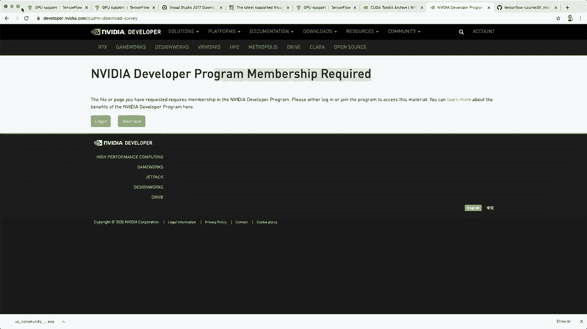
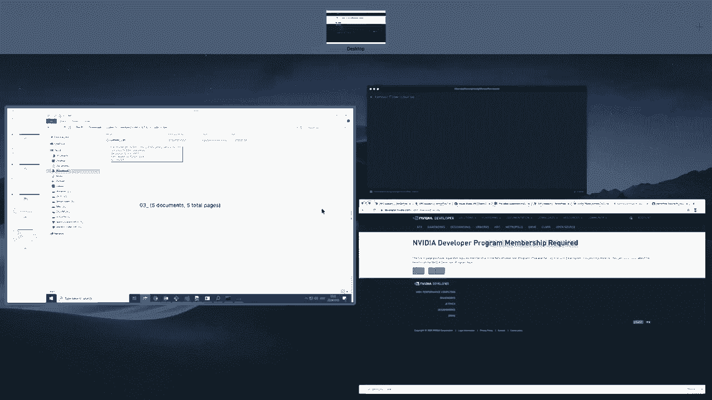
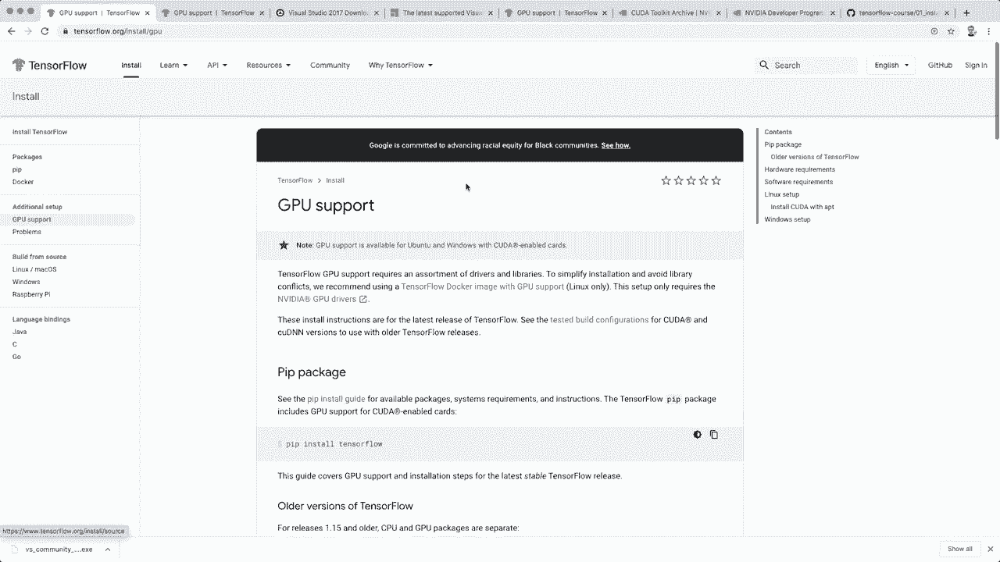
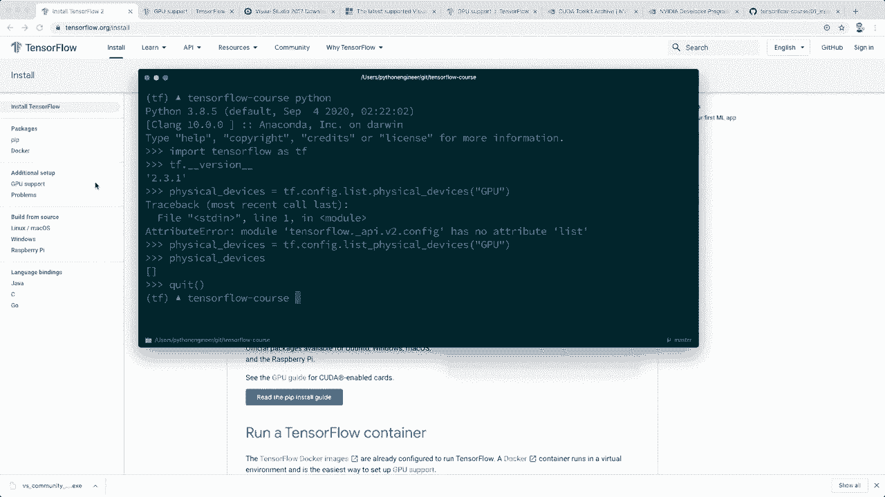

# TensorFlow初学者教程 P1：L1- 安装与环境配置 🛠️


在本节课中，我们将学习如何为TensorFlow配置开发环境。TensorFlow是一个由谷歌开发的端到端开源机器学习与深度学习平台，是最受欢迎的深度学习框架之一。我们将从基础安装开始，并介绍如何配置GPU支持。

## 概述

本节教程将指导你完成TensorFlow的安装过程。主要内容包括：检查系统要求、通过Pip安装TensorFlow、以及为Windows系统配置GPU支持的额外步骤。所有课程材料均可在Github上获取。

## 系统要求

在开始安装之前，请确保你的系统满足以下基本要求。

*   **Python版本**：需要Python 3.5或更高版本。
*   **操作系统**：支持macOS、Ubuntu和Windows。
*   **包管理器**：需要Pip版本大于19。

## 基础安装步骤

对于大多数用户，安装TensorFlow的命令非常简单。以下是标准安装流程。

1.  打开命令行工具（如终端或命令提示符）。
2.  输入安装命令：`pip install tensorflow`。
3.  等待安装完成。



## Windows系统GPU支持配置

如果你的机器装有Nvidia GPU并希望利用其进行加速计算，需要进行额外配置。没有Nvidia GPU的用户可以跳过此部分。



上一节我们介绍了基础安装，本节中我们来看看如何为Windows系统配置GPU支持。以下是所需的步骤和组件。



1.  **安装Visual Studio 2017**：需要安装免费的社区版。
2.  **安装C++可再发行组件**：从提供的链接下载并安装相应版本。
3.  **安装CUDA工具包**：需要版本10.1。从Nvidia官网下载并安装。
4.  **安装cuDNN SDK**：需要版本7。从Nvidia开发者网站下载（需注册账户）。
5.  **整合cuDNN文件**：将下载的cuDNN文件（`bin`， `include`， `lib`目录下的内容）复制到CUDA工具包的安装目录（例如 `C:\Program Files\NVIDIA GPU Computing Toolkit\CUDA\v10.1`）的对应文件夹中。
6.  **配置环境变量**：
    *   创建系统变量 `CUDA_PATH`，值为CUDA安装路径（如 `C:\Program Files\NVIDIA GPU Computing Toolkit\CUDA\v10.1`）。
    *   在系统 `Path` 变量中添加以下路径：
        *   `%CUDA_PATH%\bin`
        *   `%CUDA_PATH%\libnvvp`

完成以上步骤后，即可使用相同的 `pip install tensorflow` 命令安装支持GPU的TensorFlow。

## 使用虚拟环境（推荐）



为了避免包依赖冲突，建议使用虚拟环境进行安装。这里以Conda为例，你也可以使用Python内置的 `venv`。

首先，我们创建一个新的Conda环境。以下是具体操作命令。

```bash
# 创建一个名为‘tf’、Python版本为3.8的新环境
conda create -n tf python=3.8
# 激活该环境
conda activate tf
```

环境激活后，即可在该环境中安装TensorFlow。虽然Conda也提供安装命令，但官方推荐使用Pip以获得最佳兼容性。

```bash
# 在激活的虚拟环境中安装TensorFlow
pip install tensorflow
```



## 验证安装

安装完成后，需要验证TensorFlow是否成功安装，以及GPU是否可用。

让我们通过Python交互界面来测试安装结果。首先导入TensorFlow库。

```python
import tensorflow as tf
# 打印TensorFlow版本
print(tf.__version__)
```

如果导入没有报错，并成功打印出版本号（例如 `2.3.1`），则说明基础安装成功。

接下来，我们可以检查GPU是否已被TensorFlow识别。

```python
# 列出所有可用的物理GPU设备
gpus = tf.config.list_physical_devices('GPU')
print(gpus)
```

如果输出为一个空列表 `[]`，表示未检测到GPU或GPU支持未正确配置。如果配置正确，这里将显示你的GPU设备信息。

## 总结



本节课中我们一起学习了TensorFlow的安装与环境配置。我们涵盖了从满足系统要求、执行基础Pip安装，到为Windows系统详细配置GPU支持的完整流程。同时，我们介绍了使用虚拟环境的最佳实践，并学习了如何验证安装结果。现在你的开发环境已经准备就绪，可以开始探索TensorFlow的世界了。