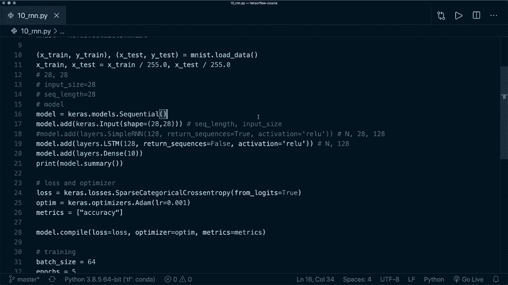

# TensorFlow教程 P9：L10 - 循环神经网络 (RNN & LSTM & GRU) 🧠➡️🧠

在本节课中，我们将要学习循环神经网络（RNN），这是一种能够处理序列数据的强大神经网络。我们将了解其基本概念，并使用TensorFlow的Keras API来实现一个简单的RNN模型，用于图像分类任务。

---

## 概述 📋


循环神经网络（RNN）允许网络将先前的输出作为输入，并维持一个隐藏状态，这使得它特别适合处理像文本、时间序列这样的序列数据。本节课，我们将学习RNN的基本原理，并动手实现一个用于MNIST手写数字分类的RNN模型。

---

## 什么是循环神经网络 (RNN)？

上一节我们介绍了RNN适用于序列数据。本节中我们来看看RNN的核心思想。

RNN与传统神经网络的关键区别在于其**循环连接**。它拥有一个“记忆”单元，可以保存之前时间步的信息。这使得网络在处理序列中的下一个元素时，能够考虑到之前所有元素的信息。

其核心计算过程可以用以下公式描述：
**`h_t = activation(W * x_t + U * h_{t-1} + b)`**
其中：
*   `h_t` 是当前时间步的隐藏状态。
*   `x_t` 是当前时间步的输入。
*   `h_{t-1}` 是上一个时间步的隐藏状态。
*   `W`, `U`, `b` 是需要学习的权重和偏置参数。

---

## RNN的应用场景

以下是RNN的一些常见应用：
*   **文本生成**：根据已有文本生成新的连贯文本。
*   **机器翻译**：将一种语言的句子翻译成另一种语言。
*   **情感分析**：判断一段文本（如评论）表达的情感是正面还是负面。

---

## 在TensorFlow中实现RNN

现在，让我们将理论付诸实践。我们将使用MNIST数据集，但以一种特殊的方式使用它：将一张28x28像素的图像视为一个长度为28的序列，序列中的每个时间步是图像的一行（共28个像素特征）。

### 1. 构建RNN模型

我们将使用Keras的`Sequential` API来构建模型。

```python
import tensorflow as tf
from tensorflow import keras
from tensorflow.keras import layers

# 定义一个顺序模型
model = keras.Sequential()

# 添加输入层，指定输入形状为 (序列长度, 特征数)
# 对于MNIST，我们将图像视为28个时间步，每个时间步有28个特征
model.add(layers.Input(shape=(28, 28)))

# 添加一个简单的RNN层，指定隐藏单元的数量
model.add(layers.SimpleRNN(units=128, activation='relu'))
# 默认激活函数是tanh，这里我们尝试使用relu

# 添加输出层，用于10分类任务
model.add(layers.Dense(10))
# 注意：这里没有使用激活函数，我们将在损失函数中处理
```

### 2. 理解RNN的输出

RNN层可以返回两种形式的输出：
*   **返回最后一个时间步的输出**（`return_sequences=False`，默认）：输出形状为 `(batch_size, units)`。这是分类任务中常用的方式，因为它汇总了整个序列的信息。
*   **返回所有时间步的输出**（`return_sequences=True`）：输出形状为 `(batch_size, sequence_length, units)`。这在堆叠多个RNN层时非常有用。

### 3. 编译、训练与评估模型

以下是编译和训练模型的步骤：
```python
# 编译模型
model.compile(
    loss=keras.losses.SparseCategoricalCrossentropy(from_logits=True), # 指定from_logits=True
    optimizer=keras.optimizers.Adam(),
    metrics=['accuracy']
)

# 训练模型
model.fit(x_train, y_train, batch_size=64, epochs=5, verbose=2)

# 评估模型
model.evaluate(x_test, y_test, verbose=2)
```
运行此代码后，我们的简单RNN模型在MNIST测试集上可以达到约97%的准确率。

---

## 更强大的RNN变体：LSTM与GRU

简单的RNN在处理长序列时可能会遇到梯度消失或爆炸的问题。因此，研究者提出了更复杂的结构。

以下是两个最著名的RNN变体，它们的表现通常优于简单RNN：
*   **长短期记忆网络 (LSTM)**：通过引入“门”机制（输入门、遗忘门、输出门）来更好地控制信息的流动和记忆。
*   **门控循环单元 (GRU)**：LSTM的一个简化版本，合并了部分门结构，参数更少，计算效率更高。

在Keras中使用它们非常简单，只需替换层类型即可：
```python
# 使用LSTM层
model.add(layers.LSTM(units=128))

# 使用GRU层
model.add(layers.GRU(units=128))
```
它们的参数和输出形状与`SimpleRNN`类似，你可以直接替换并尝试，看看性能是否有提升。

---

## 总结 🎯

本节课中我们一起学习了循环神经网络（RNN）。
我们了解了RNN通过隐藏状态处理序列数据的核心思想，并使用TensorFlow的Keras API实现了一个用于图像分类的SimpleRNN模型。
我们还介绍了更强大的RNN变体——LSTM和GRU。
你学会了如何将图像数据重塑为序列，以及如何构建、训练一个基本的RNN模型。



在下一个教程中，我们将学习如何将RNN应用于更自然的序列数据——文本分类任务。