# 生成式AI：P1：从初学者到专家的深度路线图 🚀

在本节课中，我们将学习生成式人工智能的完整、详细学习路线图。本路线图旨在帮助初学者逐步掌握相关技能，并最终达到专家水平。我们将从基础概念开始，逐步深入到核心模型和应用开发。

## 概述

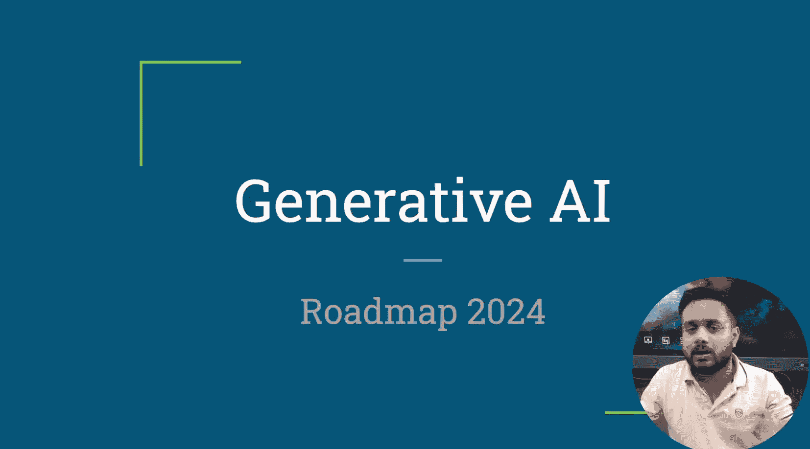

生成式人工智能能够根据训练样本生成新的数据。生成式模型可以生成图像、文本、音频和视频。在本路线图中，我们将主要关注生成式语言模型，特别是大型语言模型。

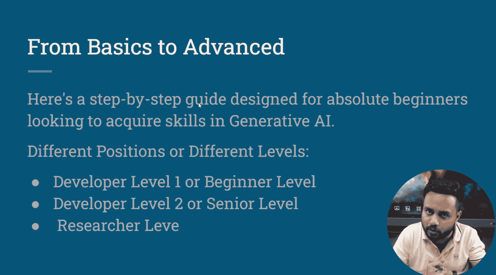

## 路线图结构

本路线图分为多个部分，以便于系统性地学习。

以下是路线图的主要组成部分：

1.  **先决条件**：学习生成式AI前需要掌握的基础知识。
2.  **基础**：进入生成式AI领域前必须理解的核心概念。
3.  **核心生成模型**：生成式AI的核心技术和工作原理。
4.  **LLM应用开发**：如何利用大型语言模型开发实际应用。
5.  **项目与实践**：获取实践经验、完成项目的途径。
6.  **其他主题**：与生成式AI相关的补充知识。
7.  **高效学习建议**：如何规划学习路径以提高效率。
8.  **常见问题解答**：针对常见疑问的解答。

## 先决条件

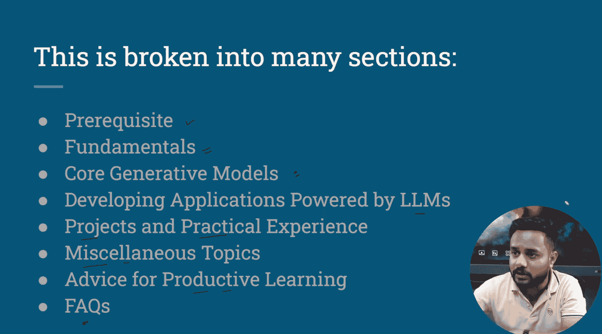

在开始学习生成式AI之前，你需要掌握一些基础技能。上一节我们介绍了路线图的整体结构，本节中我们来看看具体需要哪些先决条件。

### 编程语言

Python是数据科学、机器学习和AI领域最常用的编程语言。

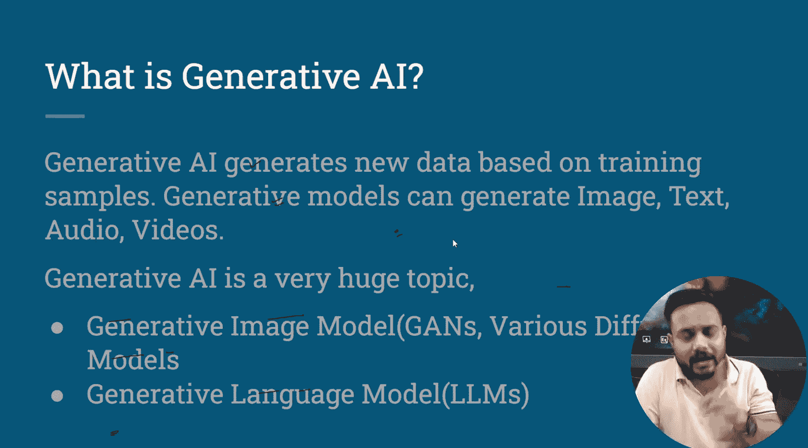

以下是选择Python的几个关键原因：

*   **社区支持**：Python拥有庞大且活跃的社区，为AI开发提供了丰富的资源。
*   **库与框架**：Python拥有大量支持AI开发的库和框架，涵盖可视化、计算、计算机视觉、自然语言处理和机器学习等各个方面。
*   **灵活性与生产力**：Python语法简洁，易于学习和使用，并且提供了许多现成的原型工具，能有效提升开发效率。
*   **数据分析与可视化**：Python在数据处理和可视化方面功能强大，是AI项目不可或缺的一部分。

为了有效使用Python，你需要学习以下核心主题：

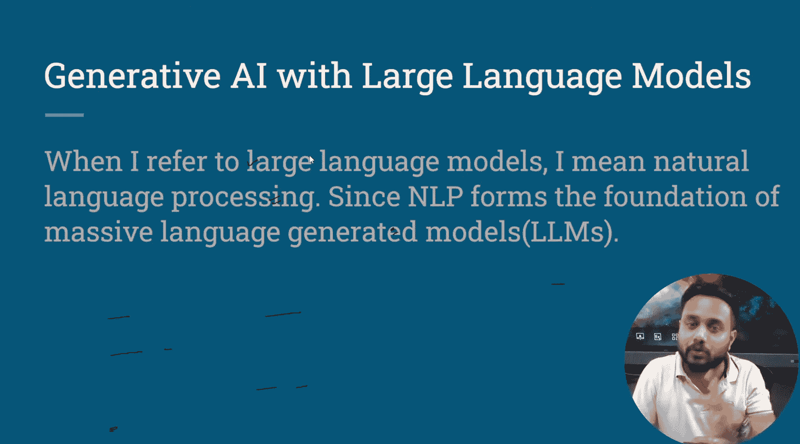

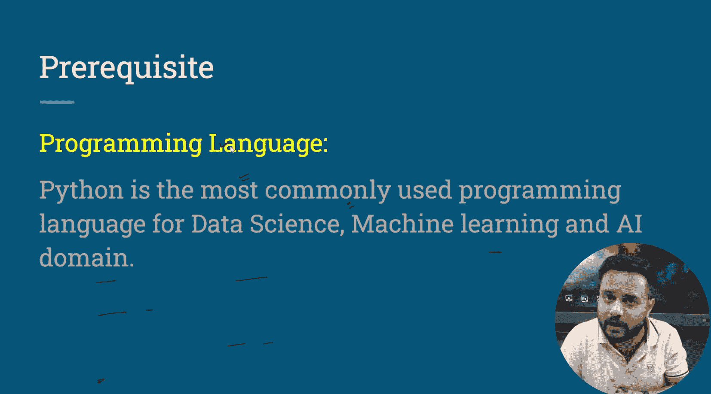

*   变量、数字、列表、字典、集合
*   条件语句、循环
*   函数、Lambda表达式
*   模块导入与使用
*   文件读写
*   异常处理
*   类与对象

### NoSQL数据库

在深度学习和自然语言处理流水线中，NoSQL数据库被广泛使用。

深度学习项目通常涉及处理大量非结构化数据，如图像、文本、音频和视频。NoSQL数据库非常适合存储和管理这类数据。

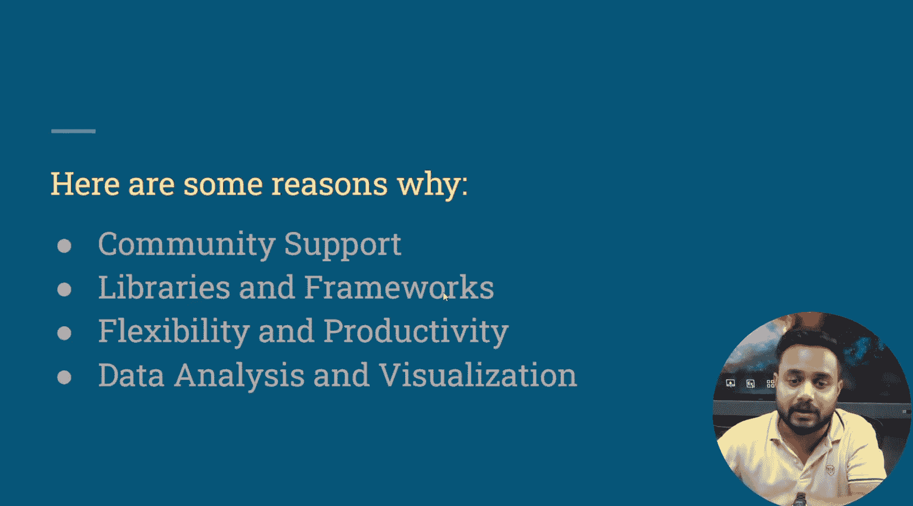

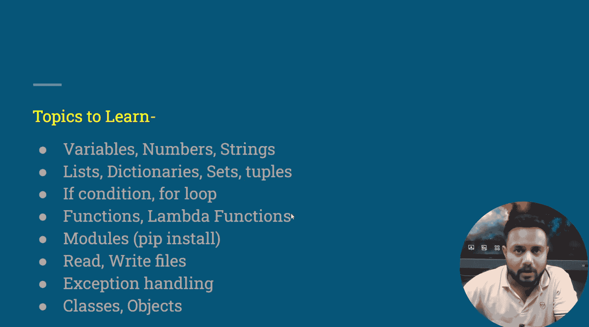

以下是NoSQL数据库在AI项目中的优势：

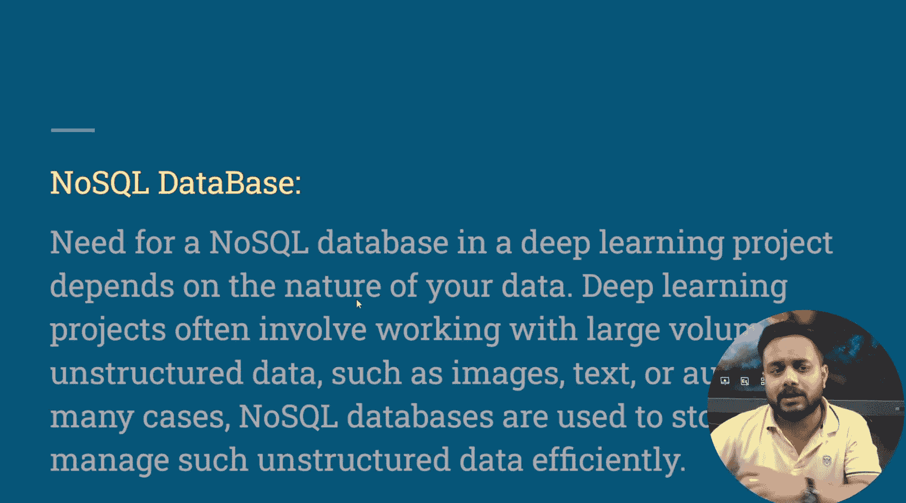

*   **可扩展性**：易于水平扩展以处理海量数据。
*   **灵活性**：能够存储多样化的数据类型。
*   **实时写入**：支持高性能的数据插入操作。
*   **分布式计算**：天然支持分布式架构。
*   **无模式设计**：无需预定义严格的数据结构，可以动态存储数据。

在众多NoSQL数据库中，建议优先学习 **MongoDB** 和 **Cassandra**，因为它们在工业界应用广泛。

## 基础

掌握了编程和数据库基础后，我们需要构建生成式AI的理论基石。上一节我们讨论了先决条件，本节中我们来看看数学与统计学的基础知识。

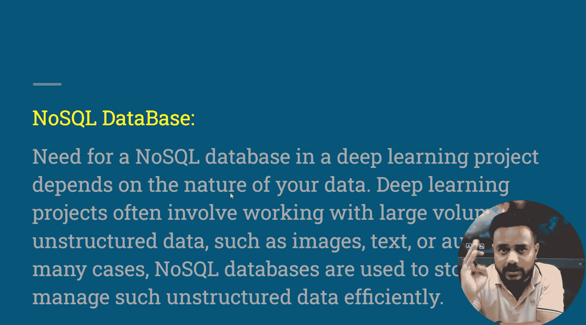

### 数学与统计学

数学与统计学是数据科学和人工智能的基础，它们帮助我们从复杂数据中提取有意义的见解。

统计学对于理解数据模式至关重要。你需要学习的核心统计学主题包括：

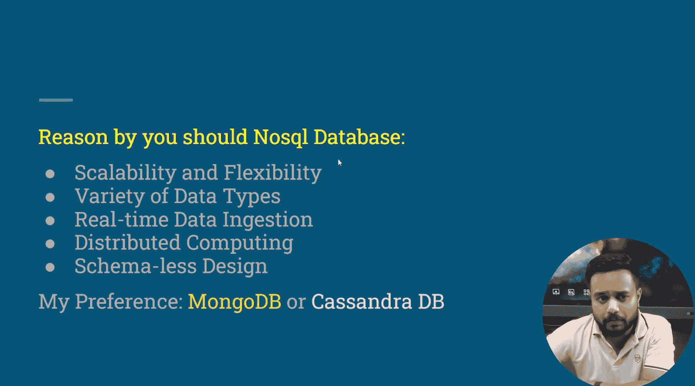

*   描述性统计
*   推断性统计
*   基本统计图表
*   集中趋势度量
*   分布类型
*   中心极限定理
*   相关系数
*   假设检验

在数学方面，以下三个领域扮演着关键角色：

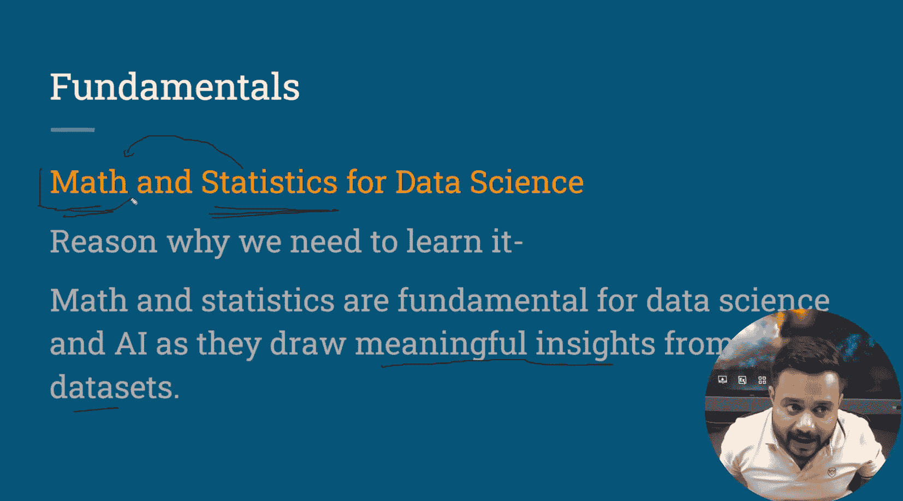

1.  **概率论**：用于量化不确定性，是许多机器学习算法的基础。
2.  **线性代数**：涉及向量、矩阵和张量运算，是深度学习模型（如神经网络）的核心数学工具。
3.  **微积分**：特别是微分，用于优化算法（如梯度下降），以训练模型并找到最佳参数。

## 总结

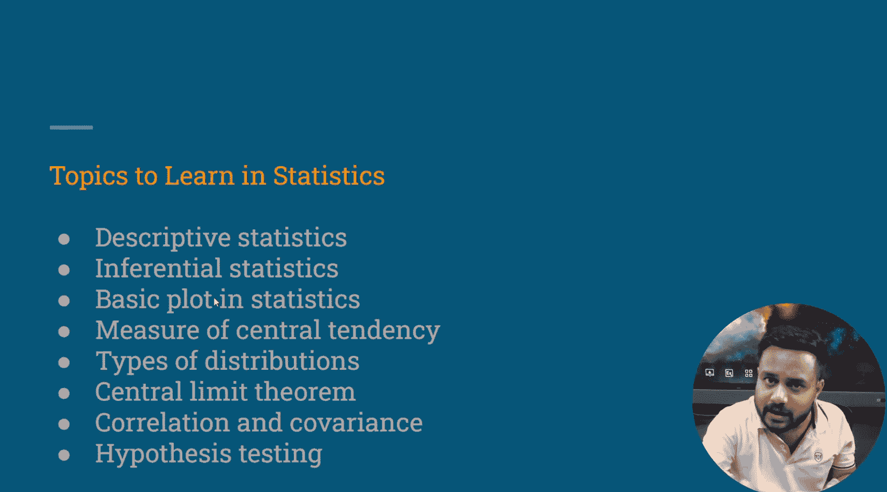

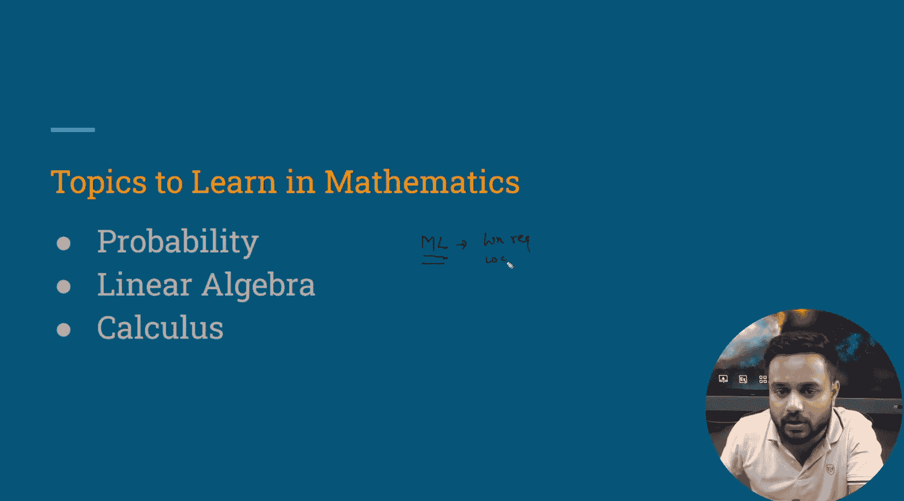

本节课中我们一起学习了生成式AI学习路线图的概述、结构以及前两个关键部分：先决条件和基础。我们明确了Python编程和NoSQL数据库的重要性，并强调了数学与统计学作为理解数据模式和模型原理的基石作用。在接下来的课程中，我们将深入探讨核心生成模型。