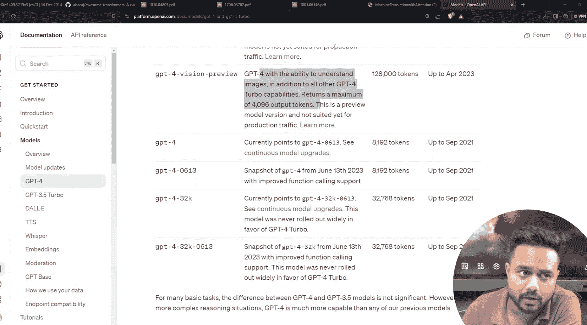
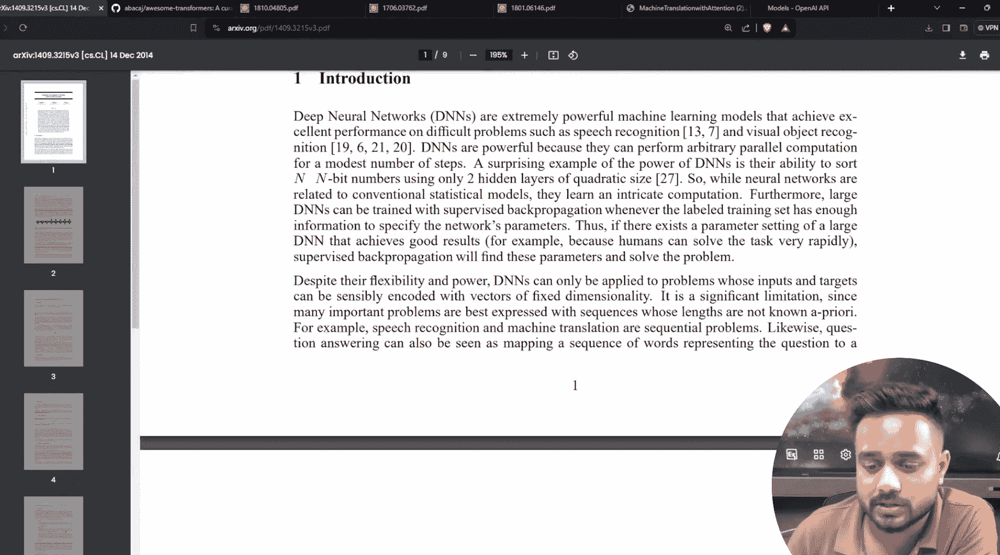
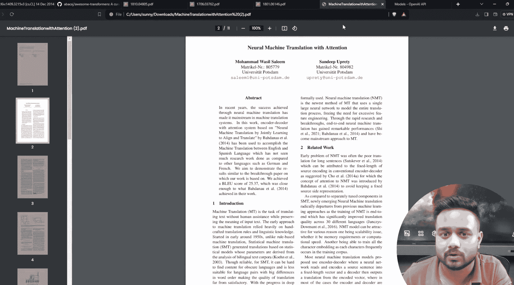
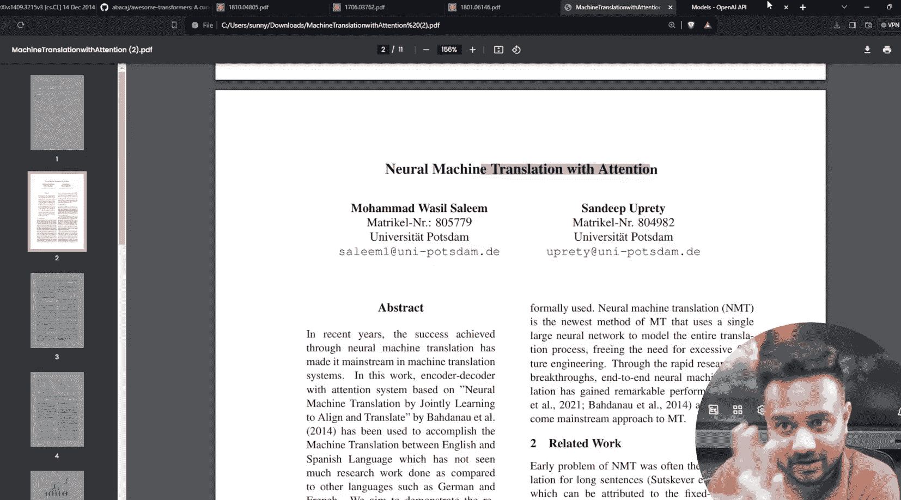

# 生成式AI：P4：生成式AI历史终章（第三部分）｜ Transformer ｜ LLM ｜ ChatGPT训练

在本节课中，我们将学习生成式AI发展史的最后一部分。我们将重点探讨编码器-解码器架构的演进、注意力机制的引入、Transformer模型的诞生，以及大型语言模型和ChatGPT的训练过程。

---

## 编码器-解码器架构回顾

上一节我们讨论了语言建模和计算机视觉的基础模型。本节中，我们来看看序列到序列任务的核心架构——编码器-解码器。

编码器-解码器架构主要用于解决“多对多”的序列映射问题，特别是在机器翻译这类任务中，输入和输出序列的长度可能不同。

以下是编码器-解码器架构的核心组件：

*   **编码器**：负责处理输入序列（如一个句子），并将其压缩成一个固定长度的上下文向量。
*   **上下文向量**：这是编码器的输出，包含了输入序列的语义信息摘要。
*   **解码器**：接收上下文向量，并基于它逐步生成输出序列。

在原始的研究论文中，编码器和解码器通常由双向LSTM构成。双向意味着模型可以同时从左到右和从右到左处理数据，从而更好地理解每个单词受前后文影响的意义。

这个架构由Google的研究人员在论文《Sequence to Sequence Learning》中提出，并最初应用于Google翻译产品。然而，该架构存在一个主要限制：当处理较长文本（超过30-35个词）时，翻译的准确性会下降。这是因为所有信息都被压缩到一个固定长度的上下文向量中，容易造成信息丢失。

## 引入注意力机制

由于基础的编码器-解码器在处理长文本时表现不佳，研究人员提出了解决方案：**编码器-解码器 + 注意力机制**。

注意力机制是一项革命性的技术，它允许解码器在生成输出的每一个词时，动态地“关注”输入序列中最相关的部分，而不是仅仅依赖一个固定的上下文向量。

以下是注意力机制的核心思想：

*   **动态权重**：解码器生成每个输出词时，会为输入序列的每个词计算一个权重分数。
*   **加权上下文**：这些权重决定了当前生成步骤应该“注意”输入序列的哪些部分。模型会计算一个加权的上下文向量，该向量是输入序列所有隐藏状态的加权和。
*   **聚焦关键信息**：这使得模型能够更有效地处理长序列，因为它可以根据需要聚焦于输入的不同部分。

这项技术在论文《Neural Machine Translation by Jointly Learning to Align and Translate》中被详细阐述。注意力机制极大地提升了机器翻译的质量，并为后续更强大的模型铺平了道路。

## Transformer模型：注意力即一切

注意力机制的成功催生了一个全新的、完全基于注意力构建的模型架构——**Transformer**。其核心论文标题《Attention Is All You Need》恰如其分地概括了它的设计哲学。

Transformer完全摒弃了RNN和LSTM等循环结构，仅使用注意力机制和前馈神经网络来处理序列数据。这带来了两大优势：**强大的并行计算能力**和**更有效地捕捉长距离依赖关系**。

Transformer模型的核心是**自注意力**机制。其公式可以简化为：

**`Attention(Q, K, V) = softmax(QK^T / √d_k) V`**

其中：
*   **Q (Query)**：代表当前需要计算注意力的位置。
*   **K (Key)**：代表序列中所有其他位置，用于与Query计算相关性。
*   **V (Value)**：代表序列中所有位置的实际信息。
*   **√d_k**：是一个缩放因子，用于防止点积结果过大导致梯度消失。

Transformer模型本身也采用编码器-解码器结构，但内部的编码器和解码器都由多层相同的“Transformer块”堆叠而成。每个块主要包含**多头自注意力层**和**前馈神经网络层**，并配有残差连接和层归一化。

## 从Transformer到大型语言模型

Transformer架构的出现是自然语言处理领域的分水岭。基于Transformer的编码器部分，诞生了如**BERT**这样的模型，它通过掩码语言建模进行预训练，擅长理解任务。

而基于Transformer的解码器部分，则发展出了**GPT**系列模型。GPT通过自回归的方式，根据上文预测下一个词，非常擅长文本生成任务。

**大型语言模型**通常指参数量巨大（数十亿甚至数千亿）、基于Transformer架构、在海量文本数据上预训练的模型。它们的训练分为两个主要阶段：
1.  **预训练**：在无标签的大规模文本数据上，通过预测下一个词（对于GPT类）或填充掩码词（对于BERT类）来学习通用的语言知识和世界知识。
2.  **微调**：在特定的、有标签的任务数据上，对预训练好的模型进行进一步训练，使其适应具体任务（如问答、摘要、对话等）。

## ChatGPT的训练过程

ChatGPT是GPT系列模型在对话任务上的成功应用。它的训练过程比基础LLM更复杂，通常包含以下关键步骤：

1.  **监督微调**：首先，使用高质量的对话数据（人类标注的问答对）对预训练好的GPT模型进行微调，教会它如何以对话形式进行回应。
2.  **奖励模型训练**：训练一个独立的奖励模型，用于评估AI助手的回复质量。训练数据来自人类对多个模型回复的排序（哪个更好）。
3.  **强化学习优化**：使用近端策略优化等强化学习算法，根据奖励模型的反馈，进一步优化SFT模型，使其生成更符合人类偏好的回复。

这个过程被称为**基于人类反馈的强化学习**，是让ChatGPT输出内容更加安全、有用、贴合用户意图的关键。

---

本节课中我们一起学习了生成式AI历史的关键终章。我们从编码器-解码器的局限性出发，看到了注意力机制如何解决信息瓶颈问题，进而催生了完全基于注意力的Transformer模型。Transformer成为了现代大型语言模型的基石，并最终通过多阶段的训练流程（预训练、微调、RLHF）演化出了像ChatGPT这样强大的对话AI。理解这条技术演进路线，是深入掌握生成式AI的重要基础。